---
date: "2019-06-23"
---  
      
# 复盘 4 | 广告系统核心技术模块
今天我准备了 18 张知识卡，和你一起来对广告系统核心技术模块的内容做一个复盘。

在这个模块，我们一起学习了18篇文章，讨论了5大话题，包括广告系统架构、知名公司的广告点击率预估模型、出价系统、预算等。通过这些点，我们勾勒出了这个领域的主线。希望你能沿着这条线，去做更多探索。

提示：点击知识卡，可以一键到达你最想复习的那一篇文章。

## 广告系统架构

[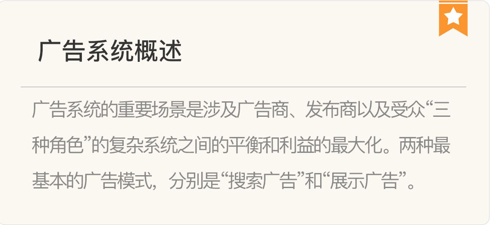](https://time.geekbang.org/column/article/8601)

[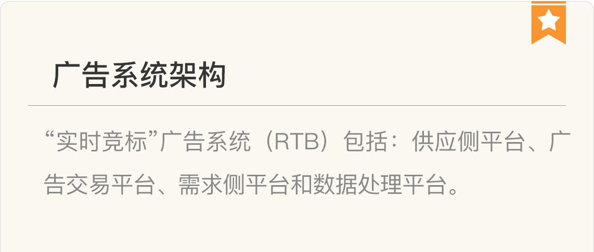](https://time.geekbang.org/column/article/8691)

[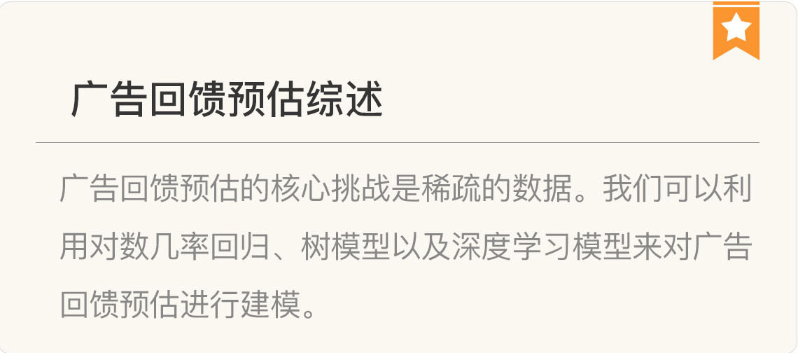](https://time.geekbang.org/column/article/8913)

## 广告点击率预估

[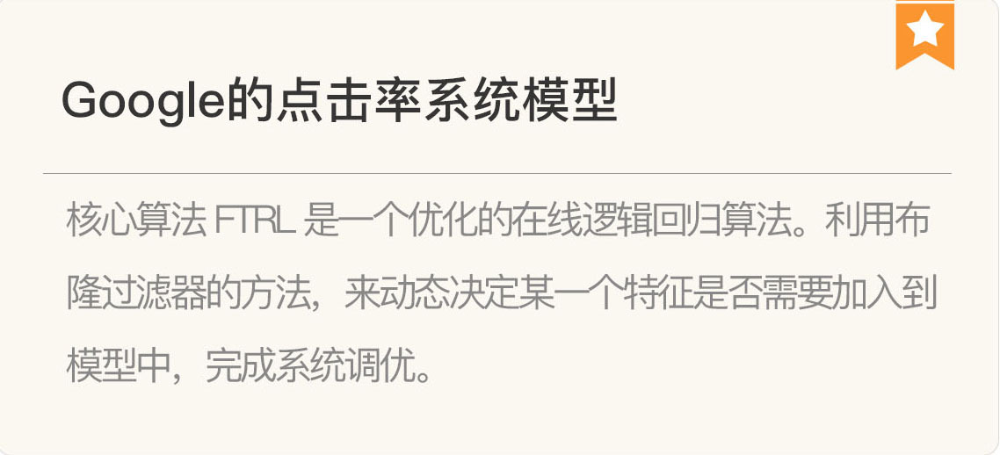](https://time.geekbang.org/column/article/370)

[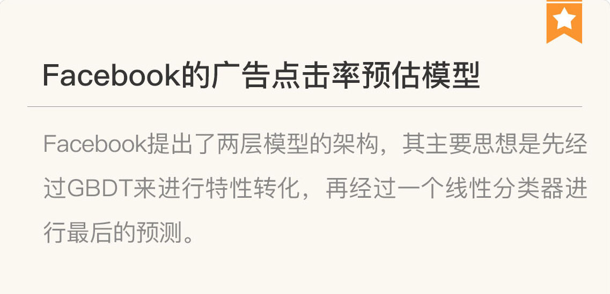](https://time.geekbang.org/column/article/9037)

[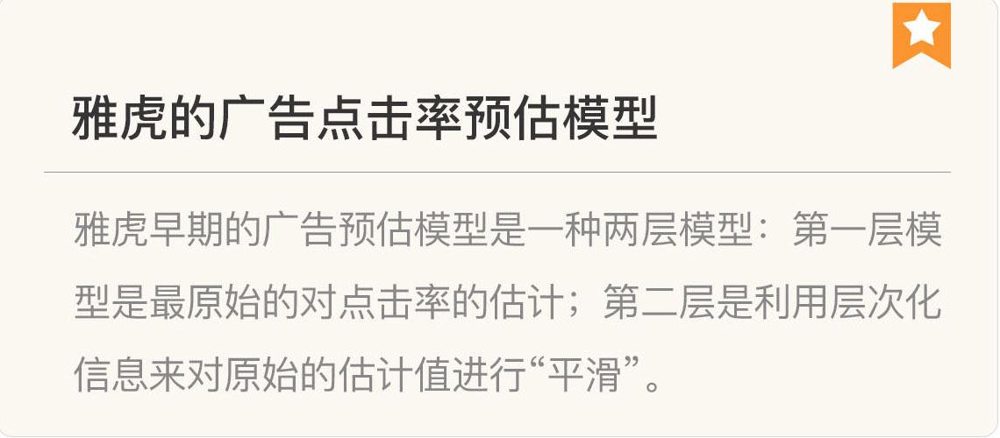](https://time.geekbang.org/column/article/9069)

[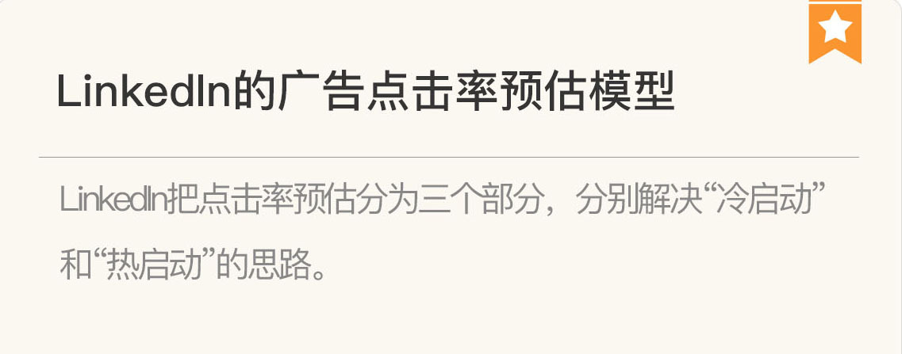](https://time.geekbang.org/column/article/9264)

[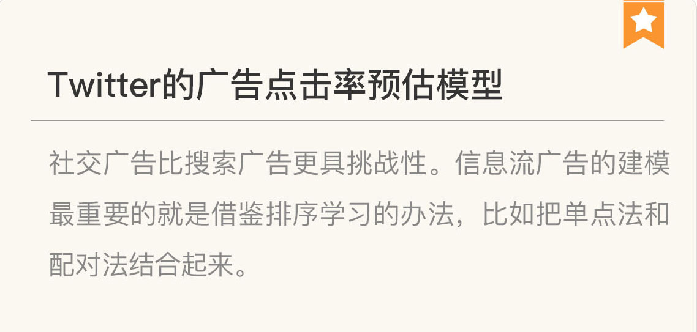](https://time.geekbang.org/column/article/9370)

[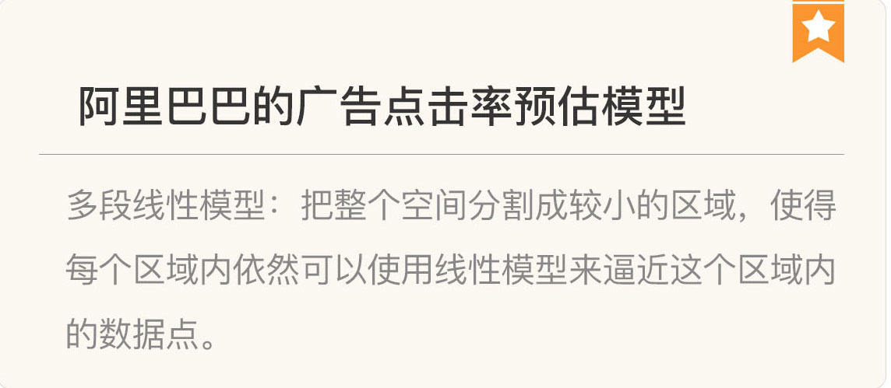](https://time.geekbang.org/column/article/9488)

## 出价系统

[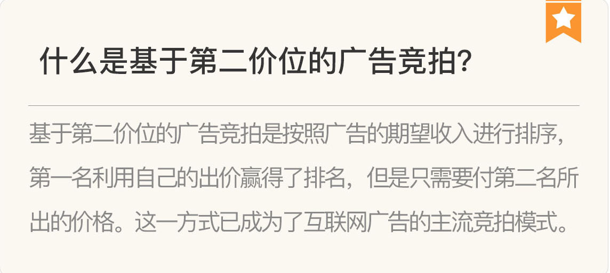](https://time.geekbang.org/column/article/9695)

[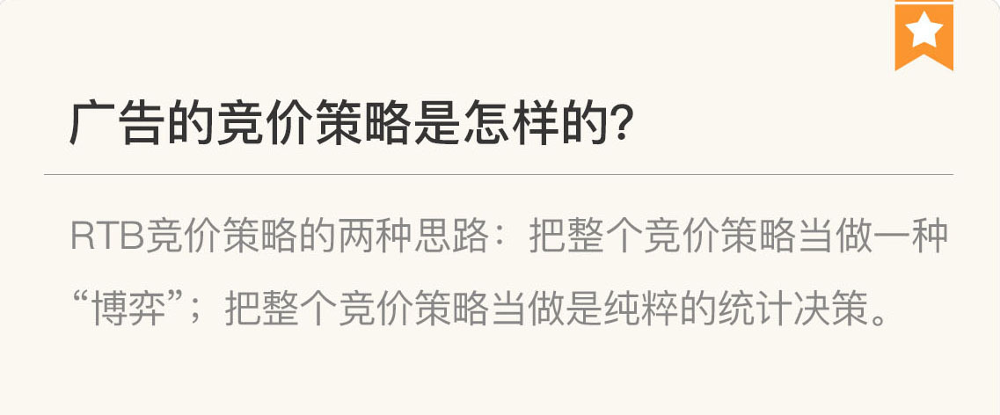](https://time.geekbang.org/column/article/9747)

[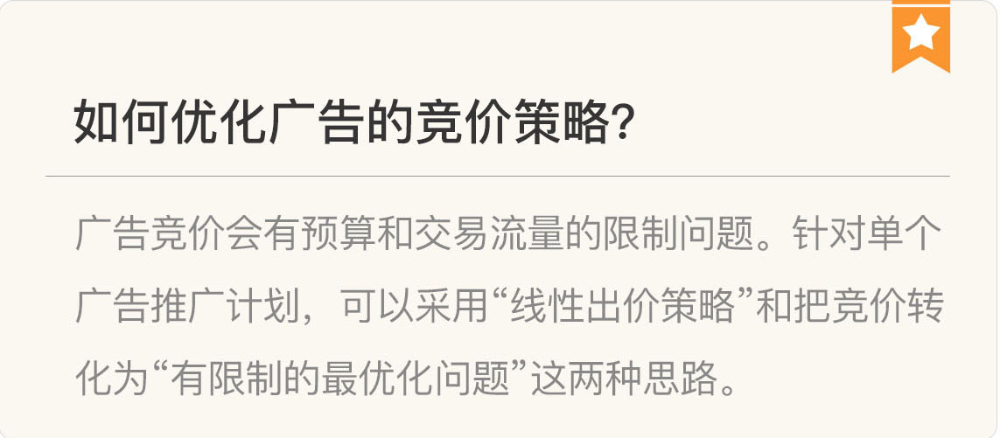](https://time.geekbang.org/column/article/9864)

## 预算

[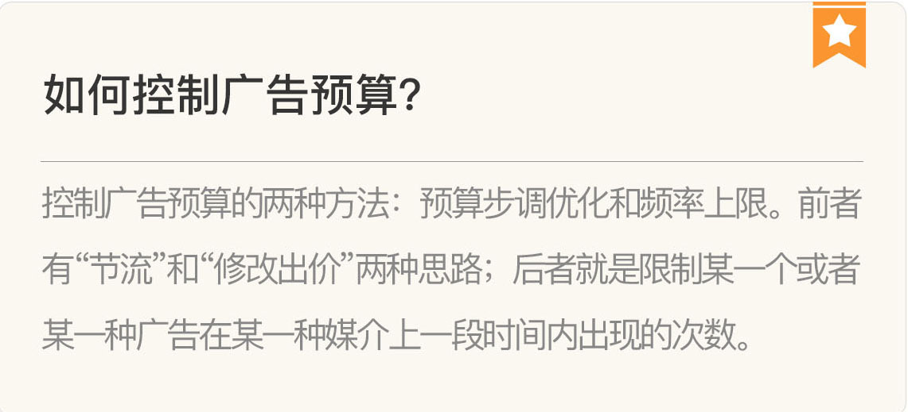](https://time.geekbang.org/column/article/10029)

[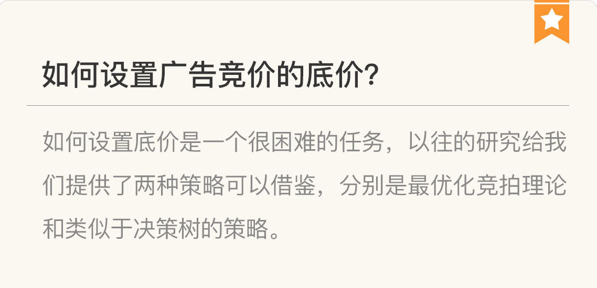](https://time.geekbang.org/column/article/10147)

[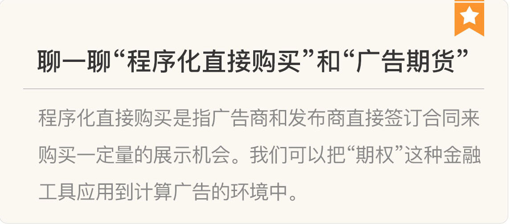](https://time.geekbang.org/column/article/10182)

## 高级话题

[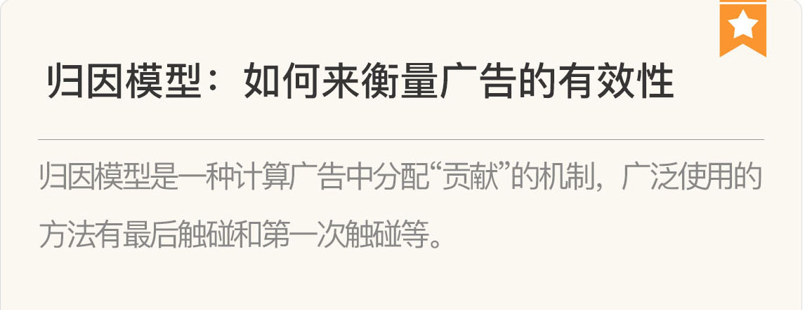](https://time.geekbang.org/column/article/10360)

[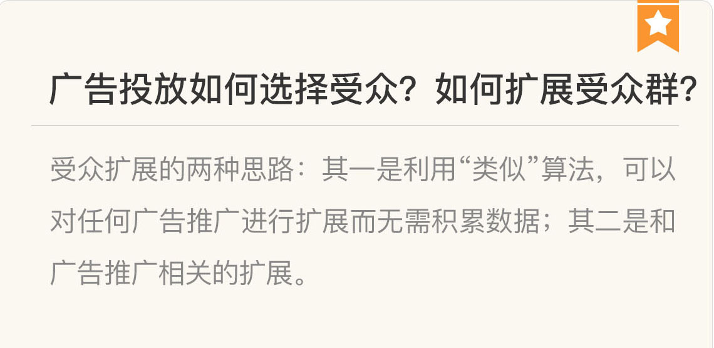](https://time.geekbang.org/column/article/10599)

[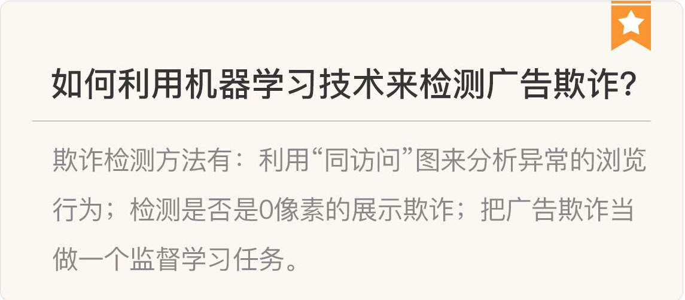](https://time.geekbang.org/column/article/10719)

## 积跬步以至千里

最后，恭喜你在人工智能领域的千里之行，又往前迈出了一步。

感谢你在专栏里的每一个留言，给了我很多思考和启发。期待能够听到你更多的声音，我们一起交流讨论。

<!-- [[[read_end]]] -->