---
date: "2019-06-23"
---  
      
# 复盘 6 | 数据科学家与数据科学团队是怎么养成的？
今天，我准备了24张知识卡，和你一起复盘数据科学家养成和数据科学团队的养成这两个模块。在这两个模块里，我们一共讨论了8个话题，从方方面面分享了数据科学家所需具备的技能；也从组建一个团队的角度出发，让你更了解自己在团队中的角色；最后，我们还聊了雅虎研究院等知名团队，帮你拓展视野。

提示：点击知识卡跳转到你最想看的那篇文章，温故而知新。

## 数据科学家基础能力

[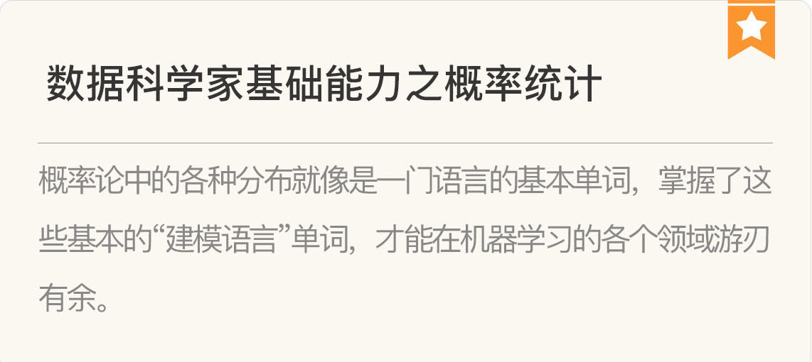](https://time.geekbang.org/column/article/308)

[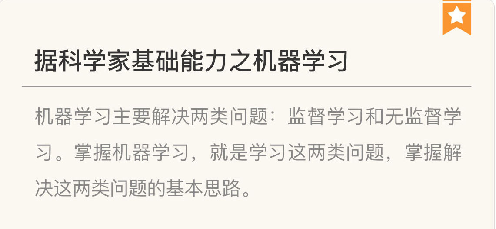](https://time.geekbang.org/column/article/311)

[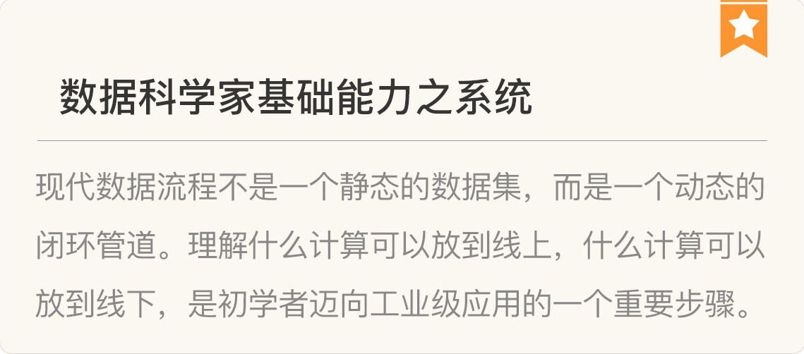](https://time.geekbang.org/column/article/316)

## 数据科学家高阶能力

[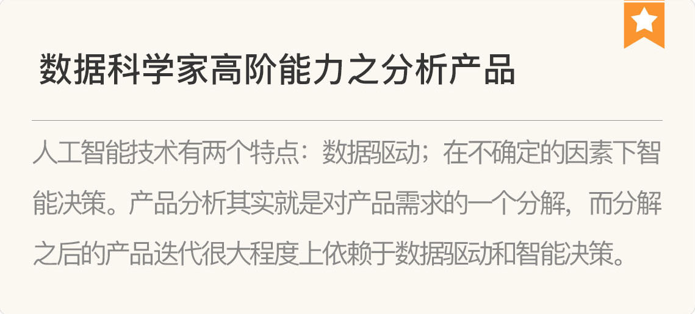](https://time.geekbang.org/column/article/382)

[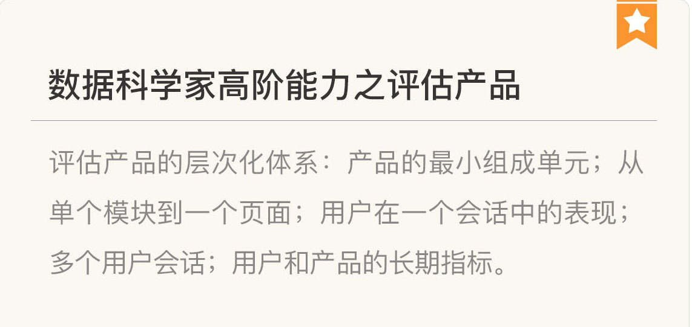](https://time.geekbang.org/column/article/385)

[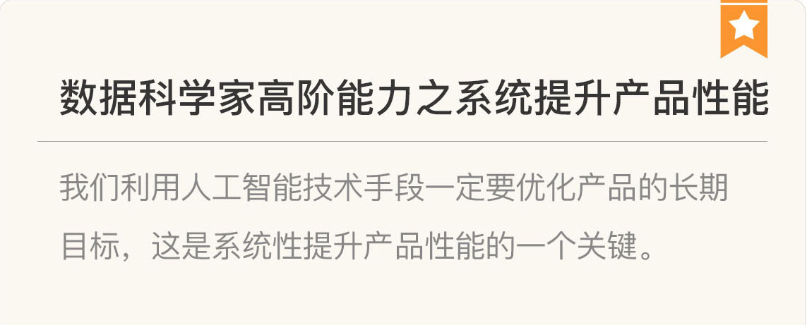](https://time.geekbang.org/column/article/388)

## 数据科学家职场话题

[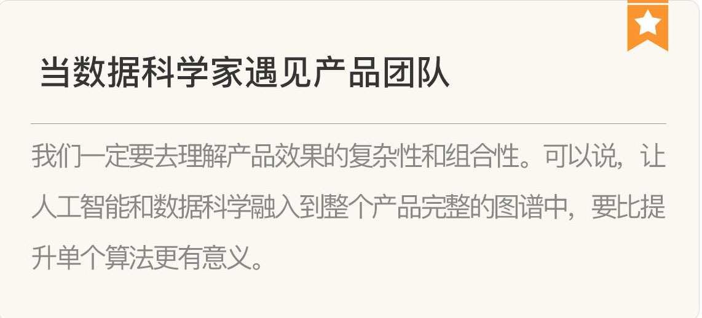](https://time.geekbang.org/column/article/2504)

[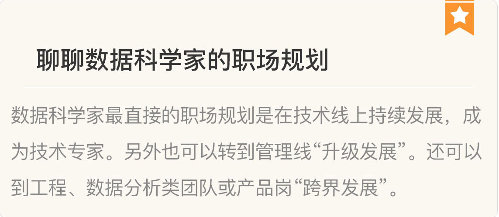](https://time.geekbang.org/column/article/2625)

## 数据科学家套路

[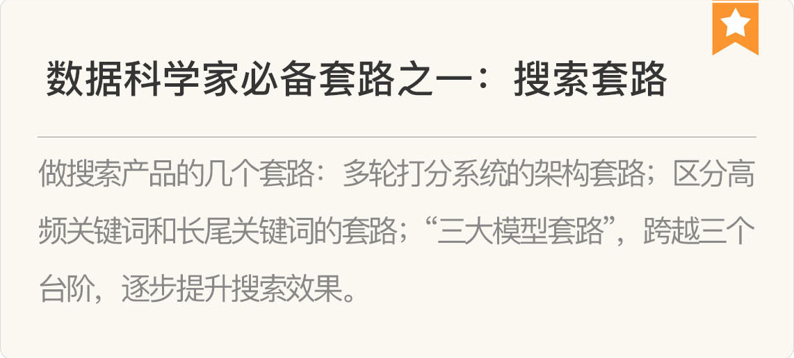](https://time.geekbang.org/column/article/10801)

[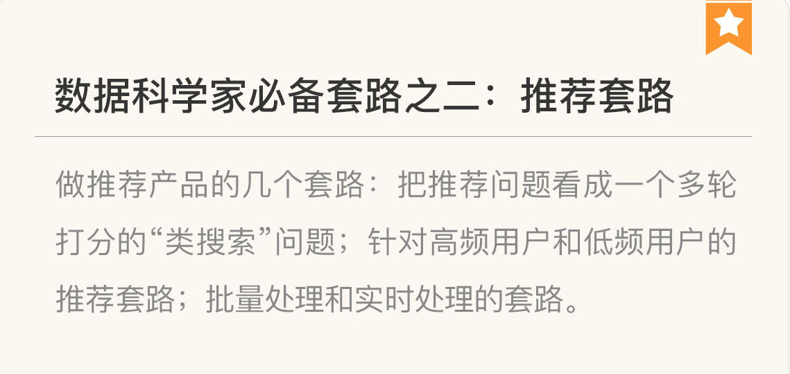](https://time.geekbang.org/column/article/10972)

[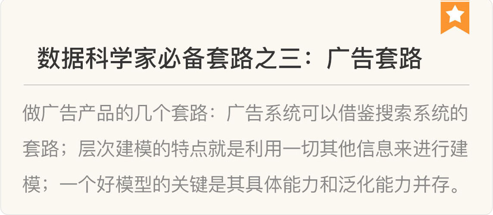](https://time.geekbang.org/column/article/11307)

## 数据科学团队基础

[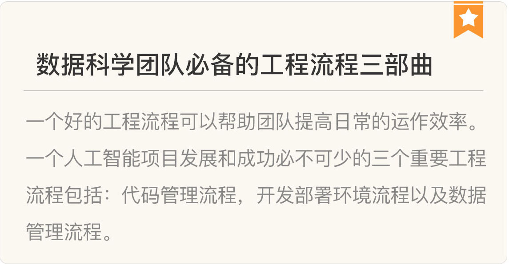](https://time.geekbang.org/column/article/13665)

[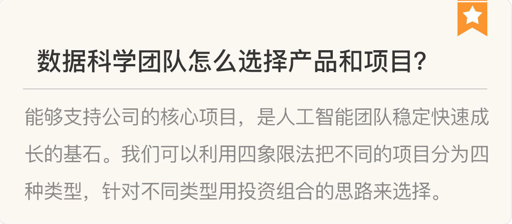](https://time.geekbang.org/column/article/13816)

## 数据科学团队招聘

[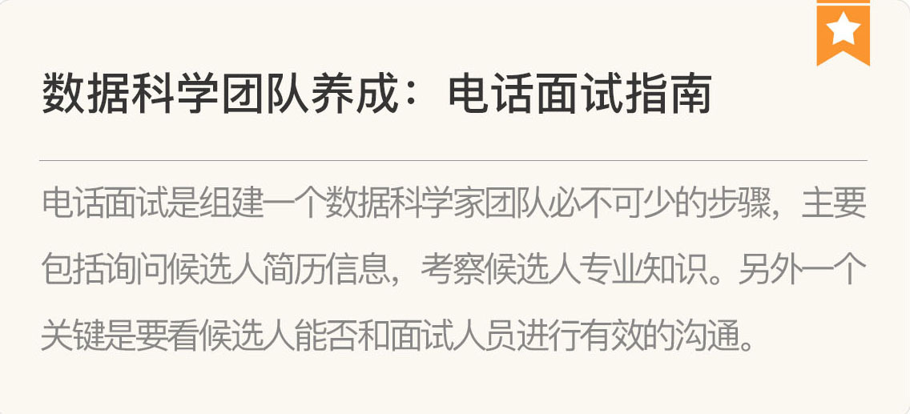](https://time.geekbang.org/column/article/3261)

[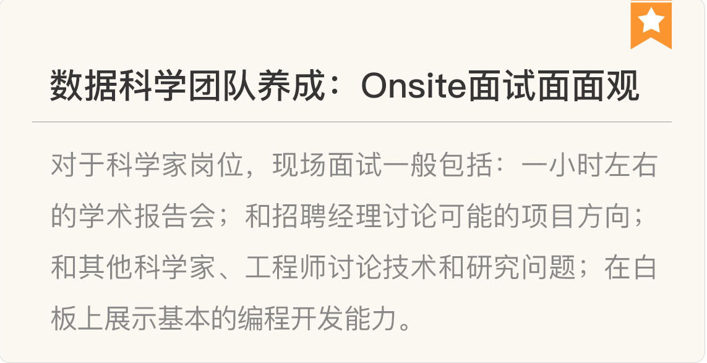](https://time.geekbang.org/column/article/3361)

[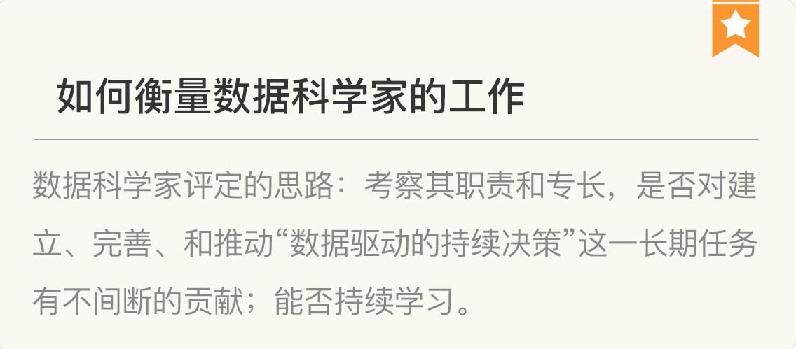](https://time.geekbang.org/column/article/3614)

## 数据科学团队高级话题

[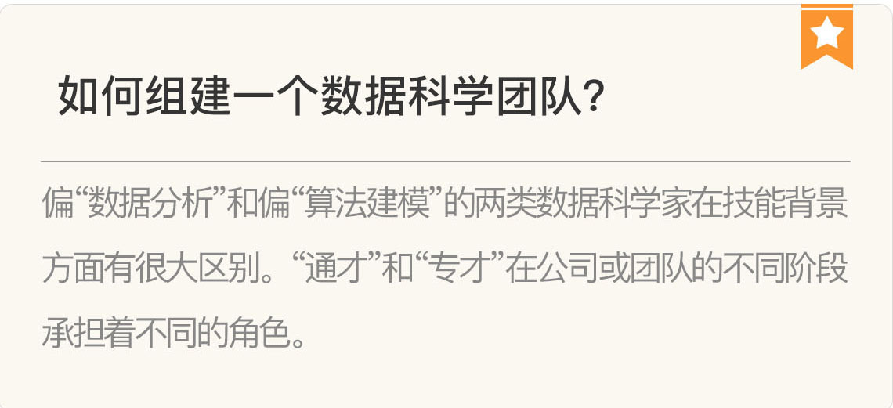](https://time.geekbang.org/column/article/156)

[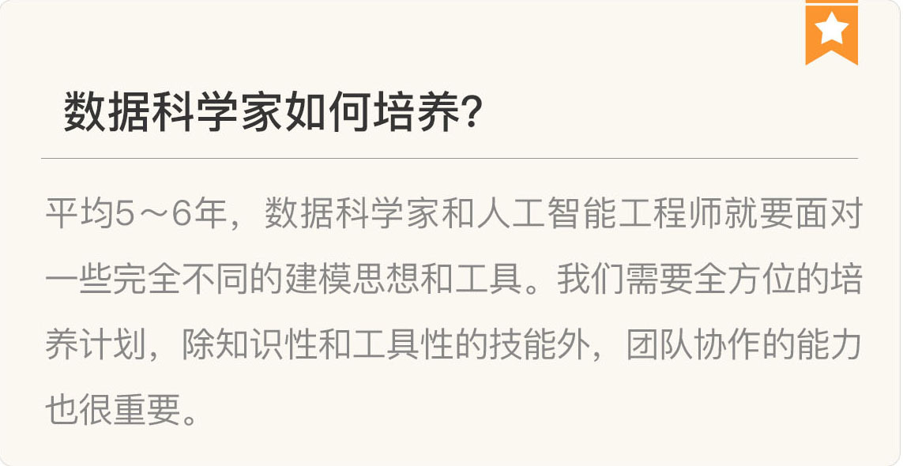](https://time.geekbang.org/column/article/3744)

## 著名数据科学人工智能团队漫谈

[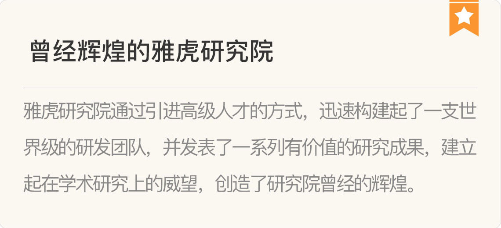](https://time.geekbang.org/column/article/379)

[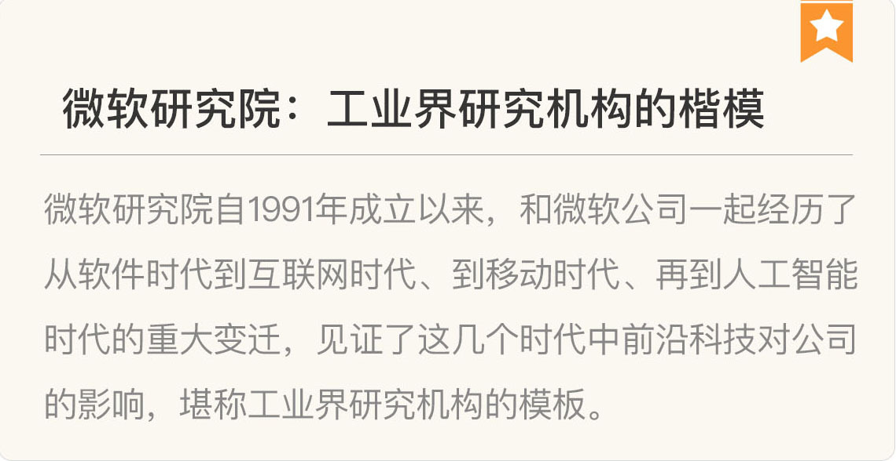](https://time.geekbang.org/column/article/40617)

[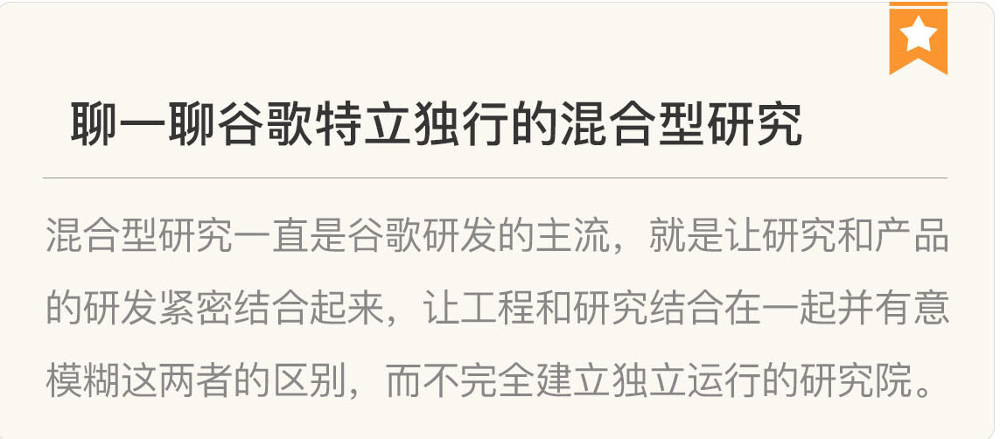](https://time.geekbang.org/column/article/40765)

## 积跬步以至千里

最后，恭喜你学完了这个模块的所有内容。不管你是一名数据科学或人工智能的初学者，还是已经积累很多宝贵的经验，亦或要组建自己的数据科学或人工智能团队，都希望这一模块的内容对你有所帮助和启发。

学无止境，选择了人工智能这条路，就意味着我们选择了一种生活方式。今天就让我们以几句诗结尾，作者是我很喜欢的美国诗人罗伯特·弗罗斯特（Robet Frost）。

Two roads diverged in a wood, and I—

I took the one less traveled by,

And that has made all the difference.

<!-- [[[read_end]]] -->

树林中分出两条路，而我——

我选择了那条少有人走的路，

从此一切与众不同。

欢迎你给我留言，和我一起交流讨论。