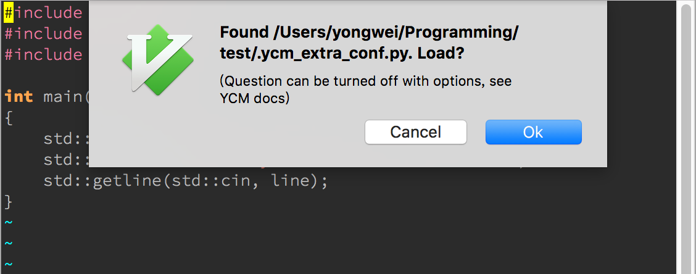
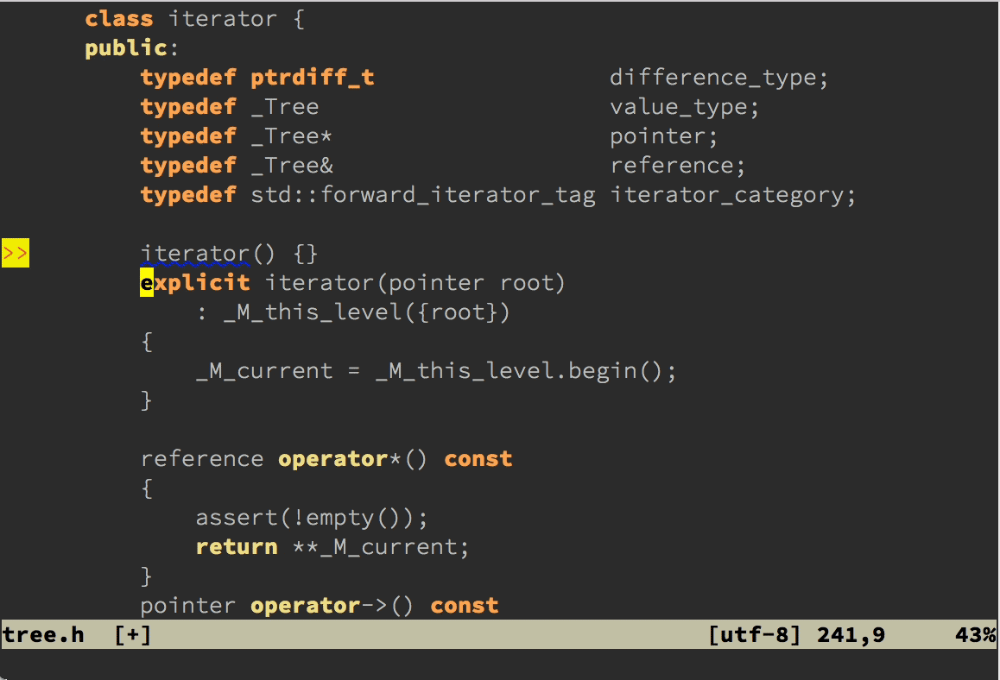
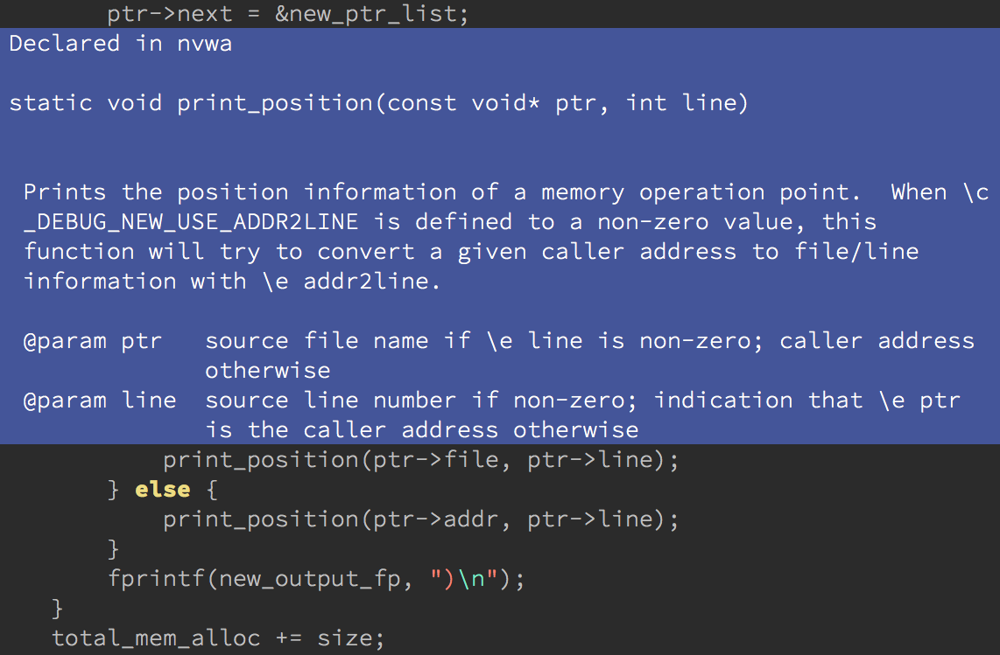
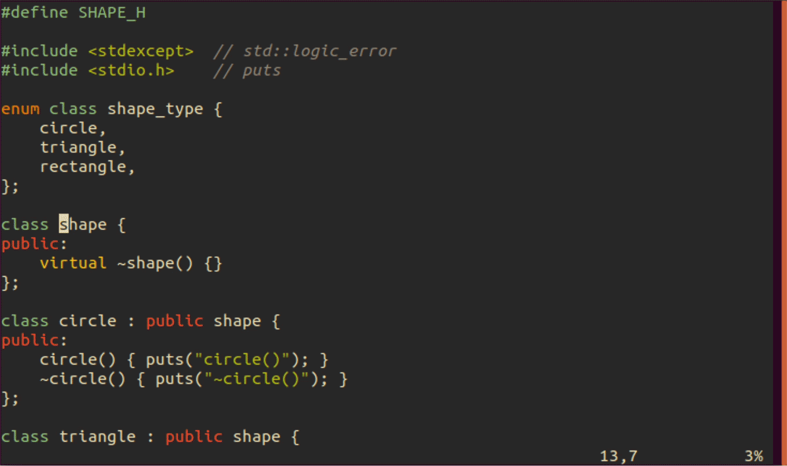

---
date: "2019-06-23"
---  
      
# 13｜YouCompleteMe：Vim 里的自动完成
你好，我是吴咏炜。

在集成开发环境里，自动完成是一个非常重要的功能。可是 Vim 并不能真正理解你输入的代码，因此它自身无法提供自动完成的功能。不过，Vim 仍然提供了一些接口，允许第三方的软件实现这样的功能，并和 Vim 自身进行集成。[YouCompleteMe](https://github.com/ycm-core/YouCompleteMe)（简称YCM）就是这样的一个第三方软件，今天，我就为你详细介绍一下它。

YCM 对 C加加 程序员最为适合，它可以提供其他工具实现不了的功能。而且，它也适用于很多其他语言，包括 C 家族的各种语言和其他常用的语言，如 Python、Java 和 Go 等。即使在 YCM 不直接支持你使用的语言的时候，它仍然能通过标识符完成功能提供比没有 YCM（和其他语言支持插件）时更好的编辑体验。因此，我推荐你使用这个插件。

## YouCompleteMe

### 功能简介

首先我来介绍一下 YCM 的基本功能吧。根据它的主页（我的翻译）：

> YouCompleteMe 是一个快速、即输即查、模糊搜索的 Vim 代码完成引擎。它实际上有好几个完成引擎：  
>  
> 
> * 一个基于标识符的引擎，可以在任何编程语言中工作
> * 一个强大的基于 clangd 的引擎，可以为 C/C加加/Objective-C/Objective-C加加/CUDA（C 家族语言）提供原生的语义代码完成
> * 一个基于 Jedi 的完成引擎，可以支持 Python 2 和 3
> * 一个基于 OmniSharp-Roslyn 的完成引擎，用来支持 C#
> * 一个基于 Gopls 的完成引擎，支持 Go
> * 一个基于 TSServer 的完成引擎，支持 JavaScript 和 TypeScript
> * 一个基于 rls 的完成引擎，支持 Rust
> * 一个基于 jdt.ls 的完成引擎，支持 Java
> * 一个通用的语言服务器协议（LSP）实现，用来支持任何其他有 LSP 服务器的语言
> * 还有一个基于 omnifunc 的完成器，使用 Vim 的全能补全（omnicomplete）系统提供的数据来为很多其他语言提供语义完成

<!-- [[[read_end]]] -->

其实，Vim 里的自动完成插件并不止这一个，但 YCM 是比较成熟也比较全面的。虽说它的安装配置有一定的复杂性，但比起另外一些要求你独立安装、配置语言服务器的方案，它至少能一次性搞定插件和你需要的语言支持，所以反而算是简单的了。我最近的主要开发语言是 C、C加加、Python 和 Vim 脚本，因此这也算是个很完美的匹配了。

下面是一个简单的示例，展示了 YCM 的效果。


总体上，你只要在 YCM 给你提示的时候，敲 `<Tab>` 来选择合适的选项，然后继续往下输入就行。由于 YCM 使用模糊匹配，你只要输入你希望的标识符中的每一段中的若干字符，就可以快速把候选项减到你要的内容敲一两下 `<Tab>` 就能出来。事实上，我后来发现，在 `std::` 后只要输入 `mu` 就足以让 `make_unique` 成为第一选择了。

不过，这里面最让我吃惊的还是，clangd 引擎居然能在我只提供部分头文件的情况下（完全不提供是不行的），自动帮我插入正确的头文件并保持其字母序排列。这个功能我以前还真还没有见过！

### 安装

#### Ubuntu 下的 apt 安装

如果你使用一个较新的 Linux 发布版，有可能系统本身已经自带了 YCM。虽然这个版本多半会有点老，但对于有些人来说，可能也够用了。毕竟，Linux 下的包安装确实方便。我们就先以 Ubuntu 为例，来介绍 Linux 包管理器下的安装过程。

首先，我们需要使用 apt 命令来安装 YCM，命令是：

```
    sudo apt install vim-youcompleteme
    

```

这步成功之后，YCM 就已经被安装到了你的系统上。不过，在你个人的 Vim 配置里，仍然还没有启用 YCM。要启用的话，可以输入下面的命令：

```
    vim-addon-manager install youcompleteme
    

```

这个命令之后，你会在你的 \~/.vim/plugin 目录下看到 youcompleteme.vim 的符号链接。这样，安装就算完成了。

#### 手动安装

如果你的系统不直接提供 YCM，或者你想要使用最新版本的 YCM，那你就需要手工编译安装了。安装之前，你需要确保你的系统上有 CMake、Python 3 和平台主流的 C加加 编译器，即 Linux 上的 GCC，macOS 上的 Clang，及 Windows 上的 MSVC。如果要安装其他语言（如 Java 和 Go）的支持，也同样要准备好相应语言的环境，这些在 YCM 的主页上有介绍，我就先不多说了。

因为 YCM 是一个需要编译组件的插件，所以我不建议你用 Vim 的包管理器来安装，那样会出什么错都搞不清楚。大致安装过程是：

1.  选择安装目录
2.  签出 YCM
3.  根据你需要使用的语言使用合适的选项，来进行编译安装

下面，我们就快速地过一下。

首先，我们需要给 YCM 一个独立的安装目录。这个目录应该在 pack 下面，但不要放在包管理器使用的目录下，以免发生冲突。我的选择是“我的”，my。因为希望 YCM 直接启动，所以最后需要放到这个目录的 start 子目录下。换句话说，Unix 上的 \~/.vim/pack/my/start，Windows 上的 \~\\vimfiles\\pack\\my\\start。

然后，我们就应当在这个目录下签出 YCM。可以在进到这个子目录里面后，使用下面的命令（Windows 下面去掉“\\”全部写一行，或者把“\\”换成“\^”）：

```
    git clone --recurse-submodules \
              --shallow-submodules \
        https://github.com/ycm-core/YouCompleteMe.git
    

```

最后就是编译安装了。主要工作由 install.py 来完成，但如果我们不提供额外的选项，YCM 不会安装上面说的那些特定语言的语义完成引擎。我们需要显式地提供相应语言的选项：

* `--clang-completer`，基于 libclang 的老 C 族语言引擎
* `--clangd-completer`，基于 clangd 的新实验 C 族语言引擎
* `--cs-completer`，C# 引擎
* `--go-completer`，Go 引擎
* `--rust-completer`，Rust 引擎
* `--java-completer`，Java 引擎
* `--ts-completer`，JavaScript 和 TypeScript 引擎
* `--all`，除 clangd 外的上述索引引擎

关于 clangd，我多说一句。虽然这个引擎被标为实验状态，但它的易用性和功能确实比老的引擎有了巨大的提升。同样是上面的代码，如果用老的 libclang 引擎的话，效果是这样的：


我们可以看到：

* 老版本不会添加 `#include` 结束的 `>` 或 `"`
* 老版本不会自动添加头文件
* 老版本不会提供函数原型提示
* 老版本不会在输入中时刻提醒当前有错误（这倒不算是件坏事）

所以，如果你编译和使用 clangd 支持没有问题，那就用它吧。对我来说，使用 libclang 引擎可能有两个理由：

* clangd 支持编译不过（我遇到过）
* 机器配置低，clangd 太慢了（我的机器上能感到性能差异，但 clangd 的响应速度完全可以接受）

你可以同时安装这两个引擎，然后通过你的 vimrc 配置文件来选择使用哪一个，使用 `let g:ycm_use_clangd = 0` 就是使用老引擎，这个值设为 1 或者干脆不设，则是使用新引擎。

另外一个要提醒你的地方是，编译环境应尽可能干净，不要暴露出自己用的第三方库的路径。我就碰到过因为环境变量里设了 Boost 库的包含路径，从而导致 YCM 编译出错的情况。YCM 自己已经包含了所需的依赖库，系统的和用户自己安装的类似库如果版本不合适的话，反而会对 YCM 造成干扰。

（此外，也告诉你一下我编译 clangd 时遇到的失败情况，也供你参考一下。我的原因是自己编译了 Python 3，由于系统上缺了一些开发包，导致 Python 功能不完整，到运行 YCM 的安装脚本时才暴露出来。我很高兴我后来花点时间解决了问题，因为 clangd 的功能真的强大很多。）

### 配置

#### 项目配置

像我上面的简单例子，YCM 是可以不需要配置就能直接工作的。但如果环境稍微复杂一点，C/C加加 程序就可能会出现识别错误。原因通常是以下三种：

* 头文件没找到，可能是因为项目内部路径比较复杂，也可能是因为编译器的头文件不是在 Clang 查找的默认位置下面
* 项目需要特别的宏定义
* 项目需要特定的 C 或 C加加 标准，或特定的编译器选项

这些情况如果出现的话，你需要让 YCM 了解项目的相应信息。

YCM 在 clangd 下的推荐做法是在源代码或其某个父目录下放一个 CMake 输出的 compile\_commands.json 文件（可在 cmake 命令行上加上 `-DCMAKE_EXPORT_COMPILE_COMMANDS=1` 来产生此文件）。这种方式最为通用和严格，因为 CMake 输出的这个编译命令文件里包含每一个源文件的编译命令，因此只要你的 CMake 配置是正确的，YCM 通常就能正确识别，哪怕你每个文件的编译选项不同都没有关系。它可以给 YCM 提供完整的项目编译信息，使得查找一个符号的引用成为可能。如果你的工程里，这个文件产生在一个 build 目录下的话，别忘了你需要在项目的根目录下执行类似下面的命令：

```
    ln -s build/compile_commands.json .
    

```

使用 compile\_commands.json 也有缺点。CMake 在这个编译命令文件里放置的是绝对路径，因此，把源代码放在一个共享位置供不同的系统使用就会有麻烦。此外，只有少数 CMake 产生器支持 `CMAKE_EXPORT_COMPILE_COMMANDS`，特别是，Windows 上默认的 Visual Studio 产生器不支持输出这个文件。抛开这些问题，如果项目比较大的话，clangd 的“编译”会消耗 CPU 和内存，也是一个可能的负面因素。但我们同时要记住，这种开销是让 YCM 能看到整个项目而不只是单个文件的代价。

如果因为某种问题你决定不使用编译命令文件这一方法，那 YCM 的经典做法是在文件所在目录或其父目录下寻找一个名字叫 .ycm\_extra\_conf.py 的文件。找到之后，它就会弹出一个提醒，提示用户是不是要载入这个文件，运行其中的代码来得到需要的配置信息。



虽然这个恼人的提示可以关掉，但这实际上会带来潜在的安全问题，毕竟 YCM 是会运行其中的 Python 代码的。此外，写这个文件也算是件麻烦事吧，尤其对不熟悉 Python 的人而言。

在 2014—2015 年期间，有人维护了一个叫 ycmconf 的插件，以一种我喜欢的方式解决了这个问题。不过，今天再直接用这个插件，就有点问题了。所以我在 GitHub 上复刻了这个插件，并进行了更新。如果你使用 YCM 进行 C 系语言的自动完成，那我推荐你安装 adah1972/ycmconf 这个插件。

这个插件支持两种简单的方式来配置 C/C加加 的自动识别：

1.  使用 CMake 输出的 compile\_commands.json 文件（由于 YCM 目前已经直接支持该文件，这只对较老版本的 YCM 有意义）
2.  使用上一讲（拓展 2）里用的 .clang\_complete 配置文件

目前我当然是以第 2 种方式来使用这个插件了：手写一个 .clang\_complete 很简单，非常适合临时写的小程序。但它的问题是，这个文件对整个目录有效。所以如果你在其中写了像 `-std=C加加14` 这样的选项，选择某一特定 C加加 标准，那这个选项对于 C 文件就是错的了，YCM 就会抱怨。不过解决起来也很容易，像上面说的情况，让 C 文件单独占一个子目录或者平行目录都可以消除此问题。

不管是哪种方法，你都需要确保配置文件在源代码的目录下或其父目录下。YCM 和 ycmconf 的搜索规则都是从源代码的所在位置往上找有没有满足文件名约定的文件，并在找到第一个时终止。

#### 全局配置

YCM 有很多命令，但它默认只对少量的功能进行了键映射，其中最重要的就是 `<Tab>` 了。在使用中，我觉得自动修正和跳转功能值得单独进行一下键映射：

```
    nnoremap <Leader>fi :YcmCompleter FixIt<CR>
    nnoremap <Leader>gt :YcmCompleter GoTo<CR>
    nnoremap <Leader>gd :YcmCompleter GoToDefinition<CR>
    nnoremap <Leader>gh :YcmCompleter GoToDeclaration<CR>
    nnoremap <Leader>gr :YcmCompleter GoToReferences<CR>
    

```

自动修正功能可以参考下图的演示。



自动修正的范围很广，小到修正一个拼写错误或者漏写名空间这样的问题，大到提供安全方面或代码风格现代化的调整（它可以利用你的 [Clang-Tidy](https://clang.llvm.org/extra/clang-tidy/) 配置来向你报告错误和提供修正建议）。有了它，编码工作真的轻松了许多。

我们这儿有四种跳转：

1.  `GoTo`，无脑跳转，最常用的就是这个功能，如果能跳转到定义，就跳转到定义，否则就跳转到声明。
2.  `GoToDefinition`，顾名思义，就是跳转到定义。
3.  `GoToDeclaration`，专门跳转到声明。
4.  `GoToReferences`，可以用来查出一个符号被引用的地方（libclang 引擎不支持该命令）。

注意，对 C 族语言来说，只有让 clangd 看到你的项目的 compile\_commands.json 文件，才能使用 `GoToReferences` 这个命令查找整个项目里符号被引用的地方；否则，你只能查出当前 Vim 里可见的引用，而非整个项目。

YCM 有很多配置参数，有些在默认状态下工作得不是很好。我通常会配置下面这些：

```
    let g:ycm_auto_hover = ''
    let g:ycm_complete_in_comments = 1
    let g:ycm_filetype_whitelist = {
          \ 'c': 1,
          \ 'cpp': 1,
          \ 'python': 1,
          \ 'vim': 1,
          \ 'sh': 1,
          \ 'zsh': 1,
          \ }
    let g:ycm_goto_buffer_command = 'split-or-existing-window'
    let g:ycm_key_invoke_completion = '<C-Z>'
    

```

第一项 `ycm_auto_hover` 用来禁用光标在一个符号上长期停留出现的自动文档提示。未禁用时的效果如下图：



这个自动提示不能说一点用都没有，但它很容易成为写代码时的干扰，所以我还是把它禁用了。

第二项 `ycm_complete_in_comments` 表示我希望在写注释的时候也能启用自动完成——毕竟注释里通常也要写代码里的变量、函数名什么的。

第三项 `ycm_filetype_whitelist` 用来仅对白名单列表里的文件类型才启用 YCM。没有这一项，YCM 在打开一些特殊类型的文件时可能会报错，有时候也会导致打开的延迟。我就明确一下，让它只在我常用的源代码类型里才启用。

第四项 `ycm_goto_buffer_command` 用来告诉 YCM，当跳转的目的文件尚未打开时，用分割窗口的方式打开新文件；如果已经打开则跳转到相应的窗口。其他的可能值是 `'same-buffer'`，在同一个缓冲区的位置打开（除非这个位置因为文件修改的原因不能被替换），及 `'split'`，除非跳转目的在同一个文件，永远在新分割的窗口打开。

第五项 `ycm_key_invoke_completion` 用来定义手工启用语义完成的按键。在你输入时，YCM 会自动尝试标识符匹配，而当你输入 `.`、`->`、`::` 或这个按键时，YCM 则会启用语义完成，来给出当前上下文中允许出现的符号。这个按键默认是 `<C-Space>`，在某些操作系统上是不能用的（如 Mac 和老的 Windows），所以我改成了 `<C-Z>`。你也可以选择你自己喜欢的按键（但要注意映射冲突问题：Vim 里在插入模式下的可用键不多，事实上只有在终端下容易出问题的 `<C-S>` 和 `<C-Z>` 在 Vim 里没有默认功能）。

### 使用

说了这么多，实际上 YCM 大部分使用方法我也已经提到了。它基本上只要你使用 `<Tab>` 就能使用，你如果不理睬它的提示，它也不会对你造成什么干扰（我遇到过一些 Vim 的插件，虽然能提供些有用的提示，但是会侵入式地影响正常输入，那就只能删除/禁用了）。其他最重要的功能，我们也已经进行了按键映射，上面也都有了初步的描述。

还有一个可能有用的命令，不能通过按键映射，那就是重命名的重构。这个命令需要你把光标移到要修改的符号上，然后输入的命令里要有新的名称。比如，如果你要把一个 `foo` 符号重命名成 `bar`，需要把光标移动 `foo` 上面，然后输入：

```
    :YcmCompleter RefactorRename bar
    

```

命令虽然略长，但你一样可以用 `<Tab>` 来自动完成，所以你多打不了几个字符的。

YCM 默认只在屏幕底部显示当前行的问题，并且显示很可能被截断。要看到所有的代码问题，可以使用命令 `:YcmDiags`。

此外 YCM 还有一些调试命令，一般不需要使用，我这边就不介绍了。你可以自己在帮助文档里查看。

## RTags（选学）

因为有段时间我只能用 libclang 引擎，不能查找符号的引用，因此我安装了另外一个开源工具，[RTags](https://github.com/Andersbakken/rtags)，来弥补这一缺憾。在使用 clangd 的情况下，RTags 已经不那么必要了。它仍然提供了一些特别的功能，并且 Linux 发布版里可能仍只提供了 libclang 引擎的 YCM，因此我就把这部分作为选学提供了，相当于本讲内部的一个小加餐。爱折腾并且使用非 Windows 环境（RTags 尚不支持 Windows）的小伙伴们可以把这部分读完，其他人就跳到内容小结吧。

### 安装

这次我就只讲自己构建安装的大概过程了。如果你的平台支持二进制安装，相信你应该可以自己搞定了。

首先我们要安装 RTags 本身。安装前，我们需要确认所在的平台有 CMake、C加加 编译器和 libclang 的开发包。这些都有了之后，我们选一个目录，执行下面的命令就可以编译安装了：

```
    git clone --recursive https://github.com/Andersbakken/rtags.git
    cd rtags
    mkdir build
    cd build
    cmake -DCMAKE_EXPORT_COMPILE_COMMANDS=1 -DCMAKE_BUILD_TYPE=Release ..
    make -j4
    sudo make install
    

```

在这些命令都正常执行之后，你就已经把 RTags 的命令安装到了 /usr/local 下面。

随后我们安装 RTags 和 Vim 集成的插件。这个比较简单，用你的包管理器安装 lyuts/vim-rtags 即可。在配置文件里，我通常只做一处调整：

```
    let g:rtagsUseLocationList = 0
    

```

这是因为 vim-rtags 默认使用位置列表（location list）而不是快速修复窗口。我们之前没有介绍过位置列表，我就快速引用一下文档：

> 位置列表是一个窗口局部的快速修复列表。由 `:lvimgrep`、`:lgrep`、`:lhelpgrep`、`:lmake` 等命令产生，它们生成位置列表而不是对应的 `:vimgrep`、`:grep`、`:helpgrep`、`:make` 生成的快速修复列表。
> 
> 位置列表和窗口相关联，而每个窗口都要单独的位置列表。一个位置列表只能和一个窗口相关联。位置列表和快速修复列表相互独立。

我通常不怎么使用位置列表，主要是为了简单，可以使用固定的快捷键。

### 运行和项目配置

RTags 是一个客户端/服务器端架构的程序。但它不是用 TCP/IP，而是 Unix 域套接字，一个用户只能运行一个服务器，可以支持多个客户端。启动服务器端的命令非常简单，就是：

```
    rdm &
    

```

我这儿用了 `&`，让 rdm 在后台运行，但输出仍能直接从终端上看到。在我们刚开始学习使用 RTags 时，我们仍需多多监控 rdm 的输出。

在某个项目中启用 RTags，最简单的方式就是使用 CMake 输出的 compile\_commands.json 文件。我们只需要在这个目录下执行以下命令：

```
    rc -J .
    

```

随后我们就能看到运行 rdm 的那个窗口屏幕哗哗地翻滚，忙着“编译”代码。等到 rdm 忙完了，项目索引就算完成了。而当你修改代码时，rdm 会看到你修改，然后就会自动编译相关的文件，保持索引为最新。

有没有注意到我上面编译 RTags 的命令已经生成了 compile\_commands.json 文件？所以，如果你没有现成的其他 CMake 项目，你可以用这个项目本身来进行搜索。

### 使用

如果我们使用默认的 vim-rtags 键映射的话，我们只需要把光标移到一个符号上面，然后输入 `\rf`（理解为 find references）即可。下面是一个示例：



这个结果出来的速度比用 `:grep` 可快多了！

它还有很多其他命令，可以用来查找定义、**查找父类**、**查找子类**、**显示调用树**，等等。有些功能在 YCM 里并没有对应物，这也是 RTags 的价值了。你可以在 [vim-rtags 的主页](https://github.com/lyuts/vim-rtags)上查看学习所有这些命令及其快捷键。

## 内容小结

在本讲中，我们主要介绍了 YouCompleteMe 这个重量级插件，包括其安装和配置。我们可以看到，在插件的帮助下，我们可以获得不输于集成开发环境的自动完成体验，同时，仍然享受 Vim 的快速启动和强大编辑功能。最后我们花了一点点时间介绍了 RTags 工具和 vim-rtags 插件，它在你写 C 族语言而不能使用 clangd 引擎时会特别有帮助。

YCM 的参数和键映射我写到了示例配置文件里，对应的标签是 `l13-unix` 和 `l13-windows`。

## 课后练习

今天学完之后的主要任务，当然就是把 YouCompleteMe 装起来、配置好了。它的使用反而是相当简单的，大部分情况下使用 `<Tab>` 就行。

至于 RTags，Unix 下的 C加加 程序员们可以根据自己的兴趣，决定是否捣腾一下。这个工具还是有点可玩性的。

如果遇到什么问题，欢迎留言和我讨论。我们下一讲再见！