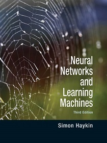
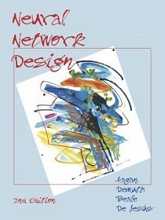
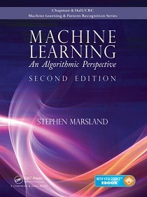
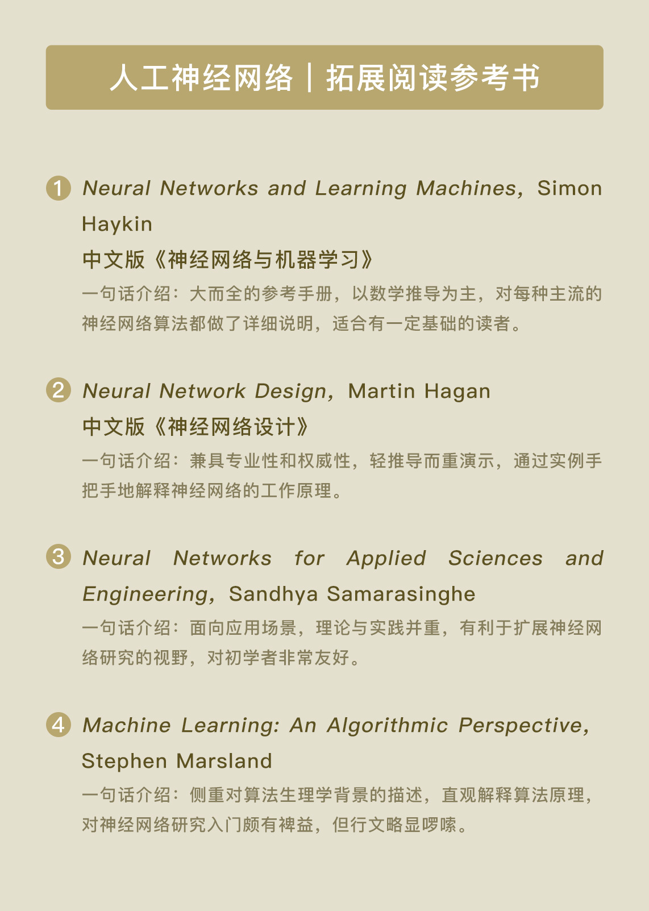

---
date: "2019-06-23"
---  
      
# （课外辅导）人工神经网络 | 拓展阅读参考书
人工神经网络方向的参考书首推**Simon Haykin**所著的**Neural Networks and Learning Machines**，英文版于2008年出到第三版，中译本名为**《神经网络与机器学习》**，也有影印本。本书是“大而全”的参考手册类型，全书以数学推导为主，对每种主流的神经网络算法都做了详细说明。Simon Haykin是通信系统与信号处理的专家，在这本神经网络的专著中也穿插了大量信号处理和信息论中常用的工具，散发着浓厚的数学气息，因而适合在具有一定基础的条件下阅读。

另一本神经网络的专著是**Martin Hagan**等人合著的**Neural Network Design**，英文版于2014年出到第二版，中译本名为**《神经网络设计》**，对应原书第一版。本书的几位作者是Matlab中神经网络工具箱的开发者，因而其专业性和权威性毋庸置疑。和Simon Haykin的学究著作相比，本书轻推导而重演示，主要通过实例手把手地解释神经网络的工作原理，对线性代数和最优化等基本工具也有涉及。

**Sandhya Samarasinghe**所著的**Neural Networks for Applied Sciences and Engineering**同样是非常好的参考书，英文版出版于2007年，暂无中译本。正如书名所示，本书是一本面向应用场景的书籍，侧重于神经网络在工程中，尤其是在基于数据进行模式识别中的应用。书中同样包含丰富的实例，其中不乏取材于真实的数据分析案例，和现实结合得相当紧密的实例。本书是难得的理论与实践并重的参考书，有利于扩展神经网络研究的视野，对初学者也非常友好。

最后一本是**Stephen Marsland**所著的**Machine Learning: An Algorithmic Perspective**，英文版于2015年出到第二版，暂无中文版。本书的主题是机器学习，但对包括感知器、多层感知器、径向基网络和自组织映射等主流的神经网络算法都用专门的章节加以介绍。在介绍中，作者侧重于对算法生理学背景的描述，以及对于算法原理的直观解释，这对神经网络研究的入门者无疑颇有裨益。遗憾的是，本书的行文略显啰嗦。

**部分书目链接**

* [Neural Networks and Learning Machines](https://cours.etsmtl.ca/sys843/REFS/Books/ebook_Haykin09.pdf)

* [Neural Network Design](http://hagan.okstate.edu/NNDesign.pdf)

* [Machine Learning: An Algorithmic Perspective](<https://doc.lagout.org/science/Artificial Intelligence/Machine learning/Machine Learning_ An Algorithmic Perspective (2nd ed.) [Marsland 2014-10-08].pdf>)

<!-- [[[read_end]]] -->