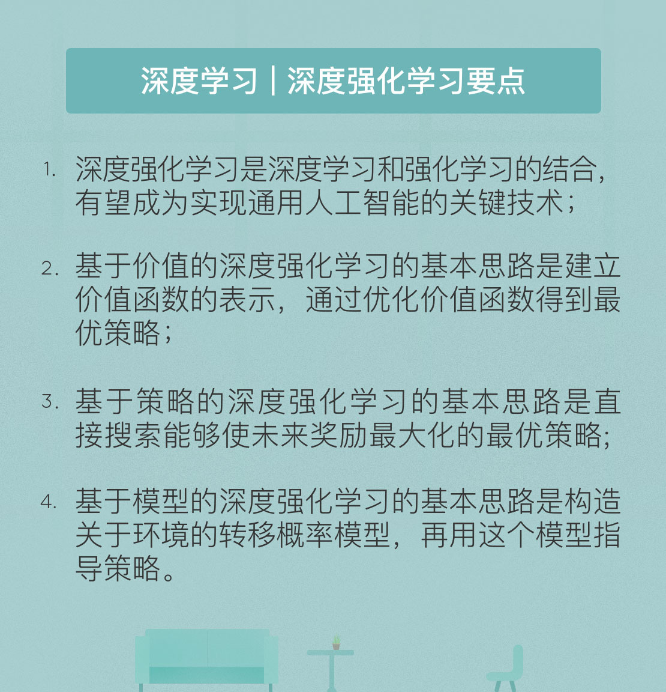

---
date: "2019-06-23"
---  
      
# 27 深度学习 | 困知勉行者勇：深度强化学习
在2017年新鲜出炉的《麻省理工科技评论》十大突破性技术中，“强化学习”榜上有名。如果把时钟调回到一年多之前的围棋人机大战，彼时的深度强化学习在AlphaGo对李世乭的横扫中就已经初露峥嵘。而在进化版AlphaGo Zero中，深度强化学习更是大放异彩，AlphaGo Zero之所以能够摆脱对人类棋谱的依赖，其原因就在于使用纯粹的深度强化学习进行端到端的自我对弈，从而超越了人类的围棋水平。

要介绍深度强化学习就不得不先说一说强化学习的故事。相比于纯人造的监督学习和无监督学习，强化学习的思想根源来自于认知科学。20世纪初，美国心理学家爱德华·桑代克在对教育过程的研究中提出了强化学习的原始理论，而作为人工智能方法的强化学习则力图使计算机在没有明确指导的情况下实现自主学习，完成从数据到决策的转变。

**强化学习（reinforcement learning）实质上是智能系统从环境到行为的学习过程，智能体通过与环境的互动来改善自身的行为，改善准则是使某个累积奖励函数最大化**。具体来说，强化学习是基于环境反馈实现决策制定的通用框架，根据不断试错得到来自环境的奖励或者惩罚，从而实现对趋利决策信念的不断增强。它强调在与环境的交互过程中实现学习，产生能获得最大利益的习惯性行为。

强化学习的特点在于由环境提供的强化信号只是对智能体所产生动作的好坏作一种评价，和监督学习中清晰明确的判定结果相比，环境的反馈只能提供很少的信息。所以强化学习需要在探索未知领域和遵从已有经验之间找到平衡。一方面，智能体要在陌生的环境中不断摸着石头过河，来探索新行为带来的奖励；另一方面，智能体也要避免在探索中玩儿脱，不能放弃根据已有经验来踏踏实实地获得最大收益的策略。

**描述强化学习最常用的模式是马尔可夫决策过程**（Markov decision process）。马尔可夫决策过程是由离散时间随机控制的过程，可以用以下的四元组来定义

* \$S\$：由智能体和环境所处的所有可能状态构成的有限集合
* \$A\$：由智能体的所有可能动作构成的有限集合
* \$P\_a\(s, s'\) = \\text\{Pr\}\(s\_\{t + 1\} = s' | s\_t = s, a\_t = a\)\$：智能体在\$t\$时刻做出的动作\$a\$使马尔可夫过程的状态从\$t\$时刻的\$s\$转移为\$t + 1\$时刻的\$s'\$的概率
* \$R\_a\(s, s'\)\$：智能体通过动作\$a\$使状态从\$s\$转移到\$s'\$得到的实时奖励

<!-- [[[read_end]]] -->

除了这个四元组之外，_强化学习还包括一个要素，就是描述主体如何获取奖励的规则_。强化学习主体和环境之间的交互是以离散时间步的方式实现的。在某个时间点上，智能体对环境进行观察，得到这一时刻的奖励，接下来它就会在动作集中选择一个动作发送给环境。来自智能体的动作既能改变环境的状态，也会改变来自环境的奖励。而在智能体与环境不断互动的过程中，它的终极目标就是让自己得到的奖励最大化。

**深度强化学习（deep reinforcement learning）是深度学习和强化学习的结合，它将深度学习的感知能力和强化学习的决策能力熔于一炉，用深度学习的运行机制达到强化学习的优化目标，从而向通用人工智能迈进**。

根据实施方式的不同，深度强化学习方法可以分成三类，分别是_基于价值、基于策略和基于模型的深度强化学习_。

**基于价值（value-based）的深度强化学习的基本思路是建立一个价值函数的表示**。价值函数（value function）通常被称为\$Q\$函数，以状态空间\$S\$和动作空间\$A\$为自变量。但对价值函数的最优化可以说是醉翁之意不在酒，其真正目的是确定智能体的行动策略——没错，就是前文中“基于策略”的那个策略。

策略是从状态空间到动作空间的映射，表示的是智能体在状态\$s\_t\$下选择动作\$a\$，执行这一动作并以概率\$P\_a\(s\_t, s\_\{t + 1\}\)\$转移到下一状态\$s\_\{t + 1\}\$，同时接受来自环境的奖赏\$R\_a\(s\_t, s\_\{t + 1\}\)\$。价值函数和策略的关系在于它可以表示智能体一直执行某个固定策略所能获得的累积回报。如果某个策略在所有状态-动作组合上的期望回报优于所有其他策略，这就是个最优策略。_基于价值的深度强化学习就是要通过价值函数来找到最优策略_，最优策略的数目可能不止一个，但总能找到其中之一。

**在没有“深度”的强化学习中，使用价值函数的算法叫做 Q学习算法**（Q-learning）。Q算法其实非常简单，就是在每个状态下执行不同的动作，来观察得到的奖励，并迭代执行这个操作。本质上说，Q学习算法是有限集上的搜索方法，如果出现一个不在原始集合中的新状态，Q算法就无能为力了，所以这是一种不具备泛化能力的算法，也就不能对未知的情况做出预测。

为了实现具有预测功能的Q算法，深度强化学习采用的方式是将Q算法的参数也作为未知的变量，用神经网络来训练Q算法的参数，这样做得到的就是深度Q网络。深度Q网络中有两种值得一提的机制，分别是经验回放和目标Q网络。

经验回放的作用就是避免“熊瞎子掰苞米，掰新的扔旧的”这种窘境。通过将以往的状态转移数据存储下来并作为训练数据使用，经验回放能够克服数据之间的相关性，避免网络收敛到局部极小值。

目标Q网络则对当前Q值和目标Q值做了区分，单独使用一个新网络来产生目标Q值。这相当于对当前Q值和目标Q值进行去相关，从而克服了非平稳目标函数的影响，避免算法得到震荡的结果。

2016年以来，研究者又对深度Q网络提出了其他方面的改进，感兴趣的话，你可以搜索相关的论文。

既然对价值函数的学习也是以最优策略为终极目标，那为什么不绕开价值函数，直接来学习策略呢？

**基于策略（strategy-based）的深度强化学习的基本思路就是直接搜索能够使未来奖励最大化的最优策略**。具体的做法是利用深度神经网络对策略进行参数化的表示，再利用策略梯度方法进行优化，通过不断计算总奖励的期望关于策略参数的梯度来更新策略参数，最终收敛到最优策略上。

_策略梯度方法的思想是直接使用逼近函数来近似表示和优化策略，通过增加总奖励较高情况的出现概率来逼近最优策略_。其运算方式和深度学习中的随机梯度下降法类似，都是在负梯度的方向上寻找最值，以优化深度网络的参数。

这种方法的问题是在每一轮的策略梯度更新中都需要大量智能体与环境的互动轨迹作为训练数据，但在强化学习中，大量的在线训练数据是难以获取的，这无疑给策略梯度方法带来了很大的限制。

**一种实用的策略梯度方法是无监督强化辅助学习**（UNsupervised REinforcement and Auxiliary Learning），简称UNREAL算法。_UNREAL算法的核心是行动者-评论家（actor-critic）机制，两者分别代表两个不同的网络_。

行动者是策略网络，用于对策略进行更新；评论家则是价值函数网络，通过逼近状态-动作对的价值函数来判定哪些是有价值的策略。这种机制就和人类的行为方式非常接近了，也就是用价值观来指导行为，而行为经验又会对价值观产生反作用。

在行动者-评论家机制的基础上，UNREAL做出了一些改进。首先是_采用异步训练的思想_，即让多个训练环境同时采集数据并执行训练，这不仅提升了数据的采样速度，也提升了算法的训练速度。在不同训练环境采集样本还能避免样本之间的强相关性，有利于神经网络的性能提升。

UNREAL的另一个改进是_引入了多重的辅助任务_。多个辅助任务同时训练单个网络既能加快学习速度，又能进一步提升性能，代价则是计算量的增加。常用的辅助任务包括控制任务和回馈预测任务。需要注意的是，虽然并行执行的任务种类不同，但它们使用的都是同样的训练数据，因而可以看成是对已有数据价值更加充分的挖掘与利用。

无论是基于价值还是基于策略的深度强化学习方法，都没有对环境模型做出任何先验假设。**基于模型（model-based）的深度强化学习的基本思路是构造关于环境的模型，再用这个模型来指导决策**。关于环境的模型可以使用转移概率\$p\(r, s' | s, a\)\$来表示，它描述了从当前的状态和动作到下一步的状态和奖励的可能性。将转移概率在状态空间和动作空间上遍历，就可以得到完整的转移概率张量。不同的转移概率可以通过深度网络训练得到。

和前两种方法相比，基于模型的方法存在很多问题，相关的研究和应用也比较少。在转移概率的估计中，每个概率值上都会存在误差，而这些误差在较长的状态转移序列上累积起来，可能会达到相当惊人的水平。这将导致计算出的奖励值和真实奖励值之间的南辕北辙。

可即便如此，基于模型的方法仍有较强的现实意义。它能减少与真实环境进行互动的次数，而这种互动在实践中往往是受限的。此外，如果能学到一个足够准确的环境模型，对智能体的控制难度也会大大降低。

今天我和你分享了深度强化学习的简单原理与方法分类，其要点如下：

* 深度强化学习是深度学习和强化学习的结合，有望成为实现通用人工智能的关键技术；
* 基于价值的深度强化学习的基本思路是建立价值函数的表示，通过优化价值函数得到最优策略；
* 基于策略的深度强化学习的基本思路是直接搜索能够使未来奖励最大化的最优策略；
* 基于模型的深度强化学习的基本思路是构造关于环境的转移概率模型，再用这个模型指导策略。

深度强化学习的三种实现方式各具特色，各有千秋，那么能不能将它们优势互补，从而发挥更大的作用呢？

欢迎发表你的观点。

