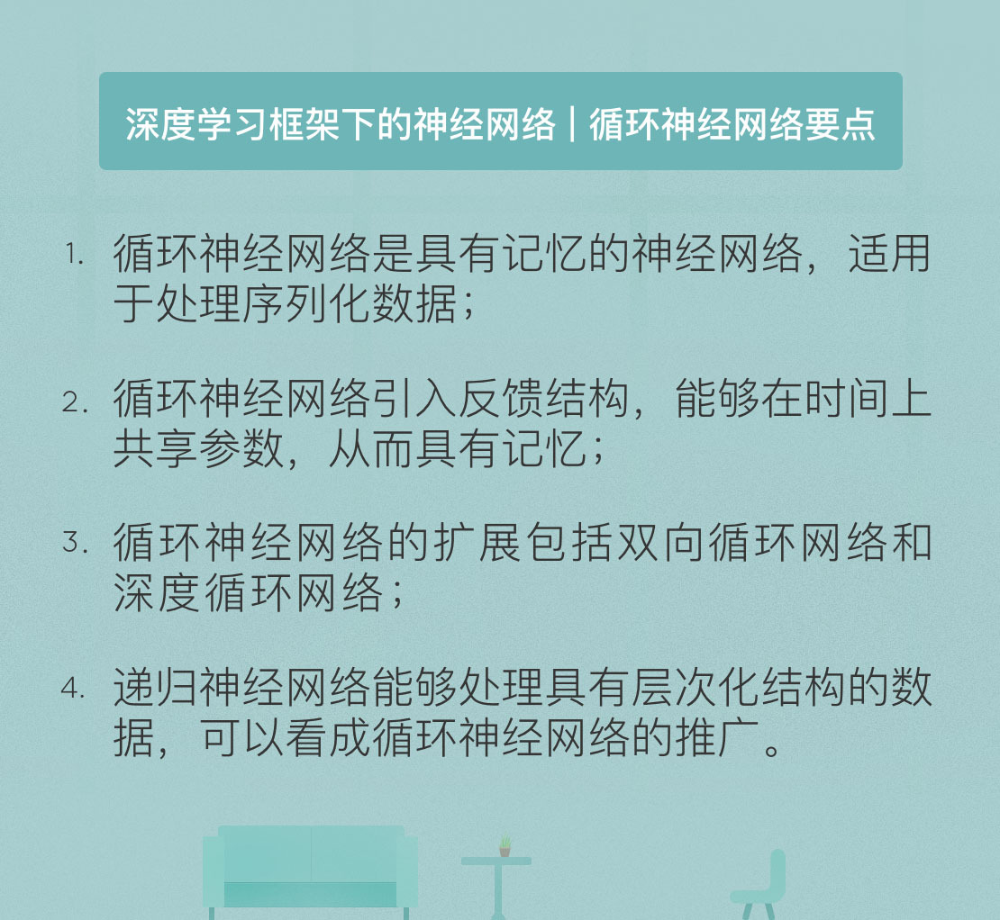

---
date: "2019-06-23"
---  
      
# 30 深度学习框架下的神经网络 | 昨日重现：循环神经网络
今天是除夕，明天就是春节啦，在这里，给你拜个早年，祝你狗年大吉，新春快乐，在新的一年里，福旺运旺！

今天我们继续讨论深度学习框架下的神经网络，聊一聊**循环神经网络**。

2017年，一本名叫《阳光失了玻璃窗》的诗集出版了。这本来是再普通不过的事情，可诗集的作者是赫赫有名的网红机器人微软小冰，或者更确切地说，小冰背后的算法，就让事情变得没那么简单了。

我在网上拜读了一些小冰的诗，实话实说，它们让我想起了几年前那些将简单的旋律和节奏随机排列组合而批量生产出来，至今仍在广场舞音乐中大行其道的网络歌曲。但小冰的诗显然技高一筹，循环神经网络和递归神经网络这些高大上的技术让它的排列组合更加难以捉摸。

在深度学习中，RNN这个缩写有两层含义，它既可以表示循环神经网络（Recurrent Neural Network），也可以表示递归神经网络（Recursive Neural Network）。巧的是，这两个RNN之间的关系还很密切：循环神经网络可以看成是递归神经网络的特例，递归神经网络则可以视为循环神经网络的推广。

**循环神经网络和我们前面介绍的所有神经网络都不一样，它的独特之处在于引入了“时间”的维度，因而适用于处理时间序列类型的数据**。回忆一下上次分享的卷积神经网络，它具有空间上的参数共享的特性，也就是同样的核函数可以应用在图像的不同区域之上。如果把参数共享调整到时间的维度上，让神经网络使用相同的权重系数来处理具有先后顺序的数据，得到的就是循环神经网络。

从结构上看，使用神经网络处理可变长度的输入时，在时间上共享参数是非常有必要的。定义在空间上的数据不会无穷无尽地延伸，即使大如《清明上河图》也有确定的边界存在。在很多图像识别的任务中，输入图像的像素数目甚至是有特定要求的。但对于一个以时间为自变量的变长数据来说，很难说清楚数据的终点在哪里，抑或这个终点根本就不存在。

这种情况之下，如果对每一个时间点上的数据都计算一次神经网络的权重系数，无疑会带来极大的计算负荷。循环神经网络就是将长度不定的输入分割为等长度的小块，再使用相同的权重系数进行处理，从而实现对变长输入的计算与处理。

<!-- [[[read_end]]] -->

**从功能上看，时间维度上的参数共享可以充分利用数据之间的时域关联性**。在生活中你一定有这样的经验：前后文的语境能够对信息进行有效的补充。在大大小小的英语考试中都少不了一类叫做“完形填空”的题目，这类题目的要求就是根据上下文的语义选择用于填空的合适的词语。比方说妈妈在厨房里突然喊我：“菜炒好了，赶紧来......”，即使后面的话没有听清楚，也能猜到十有八九是让我赶紧吃饭，而不是洗衣服或者其他什么事情。这利用的就是数据的**时域关联**。

循环神经网络对时域的关联性的利用体现在时刻\$t\$的输出既取决于当前时刻的输入，也取决于网络在前一时刻\$t \- 1\$甚至于更早的输出。从这个意义上讲，**循环神经网络引入了反馈机制，因而具有记忆的功能**。正是记忆功能使循环神经网络能够提取来自序列自身的信息，这是传统的前馈神经网络所无法做到的。

关于循环神经网络的记忆特性，可以做出进一步的解释：**其实前馈网络在某种程度上同样具有记忆，只要神经网络的参数经过最优化，优化的参数中就会包含着过往数据的踪迹**。但最优化的记忆只局限于训练数据集上。当训练出的模型应用到新的测试数据集上时，其参数并不会根据测试数据的表现做出进一步的调整，因而前馈神经网络的记忆其实是“冻结”的记忆。

相比之下，在循环神经网络中，记忆的作用更加宽泛。它的作用不是给每种类型的特征分配固定的权重，而是描述一系列时序事件之间的关系，即使这些事件之间可能没有明显而紧密的时间关联，但它们之间的相关性依然可能如草蛇灰线般伏延千里，而这正是循环网络的记忆要挖掘的对象。

两种网络代表了两种不同的知识类型。

前馈网络适用于表示客观性的知识。当我们学会分辨颜色之后，这项技能就会伴随我们一生，不会随时间或环境的变化而变化，就像一块红布不会因为放了几十年或者是拿到另一个城市而变成蓝色。

循环网络则适用于表示主观性的知识。每种语言中都有同音不同义的词汇，那么在听到一个"jing"的音节时，就要根据前后的其他音节来判断它到底是干净的“净”还是安静的“静”。很多主观性知识正隐藏在数据的顺序之中，而这种顺序恰恰可以由循环神经网络刻画。

具体来说，输入序列的内部信息存储在循环神经网络的隐藏层中，并随着时间的推移在隐藏层中流转。循环神经网络的记忆特性可以用以下公式表示

\$\$ \\mathbf\{h\}\_t = f\(\\mathbf\{W\} \\mathbf\{x\}\_t + \\mathbf\{U\} \\mathbf\{h\}\_\{t \- 1\} \) \$\$

这个式子的含义在于将时刻\$t\$的输入\$\\mathbf\{x\}\_t\$的加权结果和时刻\$t \- 1\$的隐藏层状态\$\\mathbf\{h\}\_\{t \- 1\}\$的加权结果共同作为传递函数的输入，得到的就是隐藏层在时刻\$t\$的输出\$\\mathbf\{h\}\_t\$。\$\\mathbf\{W\}\$表示了从输入到状态的权重矩阵，\$\\mathbf\{U\}\$则表示了从状态到状态的转移矩阵。直观地看起来，\$\\mathbf\{h\}\_t\$只取决于\$\\mathbf\{h\}\_\{t \- 1\}\$，但由于\$\\mathbf\{h\}\_\{t \- 1\}\$又取决于\$\\mathbf\{h\}\_\{t \- 2\}\$，\$\\mathbf\{h\}\_\{t \- 2\}\$又取决于\$\\mathbf\{h\}\_\{t \- 3\}\$，因而\$\\mathbf\{h\}\_t\$和之前所有时刻的隐藏层状态都是有关系的。

对循环神经网络的训练就是根据输出结果和真实结果之间的误差不断调整参数\$\\mathbf\{W\}\$和\$\\mathbf\{U\}\$，直到达到预设要求的过程，其目的是实现对输入序列的精确划分。**其训练方法也是基于梯度的反向传播算法，但和其他前馈网络不同的是，这里的反向传播是通过时间进行的**（backpropagation through time）。

由于循环神经网络的每个状态都与之前的所有状态相关，因而在基于时间的反向传播中，对当前时刻的参数求偏导一定会涉及前一时刻的参数。这其实和原始的反向传播算法毫无区别，只不过在链式法则中添加了一组关于时间的中间变量。

在普通的循环神经网络中，记忆只会涉及到过去的状态。如果想让循环神经网络利用来自未来的信息，就要让当前的状态和以后时刻的状态同样建立起联系，得到的就是**双向循环神经网络**（bidirectional recurrent neural network）。

双向循环网络包括正向计算和反向计算两个环节，在正向计算中，时刻\$t\$的隐藏层状态\$\\mathbf\{h\}\_t\$与过去的\$\\mathbf\{h\}\_\{t \- 1\}\$相关；而在反向计算中，时刻\$t\$的隐藏层状态\$\\mathbf\{h\}\_t\$与未来的\$\\mathbf\{h\}\_\{t + 1\}\$相关。由于正向计算和反向计算的权重系数是不共享的，因而双向循环网络需要分别计算正向和反向的结果，并将两者的组合作为隐藏层的最终参数。

将深度结构引入双向循环神经网络就可以得到深度循环网络，它和其他深度结构一样，具有多个隐藏层。每个隐藏层的状态\$\\mathbf\{h\}\_t\^i\$既取决于同一时刻前一隐藏层的状态\$\\mathbf\{h\}\_t\^\{i \- 1\}\$，也取决于同一隐藏层在前一时刻的状态\$\\mathbf\{h\}\_\{t \- 1\}\^i\$。

深度结构的作用在于建立更清晰的表示，这也可以用完形填空的例子来做类比，有些填空只需要根据它所在的句子便可以推断出来，这对应着单个隐藏层在时间维度上的依赖性；有些填空则可能要通读整段甚至全文才能确定它合适的意义，这就对应着深度结构在时间维度和空间维度上共有的依赖性。

循环神经网络的特点是在时间维度上共享参数，从而展开处理序列。如果换一种展开方式，将序列数据展开成树状结构，用到的就是**递归神经网络**。递归神经网络在处理数据使用的也是相同的权重系数，但这里的相同并非体现在时间上，而是体现在结构上。递归网络首先将输入数据转化为某种拓扑结构，再在相同的结构上递归使用相同的权重系数，通过遍历方式得到结构化的预测。

**在自然语言处理中，递归神经网络可以解决时间序列无法解决的问题**。比方说，“两个大学的老师”是个有歧义的句子，如果单纯地将它拆分为词序列是无法消解歧义性的，只有用语法解析树来表示才能表示出定语“两个”到底描述的是“大学”还是“老师”。

将数据用树状结构表示后，递归神经网络的作用是将它们进一步表示成向量，映射到表示语义的向量空间之中。在语义空间上既可以度量单个向量的尺度，比如判定句子的感情色彩到底是褒义还是贬义；也可以度量不同向量之间的关系，比如确定两个句子意义上的相似程度。

递归神经网络通过树状结构将一个完整的句子打散为若干分量的组合，生成的向量就是树结构的根节点。在训练中，递归网络使用的也是误差反向传播的方法，误差从树结构的根节点反向传播到每个叶子节点。但在实际应用中，递归神经网络远不如循环神经网络受欢迎，这是因为它的训练需要高度的人工干预，将训练集的每个句子标注为语法解析树的形式不仅需要人工完成，而且费时费力。从性价比的角度看，递归网络远不如循环网络来得实在。

今天我和你分享了循环神经网络和递归神经网络的基本原理与简要的工作机制。其要点如下：

* 循环神经网络是具有记忆的神经网络，适用于处理序列化数据；
* 循环神经网络引入反馈结构，能够在时间上共享参数，从而具有记忆；
* 循环神经网络的扩展包括双向循环网络和深度循环网络；
* 递归神经网络能够处理具有层次化结构的数据，可以看成循环神经网络的推广。

循环神经网络的记忆机制与人类的记忆机制颇为相似。那么人类记忆还有哪些特点可以借鉴到神经网络的设计当中呢？

欢迎发表你的观点。

