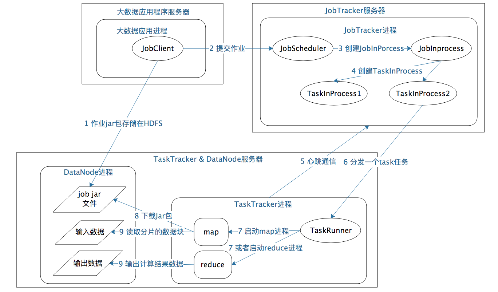
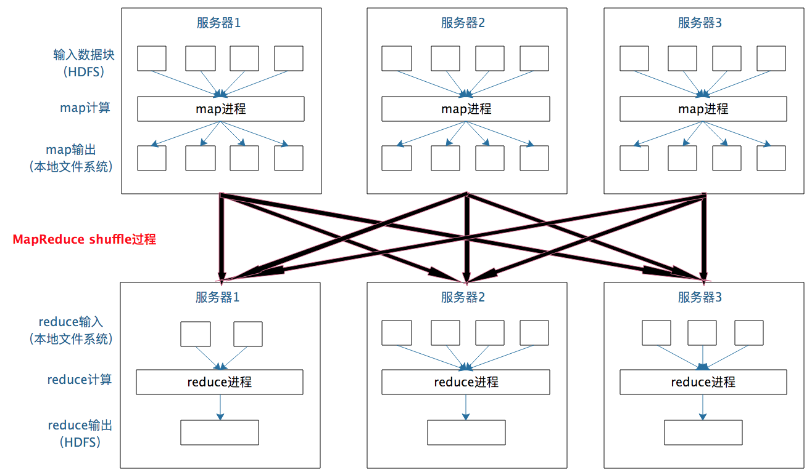

---
date: "2019-06-23"
---  
      
# 08 | MapReduce如何让数据完成一次旅行？
上一期我们聊到MapReduce编程模型将大数据计算过程切分为Map和Reduce两个阶段，先复习一下，在Map阶段为每个数据块分配一个Map计算任务，然后将所有map输出的Key进行合并，相同的Key及其对应的Value发送给同一个Reduce任务去处理。通过这两个阶段，工程师只需要遵循MapReduce编程模型就可以开发出复杂的大数据计算程序。

那么这个程序是如何在分布式集群中运行起来的呢？MapReduce程序又是如何找到相应的数据并进行计算的呢？答案就是需要MapReduce计算框架来完成。上一期我讲了MapReduce既是编程模型又是计算框架，我们聊完编程模型，今天就来讨论MapReduce如何让数据完成一次旅行，也就是MapReduce计算框架是如何运作的。

首先我想告诉你，在实践中，这个过程有两个关键问题需要处理。

* 如何为每个数据块分配一个Map计算任务，也就是代码是如何发送到数据块所在服务器的，发送后是如何启动的，启动以后如何知道自己需要计算的数据在文件什么位置（BlockID是什么）。

* 处于不同服务器的map输出的\<Key, Value> ，如何把相同的Key聚合在一起发送给Reduce任务进行处理。

<!-- [[[read_end]]] -->

那么这两个关键问题对应在MapReduce计算过程的哪些步骤呢？根据我上一期所讲的，我把MapReduce计算过程的图又找出来，你可以看到图中标红的两处，这两个关键问题对应的就是图中的两处“MapReduce框架处理”，具体来说，它们分别是MapReduce作业启动和运行，以及MapReduce数据合并与连接。


## MapReduce作业启动和运行机制

我们以Hadoop 1为例，MapReduce运行过程涉及三类关键进程。

1.大数据应用进程。这类进程是启动MapReduce程序的主入口，主要是指定Map和Reduce类、输入输出文件路径等，并提交作业给Hadoop集群，也就是下面提到的JobTracker进程。这是由用户启动的MapReduce程序进程，比如我们上期提到的WordCount程序。

2.JobTracker进程。这类进程根据要处理的输入数据量，命令下面提到的TaskTracker进程启动相应数量的Map和Reduce进程任务，并管理整个作业生命周期的任务调度和监控。这是Hadoop集群的常驻进程，需要注意的是，JobTracker进程在整个Hadoop集群全局唯一。

3.TaskTracker进程。这个进程负责启动和管理Map进程以及Reduce进程。因为需要每个数据块都有对应的map函数，TaskTracker进程通常和HDFS的DataNode进程启动在同一个服务器。也就是说，Hadoop集群中绝大多数服务器同时运行DataNode进程和TaskTracker进程。

JobTracker进程和TaskTracker进程是主从关系，主服务器通常只有一台（或者另有一台备机提供高可用服务，但运行时只有一台服务器对外提供服务，真正起作用的只有一台），从服务器可能有几百上千台，所有的从服务器听从主服务器的控制和调度安排。主服务器负责为应用程序分配服务器资源以及作业执行的调度，而具体的计算操作则在从服务器上完成。

具体来看，MapReduce的主服务器就是JobTracker，从服务器就是TaskTracker。还记得我们讲HDFS也是主从架构吗，HDFS的主服务器是NameNode，从服务器是DataNode。后面会讲到的Yarn、Spark等也都是这样的架构，这种一主多从的服务器架构也是绝大多数大数据系统的架构方案。

可重复使用的架构方案叫作架构模式，一主多从可谓是大数据领域的最主要的架构模式。主服务器只有一台，掌控全局；从服务器有很多台，负责具体的事情。这样很多台服务器可以有效组织起来，对外表现出一个统一又强大的计算能力。

讲到这里，我们对MapReduce的启动和运行机制有了一个直观的了解。那具体的作业启动和计算过程到底是怎样的呢？我根据上面所讲的绘制成一张图，你可以从图中一步一步来看，感受一下整个流程。



如果我们把这个计算过程看作一次小小的旅行，这个旅程可以概括如下：

1.应用进程JobClient将用户作业JAR包存储在HDFS中，将来这些JAR包会分发给Hadoop集群中的服务器执行MapReduce计算。

2.应用程序提交job作业给JobTracker。

3.JobTracker根据作业调度策略创建JobInProcess树，每个作业都会有一个自己的JobInProcess树。

4.JobInProcess根据输入数据分片数目（通常情况就是数据块的数目）和设置的Reduce数目创建相应数量的TaskInProcess。

5.TaskTracker进程和JobTracker进程进行定时通信。

6.如果TaskTracker有空闲的计算资源（有空闲CPU核心），JobTracker就会给它分配任务。分配任务的时候会根据TaskTracker的服务器名字匹配在同一台机器上的数据块计算任务给它，使启动的计算任务正好处理本机上的数据，以实现我们一开始就提到的“移动计算比移动数据更划算”。

7.TaskTracker收到任务后根据任务类型（是Map还是Reduce）和任务参数（作业JAR包路径、输入数据文件路径、要处理的数据在文件中的起始位置和偏移量、数据块多个备份的DataNode主机名等），启动相应的Map或者Reduce进程。

8.Map或者Reduce进程启动后，检查本地是否有要执行任务的JAR包文件，如果没有，就去HDFS上下载，然后加载Map或者Reduce代码开始执行。

9.如果是Map进程，从HDFS读取数据（通常要读取的数据块正好存储在本机）；如果是Reduce进程，将结果数据写出到HDFS。

通过这样一个计算旅程，MapReduce可以将大数据作业计算任务分布在整个Hadoop集群中运行，每个Map计算任务要处理的数据通常都能从本地磁盘上读取到。现在你对这个过程的理解是不是更清楚了呢？你也许会觉得，这个过程好像也不算太简单啊！

其实，你要做的仅仅是编写一个map函数和一个reduce函数就可以了，根本不用关心这两个函数是如何被分布启动到集群上的，也不用关心数据块又是如何分配给计算任务的。**这一切都由MapReduce计算框架完成**！是不是很激动，这也是我们反复讲到的MapReduce的强大之处。

## MapReduce数据合并与连接机制

**MapReduce计算真正产生奇迹的地方是数据的合并与连接**。

让我先回到上一期MapReduce编程模型的WordCount例子中，我们想要统计相同单词在所有输入数据中出现的次数，而一个Map只能处理一部分数据，一个热门单词几乎会出现在所有的Map中，这意味着同一个单词必须要合并到一起进行统计才能得到正确的结果。

事实上，几乎所有的大数据计算场景都需要处理数据关联的问题，像WordCount这种比较简单的只要对Key进行合并就可以了，对于像数据库的join操作这种比较复杂的，需要对两种类型（或者更多类型）的数据根据Key进行连接。

在map输出与reduce输入之间，MapReduce计算框架处理数据合并与连接操作，这个操作有个专门的词汇叫**shuffle**。那到底什么是shuffle？shuffle的具体过程又是怎样的呢？请看下图。



每个Map任务的计算结果都会写入到本地文件系统，等Map任务快要计算完成的时候，MapReduce计算框架会启动shuffle过程，在Map任务进程调用一个Partitioner接口，对Map产生的每个\<Key, Value>进行Reduce分区选择，然后通过HTTP通信发送给对应的Reduce进程。这样不管Map位于哪个服务器节点，相同的Key一定会被发送给相同的Reduce进程。Reduce任务进程对收到的\<Key, Value>进行排序和合并，相同的Key放在一起，组成一个\<Key, Value集合>传递给Reduce执行。

map输出的\<Key, Value>shuffle到哪个Reduce进程是这里的关键，它是由Partitioner来实现，MapReduce框架默认的Partitioner用Key的哈希值对Reduce任务数量取模，相同的Key一定会落在相同的Reduce任务ID上。从实现上来看的话，这样的Partitioner代码只需要一行。

```
     /** Use {@link Object#hashCode()} to partition. */ 
    public int getPartition(K2 key, V2 value, int numReduceTasks) { 
        return (key.hashCode() & Integer.MAX_VALUE) % numReduceTasks; 
     }
    

```

讲了这么多，对shuffle的理解，你只需要记住这一点：**分布式计算需要将不同服务器上的相关数据合并到一起进行下一步计算，这就是shuffle**。

shuffle是大数据计算过程中最神奇的地方，不管是MapReduce还是Spark，只要是大数据批处理计算，一定都会有shuffle过程，只有**让数据关联起来**，数据的内在关系和价值才会呈现出来。如果你不理解shuffle，肯定会在map和reduce编程中产生困惑，不知道该如何正确设计map的输出和reduce的输入。shuffle也是整个MapReduce过程中最难、最消耗性能的地方，在MapReduce早期代码中，一半代码都是关于shuffle处理的。

## 小结

MapReduce编程相对说来是简单的，但是MapReduce框架要将一个相对简单的程序，在分布式的大规模服务器集群上并行执行起来却并不简单。理解MapReduce作业的启动和运行机制，理解shuffle过程的作用和实现原理，对你理解大数据的核心原理，做到真正意义上把握大数据、用好大数据作用巨大。

## 思考题

互联网应用中，用户从手机或者PC上发起一个请求，请问这个请求数据经历了怎样的旅程？完成了哪些计算处理后响应给用户？

欢迎你写下自己的思考或疑问，与我和其他同学一起讨论。