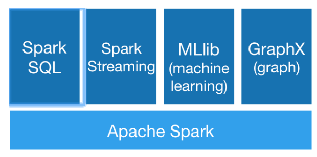

---
date: "2019-06-23"
---  
      
# 12 | 我们并没有觉得MapReduce速度慢，直到Spark出现
Hadoop MapReduce虽然已经可以满足大数据的应用场景，但是其执行速度和编程复杂度并不让人们满意。于是UC Berkeley的AMP Lab推出的Spark应运而生，Spark拥有更快的执行速度和更友好的编程接口，在推出后短短两年就迅速抢占MapReduce的市场份额，成为主流的大数据计算框架。

读到这里请你先停一下，请给这段看似“没毛病”的引子找找问题。

不知道你意识到没有，我在这段开头说的，“Hadoop MapReduce虽然已经可以满足大数据的应用场景，但是其执行速度和编程复杂度并不让人们满意”，这句话其实是错误的。这样说好像可以让你更加清晰地看到事物发展的因果关系，同时也可以暗示别人自己有洞察事物发展规律的能力。然而，这种靠事后分析的因果规律常常是错误的，**往往把结果当作了原因**。

事实上，在Spark出现之前，我们并没有对MapReduce的执行速度不满，我们觉得大数据嘛、分布式计算嘛，这样的速度也还可以啦。至于编程复杂度也是一样，一方面Hive、Mahout这些工具将常用的MapReduce编程封装起来了；另一方面，MapReduce已经将分布式编程极大地简化了，当时人们并没有太多不满。

<!-- [[[read_end]]] -->

真实的情况是，人们在Spark出现之后，才开始对MapReduce不满。原来大数据计算速度可以快这么多，编程也可以更简单。而且Spark支持Yarn和HDFS，公司迁移到Spark上的成本很小，于是很快，越来越多的公司用Spark代替MapReduce。也就是说，因为有了Spark，才对MapReduce不满；而不是对MapReduce不满，所以诞生了Spark。真实的因果关系是相反的。

这里有一条关于问题的定律分享给你：**我们常常意识不到问题的存在，直到有人解决了这些问题。**

当你去询问人们有什么问题需要解决，有什么需求需要被满足的时候，他们往往自己也不知道自己想要什么，常常言不由衷。但是如果你真正解决了他们的问题，他们就会恍然大悟：啊，这才是我真正想要的，以前那些统统都是“垃圾”，我早就想要这样的东西（功能）了。

所以顶尖的产品大师（问题解决专家），并不会拿着个小本本四处去做需求调研，问人们想要什么。而是在旁边默默观察人们是如何使用产品（解决问题）的，然后思考更好的产品体验（解决问题的办法）是什么。最后当他拿出新的产品设计（解决方案）的时候，人们就会视他为知己：你最懂我的需求（我最懂你的设计）。

乔布斯是这样的大师，Spark的作者马铁也是这样的专家。

说了那么多，我们回到Spark。Spark和MapReduce相比，有更快的执行速度。下图是Spark和MapReduce进行逻辑回归机器学习的性能比较，Spark比MapReduce快100多倍。


除了速度更快，Spark和MapReduce相比，还有更简单易用的编程模型。使用Scala语言在Spark上编写WordCount程序，主要代码只需要三行。

```
    val textFile = sc.textFile("hdfs://...")
    val counts = textFile.flatMap(line => line.split(" "))
                     .map(word => (word, 1))
                     .reduceByKey(_ + _)
    counts.saveAsTextFile("hdfs://...")
    

```

不熟悉Scala语言没关系，我来解释一下上面的代码。

第1行代码：根据HDFS路径生成一个输入数据RDD。

第2行代码：在输入数据RDD上执行3个操作，得到一个新的RDD。

* 将输入数据的每一行文本用空格拆分成单词。

* 将每个单词进行转换，`word => (word, 1)`，生成\<Key, Value>的结构。

* 相同的Key进行统计，统计方式是对Value求和，`(_ + _)`。

第3行代码：将这个RDD保存到HDFS。

RDD是Spark的核心概念，是弹性数据集（Resilient Distributed Datasets）的缩写。RDD既是Spark面向开发者的编程模型，又是Spark自身架构的核心元素。

我们先来看看作为Spark编程模型的RDD。我们知道，大数据计算就是在大规模的数据集上进行一系列的数据计算处理。MapReduce针对输入数据，将计算过程分为两个阶段，一个Map阶段，一个Reduce阶段，可以理解成是**面向过程的大数据计算**。我们在用MapReduce编程的时候，思考的是，如何将计算逻辑用Map和Reduce两个阶段实现，map和reduce函数的输入和输出是什么，这也是我们在学习MapReduce编程的时候一再强调的。

而Spark则直接针对数据进行编程，将大规模数据集合抽象成一个RDD对象，然后在这个RDD上进行各种计算处理，得到一个新的RDD，继续计算处理，直到得到最后的结果数据。所以Spark可以理解成是**面向对象的大数据计算**。我们在进行Spark编程的时候，思考的是一个RDD对象需要经过什么样的操作，转换成另一个RDD对象，思考的重心和落脚点都在RDD上。

所以在上面WordCount的代码示例里，第2行代码实际上进行了3次RDD转换，每次转换都得到一个新的RDD，因为新的RDD可以继续调用RDD的转换函数，所以连续写成一行代码。事实上，可以分成3行。

```
    val rdd1 = textFile.flatMap(line => line.split(" "))
    val rdd2 = rdd1.map(word => (word, 1))
    val rdd3 = rdd2.reduceByKey(_ + _)
    

```

RDD上定义的函数分两种，一种是转换（transformation）函数，这种函数的返回值还是RDD；另一种是执行（action）函数，这种函数不再返回RDD。

RDD定义了很多转换操作函数，比如有计算**map**\(func\)、过滤**filter**\(func\)、合并数据集**union**\(otherDataset\)、根据Key聚合**reduceByKey**\(func, \[numPartitions\]\)、连接数据集**join**\(otherDataset, \[numPartitions\]\)、分组**groupByKey**\(\[numPartitions\]\)等十几个函数。

我们再来看看作为Spark架构核心元素的RDD。跟MapReduce一样，Spark也是对大数据进行分片计算，Spark分布式计算的数据分片、任务调度都是以RDD为单位展开的，每个RDD分片都会分配到一个执行进程去处理。

RDD上的转换操作又分成两种，一种转换操作产生的RDD不会出现新的分片，比如map、filter等，也就是说一个RDD数据分片，经过map或者filter转换操作后，结果还在当前分片。就像你用map函数对每个数据加1，得到的还是这样一组数据，只是值不同。实际上，Spark并不是按照代码写的操作顺序去生成RDD，比如`rdd2 = rdd1.map(func)`这样的代码并不会在物理上生成一个新的RDD。物理上，Spark只有在产生新的RDD分片时候，才会真的生成一个RDD，Spark的这种特性也被称作**惰性计算**。

另一种转换操作产生的RDD则会产生新的分片，比如`reduceByKey`，来自不同分片的相同Key必须聚合在一起进行操作，这样就会产生新的RDD分片。实际执行过程中，是否会产生新的RDD分片，并不是根据转换函数名就能判断出来的，具体我们下一期再讨论。

总之，你需要记住，Spark应用程序代码中的RDD和Spark执行过程中生成的物理RDD不是一一对应的，RDD在Spark里面是一个非常灵活的概念，同时又非常重要，需要认真理解。

当然Spark也有自己的生态体系，以Spark为基础，有支持SQL语句的Spark SQL，有支持流计算的Spark Streaming，有支持机器学习的MLlib，还有支持图计算的GraphX。利用这些产品，Spark技术栈支撑起大数据分析、大数据机器学习等各种大数据应用场景。



我前面提到，顶尖的产品设计大师和问题解决专家，不会去询问人们想要什么，而是分析和观察人们的做事方式，从而思考到更好的产品设计和问题解决方案。

但是这种技巧需要深邃的观察力和洞察力，如果没有深度的思考，做出的东西就会沦为异想天开和自以为是。要知道大众提出的需求虽然也无法触及问题的核心，但是好歹是有共识的，大家都能接受，按这种需求做出的东西虽然平庸，但是不至于令人厌恶。

而缺乏洞见的自以为是则会违反常识，让其他人本能产生排斥感，进而产生对立情绪。这种情绪之下，设计没有了进一步改进的基础，最后往往成为悲剧。这两年在所谓互联网思维的鼓吹下，一些缺乏专业技能的人，天马行空创造需求，受到质疑后公开批评用户，也是让人倍感惊诧。

我们在自己的工作中，作为一个不是顶尖大师的产品经理或工程师，如何做到既不自以为是，又能逐渐摆脱平庸，进而慢慢向大师的方向靠近呢？

有个技巧可以在工作中慢慢练习：**不要直接提出你的问题和方案**，不要直接说“你的需求是什么？”“我这里有个方案你看一下”。

直向曲中求，对于复杂的问题，越是直截了当越是得不到答案。迂回曲折地提出问题，一起思考问题背后的规律，才能逐渐发现问题的本质。通过这种方式，既能达成共识，不会有违常识，又可能产生洞见，使产品和方案呈现闪光点。

* 你觉得前一个版本最有意思（最有价值）的功能是什么？

* 你觉得我们这个版本应该优先关注哪个方面？

* 你觉得为什么有些用户在下单以后没有支付？

## 思考题

你在工作、生活中通过提问发现问题背后的本质、现象背后的规律的例子有哪些？或者你观察到同事、朋友这样的例子有哪些？

欢迎你写下自己的思考或疑问，与我和其他同学一起讨论。