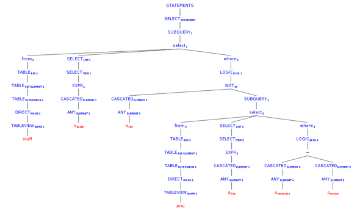
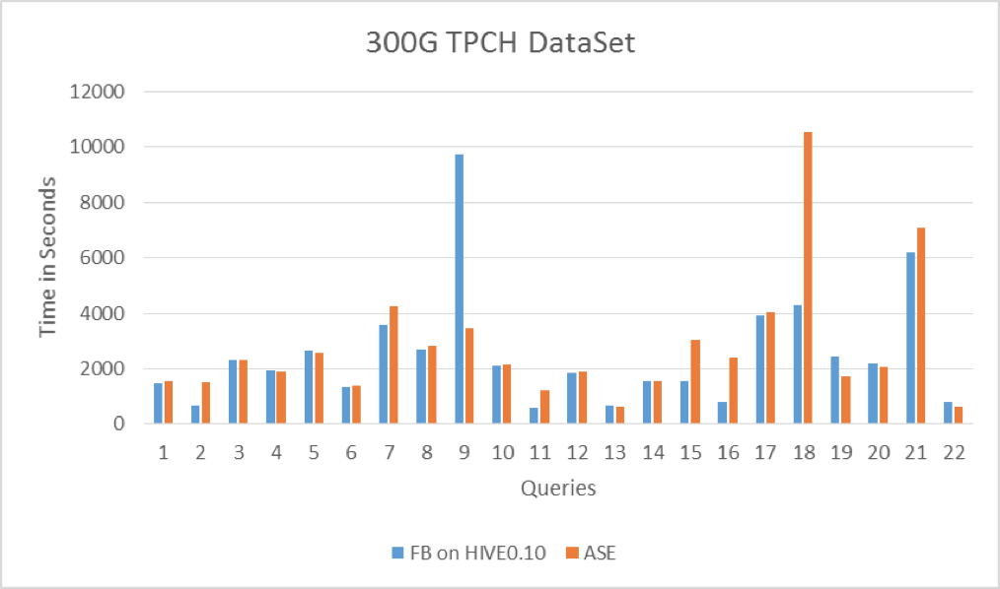
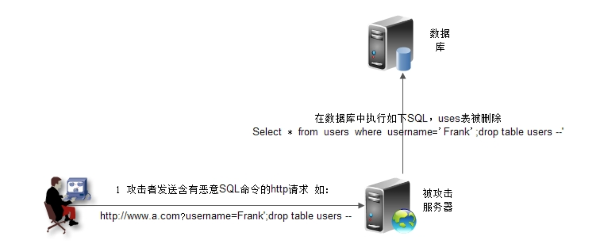

---
date: "2019-06-23"
---  
      
# 18 | 如何自己开发一个大数据SQL引擎？
从今天开始我们就进入了专栏的第三个模块，一起来看看大数据开发实践过程中的门道。学习一样技术，如果只是作为学习者，被动接受总是困难的。**但如果从开发者的视角看，很多东西就豁然开朗了，明白了原理，有时甚至不需要学习，顺着原理就可以推导出各种实现细节**。

各种知识从表象上看，总是杂乱无章的，如果只是学习这些繁杂的知识点，固然自己的知识面是有限的，并且遇到问题的应变能力也很难提高。所以有些高手看起来似乎无所不知，不论谈论起什么技术，都能头头是道，其实并不是他们学习、掌握了所有技术，而是他们是在谈到这个问题的时候，才开始进行推导，并迅速得出结论。

我在Intel的时候，面试过一个交大的实习生，她大概只学过一点MapReduce的基本知识，我问她如何用MapReduce实现数据库的join操作，可以明显看出她没学习过这部分知识。她说：我想一下，然后盯着桌子看了两三秒的时间，就开始回答，基本跟Hive的实现机制一样。从她的回答就能看出这个女生就是一个高手，高手不一定要很资深、经验丰富，把握住了技术的核心本质，掌握了快速分析推导的能力，能够迅速将自己的知识技能推进到陌生的领域，就是高手。

这也是我这个专栏的目的，讲述大数据技术的核心原理，分享一些高效的思考和思维方式，帮助你构建起自己的技术知识体系。

<!-- [[[read_end]]] -->

在这个模块里，我将以大数据开发者的视角，讲述大数据开发需要关注的各种问题，以及相应的解决方案。希望你可以进入我的角色，跳出纷繁复杂的知识表象，掌握核心原理和思维方式，进而融会贯通各种技术，再通过各种实践训练，最终成为真正的高手。

前面专栏我们提到过，程序员的三大梦想，也就是开发数据库、操作系统和编译器。今天我们通过一个支持标准SQL语法的大数据仓库引擎的设计开发案例，看看如何自己开发一个大数据SQL引擎。

在学习今天的内容前，我们先回顾一下前面讨论过的大数据仓库Hive。作为一个成功的大数据仓库，它将SQL语句转换成MapReduce执行过程，并把大数据应用的门槛下降到普通数据分析师和工程师就可以很快上手的地步。这部分内容如果你忘记了，可以返回[专栏第11期](http://time.geekbang.org/column/article/69459)复习一下。

但是Hive也有自己的问题，由于它使用自己定义的Hive QL语法，这对已经熟悉Oracle等传统数据仓库的分析师来说，还是有一定的上手难度。特别是很多企业使用传统数据仓库进行数据分析已经由来已久，沉淀了大量的SQL语句，并且这些SQL经过多年的修改打磨，非常庞大也非常复杂。我曾经见过某银行的一条统计报表SQL，打印出来足足两张A4纸。这样的SQL光是完全理解可能就要花很长时间，再转化成Hive QL就更加费力，还不说转化修改过程中可能引入的bug。

2012年那会，我还在Intel亚太研发中心大数据团队，当时团队决定开发一款能够支持标准数据库SQL的大数据仓库引擎，希望让那些在Oracle上运行良好的SQL可以直接运行在Hadoop上，而不需要重写成Hive QL。这就是后来的[Panthera](http://github.com/intel-hadoop/project-panthera-ase)项目。

在开发Panthera前，我们分析一下Hive的主要处理过程，大体上分成三步：

1.将输入的Hive QL经过语法解析器转换成Hive抽象语法树（Hive AST）。  
2.将Hive AST经过语义分析器转换成MapReduce执行计划。  
3.将生成的MapReduce执行计划和Hive执行函数代码提交到Hadoop上执行。

Panthera的设计思路是保留Hive语义分析器不动，替换Hive语法解析器，使其将标准SQL语句转换成Hive语义分析器能够处理的Hive抽象语法树。用图形来表示的话，是用红框内的部分代替黑框内原来Hive的部分。


红框内的组件我们重新开发过，浅蓝色的是我们使用的一个开源的SQL语法解析器，将标准SQL解析成标准SQL抽象语法树（SQL AST），后面深蓝色的就是团队自己开发的SQL抽象语法树分析与转换器，将SQL AST转换成Hive AST。

那么标准SQL和Hive QL的差别在哪里呢？

标准SQL和Hive QL的差别主要有两个方面，一个是语法表达方式，Hive QL语法和标准SQL语法略有不同；另一个是Hive QL支持的语法元素比标准SQL要少很多，比如，数据仓库领域主要的测试集[TPC-H](http://www.tpc.org/tpch/)所有的SQL语句Hive都不支持。尤其是Hive不支持复杂的嵌套子查询，而对于数据仓库分析而言，嵌套子查询几乎是无处不在的。比如下面这样的SQL，在where查询条件existes里面包含了另一条SQL语句。

```
    select o_orderpriority, count(*) as order_count 
    from orders 
    where o_orderdate >= date '[DATE]' 
    and o_orderdate < date '[DATE]' + interval '3' month 
    and exists 
    ( select * from lineitem 
    where l_orderkey = o_orderkey and l_commitdate < l_receiptdate ) 
    group by o_orderpriority order by o_orderpriority;
    

```

所以开发支持标准SQL语法的SQL引擎的难点，就变成**如何将复杂的嵌套子查询消除掉**，也就是where条件里不包含select。

SQL的理论基础是关系代数，而关系代数的主要操作只有5种，分别是并、差、积、选择、投影。所有的SQL语句最后都能用这5种操作组合完成。而一个嵌套子查询可以等价转换成一个连接（join）操作。

比如这条SQL

```
    select s_grade from staff where s_city not in (select p_city from proj where s_empname=p_pname)
    

```

这是一个在where条件里嵌套了not in子查询的SQL语句，它可以用left outer join和left semi join进行等价转换，示例如下，这是Panthera自动转换完成得到的等价SQL。这条SQL语句不再包含嵌套子查询，

```
    select panthera_10.panthera_1 as s_grade from (select panthera_1, panthera_4, panthera_6, s_empname, s_city from (select s_grade as panthera_1, s_city as panthera_4, s_empname as panthera_6, s_empname as s_empname, s_city as s_city from staff) panthera_14 left outer join (select panthera_16.panthera_7 as panthera_7, panthera_16.panthera_8 as panthera_8, panthera_16.panthera_9 as panthera_9, panthera_16.panthera_12 as panthera_12, panthera_16.panthera_13 as panthera_13 from (select panthera_0.panthera_1 as panthera_7, panthera_0.panthera_4 as panthera_8, panthera_0.panthera_6 as panthera_9, panthera_0.s_empname as panthera_12, panthera_0.s_city as panthera_13 from (select s_grade as panthera_1, s_city as panthera_4, s_empname as panthera_6, s_empname, s_city from staff) panthera_0 left semi join (select p_city as panthera_3, p_pname as panthera_5 from proj) panthera_2 on (panthera_0.panthera_4 = panthera_2.panthera_3) and (panthera_0.panthera_6 = panthera_2.panthera_5) where true) panthera_16 group by panthera_16.panthera_7, panthera_16.panthera_8, panthera_16.panthera_9, panthera_16.panthera_12, panthera_16.panthera_13) panthera_15 on ((((panthera_14.panthera_1 <=> panthera_15.panthera_7) and (panthera_14.panthera_4 <=> panthera_15.panthera_8)) and (panthera_14.panthera_6 <=> panthera_15.panthera_9)) and (panthera_14.s_empname <=> panthera_15.panthera_12)) and (panthera_14.s_city <=> panthera_15.panthera_13) where ((((panthera_15.panthera_7 is null) and (panthera_15.panthera_8 is null)) and (panthera_15.panthera_9 is null)) and (panthera_15.panthera_12 is null)) and (panthera_15.panthera_13 is null)) panthera_10 ;
    

```

通过可视化工具将上面两条SQL的语法树展示出来，是这样的。



这是原始的SQL抽象语法树。


这是等价转换后的抽象语法树，内容太多被压缩得无法看清，不过你可以感受一下（笑）。

那么，在程序设计上如何实现这样复杂的语法转换呢？当时Panthera项目组合使用了几种经典的设计模式，每个语法点被封装到一个类里去处理，每个类通常不过几十行代码，这样整个程序非常简单、清爽。如果在测试过程中遇到不支持的语法点，只需为这个语法点新增加一个类即可，团队协作与代码维护非常容易。

使用装饰模式的语法等价转换类的构造，Panthera每增加一种新的语法转换能力，只需要开发一个新的Transformer类，然后添加到下面的构造函数代码里即可。

```
       private static SqlASTTransformer tf =
          new RedundantSelectGroupItemTransformer(
          new DistinctTransformer(
          new GroupElementNormalizeTransformer(
          new PrepareQueryInfoTransformer(
          new OrderByTransformer(
          new OrderByFunctionTransformer(
          new MinusIntersectTransformer(
          new PrepareQueryInfoTransformer(
          new UnionTransformer(
          new Leftsemi2LeftJoinTransformer(
          new CountAsteriskPositionTransformer(
          new FilterInwardTransformer(
          //use leftJoin method to handle not exists for correlated
          new CrossJoinTransformer(
          new PrepareQueryInfoTransformer(
          new SubQUnnestTransformer(
          new PrepareFilterBlockTransformer(
          new PrepareQueryInfoTransformer(
          new TopLevelUnionTransformer(
          new FilterBlockAdjustTransformer(
          new PrepareFilterBlockTransformer(
          new ExpandAsteriskTransformer(
          new PrepareQueryInfoTransformer(
          new CrossJoinTransformer(
          new PrepareQueryInfoTransformer(
          new ConditionStructTransformer(
          new MultipleTableSelectTransformer(
          new WhereConditionOptimizationTransformer(
          new PrepareQueryInfoTransformer(
          new InTransformer(
          new TopLevelUnionTransformer(
          new MinusIntersectTransformer(
          new NaturalJoinTransformer(
          new OrderByNotInSelectListTransformer(
          new RowNumTransformer(
          new BetweenTransformer(
          new UsingTransformer(
          new SchemaDotTableTransformer(
          new NothingTransformer())))))))))))))))))))))))))))))))))))));
    

```

而在具体的Transformer类中，则使用组合模式对抽象语法树AST进行遍历，以下为Between语法节点的遍历。我们看到使用组合模式进行树的遍历不需要用递归算法，因为递归的特性已经隐藏在树的结构里面了。

```
      @Override
      protected void transform(CommonTree tree, TranslateContext context) throws SqlXlateException {
        tf.transformAST(tree, context);
        trans(tree, context);
      }
    
      void trans(CommonTree tree, TranslateContext context) {
        // deep firstly
        for (int i = 0; i < tree.getChildCount(); i++) {
          trans((CommonTree) (tree.getChild(i)), context);
        }
        if (tree.getType() == PantheraExpParser.SQL92_RESERVED_BETWEEN) {
          transBetween(false, tree, context);
        }
        if (tree.getType() == PantheraExpParser.NOT_BETWEEN) {
          transBetween(true, tree, context);
        }
      }
    

```

将等价转换后的抽象语法树AST再进一步转换成Hive格式的抽象语法树，就可以交给Hive的语义分析器去处理了，从而也就实现了对标准SQL的支持。

当时Facebook为了证明Hive对数据仓库的支持，Facebook的工程师手工将TPC-H的测试SQL转换成Hive QL，我们将这些手工Hive QL和Panthera进行对比测试，两者性能各有所长，总体上不相上下，这说明Panthera自动进行语法分析和转换的效率还是不错的。

Panthera（ASE）和Facebook手工Hive QL对比测试结果如下。



事实上，标准SQL语法集的语法点非常多，我们经过近两年的努力，绞尽脑汁进行各种关系代数等价变形，依然没有全部适配所有的标准SQL语法。

我在开发Panthera的时候，查阅了很多关于SQL和数据库的网站和文档，发现在我们耳熟能详的那些主流数据库之外还有很多名不见经传的数据库，此外，还有大量的关于SQL的语法解析器、测试数据和脚本集、各种周边工具。我们经常看到的MySQL、Oracle这些产品仅仅是整个数据库生态体系的冰山一角。还有很多优秀的数据库在竞争中落了下风、默默无闻，而更多的支撑起这些优秀数据库的论文、工具，非业内人士几乎闻所未闻。

这个认识给了我很大触动，我一直期待我们中国人能开发出自己的操作系统、数据库、编程语言，也看到有很多人前仆后继投入其中。但是这么多年过去了，大部分努力惨淡收场，小部分结果沦落为笑柄，成为人们饭后的谈资。我曾经思考过，为什么会这样？

开发Panthera之后，我想，我们国家虽然从事软件开发的人数很多，但是绝大多数都在做最顶层的应用开发，底层技术开发和研究的人太少，做出来的成果也太少。我们在一个缺乏周边生态体系、没有足够的竞争产品的情况下，就想直接开发出自己有影响力的操作系统、数据库、编程语言，无异于想在沙漠里种出几棵参天大树。

不过，庆幸的是，我也看到越来越多有全球影响力的底层技术产品中出现中国人的身影，小草已经在默默生长，假以时日，料想必有大树出现。

今天我讲的是一个SQL引擎是如何设计出来的，也许在你的工作几乎不可能去开发SQL引擎，但是了解这些基础的知识，了解一些设计的技巧，对你用好数据库，开发更加灵活、有弹性的系统也会很有帮助。

## 思考题

SQL注入是一种常见的Web攻击手段，如下图所示，攻击者在HTTP请求中注入恶意SQL命令（drop table users;），服务器用请求参数构造数据库SQL命令时，恶意SQL被一起构造，并在数据库中执行。



但是JDBC的PrepareStatement可以阻止SQL注入攻击，MyBatis之类的ORM框架也可以阻止SQL注入，请从数据库引擎的工作机制解释PrepareStatement和MyBatis的防注入攻击的原理。

欢迎你点击“请朋友读”，把今天的文章分享给好友。也欢迎你写下自己的思考或疑问，与我和其他同学一起讨论。