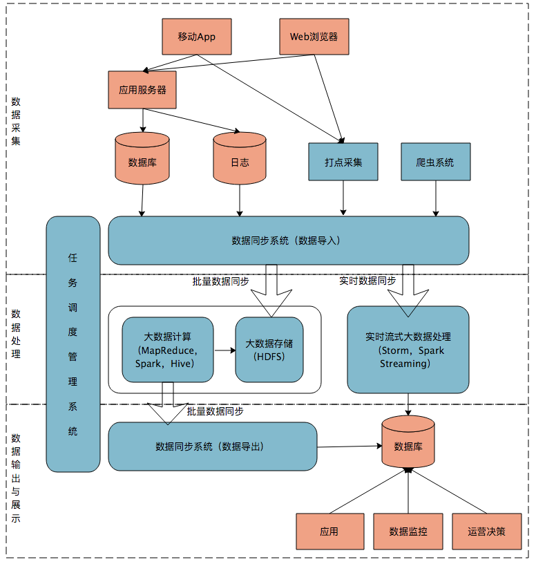
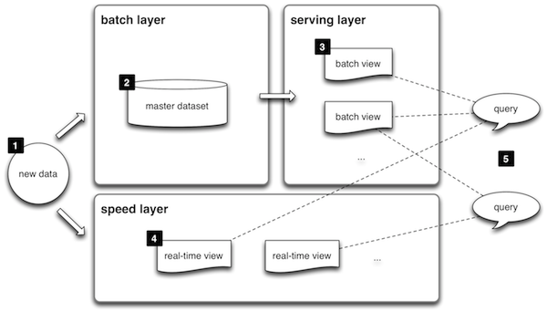

---
date: "2019-06-23"
---  
      
# 26 | 互联网产品 + 大数据产品 = 大数据平台
从今天开始，我们进入专栏的“大数据平台与系统集成”模块。

前面我讲了各种大数据技术的原理与架构，大数据计算通过将可执行的代码分发到大规模的服务器集群上进行分布式计算，以处理大规模的数据，即所谓的移动计算比移动数据更划算。但是在分布式系统中分发执行代码并启动执行，这样的计算方式必然不会很快，即使在一个规模不太大的数据集上进行一次简单计算，MapReduce也可能需要几分钟，Spark快一点，也至少需要数秒的时间。

而互联网产品处理用户请求，需要毫秒级的响应，也就是说，要在1秒内完成计算，因此大数据计算必然不能实现这样的响应要求。但是互联网应用又需要使用大数据，实现统计分析、数据挖掘、关联推荐、用户画像等一系列功能。

那么如何才能弥补这互联网和大数据系统之间的差异呢？解决方案就是将面向用户的互联网产品和后台的大数据系统整合起来，也就是今天我要讲的构建一个大数据平台。

大数据平台，顾名思义就是整合网站应用和大数据系统之间的差异，将应用程序产生的数据导入到大数据系统，经过处理计算后再导出给应用程序使用。

下图是一个典型的互联网大数据平台的架构。

在这张架构图中，大数据平台里面向用户的在线业务处理组件用褐色标示出来，这部分是属于互联网在线应用的部分，其他蓝色的部分属于大数据相关组件，使用开源大数据产品或者自己开发相关大数据组件。

<!-- [[[read_end]]] -->

你可以看到，大数据平台由上到下，可分为三个部分：数据采集、数据处理、数据输出与展示。

**数据采集**

将应用程序产生的数据和日志等同步到大数据系统中，由于数据源不同，这里的数据同步系统实际上是多个相关系统的组合。数据库同步通常用Sqoop，日志同步可以选择Flume，打点采集的数据经过格式化转换后通过Kafka等消息队列进行传递。

不同的数据源产生的数据质量可能差别很大，数据库中的数据也许可以直接导入大数据系统就可以使用了，而日志和爬虫产生的数据就需要进行大量的清洗、转化处理才能有效使用。

**数据处理**

这部分是大数据存储与计算的核心，数据同步系统导入的数据存储在HDFS。MapReduce、Hive、Spark等计算任务读取HDFS上的数据进行计算，再将计算结果写入HDFS。

MapReduce、Hive、Spark等进行的计算处理被称作是离线计算，HDFS存储的数据被称为离线数据。在大数据系统上进行的离线计算通常针对（某一方面的）全体数据，比如针对历史上所有订单进行商品的关联性挖掘，这时候数据规模非常大，需要较长的运行时间，这类计算就是离线计算。

除了离线计算，还有一些场景，数据规模也比较大，但是要求处理的时间却比较短。比如淘宝要统计每秒产生的订单数，以便进行监控和宣传。这种场景被称为大数据流式计算，通常用Storm、Spark Steaming等流式大数据引擎来完成，可以在秒级甚至毫秒级时间内完成计算。

**数据输出与展示**

前面我说过，大数据计算产生的数据还是写入到HDFS中，但应用程序不可能到HDFS中读取数据，所以必须要将HDFS中的数据导出到数据库中。数据同步导出相对比较容易，计算产生的数据都比较规范，稍作处理就可以用Sqoop之类的系统导出到数据库。

这时，应用程序就可以直接访问数据库中的数据，实时展示给用户，比如展示给用户关联推荐的商品。淘宝卖家的量子魔方之类的产品，其数据都来自大数据计算产生。

除了给用户访问提供数据，大数据还需要给运营和决策层提供各种统计报告，这些数据也写入数据库，被相应的后台系统访问。很多运营和管理人员，每天一上班，就是登录后台数据系统，查看前一天的数据报表，看业务是否正常。如果数据正常甚至上升，就可以稍微轻松一点；如果数据下跌，焦躁而忙碌的一天马上就要开始了。

将上面三个部分整合起来的是任务调度管理系统，不同的数据何时开始同步，各种MapReduce、Spark任务如何合理调度才能使资源利用最合理、等待的时间又不至于太久，同时临时的重要任务还能够尽快执行，这些都需要任务调度管理系统来完成。

有时候，对分析师和工程师开放的作业提交、进度跟踪、数据查看等功能也集成在这个任务调度管理系统中。

简单的大数据平台任务调度管理系统其实就是一个类似Crontab的定时任务系统，按预设时间启动不同的大数据作业脚本。复杂的大数据平台任务调度还要考虑不同作业之间的依赖关系，根据依赖关系的DAG图进行作业调度，形成一种类似工作流的调度方式。

对于每个公司的大数据团队，最核心开发、维护的也就是这个系统，大数据平台上的其他系统一般都有成熟的开源软件可以选择，但是作业调度管理会涉及很多个性化的需求，通常需要团队自己开发。开源的大数据调度系统有Oozie，也可以在此基础进行扩展。

上面我讲的这种大数据平台架构也叫Lambda架构，是构建大数据平台的一种常规架构原型方案。Lambda架构原型请看下面的图。

1.数据（new data）同时写入到批处理大数据层（batch layer）和流处理大数据层（speed layer）。

2.批处理大数据层是数据主要存储与计算的地方，所有的数据最终都会存储到批处理大数据层，并在这里被定期计算处理。

3.批处理大数据层的计算结果输出到服务层（serving layer），供应用使用者查询访问。

4.由于批处理的计算速度比较慢，数据只能被定期处理计算（比如每天），因此延迟也比较长（只能查询到截止前一天的数据，即数据输出需要T+1）。所以对于实时性要求比较高的查询，会交给流处理大数据层（speed layer），在这里进行即时计算，快速得到结果。

5.流处理计算速度快，但是得到的只是最近一段时间的数据计算结果（比如当天的）；批处理会有延迟，但是有全部的数据计算结果。所以查询访问会将批处理计算的结果和流处理计算的结果合并起来，作为最终的数据视图呈现。

## 小结

我们看下一个典型的互联网企业的数据流转。用户通过App等互联网产品使用企业提供的服务，这些请求实时不停地产生数据，由系统进行实时在线计算，并把结果数据实时返回用户，这个过程被称作在线业务处理，涉及的数据主要是用户自己一次请求产生和计算得到的数据。单个用户产生的数据规模非常小，通常内存中一个线程上下文就可以处理。但是大量用户并发同时请求系统，对系统而言产生的数据量就非常可观了，比如天猫“双十一”，开始的时候一分钟就有数千万用户同时访问天猫的系统。

在线数据完成和用户的交互后，会以数据库或日志的方式存储在系统的后端存储设备中，大量的用户日积月累产生的数据量非常庞大，同时这些数据中蕴藏着大量有价值的信息需要计算。但是我们没有办法直接在数据库以及磁盘日志中对这些数据进行计算，前面我们也一再讨论过大规模数据计算的挑战，所以需要将这些数据同步到大数据存储和计算系统中进行处理。

但是这些数据并不会立即被数据同步系统导入到大数据系统，而是需要隔一段时间再同步，通常是隔天，比如每天零点后开始同步昨天24小时在线产生的数据到大数据平台。因为数据已经距其产生间隔了一段时间，所以这些数据被称作离线数据。

离线数据被存储到HDFS，进一步由Spark、Hive这些离线大数据处理系统计算后，再写入到HDFS中，由数据同步系统同步到在线业务的数据库中，这样用户请求就可以实时使用这些由大数据平台计算得到的数据了。

离线计算可以处理的数据规模非常庞大，可以对全量历史数据进行计算，但是对于一些重要的数据，需要实时就能够进行查看和计算，而不是等一天，所以又会用到大数据流式计算，对于当天的数据实时进行计算，这样全量历史数据和实时数据就都被处理了。

我的专栏前面三个模块都是关于大数据产品的，但是在绝大多数情况下，我们都不需要自己开发大数据产品，我们仅仅需要用好这些大数据产品，也就是如何将大数据产品应用到自己的企业中，将大数据产品和企业当前的系统集成起来。

大数据平台听起来高大上，事实上它充当的是一个粘合剂的作用，将互联网线上产生的数据和大数据产品打通，它的主要组成就是数据导入、作业调度、数据导出三个部分，因此开发一个大数据平台的技术难度并不高。前面也有同学提问说，怎样可以转型做大数据相关业务，我觉得转型去做大数据平台开发也许是一个不错的机会。

## 思考题

如果你所在的公司安排你去领导开发公司的大数据平台，你该如何开展工作？建议从资源申请、团队组织、跨部门协调、架构设计、开发进度、推广实施多个维度思考。

欢迎你点击“请朋友读”，把今天的文章分享给好友。也欢迎你写下自己的思考或疑问，与我和其他同学一起讨论。