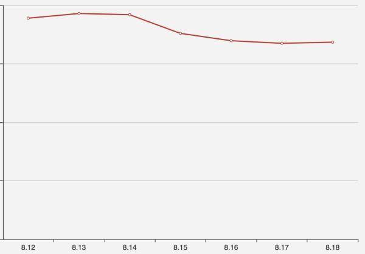
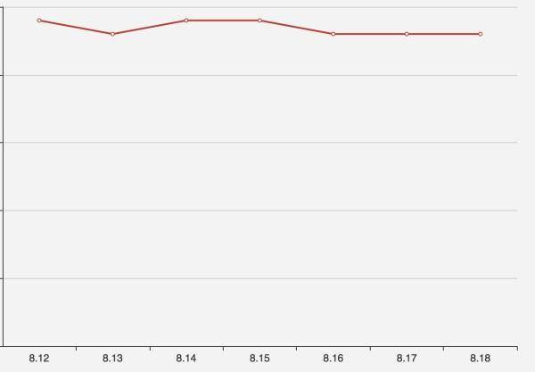
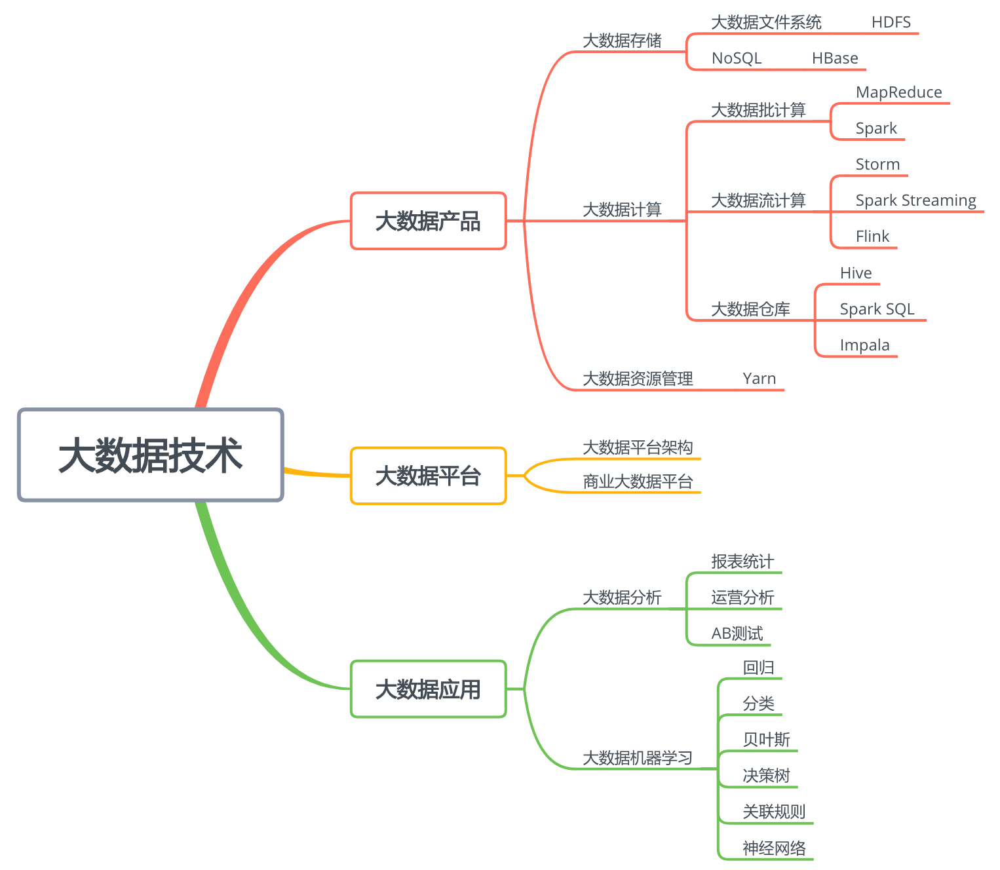

---
date: "2019-06-23"
---  
      
# 33 | 一个电商网站订单下降的数据分析案例
企业运营的数据可以让管理者、运营人员、技术人员全面、快速了解企业的各项业务运行的状况，并发现公司可能出现的经营问题，进而能通过这些指标进行详细分析，最后定位问题的原因，并找到解决的办法。

今天我们一起通过一个案例，来看看如何通过数据分析追踪并解决问题。

## 数据分析案例

X网站是一家主营母婴用品的电商网站，网站运营多年，是该领域的领头者之一，各项数据指标相对比较稳定。运营人员发现从8月15日开始，网站的订单量连续四天明显下跌。由于受节假日、促销、竞争对手活动等影响，日订单量有所起伏是正常现象，所以前两天（8.15、8.16）运营人员并没有太在意。

但是，8月18号早晨发现8月17号的订单量并没有恢复到正常水平，运营人员开始尝试寻找原因：是否有负面报道被扩散，是否竞争对手在做活动，是否某类商品缺货、价格异常，但是并没有找到原因。并且第二天发现订单量依然没有恢复正常，于是将问题提交给数据分析团队，作为最高优先级成立数据分析专项小组进行分析。



你从上图可以看到，8月15日开始订单量明显下滑。

数据分析师第一反应是网站新增用户出现问题，因为历史上出现过类似比例的订单量下跌，当时查找到的原因是，网站的主要广告推广渠道没有及时续费，广告被下架，新增用户量明显下滑导致订单量下降。数据分析师拉取了同期的新增用户量数据，发现新增用户并没有明显下降，如下图所示。

<!-- [[[read_end]]] -->



拉出同期的日活数据查看，发现日活数据也没有明显下降，便做出基本判断：用户在访问网站的过程中，转化出了问题。

和一般的电商网站类似，X网站的常规转化过程也是：用户打开App，搜索关键词查找想要的商品，浏览商品搜索结果列表，点击某个商品，查看该商品的详细信息，如果有购买意向，可能会进一步咨询客服人员，然后放入购物车，最后对购物车所有商品进行支付，产生有效订单。X网站的转化漏斗如下。


如果定义打开App为活跃，那么网站的整体转化就是活跃到订单的转化，公式为：

```
    订单活跃转化率 = 日订单量 / 打开用户数
    

```

显然从15号开始，这个转化率开始下降，但转化过程有多个环节，那么具体是哪个环节出了问题呢？数据分析师对转化过程每个环节计算转化率。例如：

```
    搜索打开转化率 = 搜索用户数 / 打开用户数
    

```

以此类推，每个环节都可以计算其转化率，将这些转化率的近期历史数据绘制在一张折线图上，就可以看到各个环节转化率的同期对比视图。


由于比例关系，图中可能不太明显，但是还是可以看出，有明显降幅的是咨询详情转化率（最下方折线），降幅接近10\%。调查客服也没有发现异常情况，进一步对咨询信息分类统计后发现，新用户的咨询量几乎为0，明显不合常理。

数据分析师自己注册了一个新用户然后发起咨询，没有得到回复。查询后台，发现咨询信息没有到达客服。于是将问题提交给技术部门调查，工程师查看8月15日当天发布记录，发现有消息队列SDK更新，而咨询信息是通过消息队列发给客服的。进一步调查发现是程序bug，新用户信息构建不完整，导致消息发送异常。

最后紧急修复bug发布上线，第二天订单量恢复正常。

> 该案例为虚构案例，仅用于数据分析过程演示。

## 数据分析方法

辩证唯物主义告诉我们，这个世界是普遍联系的，任何事物都不是孤立存在的。所以当出现运营数据异常的时候，引起异常的原因可能有很多，越是根本性的问题，越是有更多引起问题的可能，如何进行数据分析，其实并不是一件简单的事。

数据分析中，有一种金字塔分析方法。它是说，任何一个问题，都可能有三到五个引起的原因，而每个原因，又可能有三到五个引起的子原因，由此延伸，组成一个金字塔状的结构。我们可以根据这个金字塔结构对数据进行分析，寻找引起问题的真正原因。

上面案例中一开始运营人员自己寻找订单量下降原因的时候，其实就用了金字塔分析方法。


金字塔分析方法可以全面评估引起问题的各种原因，但是也可能会陷入到太过全面，无从下手或者分析代价太大的境况。所以要根据经验和分析，寻找主要原因链路。绝大多数互联网产品的主要原因链路就在转化漏斗图上，上面案例中，数据分析师的分析过程，基本就集中在转化漏斗上。

我曾经看过某独角兽互联网公司的数据运营指导文件，对于几个关键业务指标的异常必须要及时通知高管层，并在限定时间内分析异常原因。而指导分析的链路点，基本都在转化漏斗图上，只不过因为入口渠道众多，这样的分析链路也有很多条。

这种金字塔方法不仅可以用于数据分析过程，在很多地方都适用，任何事情都可以归纳出一个中心点，然后几个分支点，每个分支点又有几个子分支。构建起这样一个金字塔，对于你要表达的核心观点，或者要学习知识，都可以有一个清晰的脉络，不管是和别人交流，还是自己思考学习，都很有帮助。

上面画的金字塔分析图其实就是思维导图，我的大数据专栏的知识点也可以用金字塔方法描述。



人如何进行高效的思考，一方面是天分，一方面可以通过训练提高。我见过最厉害的人，他的思考过程如飞鸿掠影，不留痕迹；讨论问题的时候，往往只描述清楚问题，还没展开讨论，他就能直指问题的根源，其他人再争论半天，才发现确实如他所言。还有一种人，他会详细分析各种可能的原因，排查、分析、否定各种可能，最后找到问题的结症。因为过程严谨、思路清晰，所以通常也能解决真正的问题。

前一种，我想大概主要靠天分，而后一种，其实就是使用金字塔方法。但是在实际中，我却经常见到第三种情况：没有前一种的天分，也不愿付出后一种的努力，思考过程天马行空，抓不住重点，找不到突破口，越想越乱，越思考越糊涂。其实，金字塔方法并不难掌握，只要用心学习、训练，每个人都可以学会这种思考方法。

## 小结

数据分析是大数据最主要的应用场景，很多企业所谓的大数据其实就是大数据分析，而大数据分析也确实能够对企业管理和运营起到积极的推进作用。而企业的管理、产品、技术过程中的各种决策、外部市场环境的变化，也都会在数据上反映出来。关注数据分析，抓住数据，就能抓住企业运行的关键。而企业在运营过程中出现的问题，也可以通过数据分析定位，发现引起问题的原因，并从根本上解决问题。

前面专栏有同学留言说“我在公司做大数据多年，现在大数据平台已经稳定，数据量和业务都没有太大变化，工作重复，也没有什么进步，不知道下一步该怎么走”。我建议技术人员可以有更开阔的视野，不要仅仅给自己定位就是一个写代码的，比如也可以尝试去做一些数据分析，拥有数据思维、产品思维、商业思维，然后不管你还是想继续写代码，还是就此发现了自己新的天赋点，你的思路和人生之路都会更加开阔。

## 思考题

学习和工作计划也可用思维导图来完成，总目标、子目标，可以逐级分解，最后每个小目标都可以用几周甚至几天完成。这样，当绝大多数小目标完成了，今年的大目标也就完成了。在专栏的“[新年寄语](http://time.geekbang.org/column/article/75682)”中，很多同学都留言写下自己的新年目标和期望，你能否用思维导图将这个目标分解成一个金字塔结构呢？

欢迎你点击“请朋友读”，把今天的文章分享给好友。也欢迎你写下自己的思考或疑问，与我和其他同学一起讨论。