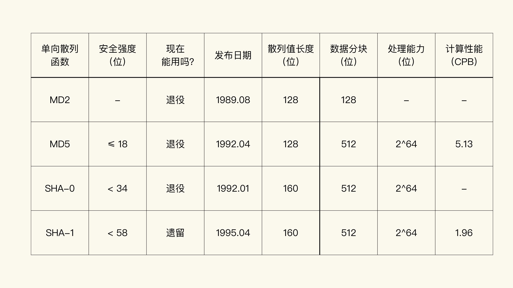
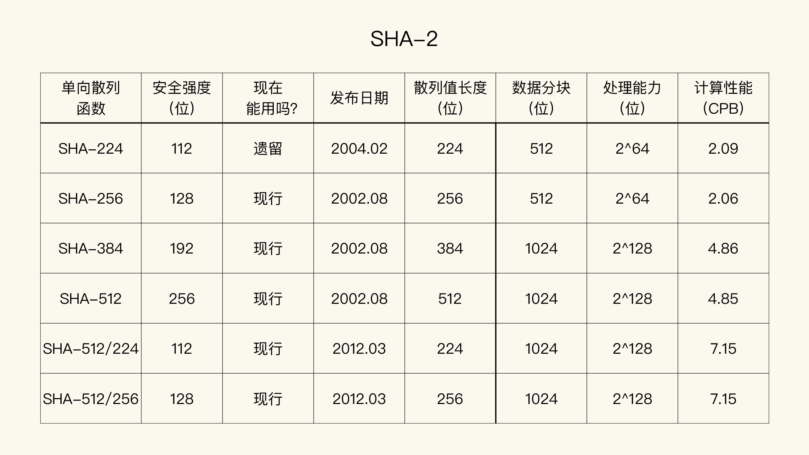
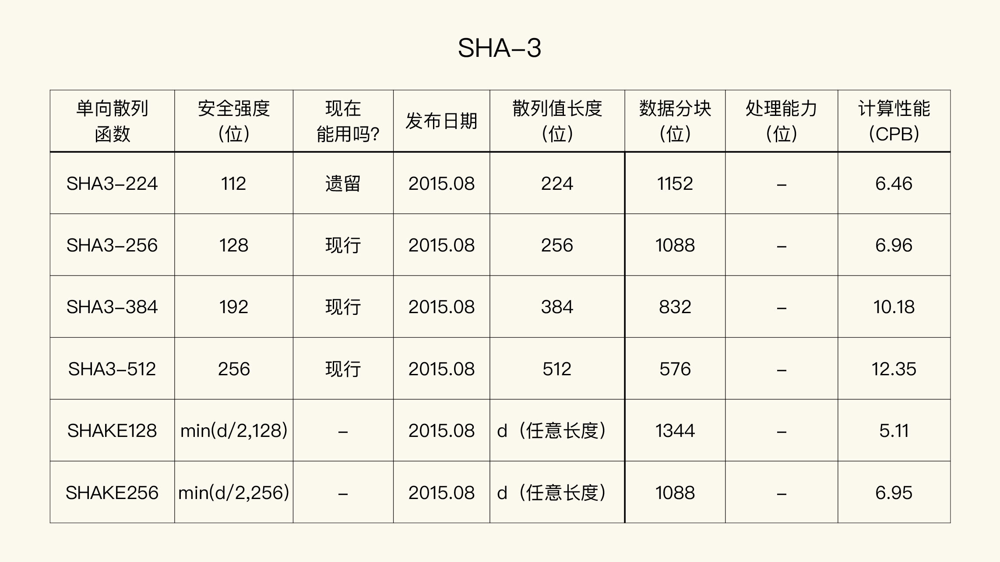
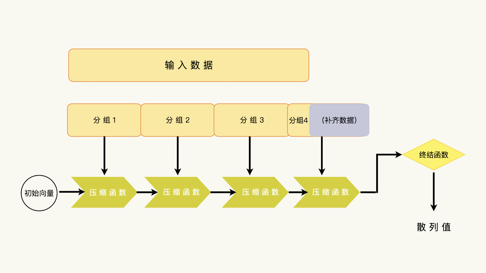
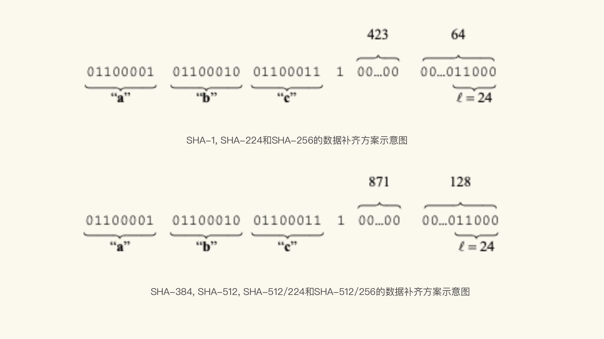

---
date: "2019-06-23"
---  
      
# 04｜选择哈希算法应该考虑哪些因素？
你好，我是范学雷。

上一讲，通过讨论单向散列函数的两个困难程度，我们了解到了安全强度的计量办法，安全强度的衰减，以及常见的安全强度推荐指标，我们还对安全强度有了一个更直观的感受。

你还记得上一讲提到的，现在的应用程序要使用128位或者更高安全强度的算法吗？那么，对于单向散列函数来说，哪些算法能够满足这样的安全强度要求呢？我们在选择这些算法的时候，应该去考虑哪些因素呢？这就是我们这次要解决的问题。

首先，让我们先来分析一下，还有哪些算法是可用的算法。

## 有哪些可用的算法？

为什么要先分析有哪些可用的算法呢？因为，在选择哈希算法的时候，我们的确需要综合考虑很多因素，但是如果这个算法是不可用的，其他因素也就无足轻重了。

所以，**判断一个现存的算法，还能不能继续使用是我们选择算法的第一步**。根据这个标准，我把常见的算法分为了以下三类：

* 退役的算法；
* 遗留的算法；
* 现行的算法。

**退役的算法，****就是那些****已经退出了历史舞台****的算法****，****它们的****安全强度很弱，****你****一定不****能****再用了**。如果你看到退役的算法还在使用，往往意味着这是一个过时的系统，或者是它的开发者缺少密码学常识（这怪不得它的开发者，毕竟密码学常识一直没有得到普及）。

如果是我们自己能够掌控的系统，一定要尽最大努力、尽快地升级算法。

<!-- [[[read_end]]] -->

**什么是遗留的算法？你只要记住，它们存在明显的安全问题，已经不足以支撑现在的安全强度需求了，你一定不要用在新系统中了**。因为，遗留的算法，已经走在退役的路上了。

那为什么有的人还在保留遗留的算法？因为，保留遗留算法，还是会让系统有更好的兼容性和互操作性，给现有系统升级到新算法留有一段时间。但是，新的代码和项目，就不要再使用遗留算法了。现在，还要继续运营的系统，也要想办法尽快升级算法。

到了最后，**只有现行的算法，****没有明显的安全问题，****是****我们****现在可以使用的算法**。这是因为现行算法的安全性，是经过很多密码学专家分析验证的。一般到目前为止，还没有人能发现明显的安全缺陷。现行的算法，才是我们应该使用、可以放心的算法。

不过，不同的推荐指标，对于算法的选择也有不同的考量和倾向。我们这里使用上一讲，我们提到过的较为保守的ECRYPT-CSA的2018年建议。

在下面的表格里，我罗列了一些常见的算法，以及一些相关的信息。其中，计算性能参考的是ECRYPT在2020年7月和2019年10月对4096个字节数据的性能基准测试结果。

什么是计算性能？它表示在数据运算时，处理一个字节处理需要执行的微处理器的时钟周期数。它使用的度量单位是每字节周期数（CPB，Cycles Per Byte）。

每字节周期数是一个常用的密码算法实际性能的参考指标。每字节花费的时钟周期数越小，表示这个算法运算得越快，性能越好。

## 为什么有处理能力限制？

在上面的表格里，你能看到，有一列说的是数据处理能力。数据处理能力指的是对应的单向散列函数能够处理的最大的输入数据。比如，SHA-256能够处理的最大数据是2\^64位。

我们前面说过，单向散列函数可以把任意大小的数据，转行成固定长度的数据。那为什么有的单向散列函数还有处理能力限制呢？上限不应该是无限大吗？为什么有的单向散列函数，比如SHAKE128，又没有处理能力限制呢？

问题虽然有点多，不过还是值得我们关注的。我们要想了解这个数据处理能力的限制是什么意思，就要知道它的由来。也就是说，我们需要了解单向散列函数是如何处理输入数据的。

一个典型的单向散列函数，由四个部分组成：数据分组、链接模式、单向压缩函数和终结函数。

我们来看数据分组，数据分组负责把输入数据分割成压缩函数能够处理的数据块。在上面的表里，有一项是“数据分块”，按照“位”来计量，指的就是压缩函数能够处理的数据块尺寸。

一般来说，压缩函数能够接收的数据块大小是固定的。比如SHA-256的压缩函数只能处理512位的数据，多一位不行，少一位也不行。

可是，实际单向散列函数的输入数据的大小不一定就是一个完整的、压缩函数可以接收的数据块。比如说，我们可能使用SHA-256处理一个字节，可能处理一千个字节，也可能处理一百万个字节。输入数据可能是512位的整数倍，也可能不是。

然后，整数倍的数据，可以送给压缩函数分批处理；不足整数倍的数据，就需要填充、补齐，变成压缩函数可以处理的数据块大小。

在下图SHA-1和SHA-2的数据补齐方案里，输入数据长度是补充数据的一部分。其中，SHA-1、SHA-224、SHA-256使用64位来表示输入数据长度；SHA-384、SHA-512、 SHA-512/224和 SHA-512/256使用128位来表示输入数据长度。

但是，如果输入数据长度超过了数据补齐方案的限制，数据就没有办法分组了。这就是单向散列函数数据处理能力限制的来源。

而我们说，SHA-3的设计，放弃了在数据补齐方案里使用固定位数表示输入数据长度的做法，它也就不再有数据处理能力的限制。

幸运的是，到目前为止，这个数据处理能力限制是很高的，一般的应用程序很难超越它。不过，我们心里还是要有一根弦，需要考虑数据处理能力限制的时候，我们千万不能疏忽了它。

**选择什么样的数据补齐方案，是密码学里一个棘手的问题**。很多针对密码算法的攻击，都是从数据补齐方案下手的。我们关注这个问题，更多地是为了简单地了解单向散列函数的内部计算。

之后，我们会详细讨论单向散列函数的一个常见的算法错配问题：长度延展攻击。

## 算法的性能是怎么决定的？

我们再来看一个在选择哈希算法时应该重点考虑的因素，算法的性能问题。

从理论上讲，一个算法的性能主要是由算法的复杂度决定的。这里有一个假设，就是不考虑其他因素的影响。但是在实践中，其他因素有时候才是影响算法性能的主要因素，比如实现细节。

在一个算法的实现细节中，通常影响计算性能的因素有：

* 算法实现的内存使用影响；
* 算法实现有没有使用优化的步骤，比如并行计算或者预运算？
* 算法实现有没有使用硬件加速，比如使用CPU关于算法的扩展指令？

一个规规矩矩的算法实现，它的性能一般落后于CPU扩展指令数十倍。遗憾的是，并不是每一个算法都有CPU扩展指令，或者每一个实现都支持CPU扩展指令。

另外，计算机本身的指令集，比如是使用32位还是64位的指令，是否和算法匹配，也是影响算法性能的一个重要因素。我们经常可以看到，SHA-512的计算速度，比SHA-256还要快。SHA-256使用32位的数据进行计算，而SHA-512使用64位的数据进行计算。

现在的计算机，一般都是64位的。所以运行在64位的计算机上，基于32位的计算可能反而比基于64位的计算还要慢。

这对我们选用算法有什么启示呢？一个应用程序，**一般而言，应该选用现行的、流行的算法。现行推荐的算法，保证了算法的安全性。流行的算法，成熟的实现会考虑实现优化，包括CPU扩展指令的支持**。选用流行的算法，也是获得较好计算性能的一个实践办法。

对于单向散列函数，目前现行的、流行的算法有：

* SHA-256
* SHA-384
* SHA-512

使用现行的、流行的算法是不是就万无一失了？遗憾的是，我们依然需要小心谨慎，不要掉进已知的安全漏洞陷阱。下一次，我们讨论单向散列函数在应用中常见的问题，包括我们上面提到的“长度延展攻击”。

## Take Away（今日收获）

今天，通过罗列常见的单向散列函数算法，我们讨论了退役的、遗留的和现行的算法分类；知道了单向散列函数的处理能力限制，以及处理能力限制的来源；我们还简单讨论了影响算法性能的常见因素。这都是我们在选择哈希算法时需要考虑的。

这一讲，我们要：

* **了解三类单向散列函数算法：退役的算法、遗留的算法以及现行的算法；**
* **知道要****尽量选用现行的、流行的算法****。对于单向散列函数，它们是****SHA-256，SHA-384****和SHA-512。**

## 思考题

今天留给大家的是一个需要动手的思考题。我们罗列了常见的单向散列函数算法，知道了退役的、遗留的和现行的算法。知道了这样的概念，我们就要把它用起来。

在你正在开发的项目中，或者你关注的开放源代码项目中，试着搜索一下这些算法，看看哪些退役的算法还在使用，哪些遗留的算法还在使用。如果发现了退役算法和遗留算法的使用，你有没有什么建议？

这是一个能够帮助你理解算法生命阶段、解决现有项目历史遗留问题的好办法。欢迎在留言区留言，记录、讨论你的发现和建议。

好的，今天就这样，我们下次再聊。