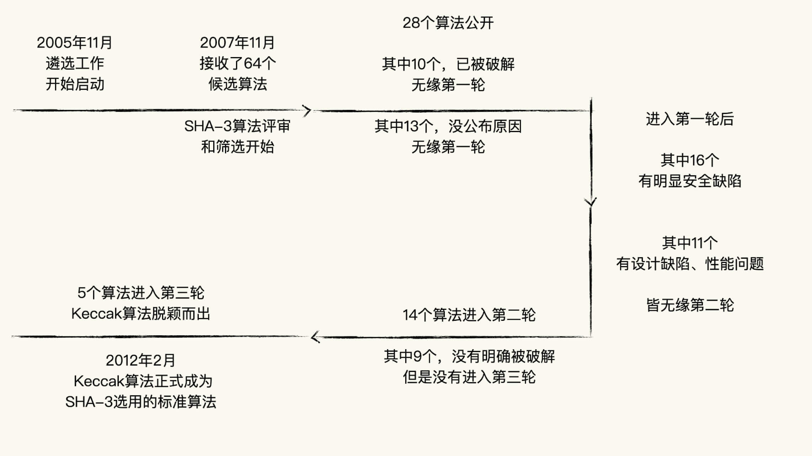
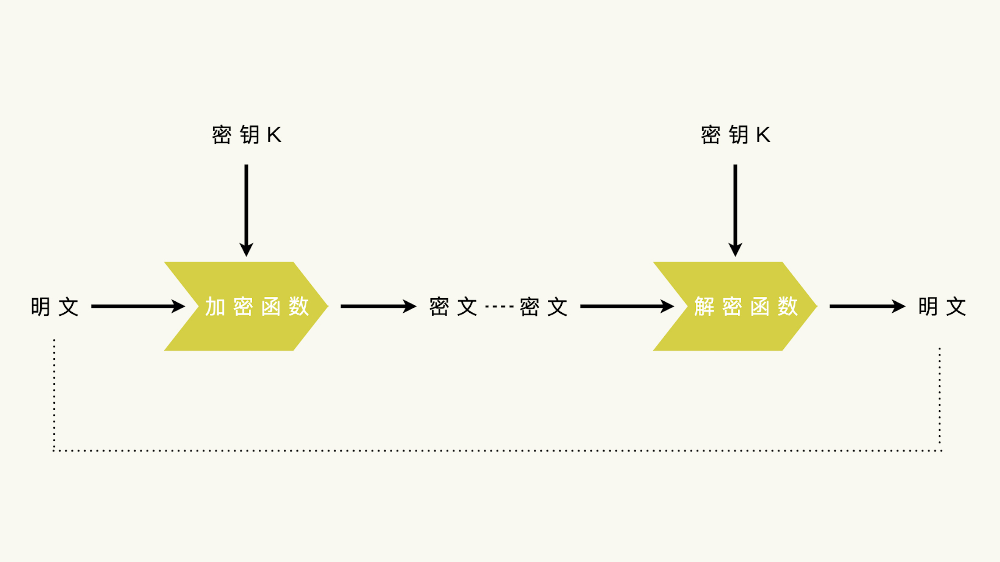
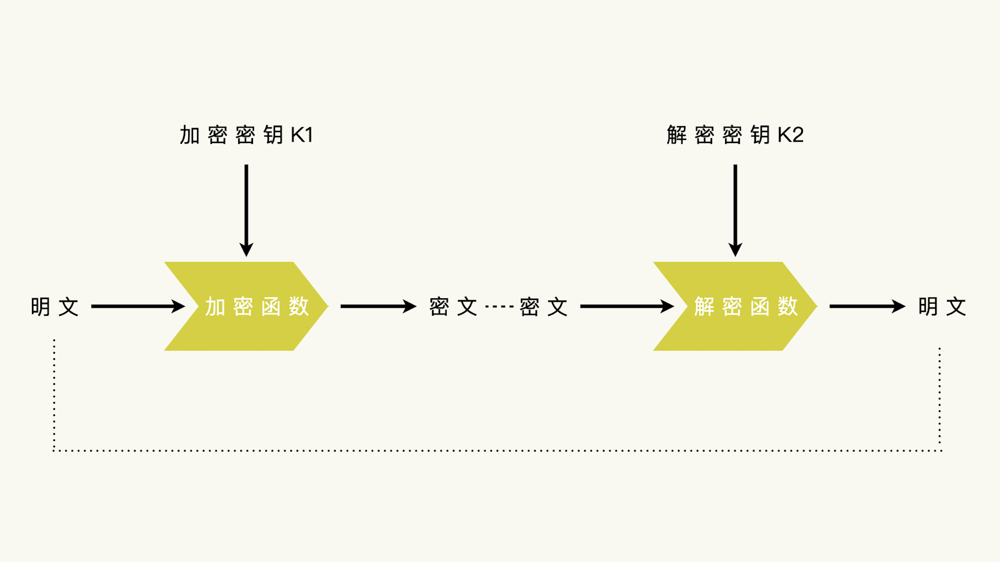

---
date: "2019-06-23"
---  
      
# 06｜对称密钥：如何保护私密数据？
你好，我是范学雷。

在上一个模块，我们学习了单向散列函数。从今天开始，我们将开启一个新的模块，在这个模块里，我将跟你讨论加密技术的相关知识。是不是感觉上一个模块的学习还意犹未尽？

别着急，单向散列函数还会出现在我们的视野里。那么，加密技术是用来做什么的呢？

还记得上一讲，我们讨论了单向散列函数的使用场景吗？其中，**一个重要的限制是****我们****需要确保给定的散列值不能被修改**。这个简单、直观的限制，给单向散列函数的使用套上了一个紧箍咒。

这说明在很多场景下，我们并不能仅仅使用单向散列函数来解决数据的完整性问题。要想去掉这个紧箍咒，扩大单向散列函数的适用场景，我们还需要其他技术，比如加密技术。

那加密技术是怎么帮助单向散列函数解决完整性问题的？这个疑问立即就来到了我们面前。不过不用担心，我们需要一点时间来了解这个问题，以及解决问题的办法。

今天，我们先来讨论第一类加密技术：对称加密技术。

## 什么是加密？

在讨论对称加密技术之前，我们要先了解加密、解密和密钥这几个概念。

其实这几个概念还是很容易理解的。把信息或者数据伪装、隐藏起来，转换成难以解释的信息或者数据，这个过程叫做**加密**。和加密这个过程相反的过程，就叫做**解密**。

一般来说，加密产生的那个难以解释的信息或者数据，我们把它叫做**密文（Ciphertext）**。对应的，加密前的数据，我们通常把它叫做**明文（Plaintext）**。

<!-- [[[read_end]]] -->

密文信息通常看起来都是晦涩难懂、毫无逻辑的，所以我们一般会通过传输或者存储密文信息，来保护私密数据。当然，这建立在一个假设基础上：没有经过授权的人或者机器，很难通过密文计算出明文；经过授权的人或者机器，才能够通过密文计算出明文。

那经过授权的人或者机器，是怎样通过密文计算出明文的？对，就是使用**密钥**。

在现代密码学里，**密钥是在加密和解密运算里，决定运算结果的一段信息**。因为，加密要使用密钥把明文信息转换为密文；解密要使用密钥把密文复原为明文。

也就是说，加密运算需要两个输入：密钥和明文。


解密运算也需要两个输入：密钥和密文。


如果没有密钥，我们就没有办法执行解密运算，也就很难把密文转换成明文。同理，如果只有授权的人或者机器才知道密钥，那么没有授权的人也很难通过密文计算出明文。

你可能会觉得，密钥太重要了！但现代密码学之前的加密，其实不是这样设计的。

历史上的加密，是没有密钥的。数据的保密性，依赖于算法的保密性。一旦算法被破解，数据也就被破解了。如果有一天，时光穿梭机真的实现了，我们穿越回去，偷听一下、偷看一下当初设计者的算法设计，算法就被破解了（时光穿梭机的梗，你可以自己搜索一下）。

其实也用不着这么科幻，就算时光穿梭机实现不了，我们也还有很多更有效的办法：

* 当初算法的设计者还健在吗？
* 当初算法的实现者还健在吗？
* 算法实现的代码还在吗？
* 算法运行的环境还在吗？

解决掉其中任何一个问题，我们就能破坏掉算法的保密性。而且，这些破解办法通常没有什么难度，比制造时光机有效率多了。除此之外，还要说一点，虽然算法保密看起来很安全，但是这也意味着只有很少的人知道算法，这样的算法质量也是值得担忧的。

**到了****现代密码学，加密数据的安全性就****依赖于加密算法的质量和密钥的保密性这两个因素**。密钥部分，是私有的部分，需要严格保密；算法部分，变成了公开的部分，要接受公开讨论、评测，接受各种分析和攻击。**一个算法，如果****在****接受****了****公开的分析、评测和各种各样的攻击****之后****，还依然被认为是安全的，****我们才能说，这个算法****的安全性是真的经得起考验的。**

为什么算法一定要公开？不公开不行吗？为了可以让你更直观地了解使用公开算法有多重要，我们一起来看看公开算法的遴选过程是怎样的。



所以，你看，仅仅单向散列函数的遴选，就花费了7年时间，还聚集了世界上最出色的密码学家和密码分析专家。在遴选标准中，有一个重要指标，就是有没有足够多的密码分析。

什么是密码分析？**密码分析，指的是分析、评测一个密码学算法，有没有安全缺陷和适用场景的限制。如果一个算法，没有人对它展开分析、评测，或者缺少足够的分析，它的安全性很难获得信任**。63个落选的算法中，不乏知名密码学专家，或者知名团队和组织的撑腰。

我相信，这些算法在提交之前，它的发明者都是信心满满的。可是一旦接受了公开的分析和评测，很多意想不到的安全缺陷就暴露出来了。

但是，保密的算法，如果没有经过大量密码分析专家的分析，是很难给人信心的。可如果经过了大量的、不同的密码分析专家的分析，保密算法也算不上保密了。的确，这是一件很矛盾的事情，有时候却又不得不这样。

所以，渐渐地，**使用公开的算法****是****密码学领域的****一个****基本常识。****不过，一个****现代密码学算法的安全性，都是基于密钥的保密，而不是算法保密要求**。遗憾的是，仍然有很多保密算法的存在和使用。对于这样的使用，我们很难有信心相信它的安全性。

为什么我们要花费这么大篇幅去讨论公开算法的遴选过程呢？

其实是因为，我想让你对以下两个密码学常识留下深刻的印象：

* **不要自己发明密码算法，尤其是****在****没有经过充分讨论、充分分析的情况下**。大部分情况下，我们自行发明的密码学算法都是灾难。
* **不要把安全性寄托在算法的保密上**。大部分情况下，保密的算法都是无法保密，并且是不堪分析的。

在这个部分里，我最后再强调一下：**现代的密码学算法的安全性，都是基于密钥的保密，而不是算法保密要求**。管理好密钥，做好密钥的保密，才是密码学系统最关键的任务。

## 什么是对称密钥？

讨论完加密和密钥，我们就要来看看对称密钥技术。

说起来对称密钥，就不得不提它的对立面，非对称密钥。1976年，惠特菲尔德·迪菲（Whitfield Diffie）、马丁·赫尔曼（Martin Hellman）发表了基于非对称密钥技术的密钥交换算法，但是在这之前，并没有对称密钥、非对称密钥的说法。

1976年之前，密码学就是一门研究对称密钥的学问。所以，我们看的二战时期的谍战片，如果里面提到了发报机和密钥，用的肯定不会是非对称密钥技术。这种影响，到现在还有，比如，当我们使用密钥这个词汇时，一般指的就是对称密钥。

**对称密钥，顾名思义，就是每一个参与者都持有相同的密钥，使用相同的密钥。**



**非对称密钥，****就是指****每一个参与者都持有不同的密钥，使用不同的密钥。**



经常有人问我，密码属于对称密钥技术吗？如果属于的话，为什么密码学不叫密钥学？密码和密钥有什么区别吗？所以，在这里，我要稍微地强调一下。

密钥和密码是两个特别容易混淆，而且经常混淆的概念。比如密码学明明是研究密钥的，偏偏叫“密码”学；密码分析明明是研究加密算法的，偏偏叫“密码”分析。怎么理解呢？

有一个技巧，就是**借助英语词汇**，这两个概念一下子就会清晰。通常地，密码的英语词汇是Password，加解密算法的英语词汇是Cipher，密钥的英语词汇是Key。

密码（Password）使用中文里的“口令”，更为贴切。比如三国时期的曹操，据说就使用过“鸡肋”作为口令。口令该怎么用呢？如果执勤的士兵问：“口令？”杨修回答“鸡肋”，这就可以获得通行许可了。如果回答的不是“鸡肋”，就不能获得通行，还可能被逮起来进一步审查。

和对称密钥类似，需要每一个参与者都知道相同的口令，使用相同的口令。

而密钥（Key）和密码（Password）的区别，在于它们的用法。口令的用法是对照口令本身。士兵知道口令是“鸡肋”，然后对照他人的回答是不是“鸡肋”。

我们上网输入的用户名和密码，也是系统要直接地或者间接地进行对照，登录者是不是使用了系统记录的口令。而密钥的用法，则是参与加密运算或者解密运算。

通常地，我们也不用纠结别人是不是能准确地使用好“密码”和“密钥”这两个词汇。我们只要从它们的使用场景来判断，到底是用作对比的口令，还是用来运算的密钥就好。

另外，在生活中，我们总是在记口令，比如我们登录网站的密码。和自然界其他生物相比，人类的记忆能力值得自豪。我们通常可以记住六位的数字，或者学过的单词。不过，即便如此，我们还是倾向于选择“123456”， “888888”或者生日这样的简单口令。

稍微复杂的口令，就超越我们的记忆能力了，更别提要记住很多网站的很多口令了。在现代计算机的眼里，这样的记忆能力实在太渣了，用最不讲究技巧的蛮力攻击也就是分分钟钟的事情。

密码需要记，但是一般来说，我们不需要记住密钥，事实上，我们也记不住。现代的密钥，通常需要至少128位没有规律的字符，而且频繁更换。比如，下面的5个密钥，其实是质量不太好的、便于记住的128位的密钥，你可以挑战挑战，看看能不能记得住：

```
    密码1: Yq3t6w9z$C&F)J@N
    密码2: gVkYp3s6v9y$B&E)
    密码3: NdRgUkXp2s5v8y/B
    密码4: -JaNcRfUjXn2r5u8
    密码5: C&F)J@NcQfTjWnZr
    

```

我们当然记不住这么复杂的密钥，除非是不世的天才。所以，我们才要拜托计算机替我们记住这么复杂的信息，并且自动地更换。

## 密钥管理的烦恼

如果我们拜托计算机替我们管理密钥，方便是方便了，但是也会立即衍生出很多现实的问题：

* 计算机替我们记住了密钥，计算机能够保持密钥的保密性吗？
* 计算机会不会出卖我们？
* 使用密码的程序会不会泄漏密钥？
* 运行算法的环境能不能泄漏密钥？
* 退役的机器里，会不会有密钥存留导致密钥泄漏？
* ……

无论哪个问题没有处理好，密钥的保密性可能都只是空谈。

**既然现代的密码学算法的安全性依赖于密钥的保密，那么，管理好密钥，做好密钥的保密，就是密码学系统最关键的任务**。不过，密钥的管理，部分内容已经超出了密码学的范畴，我们需要在计算机基础的操作系统和编程语言里找答案。

比如，在[《代码精进之路》](https://time.geekbang.org/column/intro/100019601)里，我们提到的管理敏感信息的原则，同样适用于密钥的管理。要把密钥当作超级敏感的信息来看待，在我们的代码里保护好密钥，不要泄漏密钥信息。

之后，我们还会讨论对称密钥的管理，以及怎么使用密码学的技术降低密钥管理的难度和风险。

像单向散列函数一样，不同的加密算法也有不同的安全强度。那么，到底哪些对称密钥的算法是我们可以信赖的呢？这是我们下一次要讨论的问题。

## Take Away（今日收获）

今天，我们讨论了什么是加密解密、什么是对称密钥、密钥保密的必要性，以及密钥管理的困难。通过今天的讨论，我们知道要把密钥当作超级敏感的信息来处理。

这需要我们在编写代码的时候，要特别留意密钥的无意识泄露，以及在内存、硬盘里的长时间驻留。比如说，用完密钥后，我们的代码一定要把密钥占用的内存清零，而不要依赖类似Java垃圾收集器这样的机制。再比如说，我们千万不能把密钥写到系统或者应用的日志里，日志可是泄露密钥的最便捷路径之一。

通过今天的讨论，我们要：

* 理解什么是对称密钥；
* 知道对称密钥的安全性，取决于密钥的保密性和算法的安全性，而不是算法的保密性。
* 要把密钥当作超级敏感的信息来处理，做好密钥的保密。

## 思考题

你还见过哪些坑？处理敏感信息，你有哪些经验？另外，你有没有发明过密码算法？你了解的项目有没有发明过密码算法？这些算法有能够替代的公开算法吗？

欢迎在留言区留言，分享你的经验。参与讨论的人越多，我们互相学习、互相启发的就越多。

好的，今天就这样，我们下次再聊。