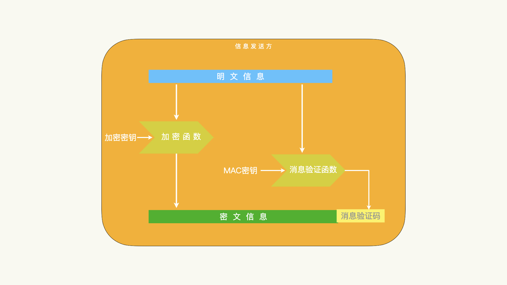
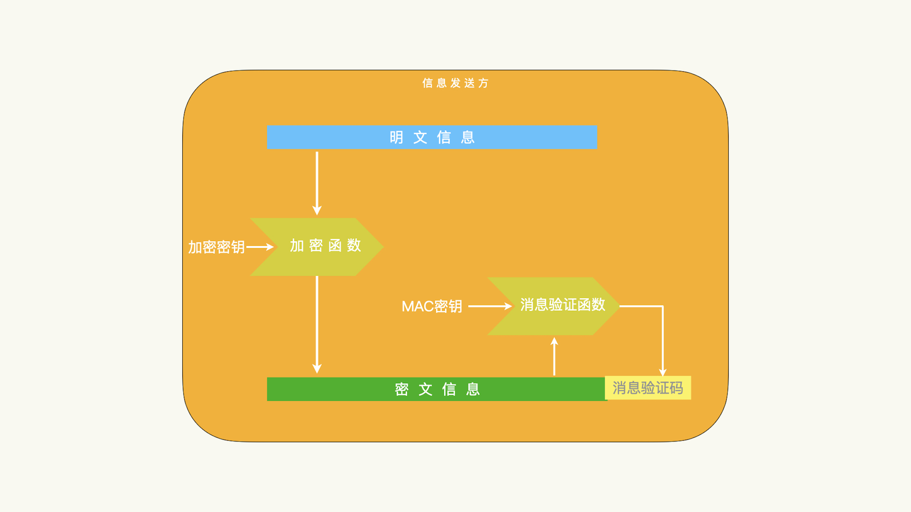
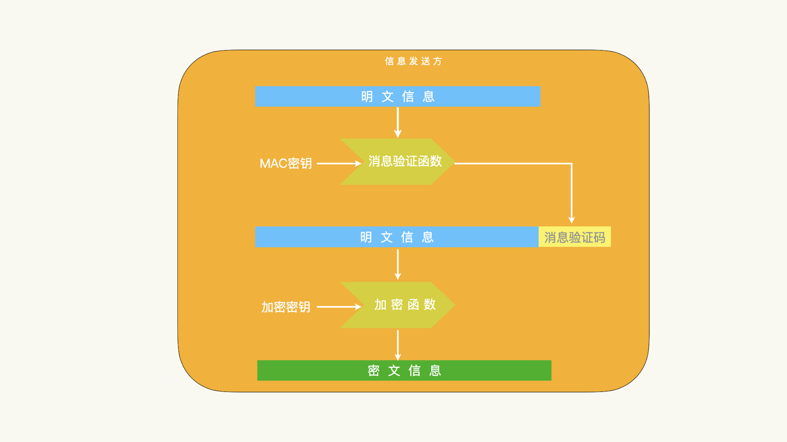
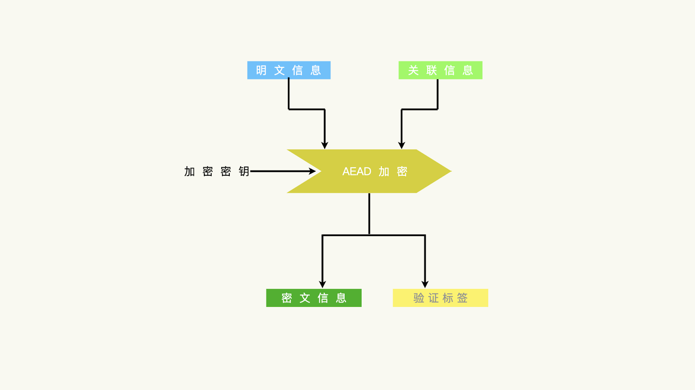
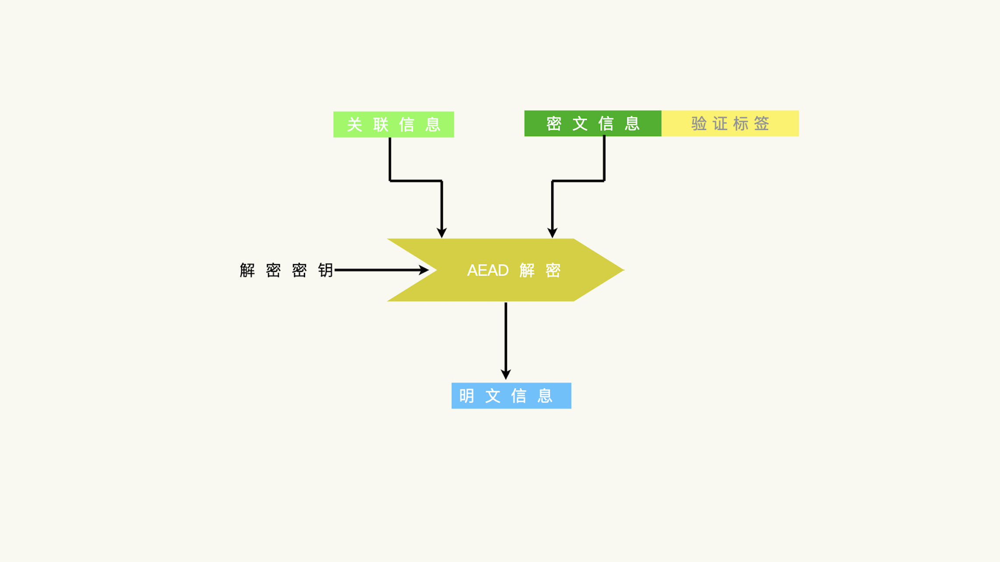

---
date: "2019-06-23"
---  
      
# 14 | 加密数据能够自我验证吗？
你好，我是范学雷。

还记得上一讲，我们讲的消息验证码吗？我们讨论过可以使用消息验证码来验证消息的真伪。但是，不知道你有没有注意，在上一次讨论中，我们并没有讨论该如何安全地传递待验证消息。

而且，待验证信息的传递还是通过明文的方式进行的，这种方式，信息的私密性会受到影响。我们前面讨论过，单独的加密并不能解决信息的有效传递问题，总是存在这样或者那样的问题。

那么，我们能不能把消息验证码和信息加密结合起来，既保持信息的私密性，也保持信息的完整性呢？这就是我们这一次要解决的问题。

## 先加密还是后加密？

想要保持信息的私密性，我们可以在信息传输之前，把明文数据加密成密文数据，然后传输密文数据。如果我们还想要保持信息的完整性，我们就要使用消息验证码。

第一个来到我们面前的问题是：消息验证码和信息加密该怎么结合起来？或者换一种说法就是，怎么构造可认证的加密（Authenticated Encryption \(AE\)）呢？

加密和验证组合起来的方式不外乎三种方案。

### 加密并验证

第一种方案，就是加密明文数据，计算明文数据的消息验证码，输出密文数据和验证码。这种方案，我们简称为加密并验证。安全外壳协议（SSH）就是采用加密并验证的方案。

<!-- [[[read_end]]] -->

这个方案的消息验证码，保护的是明文信息的完整性，而不是密文信息的完整性。如果明文信息相同，它的消息验证码也是相同的。从攻击者的角度看，如果发现两个相同的消息验证码，就可以猜测明文信息大概率是相同的。

我们前面反复讨论过，为什么要使用初始化向量来避免重复的明文生成重复的密文。这个方案，又一次把这个缺陷暴露了出来，只不过现在，我们是通过消息验证码来判断的。

### 加密后验证

第二种方案，加密明文数据，计算加密数据的消息验证码，输出密文数据和验证码。这种方案，我们简称为加密后验证。IPSec协议采用的就是加密后验证的方案。

这个方案的消息验证码，保护的是密文信息的完整性，而不是明文信息的完整性。由于密文是从明文演算过来的，也就间接地保护了明文的完整性。

另外，只要加密算法不把相同的明文信息加密成相同的密文信息，它的消息验证码也就是不同的。所以，这个方案没有上面的加密并验证方案的安全问题。

### 验证后加密

第三种方案，则是计算明文数据的消息验证码，加密明文数据和验证码，输出密文数据。这种方案，我们简称为验证后加密。SSL协议采用的就是验证后加密的方案。

这个方案的消息验证码，保护的是明文信息的完整性，而不是密文信息的完整性。如果我们把明文信息和消息验证码看作是一个数据，我们前面提到的CBC攻击方案是不是似乎又回来了？实际的攻击方案比我们前面讨论的复杂，如果你有兴趣，可以看看[这篇论文](http://citeseerx.ist.psu.edu/viewdoc/download?doi=10.1.1.106.5488&rep=rep1&type=pdf)。

每一种方案都有重量级的协议支持。重量级的协议都能使用这些方案，我们能不能任意选用哪一款方案呢？我觉得答案是很明显的。

## 该选用哪一个方案？

有了重量级协议的支持，给了我们一个很好的借口。似乎，我们可以选用这其中任何一个方案，把它用到我们的应用程序里。不过，重量级的协议也会有安全问题，有重量级协议撑腰，并不意味着它就是安全的。

由于新的密码分析技术的进展，尤其是前面我们讨论过的BEAST攻击这种新技术的出现，加密并验证以及验证后加密这两种方案都受到了很大的挑战和质疑。

接下来，在2014年以后，无论是SSH协议还是TLS协议，都提供了加密后验证的选项，用来提高协议的安全性。其中，2018年新发布的TLS协议，甚至完全抛弃了CBC模式，也不再使用上述的任何一个方案。

**所以，如果我们只能从上述三个方案中间选择，加密后验证这个方案目前来说，是最安全的方案**。截止到我准备这一讲的时候，就我自己的知识范围里，只要算法选择得当，加密后验证方案还不会出现致命的安全漏洞。

答案似乎很清楚了，结论就是，在应用程序里，我们可以放心使用加密后验证方案。 在你决定要把这个结论记下来之前，你想不想知道新的TLS协议，采用了什么样新的加密方案？这个新的加密方案，应用程序也可以使用吗？

## 带关联数据的加密

到目前为止，我们都没有讨论，信息是怎么传递给对方的。无论是在互联网里，还是现实生活中，我们要传递给对方的信息，并不单纯只有信息本身。

生活中信件的传递，需要信封，信封上还要贴邮票、盖邮戳；快递的传递，要有包裹，包裹上要贴快递单。信封和包裹，虽然是用来携带具体信息的，但其实也是信息的一部分。信封里的信件是要保密的，但是信封上的信息是公开的。信封上的信息虽然是公开的，但是同样不可更改。

网络上的信息也是这样，而且更复杂。比如一段网络数据，除了要携带应用要传递的信息外，它的信封上一般还要有版本号，信息类型以及数据长度等信息。

如果一段信息的版本号或者数据类型被篡改，接收方就没有办法正确解读接收到的信息；如果信息的数据长度被修改，接收方就没有办法判断接收的数据是不是完整的，从而影响系统的读写效率，甚至进而存在拒绝服务攻击的风险。

那有没有办法保护信封上的信息，也就是公开部分信息的完整性？

带关联数据的加密，就是用来解决这个问题的。在解决公开信息的完整性问题的同时，一般的算法设计也会同时解决掉私密信息的完整性问题。所以，这一类算法，通常也叫做带关联的认证加密（Authenticated Encryption with Associated Data（AEAD））。

不同于我们前面讨论过的加密函数，带关联的认证加密的加密函数需要三个输入数据：

* 加密密钥；
* 明文信息；
* 关联信息。

输出结果包含两段信息：

* 密文信息；
* 验证标签。

一般来说，验证标签可以看做是密文信息的一部分，需要和密文信息一起传输给信息接收方。

如果改变明文信息，密文信息和验证标签都会变化，这一点，就解决了明文信息的验证问题。如果改变关联信息，至少验证标签会不一样，这一点，解决了关联信息的验证问题。

对应地，带关联的认证加密的解密函数需要四个输入数据：

* 解密密钥；
* 关联信息；
* 密文数据；
* 验证标签。

而输出的是明文信息。在解密过程中，如果密文信息或者关联信息验证失败，明文信息不会输出。换句话说，只有明文信息和关联信息的完整性都得到验证，才会有明文信息输出。

这么一看，带关联的认证加密既解决了需要保密信息的私密性和完整性，也解决了关联信息的完整性问题，这使得带关联的认证加密算法成为目前主流的加密模式。

带关联的认证加密算法的广泛使用，也使得曾经占据主导地位的CBC算法可以从容地退出历史舞台。因为，**带关联的认证加密算法能够进行自我验证**。

自我验证，就意味着解密的时候，还能够同时检验数据的完整性。这无疑减轻了应用程序的设计和实现压力。有了带关联的认证加密算法，应用程序再也不需要自行设计、解决数据的完整性问题了。

现在有哪些流行的带关联的认证加密算法呢？下一次，我们接着聊这个话题。

## Take Away（今日收获）

今天，我们讨论了使用消息验证码构造可认证加密的三种方案。它们分别是加密并验证、加密后验证以及验证后加密。其中，加密并验证以及验证后加密这两种方案存在安全缺陷；加密后验证是一个更安全的方案。

另外，我们还讨论了带关联的认证加密的基本思路\_。\_带关联的认证加密除了提供可认证的加密，保护私密数据的完整性之外，还通过关联数据保护公开数据的完整性。**能同时保护私密数据的完整性和公开数据的完整性，这是带关联的认证加密算法要解决的主要问题**。

通过今天的讨论，我们要：

* 知道加密并验证以及验证后加密这两种方案存在安全缺陷，尽量不要使用这两种方案；
* 了解带关联的认证加密，以及它要解决的问题。

## 思考题

今天的思考题，我们继续挖掘牛郎织女的约会问题。

这一次讨论完，我们再来看看现在有没有更好的办法解决这个问题。为了方便，我把描述部分又抄写一遍。如果牛郎要给织女发信息，七夕相约鹊桥会。

> 织女：  
> 七月初七晚七点，鹊桥相会。不见不散。  
> 牛郎

你能够帮助牛郎想想吗？该怎么来保证约会信息的私密性和完整性？传递的信息该怎么构造？当然，按照惯例，我们还是要想一想，你建议的办法还有没有其他的问题？

欢迎在留言区留言，记录、讨论你的想法。

好的，今天就这样，我们下次再聊。

祝你圣诞节快乐！