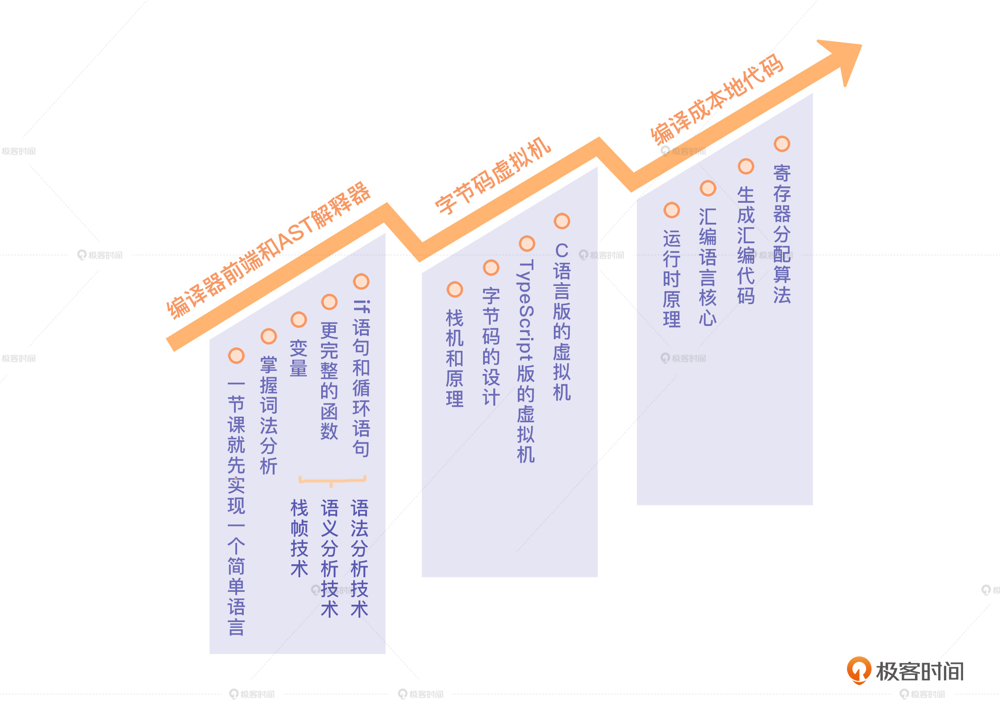
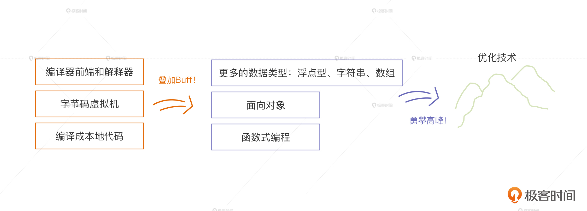

---
date: "2019-06-23"
---  
      
# 开篇词｜让我们来写一门计算机语言吧
你好，我是宫文学，一名技术创业者。

20多年前，我从北大毕业，搞过一些基础软件，也创过业，最近也一直在研究编译器、操作系统这样的底层技术。

我其实是极客时间的老面孔了，我曾在极客时间开过两门课，[《编译原理之美》](https://time.geekbang.org/column/intro/100034101)和[《编译原理实战》](https://time.geekbang.org/column/intro/100052801)。这两门课都聚焦于编译技术，一个是“读万卷书”，带你掌握编译原理；另一个是“行万里路”，教你怎么用编译技术。

今天我又设计了这门新课，带你来实现一门计算机语言。但是，你要知道，对于实现一门计算机语言而言，编译技术只是构成要素之一。它还有另外两块大的要素：一个是计算机语言的特性，包括类型系统、面向对象、函数式编程等；另一个是运行时技术，如虚拟机技术、内存管理等。

通过这门课你更好地把握计算机语言中涉及的各类技术的全貌，体会一下实现一门计算机语言的过程。

可能你还有点懵：我为啥要经历实现一门计算机语言的过程呢？这件事能帮我们提升哪些方面的能力或者成就感呢？接下来，我慢慢告诉你。

## 为什么要自己折腾一门编程语言？

现在，每个程序员都熟悉一门或几门计算机语言，但是，我们很少有人想过自己去动手实现一门语言。又或者，虽然豪情万丈地计划过，却又因为种种原因不曾真正付诸实践。

当然，我们也会为自己找很多理由。

<!-- [[[read_end]]] -->

最常见的想法是，计算机语言已经很多了，我们会用就行，干嘛要自己去实现呢？另一个常见的想法是，计算机语言，我学习起来都挺不容易，要想去实现它，那更是难以逾越的吧？

这些顾虑看起来都很有说服力，可是，尽管如此，仍然有不少人还是会摆脱这些顾虑，去动手亲自实现一下计算机语言。为什么要做这样看上去很不理性的事情呢？我从我自身的体会来谈一下。

**第一，实现一门计算机语言所带来的能力，是真的有用。**

我们有时候觉得实现一门计算机语言这样的事情，纯属闲着没事干，因为要让一门计算机语言成功的机会太渺茫了，条件太苛刻了。

不过，在实现一门计算机语言的时候，你能接触到编译技术、运行时技术、汇编语言、硬件架构和各种算法，基本上是从顶层到底层把技术做穿。有了这些硬功夫，其实你已经能够胜任大多数高层次的软件开发工作了。比如，据我了解，Python语言的异步IO模块的开源贡献者，前一阵创业就去做一种创新的异步数据库产品了。

你一样也可以。从前你只会用人家写的东西，现在你要自己来实现了，肯定能更好地理解这套东西的核心逻辑，也能获得更多技术上的高维优势。最现实的就是你能拿下一个个难啃的技术难题，获得更多的晋升机会。

**第二，不仅有用，而且这个过程真的很爽。**

在我的前两门课里，有同学在实现了一个简单的脚本解释器之后，留言说“激动得浑身发抖”。是的，钻研一些比较深入的技术，会给人带来极大的成就感。特别是对于天天使用计算机语言的程序员来说，如果你有机会把计算机语言实现一遍，洞悉其中的技术秘密，那带来的成就感更是难以比拟的！

**第三，像计算机语言这样的领域，更是大有前景。**

如果你在关注中国技术发展，那你肯定知道我们目前正奋力在补基础技术方面的课，希望有朝一日也能拥有我们中国自己的优秀基础软件，比如HarmonyOS就在做这种尝试。而且，我们会看到中国涌现出越来越多的编程平台，很多产品会具备二次编程能力，甚至我们自己的计算机语言也会出现并逐步成熟。

要实现这样的突破，需要有更多具备底层编程能力的人才加入进来，要能够深刻理解程序在计算机硬件和操作系统之上运行的基础机制，以及计算机语言编译和运行所需要的技术。而学习如何实现一门计算机语言的过程，就能够带给你这些方面的提高。

现在，我相信你已经了解了，为什么你有必要掌握实现一门计算机语言所涉及的各种技术。不管仅仅是兴趣爱好的原因，还是为了自己的发展，甚至是为了在科技创新的趋势中弄潮，我都邀请你参与进来，一起来玩一玩这些技术。

而要开始实现一门计算机语言，我们首先就需要做一个决策：去实现一门什么样的语言？

## 我要带你实现什么样的语言？

首先，我否决了去设计一门全新的语言。

因为设计一门语言真的很有难度，也是最容易引起争议的话题。而且，这项工作不仅是一项技术工作，还是一个产品设计工作，需要兼顾艺术性和用户体验，是个见仁见智的话题。

其次，我也不想像一些教科书那样，去实现一个玩具语言，这些语言往往不具备最后真正意义上的实用性。

经过几番思考，**最终我选择去实现一门已经存在的语言：TypeScript**。一门计算机语言其实可以有多个具体实现，像JavaScript就有V8（用于Chrome和Node.js）、TraceMonkey（用于FireFox）、QuickJS等多个不同的实现，每个实现都有不同的适用场景。**而我要带你做的是，TypeScript的一个全新的实现。**

TypeScript（以及JavaScript）的程序员群体相当庞大，并且它还具备编译成原生应用的潜力，所以HarmonyOS选择了TypeScript作为主力开发语言。

我前一阵参与发起了一个开源工业操作系统的项目。为顺应HarmonyOS的趋势，我也准备用TypeScript实现工业控制软件的开发。过去这些领域都是用C加加做开发，其实用TS也完全可以。我甚至也跟JavaScript（ECMAScript）标准组的一名专家热烈讨论过，我们可以把HarmonyOS的基于TypeScript的前端开发工具扩展开来，用于支持安卓、IOS、桌面应用乃至小程序的开发，变成一个跨平台的开发工具，这也完全可以。

所以说，我们这门课选择TypeScript，是看好它未来有更大的发展空间。HarmonyOS已经开了个头，我们还可以做更多的探索。

而且，这门课的大部分内容，比如编译功能等，我们也是采用TypeScript来实现的。对于前端工程师来说，他们本身就很熟悉TypeScript。对于众多的后端工程师而言，由于TypeScript是静态类型的语言，所以他们上手起来也会很快。对于移动端的开发者而言，未来肯定需要了解在HarmonyOS上如何开发应用，所以熟悉一下TypeScript也是有必要的。

那接下来，我们看看在这门课里，我会带你完成哪些工作和挑战。

## 我会带着你完成什么挑战？

总的来说，实现一门计算机语言，我们需要实现编译器、运行时，还要实现面向对象等各种语言特性。

**具体一点，首先，我会带着你实现一个纯手写的编译器前端。**

编译器前端指的是词法分析、语法分析和语义分析功能。我们目前使用的大多数计算机语言，比如Java、Go、JavaScript等，其编译器前端功能都是纯手写的，而不是采用工具生成的。我会带你了解那些被这些语言所广泛采用的最佳实践，比如LL算法、运算符优先级算法等等。

这种纯手写的实现方式，能让你最大程度体会相关算法的原理。另外，也非常有利于你根据自己的需要进行修改，来满足特定领域的需求。比如，我同学的公司有一个产品，支持在浏览器里编写代码，处理遥感数据。这样的需求，完全可以用TypeScript实现，再编译成JavaScript在浏览器里运行即可。

**第二，我还会带你实现纯手写的编译器后端。**

编译器后端指的是生成目标代码的功能，而目标代码呢，指的是字节码或汇编代码。编译器后端不仅要生成代码，还要对代码进行优化，尽量提升它的性能。

编译器后端的工作量通常更大，所以像Rust、Julia等新兴起的语言，往往采用一个后端工具，比如LLVM，而不是自己编写后端，这样可以节省大量的工作。不过这个方式也有缺陷，比如针对移动应用或者浏览器运行环境，在资源占用、即时编译速度等方面就不够理想。所以，像JVM、Android的运行时、V8等，都会自己去实现后端。

而且，如果你对语言的运行机制有特殊的要求，并且跟C/C加加这些不同，那么你最好自己实现一个后端，比如Go语言就是这样。

编译器后端通常还包含大量的优化算法（有时候，我们把这些优化功能归为中端），这些优化算法具有比较强的工程性，所以教科书里的描述往往不够具体，也不能体现业界的一些最佳实践。在这门课里呢，我们可以自己动手去体会这些最佳实践，包括基于图的IR，以及一些优化算法，从而对优化算法的理解更加具象化。

在编译器后端里，因为我们还要生成汇编代码，所以能带你掌握汇编语言的精髓。在实现一些系统级软件的时候，我们有时候必须能够想象出来，这些软件的逻辑落实到汇编代码层面是什么样子的，这样才能确定最佳的技术策略。而破除对汇编代码的陌生感，是打通技术人员奇经八脉的重要一环。

**第三，我还会带你实现多个运行时机制。**

要让编译后的程序运行起来，我们必须要设计程序的运行机制。当然了，让一个程序跑起来的方法很多。在这门课里，我将带你实现多种运行时机制，让你能体会它们各自的设计思想，并能进行相互间的比较。

首先，我会带你实现一个AST解释器，也就是通过遍历AST的方式来运行程序。这种方式虽然简单，但很实用，对很多应用需求来说都够用了。

接着，我会把AST编译成字节码，在虚拟机上运行。像Java、JavaScript、Python等语言，都支持这种运行方式。在这个环节，我们会讲解栈机和寄存器机的差别，设计字节码，并实现一个栈机。

并且，我还会带你实现两个不同版本的虚拟机，一个是基于TypeScript实现的，一个是基于C语言实现的。当你采用C语言时，你对于运行时的一些实现细节拥有更多的掌控能力。你会看到，只有掌控了像内存分配这些技术细节，才能让基于C语言的虚拟机在性能上胜出。

当然，最后，我还会带你把程序编译成本地可执行文件来运行。在这个过程中，我最希望你能够彻底搞清楚，当一个编译成本地代码的程序在运行的时候，到底CPU、操作系统和计算机语言本身各自都扮演了什么角色。这是打通技术上的奇经八脉来说，是非常重要的一环。

你会发现，作为计算机语言的实现者，你其实拥有比自己想象中大得多的发挥空间。所以，当你实现像协程、JIT机制等高级特性的时候，就能够更好地设计或理解相应的技术方案。

对于一些技术细节，比如通过汇编代码做栈桢的管理，我们也会上手获得细致的理解。基于这些透彻的理解，你会有能力基于栈桢的机制来实现尾递归和尾调用的优化，从而让你增强对于物理机的运行机制的掌控感。

最重要的是，每实现一个运行时机制，我们都会进行性能的测试和比拼。这些真实的测试和数据，会让你对于运行时机制产生非常具象的感受。下面这张图就是在课程的某一讲中，我们集齐了5个版本的运行时进行对比测试的结果。更重要的是，这几个版本的运行时，你都可以自己动手做出来。  
  
**第四，我会带你理解一些高级语言的特性是如何实现的。**

在实现了计算机语言的一些基本特性以后，我们会去讨论一些高级一点的话题，比如类型体系的实现；在支持面向对象时，如何用最小的代价实现运行时的多态特性；在支持函数编程特性时，又是如何实现高阶函数功能、闭包功能等。

而对象、闭包等特性，又不可避免地会引出运行时的内存管理问题，因此，我们也会实现一个自己的垃圾收集器。

## 我会怎么带你一步步实现？

看着我前面大段大段的介绍，你觉得这些东西难吗？有编译，有运行时，还有一些更高级的语言特性，看上去还挺难吧？内容也很多，你可能心里已经开始打“退堂鼓”了：这么多内容，难度又不小，我能跟下来吗？

请打住！其实你根本不用担心。我在课程内容的设计上是逐步递进的，你会自然而然地跟着走下来，不会感觉有很大的学习困难。我会从原理出发，带你走完整个语言的实现过程，一方面能避免各种繁琐的编程工作，对你理解原理带来干扰；另一方面又能保留足够多的技术细节，让我们的教学语言具备足够的实用性。

哪怕你只学了几节课，你也能够掌握编译器前端的基础技能，实现一个AST解释器。再学几节课呢，就能搞出一个基于TypeScript的虚拟机出来。然后再加两节呢，又搞出一个C语言版本的虚拟机出来。不知不觉间，你就走出很远，爬得很高了。

在第一部分起步篇中，我会主要选取少量的语言特性，带你迅速实现从前到后的技术贯穿，这样你就能对计算机语言涉及的各项技术有一个全局性的了解。

这一部分又分成了三个阶段。在第一个阶段，我会带你用AST解释器把TypeScript跑起来，并在这个过程中带你掌握业界最常用的词法分析技术、语法分析技术和语义分析技术。在第二个阶段，我会升级解释运行的机制，带你掌握字节码技术和栈机。而在第三个阶段，我们就已经能够让程序编译成本地代码运行了！  
  
紧接着在第二部分进阶篇呢，我会把这条路拓宽，也就是增加更丰富的语言特性，比如支持更多的数据类型、支持面向对象和函数式编程特性，等等。在这一部分，你能够丰富知识面，从而有能力解决更多的基础技术问题，其中就有内存管理这个关键技术。  
  
学完进阶篇以后，你对实现一门计算机语言中所涉及的知识点，掌握得就比较全面了。剩下的知识点，通常只有专门从事这个领域工作的人或研究人员才会去涉足，这里面就包含编译优化技术。

每一门语言都会特别重视性能，而优化技术就是提升语言性能的关键。我还看到现实中一些做开发平台的项目中，真正的硬骨头往往就是优化技术。所以在最后在第三部分优化篇里，我就主要介绍一下优化技术。我会用比较浅显和直观的方式，让你了解Java、JavaScript等语言所采用的前沿优化技术，洞悉它们最深处的奥秘，让你有能力去承担那些攻坚性的任务。  

更具体的详细目录你可以看看这个：  

如果把实现一门计算机语言看成是一场冒险，那么现在我已经给你规划好了目标和路线，也会在路途中给你不断充实“武器”和“弹药”。

但俗语也有说，“兵马未动，粮草先行。”贴心的我还给你储备好了“衣物”和“粮草”，我给你备好了有着上万行的实验代码的[代码库](https://gitee.com/richard-gong/craft-a-language/tree/master)。而且，我们课中采用的技术，是基于我手头正在做的一门实用级语言为素材的，而且会作为开源项目一直进行版本迭代，所以你甚至可以拿这个开源项目作为自己工作的基础。当然了，我也无比欢迎你加入其中和我一起共建，为我们的“后勤保障”添砖加瓦。

好了，现在万事俱备，只欠东风。加入我吧，我已经迫不及待和你开启这一场计算机语言的冒险了！

### [欢迎点击链接加入交流群](https://jinshuju.net/f/eMNUpx)