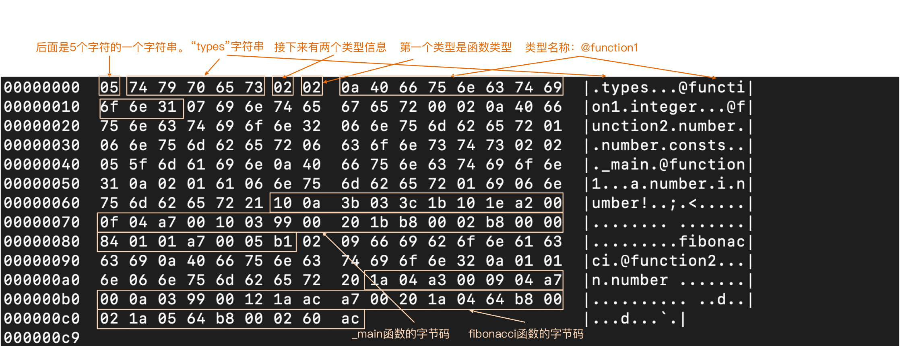
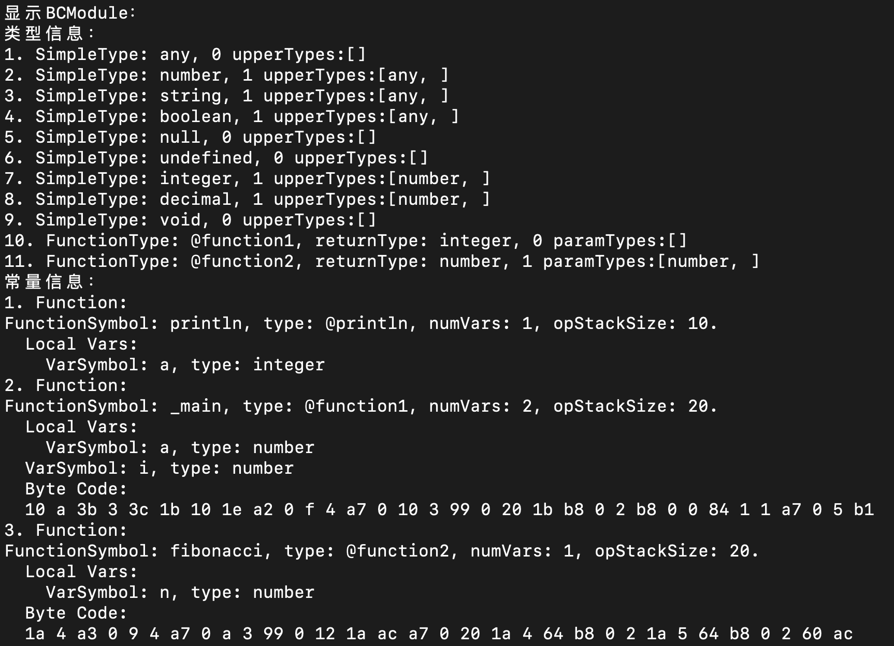
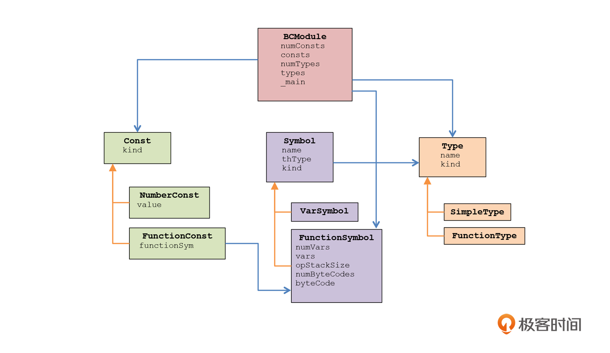
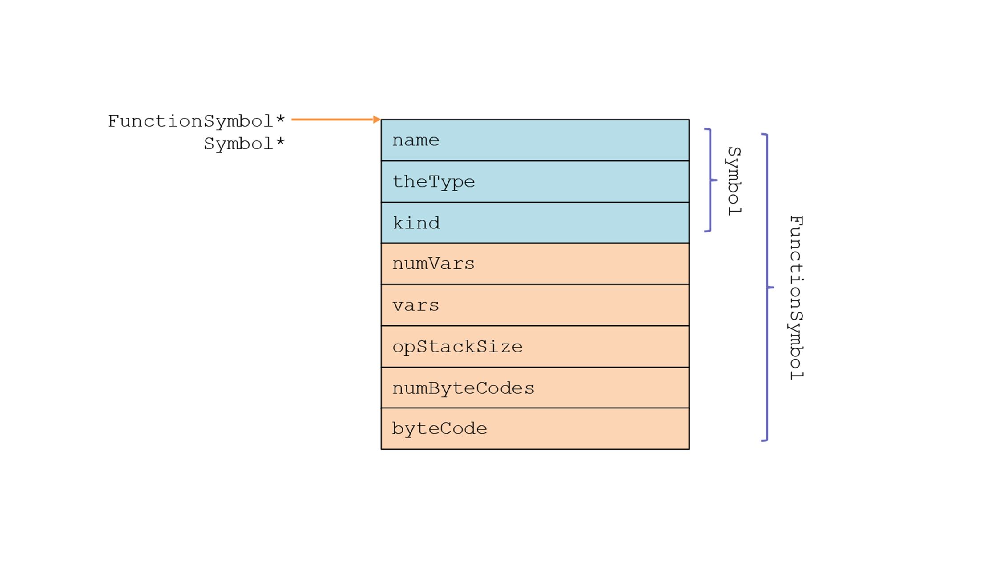
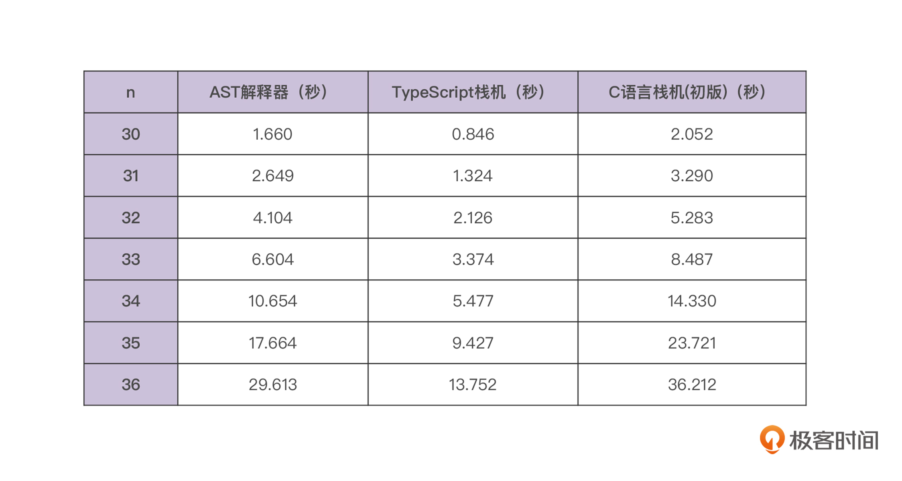

---
date: "2019-06-23"
---  
      
# 10｜基于C语言的虚拟机（一）：实现一个简单的栈机
你好，我是宫文学。

到目前为止，我们已经用TypeScript实现了一个小而全的虚拟机，也在这个过程中稍微体会了一下虚拟机设计的一些要点，比如字节码的设计、指令的生成和栈机的运行机理等等，而且我们还通过性能测试，也看到了栈机确实比AST解释器的性能更高。

虽然，上面这些工作我们都是用TypeScript实现的，但既然我们已经生成了字节码，我不由地产生了一个想法：我们能不能用C语言这样的更基础的语言来实现一个虚拟机，同样来运行这些字节码呢？

我这样的想法可不是凭空产生的。你看，字节码最大的好处，就是和平台无关的能力。不管什么平台，只要有个虚拟机，就可以运行字节码，这也是安卓平台一开始选择字节码作为运行机制的原因。你甚至也可以来试一试，假设现在时间回到智能手机刚出现的时代，你是否也能够快速设计一个虚拟机，来运行手机上的应用呢？

那么进一步，在这种移动设备上运行的应用，很重要的功能就是去调用底层操作系统的API。用C和C加加实现的虚拟机，显然在这方面有优势，能够尽量降低由于ABI转换所带来的性能损失。

所以，**这一节课，我就带你用C语言重新实现一遍虚拟机**。在这个过程中，你会对字节码文件的设计有更细致的体会，对于符号表的作用的理解也会加深，也会掌握如何用C语言设计栈桢的知识点。

<!-- [[[read_end]]] -->

好了，我们首先实现第一步的目标，把程序保存成字节码文件，再把字节码文件加载到内存。

## 读写字节码文件

在TypeScript版的虚拟机中，我们用了模块（BCModule）来保存程序的相关信息，有了这样一个模块，程序就可以生成一个独立的字节码文件，就像Java语言里，每个.java文件会编译生成一个.class文件那样。

**首先，我们要先来定字节码的文件格式。**

我们也说过，Java语言的字节码文件，是依据了专门的技术规范。其实我们仍然可以采用Java字节码文件的格式，你查阅相应的技术规格就可以。这样的话，我们编译后的结果，就直接可以用Java虚拟机来运行了！

有时间的同学可以做一下这个尝试。这项工作在某些场景下会很有意义。你可以定义自己的DSL，直接生成字节码，跟Java编写的程序一起混合运行。我认识的一位极客朋友就做了类似的使用，用低代码的编程界面直接生成了.NET的字节码，形成了一个基于Unity的游戏开发平台。

不过，我们目前的语言比较简单，所以不用遵循那么复杂的规范，我们就设计自己的文件格式就好了。

**第二，我们需要考虑：保存什么信息到字节码文件里，才足够用于程序的运行？**

从我们目前实现的虚拟机来看，其实不需要太多的信息。你可以回忆一下，其实要保证程序的运行，只需要能够从常量表里查找到函数的一些基本信息即可，最重要的信息包括：

* 这个函数的字节码；
* 这个函数有几个本地变量？我们需要在栈桢里保留存储位置；
* 这个函数的操作数栈的最大尺寸是多少？也就是最多的时候，需要在栈里保存几个操作数，以便我们预留存储空间。

除了这些信息外，再就是我们的代码里用到了的部分数字常量，也需要从常量表里加载，就像ldc指令那样。

所以说，只要把函数常量、数字常量存成字节码文件，就足够我们现在的虚拟机使用了。你也可以看到，我们现在甚至连函数名称、函数的签名都不需要，如果需要的话，也是为了在运行期来显示错误信息而已。

不过，如果把函数名称和函数签名的信息加进去，会有利于我们实现多模块的运行机制。也就是说，如果一个模块中的函数要调用另一个模块中的函数，那么我们可以创造一种机制，实现模块之间的代码查找。

这其实就是Java的类加载机制和多个.class文件之间互相调用的机制，我们仍然可以借鉴。而且，即使像C语言那样的编译成本地代码的语言，也是通过暴露出函数签名的信息，来实现多个模块之间的静态链接和动态链接机制的。

那再进一步，既然需要函数签名，那么我们就需要知道一些类型信息，比如往函数里要传递什么类型的参数，返回的是什么类型的数据，这样调用者和被调用者之间才能无缝衔接到一起。

像C语言这样的系统语言，以及在操作系统的ABI里，支持的都是一些基础的数据类型的信息，比如整数、浮点数、整数指针、字符串指针之类的。而像Java等语言，它们建立了具有较高抽象度的类型体系，还可以包含这些高级的类型信息，从而实现像运行时的类型判断、通过反省的方式动态运行程序等高级功能。

上面这几段的分析总结起来，就是我们需要往目标文件里或多或少地保存一些类型信息。

那么现在就清楚了，我们需要把常量信息和类型信息写到字节码里，就足够程序运行了。

**现在，我们来到了第三个步骤：序列化。**

具体来说，序列化就是把这些信息以一定的格式写到文件里，再从文件里恢复的过程，是一个比较啰嗦的、充满细节的过程。也就是说，我们在内存里是一种比较结构化的数据，而在文件里保存，或者通过网络传输，都是采用一个线性的数据结构。

在我的编程经验里，所有这些序列化的工作都比较繁琐，但大致的实现方式都是一样的。无论是保存成二进制格式、XML格式、json格式，还是基于一种网络协议在网络上传输，都是一个把内存中的数据结构变成线性的数据结构，然后再从线性的数据结构中恢复的过程。

你可以看看BCModuleWriter和BCModuleReader中的代码，实现的技巧也很简单，**最重要的就是你要知道每个数据占了多少个字节**。比如，当你向文件里写一个字符串的时候，你先要写下字符串的长度，再写字符串的实际数据，用这样的方法，当你读文件的时候，就能把相关信息顺利还原了。

**这类程序中稍微有点难的地方，是保证对象之间正确的引用关系**。比如，函数引用了变量和类型，而高级的类型之间也是互相有引用关系的，比如子类型的关系等等，这样就构成了一张网状的数据结构，相互之间有引用。

当你写入文件的时候，要注意，这个网的每个节点只能写一次，不能因为两个函数的返回值都引用了某个类型，就把这个类型写了两次。在读的时候呢，则要重新建立起对象之间正确的引用关系。

好了，了解了实现思路以后，再阅读相应的示例代码就很容易了。在TypeScript中，我用BCModuleWriter把斐波那契数列程序的字节码写成了文件，然后用hexdump命令来显示一下看看：  
  
乍一看，这个跟Java的字节码文件还挺像的，不过我们用的是自己的简单格式。我在图中做了标注，标明了字节是什么含义。其中\_main函数和fibonacci函数的字节码指令，我也标了出来。

之后，我可以用BCModuleReader把这个字节码文件再读入内存，重建BCModule，包括里面的符号信息。如果基于这个新的BCModule，程序同样可以顺畅地运行，那就说明我们的字节码文件里面确实包含了足够的运行信息。

好了，现在我们的字节码文件以及相应的读写机制已经设计成功，也用TypeScript做完了所有的设计验证。在这个基础上，重新用C语言实现一个虚拟机，就是一个比较简单的事情了。你可以发现，虽然我们的语言换了，但虚拟机的实现机制没有变。

接下来，我们就需要用C语言把字节码文件读到内存，并在内存重建BCModule相关的各种对象结构。

## 用C语言读入字节码文件

关于C语言版本的字节码读取程序，你可以参考一下readBCModule函数的代码。在读取了字节码文件以后，我还写了一个dumpBCModule的函数，可以在控制台显示BCModule的信息，如下图所示：



你可能会注意到，我们最后的模型里的类型信息和函数都比字节码文件里的要多。不要担心，多出来的其实是系统内置的类型（比如number类型）和内置函数（比如println），它们不需要被保存在字节码文件里，但是会被我们的程序引用到，所以我们要在内存的数据结构中体现。

在这里，我重新梳理一下内存里的对象模型，这个对象模型就是我们运行时所需要的所有信息。我们读取了字节码文件以后，会在内存里形成这个结构化的对象模型，来代表一个程序的信息。  
  
这里我再讲一个小技术点，看着上面的类图，你可能会问：C语言不是不支持面向对象吗？你为什么还能用面向对象的方式来保存这些信息？

其实，用C语言也能模拟类似面向对象的机制。以符号为例，我们是这样声明Symbol和FunctionSymbol的，让FunctionSymbol包含基类Symbol中的数据：

```
    typedef struct _Symbol{
        char* name;     //符号名称
        Type* theType;  //类型
        SymKind kind;   //符号种类
    } Symbol;
    typedef struct _FunctionSymbol{
        Symbol symbol;        //基类数据
        int numVars;          //本地变量数量
        VarSymbol ** vars;    //本地变量信息
        int opStackSize;      //操作数栈大小
        int numByteCodes;     //字节码数量
        unsigned char* byteCode; //字节码指令
    } FunctionSymbol;
    

```

在内存里，FunctionSymbol最前面的字段，就是Symbol的字段，因此你可以把FunctionSymbol的指针强制转换成Symbol的指针，从而访问Symbol的字段。这种编程方式在一些用C语言编写的系统软件里非常普遍，包括其他作者写的一些编译器的代码，以及Linux操作系统内核中的代码中都有体现。  
  
好了，现在我们已经成功地读入了字节码文件，接下来就让我们运行它吧！

## 用C语言实现栈机

现在，我们要用C语言再重新实现一遍栈机，这也很快，因为机理我们前面都梳理清楚了。实际上，整个C语言版本的虚拟机的代码，我就用了一个周末，就从TypeScript版本中移植到了C语言中。我也鼓励你用自己熟悉的语言多做几次移植的工作，每做一遍，你对虚拟机的内在机制的理解就会更加深入。

好，我来描述一下这个移植过程中的重点工作。

**首先，你仍然可以建立一个枚举数据，来描述我们所使用的指令集，也让程序更容易阅读：**


**第二，设计运行栈的数据结构。**我用了一个链表来把各个栈桢链接在一起：

```
    typedef struct _StackFrame{
        //本栈桢对应的函数，用来找到代码
        FunctionSymbol* functionSym;
        //返回地址
        int returnIndex;
        //本地变量数组
        NUMBER* localVars;  
        //操作数栈
        OprandStack* oprandStack;
        //指向前一个栈桢的链接
        struct _StackFrame * prev;
    }StackFrame;
    

```

在运行的时候，我们只要保持一个指向栈顶的指针就能访问栈桢中的数据。  
  
**第三，设计操作数栈。**在栈桢中，你会看到有一个操作数栈，我们用一个数组来表示操作数栈就可以了，然后用一个字段指向当前的栈顶。

```
    /**
     * 操作数栈
     * 当栈为空的时候，top = -1;
     * */
    typedef struct _OprandStack{
        NUMBER * data; //数组
        int top;       //栈顶的索引值
    }OprandStack;
    

```

**最后，就是做一个解释器，解释执行字节码。**这里解释器的实现跟TypeScript版本的没啥区别，就是一个无穷循环，不断读取字节码指令，并根据指令做相关的动作，我就不重复介绍了，你可以回顾一下08节的内容。

到这里，整个移植工作就算完成了。整个代码也就1000来行，其中大部分代码都是House Keeping类型的代码，用于完成字节码读写、打印调试信息等啰嗦的工作，核心代码并不多。所以你在阅读代码的时候，也不要有什么心理负担。

现在，到了检验我们新版本虚拟机的时候了。我们像之前一样，运行斐波那契数列的示例程序，检验一下基于C语言实现的虚拟机的性能到底如何。

## 性能比拼和优化设计

其实，我在一开头，是期望新版虚拟机的性能是能够马上碾压前两个运行时的，也就是AST解释器和TypeScript栈机。可是实际运行结果却出乎我的预料：**新版虚拟机的性能，只有TypeScript栈机的一半，甚至连AST解释器的性能也比不上**。

你可能不相信，这怎么可能呢？不过，性能测试的数字是不会说谎的，你自己也可以去运行一下测试用例试试看。

在测试用例中，我打印了n从30到36的斐波那契数列，对比了各个解释器的性能：  
  
我还绘制成了图表，这样能够让性能比较看上去更直观：

  
你在前一节已经看过了AST解释器和TypeScript版栈机的性能对比曲线了。现在加上了C语言版栈机的数据，它的曲线竟然是在最上面的，也就是最慢的。

**接下来的问题来了：如何评价这个评测结果呢？难道用C语言编写，性能还不如JavaScript吗？你能帮我思考一下原因吗？**

对于这个问题的分析和解决，我想放到下一节课。在分析和解决这个问题的过程中，你也会对虚拟机设计上的一些重要因素产生更深入的了解。

## 课程小结

好了，今天这节课到这里就结束了，让我们来简单回顾一下。

这一节课，我们实现了一个简单版本的虚拟机，主要工作包括几个方面：

首先，我们设计了一个字节码文件的格式，并分析了需要保存哪些信息，才能让字节码的程序运行起来，这些分析有助于你理解二进制目标文件的设计。

为了让程序运行起来，我们其实只需要有每个函数编译后形成的字节码指令，以及指令中会引用到的常量值就可以了。但我们还会保存一些符号信息和类型信息，以便支持模块之间连接，让虚拟机未来能够加载和运行多个模块。在后面的课程中，我们会把汇编代码编译成二进制目标文件，这个原理其实是相通的。

第二，我们需要编写程序，实现内存中的数据结构与顺序保存的文件数据之间的转换。这是一个程序员需要掌握的基本功，重建对象之间的引用关系是其中的难点，往往需要引入一些辅助的数据结构，比如示例代码中的SimpleTypeInfo和FunctionTypeInfo。

第三，用C语言实现栈桢、操作数栈和一个栈机，这个过程我们只是做代码移植，与TypeScript版的栈机的原理是一样的。

最后，我们实现了一个初版的C语言栈机，但很遗憾，这个虚拟机性能并没有达到我们的预期。关于这个版本的虚拟机性能不佳的问题，我们会在下一节课去详细分析并解决。

## 思考题

今天我们的思考题是：通过阅读和分析代码，你能找出C语言版本的栈机性能比较低的原因吗？希望你能在进入下一节课前独立分析一下，并在下一节课验证一下你的想法。

感谢你和我一起学习，也欢迎你把这节课分享给更多对字节码虚拟机感兴趣的朋友。我是宫文学，我们下节课再见！

## 资源链接

[这节课的示例代码在这里！](https://gitee.com/richard-gong/craft-a-language/tree/master)