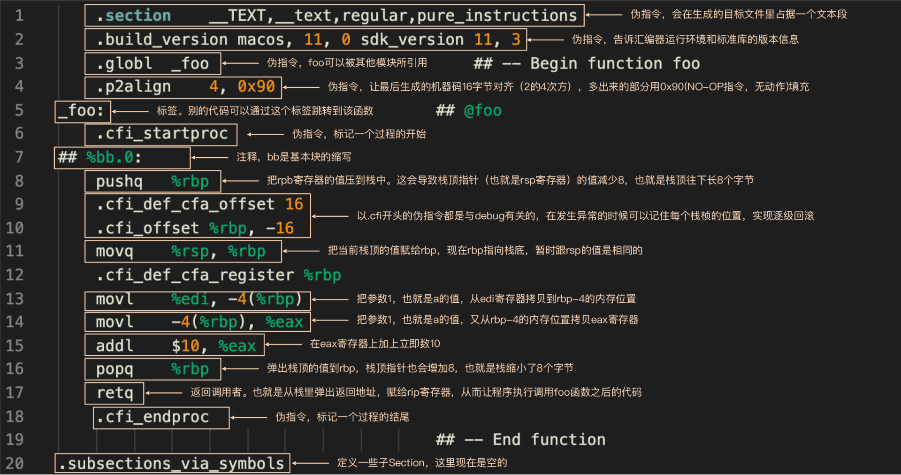
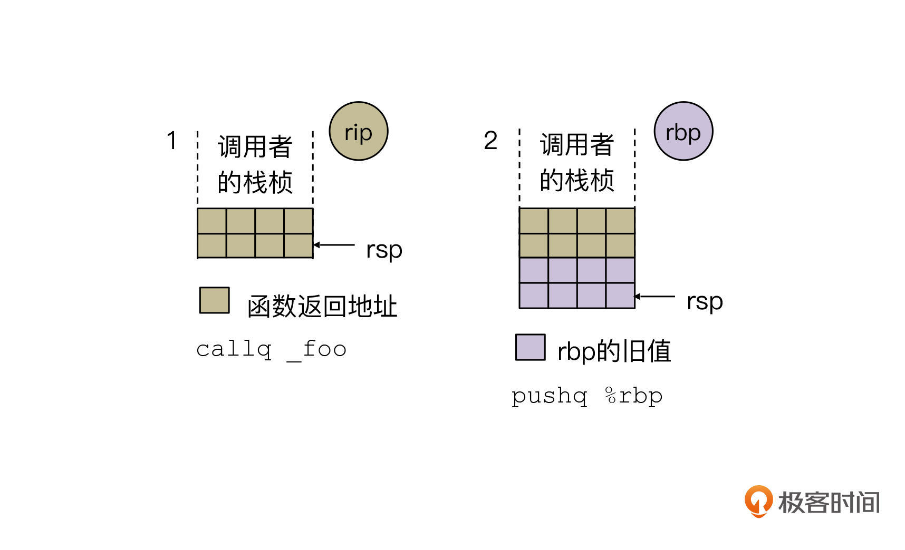
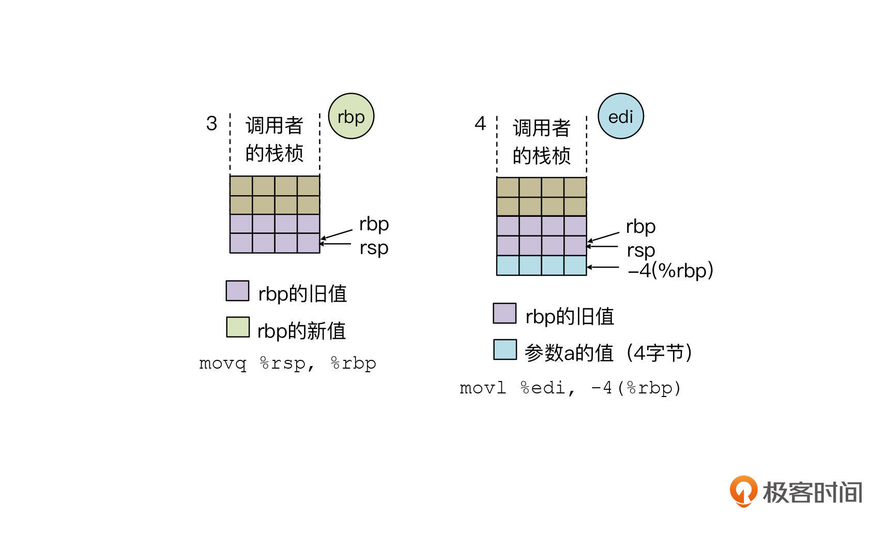
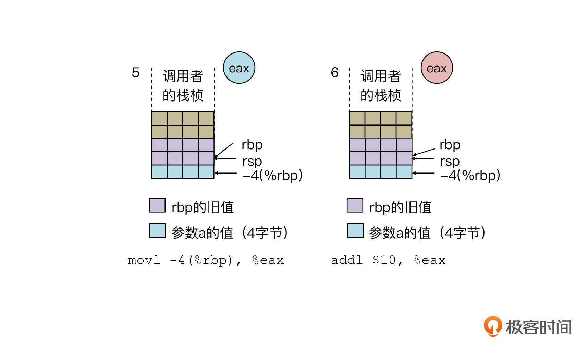
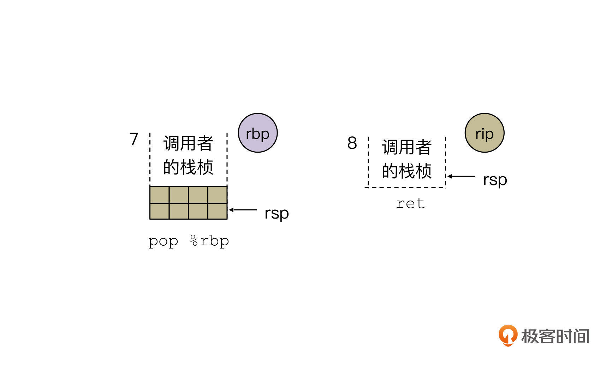

---
date: "2019-06-23"
---  
      
# 15｜汇编语言学习（二）：熟悉X86汇编代码
你好，我是宫文学。

上一节课，在开始写汇编代码之前，我先带着你在CPU架构方面做了一些基础的铺垫工作。我希望能让你有个正确的认知：**其实汇编语言的语法等层面的知识是很容易掌握的**。但要真正学懂汇编语言，关键还是要深入了解CPU架构。

今天这一节课，我们会再进一步，特别针对X86汇编代码来近距离分析一下。我会带你吃透一个汇编程序的例子，在这个过程中，你会获得关于汇编程序构成、指令构成、内存访问方式、栈桢维护，以及汇编代码优化等方面的知识点。掌握这些知识点之后，我们后面生成汇编代码的工作就会顺畅很多了！

好了，我们开始第一步，通过实际的示例程序，看看X86的汇编代码是什么样子的。

## 学习编译器生成的汇编代码

按我个人的经验来说，**学习汇编最快的方法，就是让别的编译器生成汇编代码给我们看。**

比如，你可以用C语言写出表达式计算、函数调用、条件分支等不同的逻辑，然后让C语言的编译器编译一下，就知道这些逻辑对应的汇编代码是什么样子了，而且你还可以分析每条代码的作用。这样看多了、分析多了以后，你自然就会对汇编语言越来越熟悉，也敢自己上手写了。

我们还是采用上一节课那个用C语言写的示例函数foo，我们让这个函数接受一个整型的参数，把它加上10以后返回：

<!-- [[[read_end]]] -->

```
    int foo(int a){
        return a+10;
    }
    

```

接着，再输入下面的clang或gcc命令：

```
    clang -S foo.c -o foo.s 
    或
    gcc -S foo.c -o foo.s
    

```

然后我们用一个文本编辑器打开foo.s，你就会看到下面这些汇编代码：

```
        .section    __TEXT,__text,regular,pure_instructions
        .build_version macos, 11, 0 sdk_version 11, 3
        .globl  _foo                            ## -- Begin function foo
        .p2align    4, 0x90
    _foo:                                   ## @foo
        .cfi_startproc
    ## %bb.0:
        pushq   %rbp
        .cfi_def_cfa_offset 16
        .cfi_offset %rbp, -16
        movq    %rsp, %rbp
        .cfi_def_cfa_register %rbp
        movl    %edi, -4(%rbp)
        movl    -4(%rbp), %eax
        addl    $10, %eax
        popq    %rbp
        retq
        .cfi_endproc
                                            ## -- End function
    .subsections_via_symbols
    

```

你第一次看到这样的代码的时候，可能会有点被吓着。这都是些什么呀！

不要怕，我给你梳理和解释一番，你就能慢慢适应这种代码形式，并且能看出其中的门道了。我做了一张图，几乎把这里面的每一行都做了解释，你先看一下:



首先我要说明一下，这个汇编文件采用的是GNU汇编器的语法。可能你之前学的是其他汇编器，语法可能会不同，不过看一阵子也就会习惯了。如果你在使用中遇到什么问题，也可以随时查阅[GNU汇编器的手册](https://sourceware.org/binutils/docs/as/index.html)。

GNU汇编器语法的特点是：

```
    助记符 源操作数，目的操作数
    

```

也就是说，比如在“addl    \$10, \%eax”这条指令中，addl是指令的助记符，\$10是源操作数，\%eax是目的操作数。整条指令的意思就是把立即数10加到eax寄存器原来的值上，并把结果保存在eax寄存器。

好，我们现在回到图中这个汇编代码里来，你先看看这个汇编代码的头几行。你会注意到，头几行都是以“.”号开头的。这些以“.”号开头的指令，叫做**伪指令**，或者叫做directive。它是写给汇编器看的，不是翻译成机器码的指令，这些伪指令会帮助汇编器生成正确的目标文件。

比如，第一句用了一个.section伪指令。汇编器生成的目标文件中，会有1到多个section，或者叫做**段**。每个段里面放不同的内容，有的是放代码的，有的是放数据的。

**目标文件中的这些段，会被链接程序合并、组装到一起，形成可执行文件。**当可执行文件加载到内存的时候，就会形成我们在[第12节课](https://time.geekbang.org/column/article/414397)里讲到的那种内存布局，分为文本段、初始化后的数据段、未初始化的数据段等。这一切的源头，就是在汇编代码中定义的section，以及子section。当前我们定义的section，是一个文本段，里面放的是纯代码。

接下来，.build\_version提供了目标代码的运行环境和标准库的版本。对于macOS和Linux来说，它们的二进制目标文件的格式是不同的。

.globl \_foo的意思，是\_foo标签可以被外部模块所链接。也就是说，如果另一个模块里引用了foo函数，那么它可以跳转到\_foo标签所指示的代码地址来。

.p2align的意思是，对于该section生成的二进制程序片段，必要时汇编器要在尾部添加一些填充性的内容，让它总的字节数能够被16整除。

这是什么意思呢？这涉及到CPU在内存中读取数据的性能问题。通常，如果数据是内存对齐的，读取数据的性能更高。甚至有些指令，特别是向量计算的指令，要求读取的数据必须是内存对齐的。在这里，我们是把生成的机器码做内存对齐，这样CPU读取机器码的性能会更高。内存对齐是在汇编代码中常见的一个现象，我这里先简单介绍一下，后面你在设计栈桢的时候还会再次遇到。

除了这几个伪指令之外，还有几个以.cfi开头的。这些伪指令都是为了生成与debug有关的信息。如果你去掉它们，也不会影响剩下的汇编代码编译成正常的可执行文件。

实际上，这个文件里大部分伪指令都可以去掉，都不影响最后的编译和链接。你看一下下面这个示例代码，这里面我去掉了大部分令人眼花缭乱的伪指令，看上去清爽多了。

```
    #foo_x86_pure.s   去掉了大部分伪指令的汇编代码
    .globl  _foo                            ## -- Begin function foo
    _foo:                                   ## @foo
        pushq   %rbp
        movq    %rsp, %rbp
        movl    %edi, -4(%rbp)
        movl    -4(%rbp), %eax
        addl    $10, %eax
        popq    %rbp
        retq
    

```

其中，我保留了.globl \_foo，因为我想在另一个程序中调用foo函数。这个调用者的代码如下：

```
    //callfoo.c  调用采用汇编代码编写的foo函数，并打印出计算结果。
    #include "stdio.h"
    
    int foo(int a);
    
    int main(){
        printf("foo(2) = %d\n", foo(2));
    }
    

```

接着，我再执行下面两行命令，就会生成一个叫做callfoo的可执行文件。

```
    as foo_x86_pure.s -o foo_x86_pure.o
    clang callfoo.c foo_x86_pure.o -o callfoo
    

```


这里面，第二句的clang命令暗中做了两件事情。首先是把callfoo.c编译成目标文件，然后用ld工具把两个目标文件链接成了一个可执行文件。

通过上面的练习，一方面你能了解一个多模块的程序是如何链接到一起的，另一方面呢，你也可以放开手脚，大胆地写纯汇编代码，不用担心不了解那么多伪指令了。

好了，我们再回到纯净版本的汇编代码中，看看这些代码都做了些什么事情，这样你会慢慢对汇编代码熟悉起来。

## 理解汇编代码的语法和功能

为了让你更清晰地阅读，我给代码也都加上了注释。

```
    .globl  _foo           #伪指令，让foo可以被其他模块所引用                
    _foo:                  #标签。别的代码可以通过这个标签跳转到该函数。
        #序曲（prologue）
        pushq   %rbp       #把rpb寄存器的值压到栈中。这会导致栈顶指针（也就是rsp寄存器）的值减少8，也就是栈顶往下长8个字节。
        movq    %rsp, %rbp #把当前栈顶的值赋给rbp，现在rbp指向栈底，暂时跟rsp的值是相同的。
    
        #函数体
        movl    %edi, -4(%rbp) #把参数1，也就是a的值，从edi寄存器拷贝到rbp-4的内存位置。
        movl    -4(%rbp), %eax #把参数1，也就是a的值，又从rbp-4的内存位置拷贝eax寄存器。
        addl    $10, %eax      #在eax寄存器上加上立即数10
    
        #尾声（epilogue）
        popq    %rbp       #弹出栈顶的值到rbp，栈顶指针也会增加8，也就是栈缩小了8个字节。
        retq               #返回调用者。也就是从栈里弹出返回地址，赋给rip寄存器，从而让程序执行调用foo函数之后的代码。
    

```

在这段代码中，“\_foo:”是一个标签，可以作为代码跳转的目的地。在这里你就知道了，**汇编语言里是没有函数的概念的，函数也不过意味着一段代码的开始地址而已。**在后面，我们也会为if语句和for语句等生成跳转指令，跳转指令的目的地也是一个标签，本质上跟函数入口的这个标签没啥区别。

foo函数对应的所有汇编代码，被我划分成了序曲、函数体和尾声三个部分。序曲和尾声两个部分，都是用来维护栈桢的。

在这里，我想借着这段代码，再带你了解一下与栈桢有关的知识点。我画了几个图，依次给你展示了栈和寄存器里的数据随着代码执行不断变化的情况。

我们先来看第一、二步的示意图：



**第一步是调用者执行callq \_foo指令。**

这个时候，callq指令会把rip寄存器的值压入到栈中。rip的值是当前指令的下一条指令，也就是callq之后的指令。把这个值压入到栈里以后，栈顶指针的值会减8，指向新的栈顶。那这里为什么会是减法呢？这个原因我们已经在第12节说过了，栈是从高地址向低地址延伸的。

**第二步，执行pushq \%rbp。**

这条指令是把rbp寄存器的值压到栈里。rbp是一个64位的寄存器，所以要占用8个字节。push指令还会移动栈顶指针，让rsp的值减8。

然后我们再来看第三、四步的执行结果：



**第三步，执行movq \%rsp \%rbp。**

这条指令会把rsp的值拷贝到rbp，所以rbp寄存器现在拥有了一个新值，跟rsp一起，都指向了新的栈顶。如果我们后面扩展栈桢，那么rsp的值会继续减少，保持指向栈顶，而rbp会一直指向这里，也就是栈桢的底部。

**第四步，执行movl \%edi, \-4\(\%rbp\)。**

这是把edi寄存器的值保存到栈底向下的4个字节中。因为这是一个32位整数，所以只需要占据4个字节。

注意，这里edi的值，就是foo函数第一个参数的值，也就是参数a。根据c语言的调用约定，前6个参数都是通过寄存器来传递的，这样性能更高。超过6个的之后的参数呢，还是要通过栈桢传递。

这行代码里还有一个操作数是-4\(\%rbp\)。这是一个内存地址，它的具体值是rbp寄存器的值减去4，这就涉及到X86架构下内存的寻址方式这个知识点。

在X86下访问内存，有**直接内存访问**和**间接内存访问**两种方式。直接内存访问指的是在指令后面直接跟内存的地址，比如“mov 地址值, \%eax”的意思，就是把某地址的内容拷贝到寄存器。在跳转和函数调用等指令中，我们通常是用标签来代替实际的内存地址，因为标签在链接的时候就会被计算成内存地址。

而间接内存访问，是基于寄存器的值去计算内存地址。间接内存访问的完整格式是：

**偏移量（基址，索引值，字节数）**

计算出来的内存地址是：基址 + 索引值 \* 字节数 + 偏移量

我这里举例说一下：

* 8\(\%rbp\)，是比 \%rbp 寄存器的值加 8。
* \-8\(\%rbp\)，是比 \%rbp 寄存器的值减 8。
* （\%rbp, \%eax, 4）的值，等于 \%rbp + \%eax\*4。这个地址格式相当于访问 C 语言中的数组中的元素，数组元素是 32 位的整数，它的索引值是 \%eax，而数组的起始位置是 \%rbp。其中字节数只能取 1、2、4、8 这四个值。这种寻址方式为数组或矢量数据的访问提供了便利。

好了，内存寻址方式我们就了解到这里。对于每种CPU架构，支持的寻址方式都是不太相同的，你在接触一个新的架构时需要关注一下这个点。

现在回到正题，来看第五、六条的指令：



**第五步，执行movl  \-4\(\%rbp\), \%eax。**

这个语句现在你自己也能看懂了。它是把刚才那个地址中的值，拷贝到eax寄存器中。

**第六步，addl \$10, \%eax。**

这条语句的意思是在eax寄存器上加上立即数10。在X86的汇编代码中，立即数是以\$开头的。

最后我们来看下最后两步的执行结果：



**第七步，popq \%rbp。**

这里是说弹出栈顶的值到rbp，栈顶指针也会增加8，也就是栈缩小了8个字节。

**最后一步，执行ret指令。**

这个指令会从栈里弹出返回地址，设置到rip中去。同时，栈顶指针rsp的值也加了8，栈进一步缩小。执行完ret指令以后，CPU就会去执行rip指向的代码，也就是调用者的代码中callq \_foo之后的代码。

那返回值在哪里呢？根据调用约定，foo函数的调用者是就是从eax寄存器中取返回值的。

**刚才这8个步骤，就是foo函数从被调用到返回的全过程。**多分析几次这样的汇编代码，你就能对栈的变化过程，以及各个寄存器的值的变化过程有一个直观的认知，这样就能从最底层理解程序运行的过程了。

不过，我们的分析还没有停止。我们继续打量一下上面的汇编代码，你可能还会产生几个问题。通过解决这些问题，你可以更深入地了解X86汇编代码，并初步学习到对汇编代码进行优化的技术。

## 汇编代码的优化

**问题1：在第4步，执行movl \%edi, \-4\(\%rbp\)，也就是把edi的值保存到内存的时候，你会发现目标地址其实是在栈顶外面的，超越了rsp指向的位置。这是怎么回事呢？难道我们的程序还可以访问栈之外的内存吗？**

确实如此，这其实是一个ABI的规定。System V ABI中针对amd64架构规定，程序可以访问栈顶之外128个字节的内存空间，这128个字节足够保存16个长整型数据，或者32个整型数据，还是挺大的。这样有什么好处呢？这可以减少我们的指令数量。否则，我们就要为foo函数新增加两条指令，用来移动栈顶指针了。

**再来说说问题2：我们之前讲过栈顶指针，也就是rsp。怎么这个程序里还有一个指针rbp呀？它有什么用？**

答案是，你不一定非要用它，这是个历史遗留的习惯。这个指针的作用，是在退出函数的时候，可以一步回到前一个栈桢，或者通过rbp的值来访问超过6个之外的参数（保存在调用者的栈桢里）。但你通过rsp值的加和减、以及成对的push和pop指令，其实也可以保证正确回到前一个栈桢。

所以，在新的架构下，其实我们不用这个指针也是可以的。这样的话，也就没有必要为了使用rbp而把它原来的值保存到内存里，这样也就能减少了两次内存读写操作，提升系统的性能。

**然后是问题3：你可能会说，我怎么觉得这个程序里的很多代码都在做无用功呀。特别是，先把edi寄存器的值保存到内存中，然后又从内存拷贝到eax寄存器，在eax上做计算。为什么不直接从edi拷贝到eax呢？这样就不需要做内存读写了呀？**

确实如此。因为我们当前生成的汇编代码是没有做优化的。而寄存器机最重要的优化，就是尽量多使用寄存器，减少内存读写。我们后面还会介绍寄存器分配的思路和算法。不过，我们现在就可以先手工优化一下这段汇编代码，把刚才的问题2和问题3涉及的内容都优化一下：

```
    ##foo_x86_opt2.s
    .globl  _foo           #伪指令，让foo可以被其他模块所引用                
    _foo:                  #标签。别的代码可以通过这个标签跳转到该函数。
        #函数体
        movl    %edi, %eax     #把参数1，也就是a的值，从edi寄存器拷贝到eax。
        addl    $10, %eax      #在eax寄存器上加上立即数10
    
        #尾声（epilogue）
        retq               #返回调用者。也就是从栈里弹出返回地址，赋给rip寄存器，从而让程序执行调用foo函数之后的代码。
    

```

修改完毕以后，你会发现，foo函数从7条指令减少到了3条，并且减少了4次内存读写。既缩小了代码尺寸，又提高了性能，这就是我们这次代码优化起到的作用。

那这已经优化到了最佳状态了吗？其实还没有，还是有优化空间的。请看下面的代码：

```
    ##foo_x86_opt2.s
    .globl  _foo           #伪指令，让foo可以被其他模块所引用                
    _foo:                  #标签。别的代码可以通过这个标签跳转到该函数。
        #函数体
        leal   10(%rdi), %eax  #把参数1加上10，然后拷贝到eax。
    
        #尾声（epilogue）
        retq               #返回调用者。也就是从栈里弹出返回地址，赋给rip寄存器，从而让程序执行调用foo函数之后的代码。
    

```

这里呢，我把用一条lea指令代替了原来函数体中的两条指令。指令数量又减少了一条，并且foo函数整体所花费的时钟周期也减少了。你可以在编译命令中加上-O1或-O2参数，也会获得类似的代码。

我这里再给你介绍一下**lea指令**，这个指令原本是用于做地址计算的。lea是“load effective address”的缩写，装载有效地址。它的源操作数是一个间接寻址模式的地址，在计算出地址值之后赋值给目的操作数。

在这里，我们是利用了lea指令在一条指令里能够同时完成计算和给寄存器赋值的能力，把它用于数学运算了。这就相当于上一节课我们接触到的ARM架构的add指令，那个add指令能接受两个源和1个目的，也能够同时完成加法运算和给寄存器赋值。

这种同样的功能可以用不同的指令实现，并且选择最优的指令组合的机制，叫做**指令选择**。这也是一种代码优化技术。

## 课程小结

好了，这就是今天课程的全部内容了。我们这节课近距离观察和分析了X86汇编的代码，我希望你记住这几个知识点：

GNU汇编器支持的X86汇编由伪指令、指令和标签构成。伪指令是写给汇编器的，你在学习的过程中可以暂时忽略大部分的伪指令。指令能够生成最后的机器码，标签会被链接器转化成内存地址，用于支持函数调用、跳转等功能。

X86的指令由助记符、源操作数和目的操作数构成。不过，有的指令没有目的操作数（如pushq \%rbp），还有的指令只有助记符（如retq）。操作数可以是立即数、寄存器或内存地址。内存地址包括直接内存访问和间接内存访问两种方式。

在运行一个函数时，会涉及到与栈的使用有关的代码。我们用rsp寄存器指向栈顶。push、pop、call和ret指令，都会导致rsp指针移动。在后面的课程里，你还可以手工修改rsp的值，从而改变栈的大小。

最后，我们还有多种技术可以对汇编代码进行优化。首先是寄存器分配算法，可以让程序尽量少访问内存，多利用寄存器进行计算，我们后面的课程里也会围绕这个算法展开比较多的讨论。另外，指令选择算法也会挑选出更优的指令组合，让代码的性能更高。

今天这节课，我们已经初步熟悉了X86汇编代码。那么下节课，我们就动手用编译器生成这样的汇编代码吧！在这个过程中，你还会学习到更多关于X86汇编代码的知识。

## 思考题

我们这节课是以整数运算为例来讲解的。如果把整数换成长整数，也就是foo函数的参数和返回值都改成长整型，对应的汇编代码会有什么不同呢？我建议你尝试一下，然后把你的发现在留言区分享出来。

感谢你和我一起学习，也欢迎你把这节课分享给更多对汇编代码感兴趣的朋友。我是宫文学，我们下节课见。

## 资源链接

[这里我放了一个GNU汇编器的手册。](https://sourceware.org/binutils/docs/as/index.html)