---
date: "2019-06-23"
---  
      
# 19｜怎么实现一个更好的寄存器分配算法：原理篇
你好，我是宫文学。

到目前为止，我们的语言已经能够生成机器码了，并且性能确实还挺高的。不过我们也知道，现在我们采用的寄存器分配算法呀，还是很初级的。

那这个初级的寄存器分配算法会遇到什么问题呢？我们还有更优化的分配寄存器的思路吗？

当然是有的。接下来的这两节课，我们就会来回答这两个问题，我会带你从原理到实操，理解和实现一个更好的算法，叫做**线性扫描算法**，让寄存器的分配获得更好的优化效果。

首先，我们来分析一下当前寄存器分配算法的局限性。

## 初级算法的不足

在前两节课中，我们实现了一个初级的寄存器分配算法。这个算法的特点呢，是主要的数据都保存在内存的栈桢中，包括参数和本地变量。而临时变量，则是映射到寄存器，从而保证各类运算指令的合法性，因为像加减乘数这种运算，不能两个操作数都是内存地址。

这个算法有什么不足呢？你可以暂停一会儿，先自己想一下，大概有两点。

我们现在来揭晓答案。

**第一点不足在生成的代码性能上。**

你知道，我们做编译的目标，是要让生成的代码的性能最高，但这个算法在这方面显然是不合格的。因为参数和本地变量都是从内存中访问的，这会导致代码的性能大大降低。

**第二点不足就在对需要Caller保护的寄存器的处理上。**

<!-- [[[read_end]]] -->

在上一节课后面的性能比拼中，我们发现，其实我们自己的语言编译生成的可执行程序，它的性能还略低于C语言生成的、同样未经优化的版本，按理说它们的性能应该是一样的才对。

深究原因，还是在调用函数的时候，程序需要保存那些需要Caller保护的寄存器。而我们的算法，多保护了一些其实已经不需要被保护的寄存器，从而拖累了性能。

不过，这两个方面的局限性，我们通过今天的算法，都可以很好地解决。我们现在就通过一个示例程序来找一下更好的寄存器分配算法的思路。

## 寄存器分配算法的改进思路

你先看看我们下面这个示例程序：

```
    function foo(p1:number,p2:number,p3:number,p4:number,p5:number,p6:number){
        let x7 = p1;
        let x8 = p2;
        let x9 = p3;
        let x10 = p4;
        let x11 = p5;
        let x12 = p6 + x7 + x8 + x9 + x10 + x11;
        
        let sum = x12;
        for (let i:number = 0; i< 10000; i++){
            sum += i;
        }
    
        return sum;
    }
    

```

你看这里有p1\~p6共6个参数，还有x7\~x12这6个本地变量。但在变量x12的计算过程中，我们还需要用到1个临时变量t1。接下来是一个循环语句，这个语句又涉及到sum和i两个本地变量。

**那我们怎么给它们分配寄存器呢？**

最简单的思路，就是给每个变量分配一个寄存器。所以，p1\~p6、x7\~x12、t1和sum这一共14个变量，就占据了14个寄存器。而且，你要知道，X86在进行整数运算时只有16个通用寄存器可用，扣除用于指示栈桢位置的rsp和rbp以后，本来就只剩下14个。

**那现在这14个寄存器都被占满了，接下来的变量i，是不是就只能放在内存里了呢？**

不是的。因为并不是每个寄存器都需要被我们的变量一直占据的。每个变量其实有不同的生存期，在生存期之后，程序就再也不会访问这个变量了。

我这里画了一张图，显示了我们这块代码中前13个寄存器的生存期。在图中，我用r1\~r13代表了13个寄存器，方便我们分析。不过，实际代码中，你可要换成edi、esi这些具体的寄存器名称。

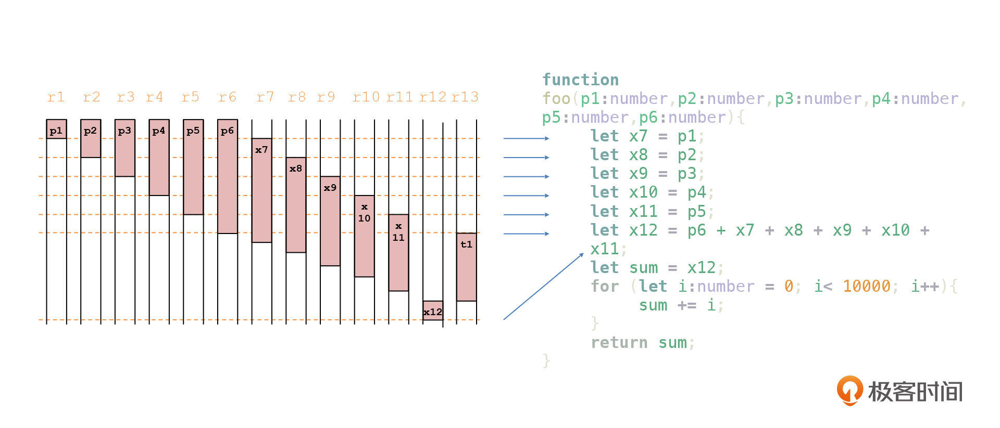

你可以看到，在运行第一行代码以后，p1对应的寄存器（r1）就被释放出来了，同时，x7对应的寄存器（r7）就开始投入使用。

随着代码的运行，r2\~r6逐步被释放，而r8\~r12也逐步被启用。最后，当我们给sum赋值完毕以后，前13个寄存器就都被释放出来了。所以，对于后面的i变量，我们其实有很多寄存器可以使用，根本不用使用内存。

在前面的分析过程中，我们着重计算了每个变量的生存期。**总的来说，只要两个变量的生存期是不交叉的，那就可以共享同一个物理寄存器。**

所以，p1和x7可以共用寄存器r1，p2和x8可以共用寄存器r2，等等。最后，t1、sum和i这三个变量，也是复用已有的寄存器就可以了。

我把这个优化后的寄存器使用情况画在了下面这张图中：

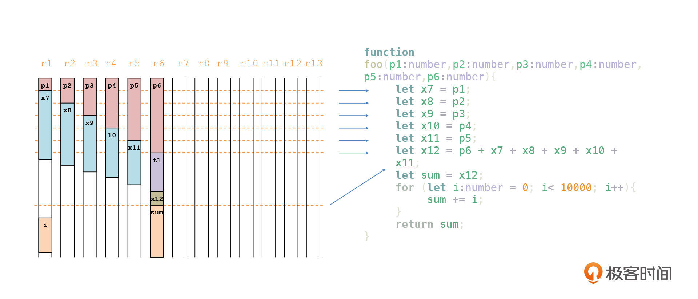

你现在算一下，基于这个优化的分配算法，我们的示例程序最多的时候只需要占用6个寄存器（不算rsp和rbp），而且大部分运行时间，都是在循环中做1万次计算，只占用了两个寄存器。

那么，你现在已经明白我们这次算法优化的思路了吗？其实就是**多个变量可以复用相同的寄存器，只要它们的生存期不重叠就行**。这具体怎么实现呢？

## 线性扫描算法

目前，在成熟语言的编译器中，比较常用的寄存器分配算法有两个：寄存器染色算法和线性扫描算法。其中，寄存器染色算法的优化效果比较好，但算法复杂度比较高，会消耗比较多的编译时间；而线性扫描算法的复杂度比较低，但在大部分情况下也能得到相当不错的优化结果。

所以今天这节课，我就重点带你实现一下线性扫描算法。如果你对寄存器染色算法也感兴趣的话，可以去看看[《编译原理之美》](https://time.geekbang.org/column/intro/100034101)中对这个算法的解析，也可以在留言区和我们分享一下。

线性扫描算法是很容易理解的，这里面的关键就是**计算出每个变量的生存期**。计算生存期可以用数据流分析算法，分析出每个变量的活跃状态，这个我们等会儿再说。

我们再把前面这个示例程序，用线性扫描算法的思路来描述分析一遍。

首先，在程序刚开始执行时，p1\~p6这6个变量都是活跃的，分别占用了1个寄存器。每个寄存器我们用了一个颜色来表示，以便区分。

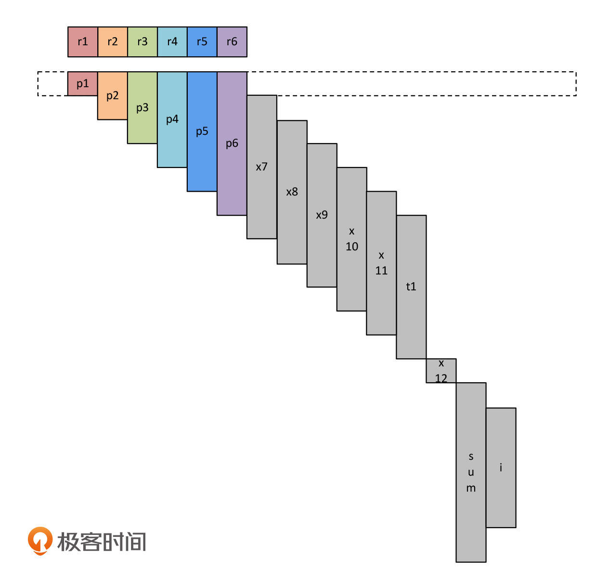

接着在第二个时间段，我们把p1赋给x7，这时p1不再活跃，而x7变得活跃起来。这个时候，让x7代替p1来使用r1寄存器就可以了，不需要再增加新的寄存器。

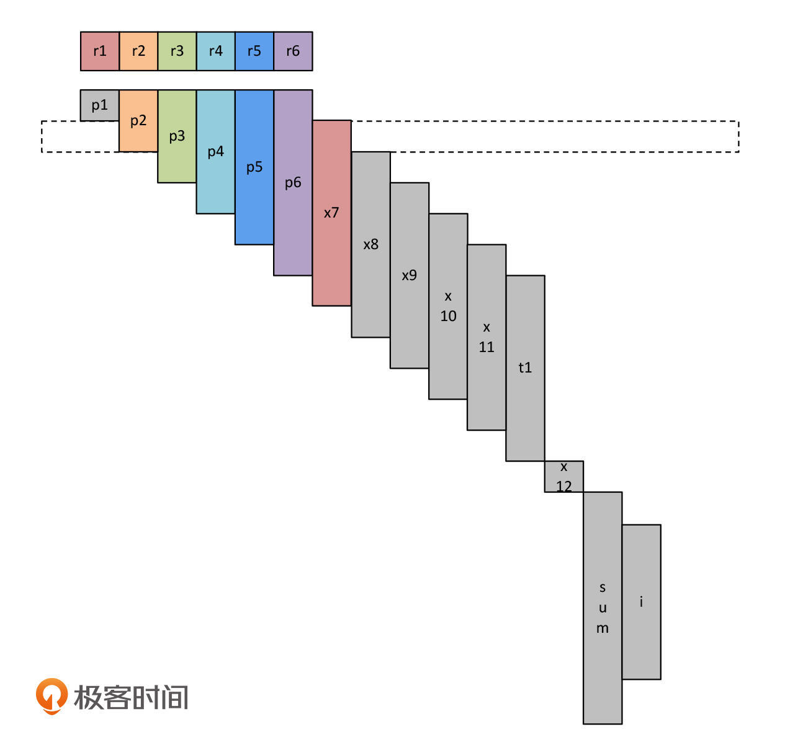

这样继续往下执行。在给x12赋值的时候，其实是会引入一个临时变量，形成下面一系列计算步骤：

```
    t1 = p6;
    t1 += x7;
    t1 += x8;
    t1 += x9;
    t1 += x10;
    t1 += x11;
    x12 = t1;
    

```

这样，随着计算过程的推进，x7\~x11的生存期逐步结束，相应的寄存器也会被释放出来。

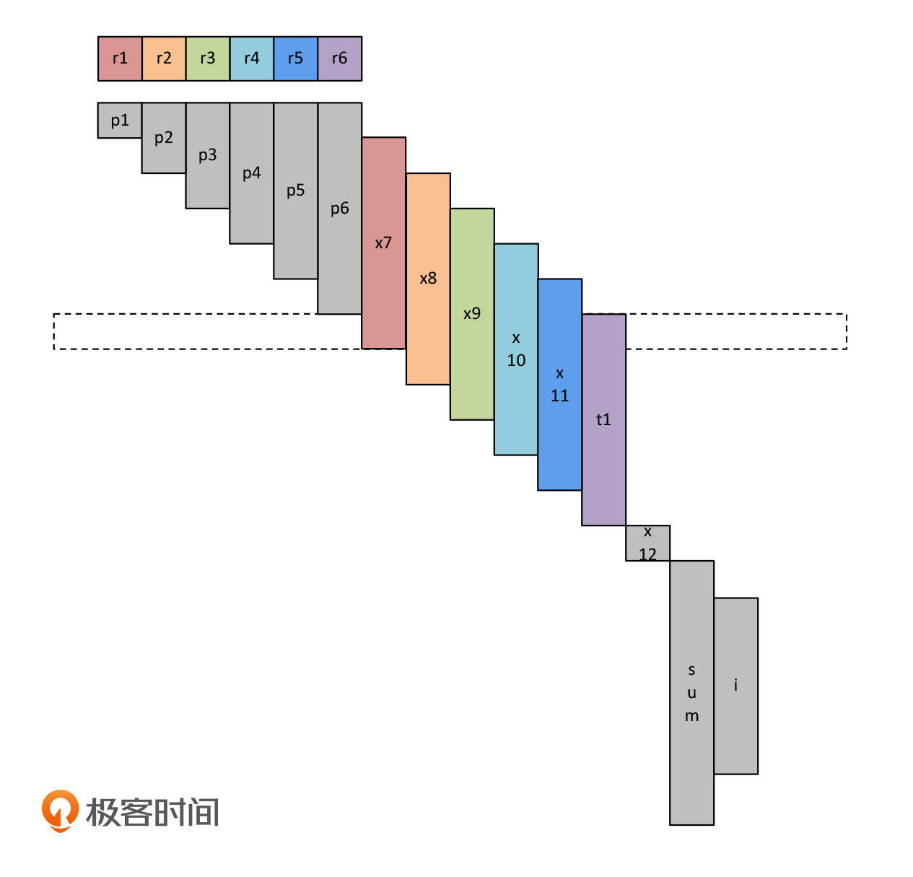

等到给x12赋值的这个表达式完全计算完毕，在这个时间点上，你会发现只有x12需要占用一个寄存器，前面11个变量的生存期都已经结束了。

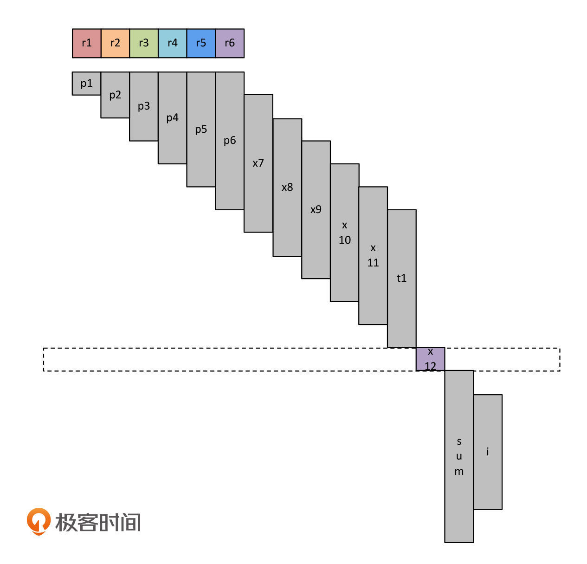

最后，我们要执行for循环的代码。在这个过程中，只需要占据两个寄存器。


好了，刚才的分析就是示例程序执行线性扫描算法的过程。在这个例子中，我们只用了6个寄存器，少于X86-64架构中通用寄存器的数量。所以，整个程序运行过程都使用寄存器就可以了。

**但事情总有例外。如果一个程序写得特别复杂，用到的变量特别多，每个变量的生存期又很长，那物理寄存器的数量还是有可能不够的。那这个时候，算法又该如何处理呢？**

这个时候，我们需要选择一个寄存器，把它的数据保存到内存中，把这个寄存器腾出来。比如说，在前面的例子中，假设我们使用的CPU只有5个寄存器，应该怎样分配呢？

在一开始，p1\~p5还可以每个变量占据一个寄存器。但p6就没有可用的寄存器了，那么我们就先把它放在内存里。因为p6还不会马上被使用，直到给t1赋值的时候，才会用到p6。

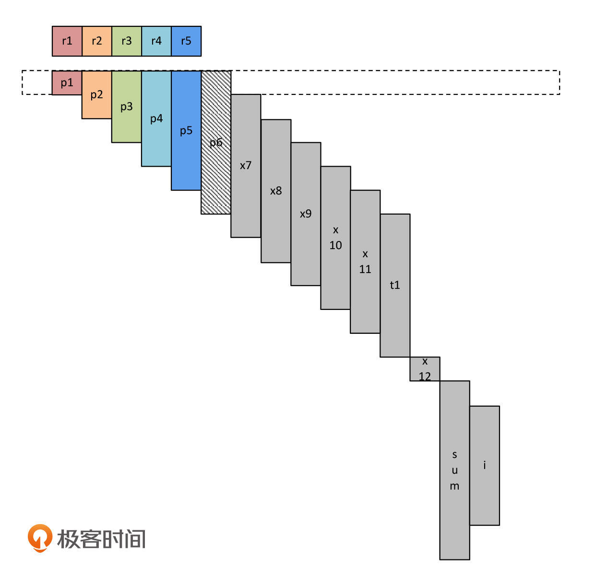

接着，程序开始一步步地运行，寄存器的使用权也被陆续转移。比如，执行完毕x7=p1以后，寄存器r1从p1转移给了x7。

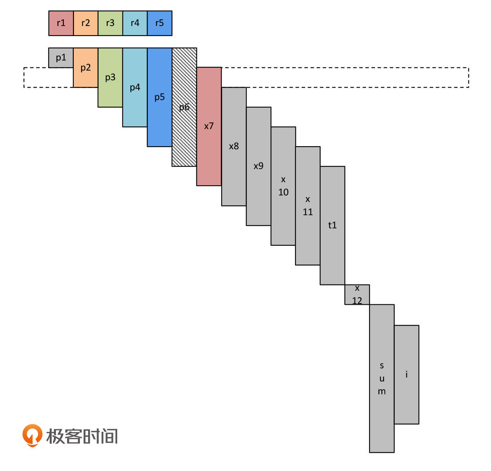

程序继续执行。在执行t1=p6之前，我们要先把p6加载到寄存器。这个时候，我们需要把另一个变量保存到内存，腾出一个寄存器。这次，我们把x11保存到内存，当然你选另几个变量也是可以的。

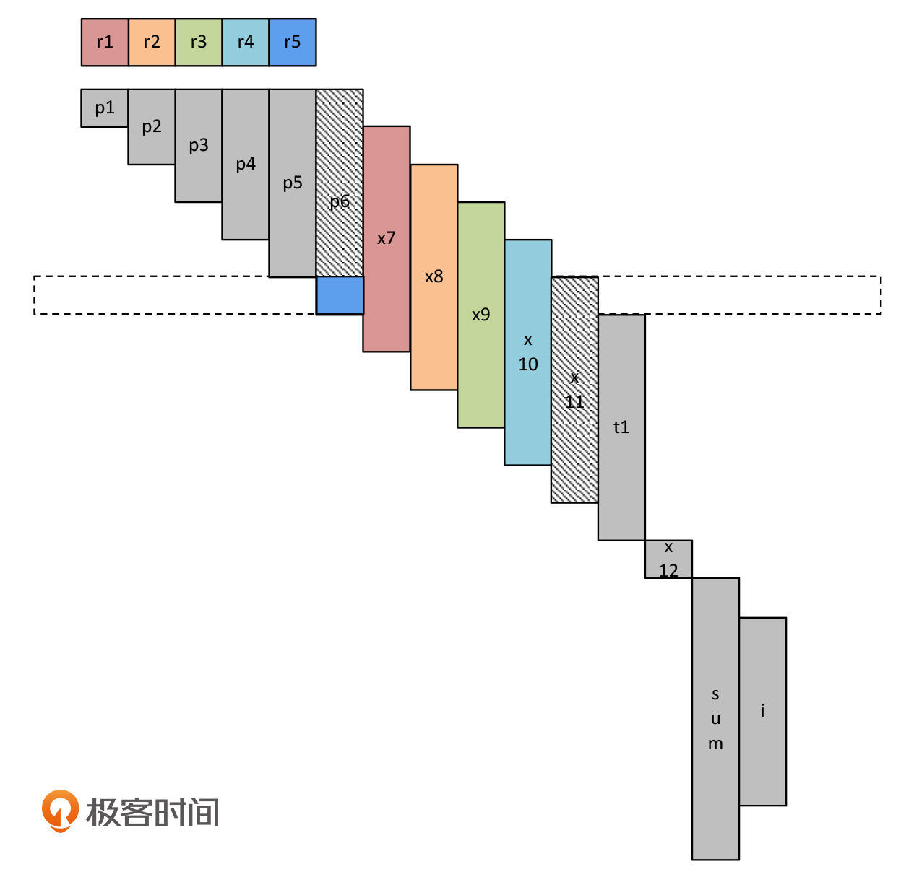

再然后，t1接替p6，占据r5寄存器。

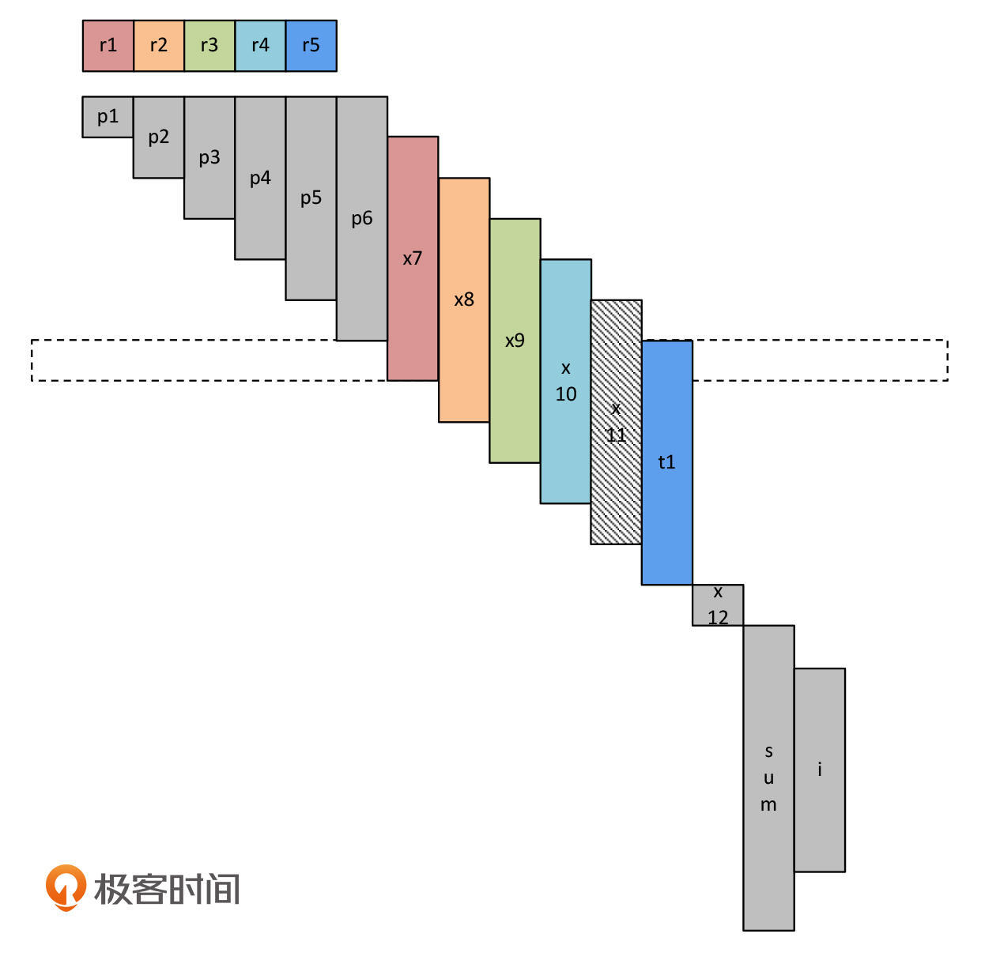

接下来，和前面一样，在执行t1+=x11之前，我们要把x11装载到内存中。这个时候，其实我们已经有很多空闲的寄存器可用了，我们选择了r1。

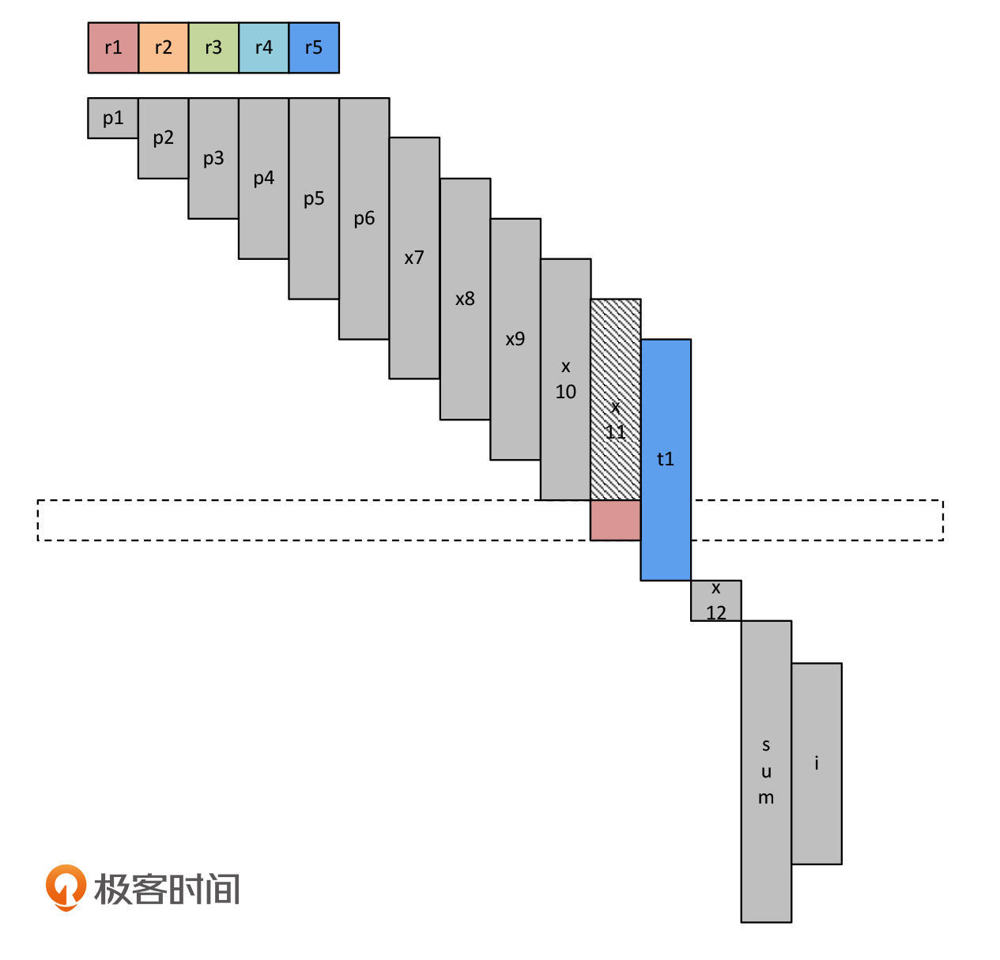

到这里，我们把寄存器溢出的场景也分析完了。这两个分析过程，我主要是用图来直观地表示的。所以，你要多看几遍这些图，体会寄存器分配的过程，就能够充分理解线性扫描算法了。

通过这个线性扫描算法，我们已经解决了我们上节课初级寄存器算法的第一点不足，也就是我们已经把参数和本地变量都放在寄存器上去访问了，优化了我们生成的本地代码的性能。而第二点的不足呢，我们也会在实现线性扫描算法的过程中，顺道解决，这就要归功于我们接下来要学习的变量活跃性分析。

从前面这个例子你也能看出来，**实现线性扫描算法的关键，是要知道每个变量的生存期**。要知道这个，我们就需要进行**变量活跃性分析**了。

变量活跃性分析是**数据流分析框架**的应用之一，而数据流分析框架，是编译器中使用的最重要的技术之一，在语义分析、代码优化等多个领域都会被用到。我们借变量活跃性分析的例子，来熟悉一下这种分析方法。

## 变量活跃性分析

我们还是针对我们前面的示例程序，来演示一下怎么来做变量活跃性分析。

下面这张图，是我针对这个程序整理的变量活跃性分析图。每一行语句的前方都有一个集合，这个集合中的元素指的是当前位置活跃的变量。也就是说，在这个位置上，我们要给这些变量分配寄存器。而其他变量，由于它们并不活跃，所以也就不需要占据寄存器了。

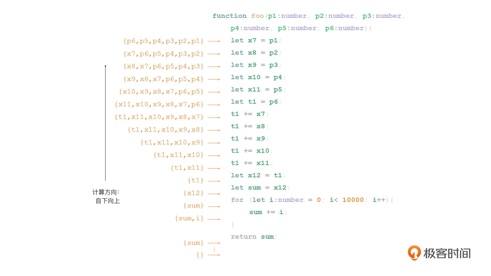

现在我们直接来看具体的分析过程。不同的数据流分析，它的分析方向是不同的。有的是自上向下分析，有的是自下向上分析，变量活跃性分析是就是从下往上进行的。

一开始，活跃变量的集合是一个空集。

然后算法遇到最底下的一条语句，也就是return语句。由于return语句使用了sum变量，所以这个时候sum变量必须是活跃的。所以现在我们活跃变量的集合就有了第一个元素：sum。

再往前一句，由于“sum+=i”中用到了i，所以i也被加入了活跃变量集合。

往前到for语句之前，由于i是在for语句中声明的，在此之前并没有i，所以我们就可以从活跃变量集合中去掉i了。

然后我们继续往前到“let sum = x12”这一句。由于这个语句用到了x12，所以集合里就加入x12。但sum变量是在这个语句中声明的，在此之前没有sum，所以我们再从集合中去掉sum。

接下来，我们继续依次类推进行活跃变量集合的计算就行了。计算规则是：**只要发现某个语句用到了某个变量，就把这个变量加入集合；只要发现了某个变量的声明语句，那就从集合中去掉这个变量。**

这样，一直到函数的开头位置，你会看到，我们活跃变量的集合剩下了foo函数的6个参数。

通过这样的变量活跃性分析，我们就能够准确地知道每个变量的生存期，也就可以据此进行寄存器的分配了。

在做好了所有的算法梳理以后，我们就可以动手进行实现了。实现过程的技术细节，我们放在了下一节课里。

## 课程小结

今天这节课，我们讲解了实现一个优化的寄存器分配算法的原理。你要记住几个知识点：

寄存器分配的原理是只要两个变量的生存期不重叠，那就可以共享寄存器。而线性扫描算法，也特别简单，就是每次在需要一个寄存器的时候，只要线性扫描所有寄存器，看看哪个寄存器上的变量的生存期已经结束了，就可以分配给新的变量。

不过，寄存器分配算法是有可能遇到寄存器数量不够的情况的。这个时候，算法就会选择一个变量，暂时把它溢出到内存，等遇到使用这个变量的语句的时候，再把它从内存里装载到寄存器就可以了。

接着，我们发现，寄存器分配算法的前提，是要进行变量活跃性分析，这里需要用到数据流分析框架。我们会从下到上针对每一条语句做分析。每一次分析，都往活跃变量集合里增加或者减少元素：遇到使用某个变量的语句，就把它加到集合里；遇到声明某个变量的语句，就把它从集合里去除。

怎么样？寄存器分配算法看上去也挺简单嘛！在理解了算法的原理之后，你再做技术实现上就会有清晰的思路了。不过，在实现过程中，要注意的技术细节还是蛮多的，所以我们就放在下一节课仔细讨论吧。

## 思考题

如果你学过线性规划等最优化理论的课程，你会意识到，线性扫描算法得到的结果可能并不是最优解。你能举出一个例子来说明一下这个潜在的缺陷吗？那又有哪些算法思路会帮助你得到最优解或较优解呢？它们的算法复杂性是怎样的呢？

希望你思考一下，也欢迎你在留言区分享自己想法，这会让你对寄存器分配算法的实质，有更深入的理解。我是宫文学，我们下节课见。