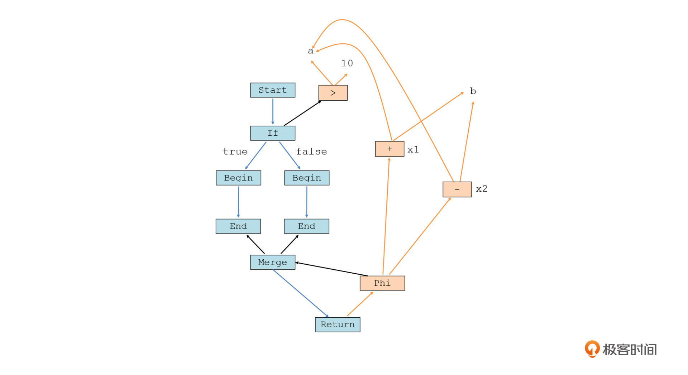

---
date: "2019-06-23"
---  
      
# 37 | 从AST到IR：体会数据流和控制流思维
你好，我是宫文学。

在上一节课，我们已经初步认识了基于图的IR。那接下来，我们就直接动手来实现它，这需要我们修改之前的编译程序，基于AST来生成IR，然后再基于IR生成汇编代码。

过去，我们语言的编译器只有前端和后端。加上这种中间的IR来过渡以后，我们就可以基于这个IR添加很多优化算法，形成编译器的中端。这样，我们编译器的结构也就更加完整了。

今天这节课，我先带你熟悉这个IR，让你能够以数据流和控制流的思维模式来理解程序的运行逻辑。之后，我还会带你设计IR的数据结构，并介绍HIR、MIR和LIR的概念。最后，我们再来讨论如何基于AST生成IR，从而为基于IR做优化、生成汇编代码做好铺垫。

首先，我还是以上一节课的示例程序为础，介绍一下程序是如何基于这个IR来运行的，加深你对控制流和数据流的理解。

## 理解基于图的运行逻辑

下面是上节课用到的示例程序，一个带有if语句的函数，它能够比较充分地展示数据流和控制流的特点：

```
      function foo(a:number, b:number):number{
        let x:number;
        if (a>10){
          x = a + b;
        }
        else{
          x = a - b;
        }
        return x;
      }
    

```

我们把这个程序转化成图，是这样的：

<!-- [[[read_end]]] -->



我们之前说了，这个图能够忠实地反映源代码的逻辑。那如果程序是基于这个图来解释执行的，它应该如何运行呢？我们来分析一下。

第1步，从start节点进入程序。

第2步，程序顺着控制流，遇到if节点，并且要在if节点这里产生分支。但为了确定如何产生分支，if节点需要从数据流中获取一个值，这个值是由“>”运算符节点提供的。所以，“a>10”这个表达式，必须要在if节点之前运行完毕，来产生if节点需要的值。

第3步，我们假设a>10返回的是true，那么控制流就会走最左边的分支，也就是if块，直到这个块运行结束。而如果返回的是false，那么就走右边的分支，也就是else块，直到这个块运行结束。这里，if块和else块都是以Begin节点开始，以End节点结束。如果块中有if或for循环这样导致控制流变化的语句，那么它们对应的控制流就会出现在Begin和End之间，作为子图。

第4步，在if块或else执行结束后，控制流又会汇聚到一起。所以图中这里就出现了一个Merge节点。这个节点把两个分支的End节点作为输入，这样我们就能知道实际程序执行的时候，是从哪个分支过来的。

第5步，控制流到达Return节点。Return节点需要返回x的值，所以这就要求数据流必须在Return之前把x的值提供出来。那到底是x1的值，还是x2的值呢？这需要由Phi节点来确定。而Phi节点会从控制流的Merge节点获取控制流路径的信息，决定到底采用x1还是x2。

最后，return语句会把所获取的x值返回，程序结束。

在我这个叙述过程中，你有没有发现一个重要的特点，就是**程序的控制流和数据流是相对独立的，只是在个别地方有交互**。这跟我们平常写程序的思维方式是很不一样的。在写程序的时候，我们是把数据流与控制流混合在一起的，不加以区分。

比如，针对当前我们的示例程序，我们的源代码里一个if语句，然后在if块和else块中分别写一些代码。这似乎意味着，只能在进入if块的时候，才运行x1=a+b的代码，而在进入else块的时候，才可以运行x2=a-b的逻辑。

但如果你把数据流和控制流分开来思考，你会发现，其实我们在任何时候都可以去计算x1和x2的值，只要在return语句之前计算完就行。比如说，你可以把x1和x2的计算挪到if语句前面去，相当于把程序改成下面的样子：

```
    function foo(a:number, b:number):number{
      x1 = a + b;
      x2 = a - b;
      if (a>10){
        x = x1;
      }
      else{
        x = x2;
      }
      return x;
    }
    

```

当然，针对我们现在的例子，把x1和x2提前计算并没有什么好处，反倒增加了计算量。我的用意在于说明，**其实数据流和控制流之间可以不必耦合得那么紧，可以相对独立。**

我们可以用这种思想再来分析下我们上节课提到的几个优化技术。

比如，我们上一节课曾经提到过“循环无关变量外提”的优化技术。而基于当前的IR，我们马上就会识别出，其实与这个变量有关的数据流，是跟循环语句的控制流没有依赖关系的，所以自然就可以提到外面去。

如果采用CFG的数据结构，我们需要把代码从一个基本块挪到另一个基本块，这个过程比较复杂。而采用基于图的IR，我们只需要在生成代码的时候，再决定把数据流对应的代码生成到哪个基本块里就好了。

其实，虽然llvm采用了CFG表示大的控制流逻辑，但它同时也采用了use-def链来表示程序中的数据流逻辑，因为优化算法需要同时用到这两方面的信息。但相对来说，我们现在的IR让控制流和数据流更大程度地解耦了，带来了算法上的便利。

而且，这个例子中的数据流节点，并不受限于if语句的控制流，在任何时候你都可以计算它，可以灵活地调整执行的先后顺序，这个时候我们说它们是浮动（floating）节点。它们的计算顺序只受输入关系的限制。

我们后面还会遇到一些情况，比如数据流的某些节点没有那么自由，它们不可以随意改变计算顺序，那我们说这些节点是固定的。

好了，你现在已经对基于IR的运行逻辑有了一定的理解了。那接下来，我们就开始动手做实现吧！首先，我们要用TypScript设计一些数据结构，来表示这种基于图的IR，就像我们之前设计了一些数据结构来表示AST那样。

## 设计IR的数据结构

要表达这种基于图的IR，重点就是**设计各种各样的节点**。而节点之间的连线呢，则是**通过节点之间的互相引用来表示**的。

我先设计了一个叫IRNode的基类，其他的节点都是从这个基类派生的。

```
    //基类
    export abstract class IRNode{
    }
    

```

IRNode有两个直接的子类，DataNode和ControlNode。

DataNode是所有数据节点的基类。DataNode可能从别的DataNode获得输入，也会成为其他DataNode的输入，这样就构成了use-def链。这个链是双向的连接，DataNode的子类只需要维护自己的input的一边，uses是被使用到它的其他节点在构造函数里自动维护的。

```
    //数据流节点的基类
    export abstract class DataNode extends IRNode{
        //该节点的输入
        abstract get inputs():DataNode[];
    
        //使用该节点的节点，形成use-def链,自动维护
        uses:DataNode[] = []; 
    
        //数据类型
        theType:Type;   
    }
    

```

DataNode的一个子类是二元运算节点。在这里，你可以看看其中的uses是如何被自动维护的：

```
    //二元运算节点
    export class BiOpNode extends DataNode{
        left:DataNode;
        right:DataNode;
    
        constructor(left:DataNode, right:DataNode, theType:Type){
            super(theType);
            this.left = left;
            this.right = right;
    
            //自动建立双向的use-def链
            left.uses.push(this);
            right.uses.push(this);
        }
    
        get inputs():DataNode[]{
            return [this.left, this.right];
        }
    }
    

```

IRNode的另一个子类ControlNode，是各种控制节点的共同基类。控制节点可能有多个后序节点，但最多只能有一个前序节点。

```
    //控制流节点的基类
    export abstract class ControlNode extends IRNode{
         //后序节点列表
         abstract get successors():IRNode[];
    
         //前序节点列表,自动维护
         predecessors:IRNode[] = []; 
    }
    

```

在ControlNode的子类中，我们只需要维护自己的后序节点，形成正向的链接就好了。而前序节点是被自动维护的，形成反向的链接。这样，前后两个节点之间就有了双向链接。

ControlNode的一个子类是IfNode。它有两个后序节点，并且还需要一个来自DataNode的输入作为if的条件。

```
    //if节点
    export class IfNode extends ControlNode{
        thenBranch:Begin;
        elseBranch:Begin;
        condition:DataNode;  //If条件
        
        constructor(condition:DataNode, thenBranch:Begin, elseBranch:End){
            super();
            this.condition = condition;
            this.thenBranch = thenBranch;
            this.elseBranch = elseBranch;
    
            thenBranch.predecessors.push(this);
            elseBranch.predecessors.push(this);
        }
    
        get successors():IRNode[]{
            return [this.thenBranch, this.elseBranch];
        }
    }
    

```

基于这个思路，我们可以设计出目前需要的各种IR节点，如下图所示：


这里的具体实现，你可以看[ir.ts](https://gitee.com/richard-gong/craft-a-language/blob/master/37/ir.ts)。

你看到这里，肯定会有很多的问题。你可能会问，为什么要设计出这样的节点？IR中包含哪些类型的节点，有没有什么依据呀？这些节点怎么跟AST差不多呀？那我们就来分析一下这几个IR设计的问题。

## HIR、MIR和LIR

其实，我们目前设计的IR节点，都是抽象度比较高的。换句话说，它跟AST在语义上是差不多的，只不过是换了一种表示方式而已。这种比较贴近源代码的、抽象层次比较高的IR，被叫做**HIR**。

与之相对应的另一端，是比较贴近机器实现的、容易转化成机器码或者汇编码的IR，叫做**LIR**。

我们具体说说HIR和LIR的区别，也就是说，抽象层级的差别，到底体现在哪里。

**首先，是一些控制流节点的差别**。在HIR里，你会见到像if节点这样的元素，显然这种元素来自源代码。在LIR里，像if节点这样的节点会被类似跳转指令的节点所代替。它们都是实现控制流的管理的，但一个抽象层级更高，一个更底层。

**第二，在数据节点方面也有区别。**在HIR里，我们用加减乘数这样的节点来表达运算。每个运算节点可以由两个节点来提供数据，计算结果保存到另一个节点，这样一共是3个地址。而在LIR里，有的CPU架构和指令集，比如X86的架构，是不支持三地址运算的，只能把一个数据加到另一个数据上，所以还必须进行IR的转换。

**最后，在数据类型方面也有很大差别。**高级语言中有丰富的类型系统，你可以在HIR中使用它们。但到了LIR层面，你只能使用CPU可以识别的数据类型，比如各种不同位数的整型和浮点型。但是对象、数组这些，通通都消失不见了。

通过这样的对比，你大概能够明白HIR和LIR的区别了。

那最后，位于HIR和LIR之间，还有一种叫做**MIR**。它既能让我们人类比较容易理解，又能够尽量保持对特定硬件平台的独立性。

**在传统的编译器中，我们需要分别设计HIR、MIR和LIR，然后实现依次的转换。这个过程，就叫做Lower的过程。**

在前面的课程里，我们曾经使用了一些内部的数据结构，比如Inst和Oprand来表示汇编代码，这就可以看做是很Low很Low的IR了，因为它很贴近X86架构的实现，没有什么跨硬件平台的能力。就算这样，我们仍然从中分出了两个层次。像函数调用、浮点数字面量的实现，我们一开始还是采用比较抽象的Oprand，之后再Lower到跟汇编代码能够完全一一对应的Oprand。

这里我要说明一下，基于图的IR还有另一个重要的优点，就是**我们可以用同一种数据结构来表示HIR、MIR和LIR**。它们的区别，只是体现在不同的节点类型上。在Lower的过程中，你可以用低抽象度的节点替换高抽象度的节点就行了。

好了，我们现在理解了IR设计中的抽象层次问题。那接下来，我们就要把AST翻译成IR。

## 把AST翻译成IR

我们一开始只需要把AST翻译成HIR。因为这两者在语义上是比较相似的，所以翻译的难度比较低。相比而言，我们之前直接从AST翻译成汇编代码，中间的跨度就有点大，需要处理的细节就很多。

首先，我们看最简单的情况，也就是没有if语句、for循环语句这种程序分支的情况。比如下面的代码：

```
    function foo(a:number, b:number){
        let x:number = a + b;
        let y:number = a + b;
        let z:number = x + y + 1;
    }
    

```

在这种情况下，a和b被翻译成参数节点，1被翻译成常量节点，每个表达式都被翻译成了一个运算节点，这些节点也是x、y和z三个本地变量的定义。


这里你要注意几个点。首先，本地变量都是被参数、常数和其他变量定义出来的，是数据流的中间节点。而参数和常量节点才可以是叶子节点。这是IR跟AST的一个很大的不同，因为AST中，本地变量是可以作为叶子节点的。

第二，一个运算节点可能跟多个变量相关联，比如示例程序中的a + b，就既代表了x变量，又代表了y变量。

最后，上面的示例程序中还有一个现象，就是在变量z的定义中，出现了连续的加法运算。这个时候，中间的一个+号节点并不对应某个变量的符号，这时候它相当于一个临时变量。

**接下来，我们把这个例子再复杂化一点，让变量x做了第二次赋值。这个时候，我们需要把这两个x区分开，从而让生成的IR保持SSA格式。**

```
    function foo(a:number, b:number){
        let x:number = a + b;
        let y:number = a + b;
        x = a - b;
        let z:number = x + y + 1;
    }
    

```

把x分解成x1和x2以后，这个示例程序就相当于变成了下面的样子：

```
    function foo(a:number, b:number){
        let x1:number = a + b;
        let y:number = a + b;
        let x2 = a - b;
        let z:number = x2 + y + 1;
    }
    

```

其中，变量z的定义引用的是x2，跟x1没有关系。所以说，在直线式运行的代码中，我们能很容易地对同一个变量的多个分身进行区分。我们总是采用最后一个分身的值。

不过，当存在控制流的分支的时候，要确定采用哪个分身的值，就没这么简单了，这也是**Phi运算**要发挥作用的时候。

现在我们就来讨论一下如何把if语句转化成IR。我们还是用这节课一开头的例子，改成SSA格式以后大约相当于下面的伪代码：

```
    function foo(a:number, b:number):number{
      let x1:number;
      let x2:number;
      if (a>10){
        x1 = a + b;
      }
      else{
        x2 = a - b;
      }
      let x = phi(which-if-branch,x1,x2);  //根据if分支来确定使用x1还是x2。
      return x;
    }
    

```

这里，我用x1和x2代替了原来的x，在if语句之后，用了一个Phi运算来得到最后x的值。

if语句的控制流部分和条件部分，我们可以根据这节课一开头我们的分析，生成相应的节点就好了。这里涉及的控制节点包括IfNode、BeginNode、EndNode和MergeNode。在IfNode和MergeNode这里，要跟数据流建立连接。

这里的具体实现，你可以参考[ir.ts](https://gitee.com/richard-gong/craft-a-language/blob/master/37/ir.ts)中的源代码。另外，你还可以运行node play example\_ir.ts \--dumpIR命令，这会把ir输出成.dot文件。.dot文件可以用graphviz软件打开查看，你能看到编译生成的ir图。这里其实还有更简单的办法，就是直接在visual studio code中打开，并用预览模式查看图形。

这样，我们就把if语句分析完了。下一节，我会继续带你分析一个更复杂一点的例子，就是for循环语句，带你更加深入的掌握生成IR的思路，从而也能够更加洞察这种IR的内在逻辑。

## 课程小结

今天课程的新内容也不少。我梳理一下其中的要点，希望你能记住：

首先，在基于图的IR中，控制流和数据流是相对独立的，耦合度较低。数据流节点往往是浮动的，并不像源代码里那样被限制在某个基本块中。这个特征有利于代码在不同的基本块中的迁移，实现一些优化效果。

第二，IR的设计中，数据节点要保存输入信息，形成自己的定义。同时，数据节点也会被自动维护该节点使用信息，也就是自己构成了哪些其他变量的定义，从而形成了双向的use-def链。而控制节点则要保存自己的后序节点信息，它的前序节点会被自动维护，这样也就构成了可以双向导航的链。在当前的设计方案中，每个控制节点最多只能有一个前序节点。

第三，IR可以划分为HIR、MIR和LIR，它们的抽象层次越来越低，从贴近高级语言，逐步Lower到贴近CPU架构。抽象层次体现在使用的节点的类型和数据类型等方面。基于图的IR的有一个优点，就是它能够用同一个数据结构，承载不同抽象层次的IR，只需要我们把节点逐步替换就行。

最后，在把AST翻译成IR的过程中，你要体会出AST和基于图的IR的不同之处。包括本地变量不会作为端点出现，必然是被其他节点定义出来的。再比如，一个节点可能对应AST中的两个变量。

## 思考题

我们今天讲到了HIR、MIR和LIR的区别。那么，我这里有三个使用IR的场景，你能帮我判断一下它应该属于哪类IR吗？

* 场景1：访问对象mammal的属性weight；
* 场景2：根据对象引用，加上一个偏移量，然后获取该地址的数值；
* 场景3：根据对象在x86-64架构下的地址，加上一个64位的偏移量，获取这个地址下的双精度浮点数值。

欢迎你把这节课分享给更多感兴趣的朋友。我是宫文学，我们下节课见。

## 资源链接

[今天的示例代码目录在这里！](https://gitee.com/richard-gong/craft-a-language/tree/master/37)