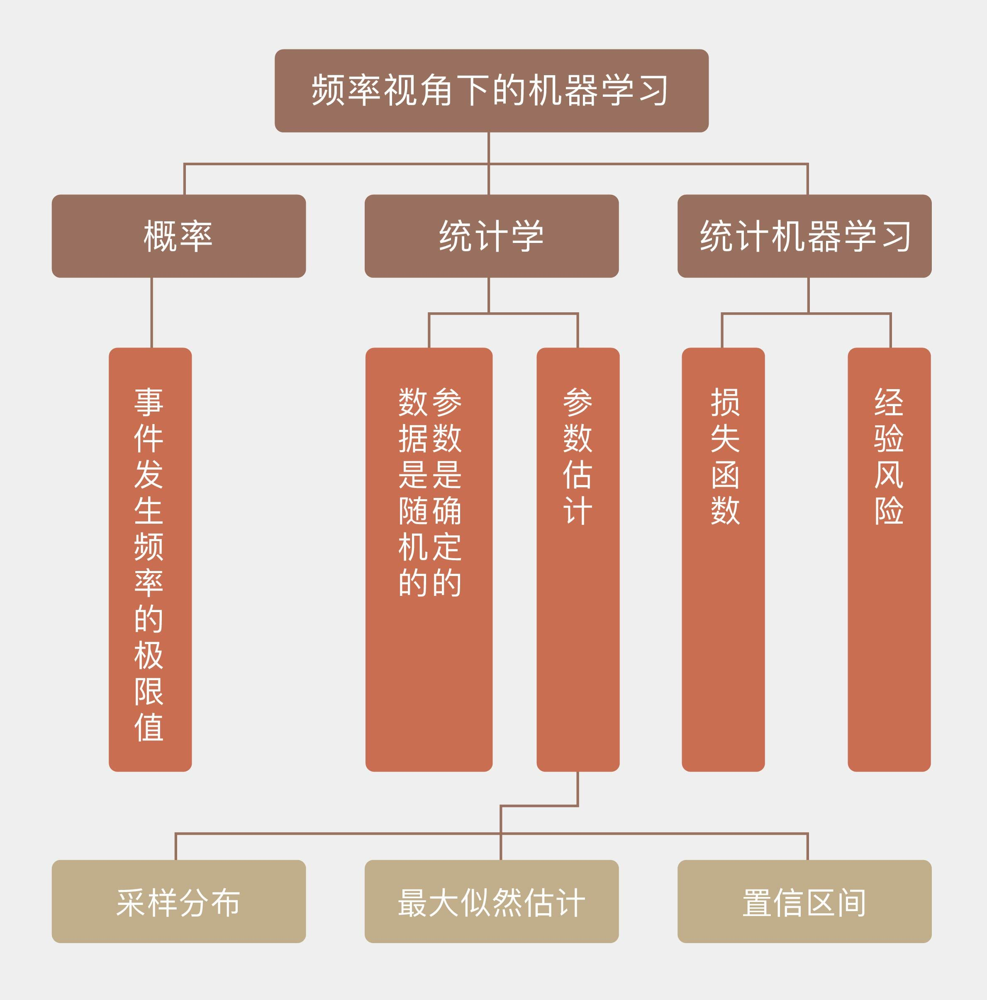

---
date: "2019-06-23"
---  
      
# 01 | 频率视角下的机器学习
在“人工智能基础课”中我曾提到，“概率”（probability）这个基本概念存在着两种解读方式，它们分别对应着**概率的频率学派**（Frequentist）和**贝叶斯学派**（Bayesian）。而解读方式上的差异也延伸到了以概率为基础的其他学科，尤其是机器学习之中。

根据机器学习领域的元老汤姆·米切尔（Tom M. Mitchell）的定义，机器学习（machine learning）是一门研究通过计算的手段利用经验来改善系统自身性能的学科。

现如今，几乎所有的经验都以数据的形式出现，因而机器学习的任务也就变成了基于已知数据构造概率模型，反过来再运用概率模型对未知数据进行预测与分析。如此一来，关于概率的不同认识无疑会影响到对模型的构建与解释。

可在概率的应用上，频率学派和贝叶斯学派的思路呈现出天壤之别，这种思维上的差异也让两派的拥护者势同水火，都视另一方为异端邪说。正因如此，在这个专栏的前两篇文章中，我将首先和你理清频率学派与贝叶斯学派对概率的不同观点，为接下来**从不同的角度理解机器学习的各种算法**打下扎实的基础。

下面这个流传已久的笑话，不经意间对频率学派和贝叶斯学派的区别给出了形象的解释：有个病人找医生看病，医生检查之后对他说：“你这病说得上是九死一生，但多亏到我这里来看了。不瞒你说，在你之前我已经看了九个得一同样病的患者，结果他们都死了，那你这第十个就一定能看得好啦，妥妥的！”

如果病人脑子没事，肯定就从这个糊涂医生那里跑了。显然，医生在看待概率时秉持的是频率主义的观点，但却是个蹩脚的频率主义者。之所以说他是频率主义者，是因为他对九死一生的理解就是十次手术九次失败一次成功；说他蹩脚则是因为他不懂频率学派的基础，区区九个病人就让他自以为掌握了生死的密码。

归根到底，**频率学派口中的概率表示的是事件发生频率的极限值**，它只有在无限次的独立重复试验之下才有绝对的精确意义。在上面的例子中，如果非要从频率的角度解释“九死一生”的话，这个10\%的概率只有在样本容量为无穷大时才有意义。因此即使“九死一生”的概率的确存在，它也不能确保第十个病人的康复。

**在频率学派眼中，当重复试验的次数趋近于无穷大时，事件发生的频率会收敛到真实的概率之上。这种观点背后暗含了一个前提，那就是概率是一个确定的值，并不会受单次观察结果的影响。**

将一枚均匀的硬币抛掷10次，结果可能是10次都是正面，也可能10次都是反面，写成频率的话就对应着0\%和100\%这两个极端，代表着最大范围的波动。可如果将抛掷次数增加到100次，出现正面的次数依然会发生变化，但波动的范围更可能会收缩到40\%到60\%之间。再将抛掷次数增加到1000，10000的话，频率波动的现象不会消失，但波动的范围会进一步收缩到越来越小的区间之内。

基于以上的逻辑，把根据频率计算概率的过程反转过来，就是频率统计估计参数的过程。**频率统计理论的核心在于认定待估计的参数是固定不变的常量，讨论参数的概率分布是没有意义的；而用来估计参数的数据是随机的变量，每个数据都是参数支配下一次独立重复试验的结果。由于参数本身是确定的，那频率的波动就并非来源于参数本身的不确定性，而是由有限次观察造成的干扰而导致**。

这可以从两个角度来解释：一方面，根据这些不精确的数据就可以对未知参数的精确取值做出有效的推断；另一方面，数据中包含的只是关于参数不完全的信息，所以从样本估计整体就必然会产生误差。

<!-- [[[read_end]]] -->

统计学的核⼼任务之一是根据从总体中抽取出的样本，也就是数据来估计未知的总体参数。参数的最优估计可以通过样本数据的分布，也就是**采样分布**（sampling distribution）来求解，由于频率统计将数据看作随机变量，所以计算采样分布是没有问题的。确定采样分布之后，参数估计可以等效成一个最优化的问题，而频率统计最常使用的最优化方法，就是**最大似然估计**（maximum likelihood estimation）。

**回忆一下最大似然估计，它的目标是让似然概率最大化，也就是固定参数的前提之下，数据出现的条件概率最大化**。这是频率学派估计参数的基本出发点：一组数据之所以能够在单次试验中出现，是因为它出现的可能性最大。而参数估计的过程就是赋予观测数据最大似然概率的过程。这可以通过下面这个简单的例子来说明：

“如果观测到的数据\$\\theta\_i\$是真实值\$\\theta\$和方差为\$\\sigma \^ 2\$，但形式未知的噪声\$e\_i\$的叠加，那么如何得出\$\\theta\$的最优估计值？”

要用最大似然估计解决这个问题，首先就要对似然概率进行建模，建模中的一个重要假设是假定未知形式的噪声满足高斯分布。这不仅在统计学中，在其他学科里也是一个常用的假设。

从理论上说，在功率有限的条件下，高斯噪声的信源熵最大，因而带来的不确定性也就越大，换句话说，这是最恶劣的噪声；从实践上说，真实的噪声通常来源于多个独立的物理过程，都具有不同的概率分布，中心极限定理告诉我们，当噪声源的数目越来越多时，它们的叠加就趋近于高斯分布，因而高斯噪声就是对真实情况的一个合理的模拟。

在高斯噪声的假设下，每个观测数据\$\\theta\_i\$所满足的概率分布就可以写成

\$\$ p\(\\theta\_i | \\theta\) = \\dfrac\{1\}\{\\sqrt\{2\\pi \\sigma \^ 2\}\} \\exp \[-\\dfrac\{\(\\theta\_i \- \\theta\) \^ 2\}\{2\\sigma \^ 2\}\]\$\$

这实际上就是采样分布。计算所有数据的概率分布的乘积，得到的就是似然函数（likelihood function）

\$\$ L\(\\boldsymbol\{\\theta\} | \\theta\) = \\prod\\limits\_\{i = 1\}\^N p\(\\theta\_i | \\theta\)\$\$

求解似然函数的对数，就可以将乘法运算转换为加法运算

\$\$ \\log L = \-\\dfrac\{1\}\{2\} \\sum\\limits\_\{i = 1\}\^N \[\\log \(2\\pi \\sigma \^ 2\) + \\dfrac\{\(\\theta\_i \- \\theta\) \^ 2\}\{2\\sigma \^ 2\}\]\$\$

令对数似然函数的导数为0，就求出了使似然概率最大的最优估计

\$\$ \\hat \\theta = \\dfrac\{1\}\{N\} \\sum\\limits\_\{i = 1\}\^N \\theta\_i \$\$

不知道你有没有在上面的公式中发现一个问题：虽然真实值\$\\theta\$是个固定值，但估计值\$\\hat \\theta\$却是数据的函数，因而也是个随机变量。

这一点其实很好理解，因为估计值本质上是利用数据构造出来的函数，既然数据是随机分布的，估计值肯定也是随机的。这意味着如果每次估计使用的数据不同，得到的估计值也不会相同。那么如何来度量作为随机变量的估计值和作为客观常量的真实值之间的偏差呢？**置信区间**（confidence interval）就是频率学派给出的答案。

置信区间的意义在于划定了真值的取值范围，真实的参数会以一定的概率\$\\alpha\$落入根据样本计算出的置信区间之内。当然，这里的概率还是要从频率的角度来解读：从同一个总体中进行100次采样可以得到100个不同的样本，根据这100个不同的样本又可以计算出100个不同的置信区间。在这么多个置信区间之中，包含真值的有多少个呢？\$100 \\times \\alpha\$个，剩下的\$100 \\times \(1 \- \\alpha\)\$个置信区间就把真值漏掉了。这有点像乱枪打鸟：每一枪都乱打一梭子，打了100枪之后统计战果，发现打下来\$100 \\times \\alpha\$只鸟。如果把参数的真实值比喻成鸟，那么每一枪轰出的一梭子子弹就是置信区间。显然，置信区间的上下界和估计值一样，也是随机变量。

总结起来，**频率主义解决统计问题的基本思路如下：参数是确定的，数据是随机的，利用随机的数据推断确定的参数，得到的结果也是随机的。**

这种思路直接把可能的参数空间压缩成为一个点：参数本身可能满足这样或者那样的概率分布，但一旦试验的条件确定，参数表现出来的就是一个固定的取值，让所有的概率分布都失去了意义。这就像说即使上帝真的掷骰子，但从骰子脱手那一刻起，它的点数就不再受上帝的控制，也就变成了确定不变的取值。频率主义者关注的就是这个真实存在的唯一参数，通过计算它对数据的影响来实现估计。

**将频率主义“参数确定，数据随机”的思路应用在机器学习当中，得到的就是统计机器学习**（statistical learning）。统计机器学习的做法是通过对给定的指标（比如似然函数或者均方误差）进行最优化，来估计模型中参数的取值，估计时并不考虑参数的不确定性，也就是不考虑未知参数的先验分布。**和参数相关的信息全部来源于数据，输出的则是未知参数唯一的估计结果，这是统计机器学习的核心特征**。

受噪声和干扰的影响，观测数据并不是未知参数的准确反映，因此如何衡量估计结果的精确程度就成为统计机器学习中的一个关键问题。**损失函数**（loss function）直接定义了模型性能的度量方式，其数学期望被称为**风险**（risk），风险最小化就是参数估计的依据和准则。但风险的计算并不能一蹴而就：估计最优参数需要计算风险，计算风险时需要在数据的概率分布上对损失函数进行积分，可表示数据的分布又需要依赖未知参数的精确取值。这就给频率主义出了一个无解的问题：风险函数是没有办法精确求解的。

为了解决这个问题，统计机器学习引入了**经验风险**（empirical risk），**用训练数据的经验分布替换掉原始表达式中数据的真实分布**，借此将风险函数转化成了可计算的数值。在真实的学习算法中，无论是分类问题中的误分类率，还是回归问题的中的均方误差，都是经验风险的实例，而所谓的最优模型也就是使经验风险最小化（empirical risk minimization）的那个模型。

今天我和你分享了频率学派对概率、统计学和机器学习的认识方式，其要点如下：

* 频率学派认为概率是随机事件发生频率的极限值；

* 频率学派执行参数估计时，视参数为确定取值，视数据为随机变量；

* 频率学派主要使用最大似然估计法，让数据在给定参数下的似然概率最大化；

* 频率学派对应机器学习中的统计学习，以经验风险最小化作为模型选择的准则。

有了这些理论之后，如何在实际问题中应用频率主义的统计学呢？这里有一个非常好的例子，来源于Nature Biotechnology第22卷第9期上的论文《什么是贝叶斯统计学》（What is Bayesian statistics）。

在这个例子中，Alice和Bob在进行一场赌局，先得到6分者获胜。判断得分的方式有一些特别：在赌局开始之前，荷官在赌桌上扔一个小球，在这个球停止的位置做个标记。显然，这个标记的位置是随机的。赌局开始后，荷官继续扔球，如果球停到标记的左侧，则Alice得分；反之停到标记右侧，则Bob得分，这就是赌局的计分规则。那么问题来了：在这样的规则下，Alice现在以5:3领先Bob，那么Bob反败为胜的概率是多大呢？

要计算Bob获胜的概率，必须要借助一个参数，那就是Alice得分的概率，不妨将它设为\$p\$，那么Bob得分的概率就是\$1 \- p\$。概率\$p\$取决于标记在赌桌上的位置，由于位置本身是随机的，\$p\$也就在\[0, 1\]上满足均匀分布。按照频率主义的观点，在这一场赌局中，\$p\$有固定的取值，并可以通过已有的得分结果来估计。估计出\$p\$后就可以进一步计算Bob获胜的概率。这个问题就作为今天的思考题目，你可以计算一下。

但是，这个问题并没有到此为止。如果跳出频率主义的限制，把\$p\$的概率分布引入到计算之中，又会得到什么样的结果呢？

请加以思考并发表你的观点。

