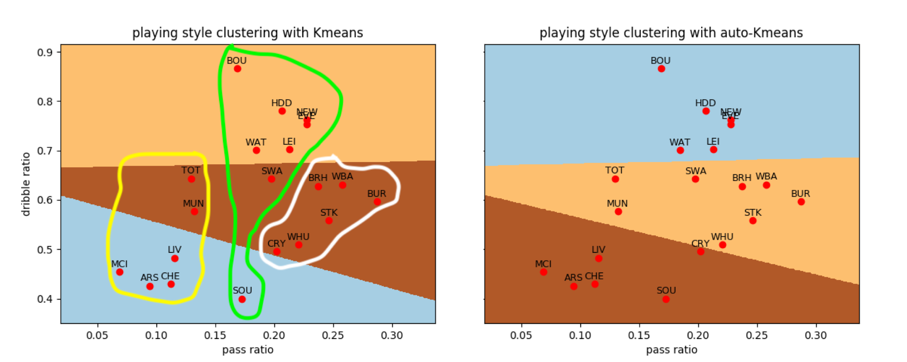
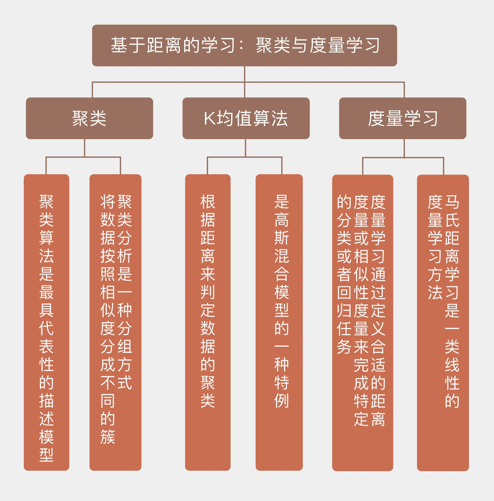

---
date: "2019-06-23"
---  
      
# 20 | 基于距离的学习：聚类与度量学习
截至目前，我所介绍的模型都属于监督学习范畴，它们处理具有标签的输入数据，给出意义明确的输出，回归模型输出的是连续的回归值，分类模型输出的是离散的类别标签，这些模型都属于**预测模型**（predictive model）。

另一类模型则隶属于无监督学习，这类模型学习没有标签的数据，其作用也不是计算类别或回归值，而是要揭示关于数据隐藏结构的一些规律，因此也被称为**描述模型**（descriptive model）。**聚类算法就是最具代表性的描述模型**。

聚类分析（cluster analysis）实际上是一种分组方式，它使每一组中的组内对象的相似度都高于组间对象的相似度，分出来的每个组都是一个簇（cluster）。由于相似度是聚类的依据，作为相似度主要度量方式之一的距离就在聚类中发挥着重要作用。

在“人工智能基础课”中，我曾介绍过四种主要的聚类算法，你可以结合下面的要点图回忆一下。除了以概率分布为基础的分布聚类以外，其他三类聚类算法都涉及对距离的使用，而其中最典型的就是\$k\$均值所代表的原型聚类算法。

[《机器学习 | 物以类聚，人以群分：聚类分析》](https://time.geekbang.org/column/article/2196)

理解\$k\$均值算法的基础是理解它对距离的使用方式。前面介绍的\$k\$近邻算法其实也用到了距离，近邻的选择就是以距离为依据的。但近邻点是以内收的形式影响未知的数据，所有近邻点按照一定的规则共同决定处于中心的未知数据的类别。如果将这种影响的方式调转方向，让处于中心的样本作为原型（prototype），像一个小太阳一样用万有引力牵引着周围的其他样本，那么其他样本就会像卫星一样被吸附在原型周围，共同构成一个星系，也就是簇。

<!-- [[[read_end]]] -->

和万有引力类似，\$k\$均值算法中定义的相似度也与距离成负相关关系，样本离原型的距离越小，两者之间的引力越大，相似度也会越高。但和天文学中的星系不同的是，\$k\$均值算法中簇的中心不会固定不变，而是要动态变化。

如果一个样本离原型太远的话，那引力就可能会减弱到让这个样本被另一个原型吸走，转移到另一个簇当中。簇内样本的流入流出会让簇的中心发生改变，进而影响不同簇之间的动态结构。好在动态结构最终会达到平衡，当所有样本到其所属簇中心的平方误差最小时，模型就会达到稳定下来。

如果聚类的任务是将\$N\$个数据点聚类成为\$K\$个簇，那它的目标函数就可以写成

\$\$ J = \\sum\\limits\_\{n = 1\}\^N \\sum\\limits\_\{k = 1\}\^K r\_\{nk\} || x\_n \- \\mu\_k || \^ 2 \$\$

其中\$x\_n\$是数据点，\$\\mu\_k\$是第k个簇的中心，也就是簇中所有数据点的均值，\$r\_\{nk\}\$是数据点和簇之间的关系：当\$x\_n\$被归类到第\$k\$个簇时为1，否则为0。

在\$\\mu\_k\$确定的前提下，将数据点\$x\_n\$归类到离它最近的那个中心\$\\mu\_k\$就能让\$J\$取到最小值，这时的\$r\_\{nk\}\$就是最优的。

确定所有的\$r\_\{nk\}\$后，利用求导可以进一步确定\$\\mu\_k\$的最优值，其表达式为

\$\$ \\mu\_k = \\dfrac\{\\sum\_n r\_\{nk\}x\_n\}\{\\sum\_n r\_\{nk\}\} \$\$

也就是当前簇中所有数据点的均值。由于\$k\$均值本身是个NP难问题，所以上面的算法并不能够保证找到全局最小值，很有可能会收敛到局部的极小值上。

根据上面的流程可以总结出\$k\$均值算法的步骤。

首先从数据集中随机选取\$k\$个样本作为\$k\$个簇各自的中心，接下来对其余样本分别计算它们到这\$k\$个中心的距离，并将样本划分到离它最近的中心所对应的簇中。当所有样本的聚类归属都确定后，再计算每个簇中所有样本的算术平均数，将结果作为更新的聚类中心，并将所有样本按照\$k\$个新的中心重新聚类。这样，“取平均-重新计算中心-重新聚类”的过程将不断迭代，直到聚类结果不再变化为止。

\$k\$均值算法的运行流程（图片来自维基百科）

下面的例子是利用\$k\$均值算法对英超球队的比赛风格进行分类。这里使用的数据集是20支英超球队在2017-18赛季的场均数据，用来聚类的两个指标分别是长传数目与短传数目的比值，以及不成功突破数目和成功突破数目的比值。

根据以往对英超球队的理解，我将聚类的数目设为3类，初始聚类中心设定为阿森纳（Arsenal）、埃弗顿（Everton）和斯托克城（Stoke）三支球队的指标。

阿尔塞纳·温格治下的阿森纳一直以来都是英超中一股细腻的技术清流，相比之下，号称“天空之城”的斯托克城崇尚高举高打，称得上是泥石流了。而埃弗顿作为中游球队的代表，可以看成是弱化版技术流和加强版身体流的组合。应该说，以这三只球队作为聚类参考是有足够的代表性的。

利用Scikit-learn库中的cluster模块的Kmeans类可以方便地计算出聚类的结果，如下面左图所示。如果你经常看球，就会发现聚类的结果差强人意：近年崛起的托特纳姆热刺（Tottenham Hotspurs）走的也是传控路线，却被划到了硬桥硬马的斯托克城一类；类似的情形也发生在自作孽不可活的典型中游队斯旺西城（Swansea City）身上。

图中右侧显示的是让算法随机选择3个中心的聚类结果，它和左侧的结果几乎完全一致，只是在水晶宫（Crystal Palace）一队上存在不同，这说明3个初始种子的选择比较准确。

英超球队比赛风格的聚类结果，左图为预设初始中心的结果，右侧为随机选择初始中心的结果

从贝叶斯的角度看，\$k\$均值算法是**高斯混合模型**（Gaussian mixture model）的一个特例。

顾名思义，混合模型将数据总体看作来自若干个高斯分布，也就是若干个成分（component）的数据的集合，\$k\$均值算法聚出来的每一个簇都对应着一个未知参数的高斯分布。所有单个高斯分布的概率密度线性组合在一起，就是整体分布的概率密度，可以表示为

\$\$ p\(\{\\bf x\}\) = \\sum\\limits\_\{k = 1\}\^K \\pi\_k N\(\{\\bf x\} | \{\\boldsymbol \\mu\}\_k, \{\\boldsymbol \\Sigma\}\_k\) \$\$

这个式子里的\$\\pi\_k\$是混合系数（mixing coefficient），表示的是每个单独的高斯分布在总体中的权重，后面的\$N\(\{\\bf x\} | \{\\boldsymbol \\mu\}\_k, \{\\boldsymbol \\Sigma\}\_k\)\$则是在被选中的高斯分布中，数据\$\\bf x\$取值的概率。

判断数据\$\\bf x\$属于哪个簇实际上就是要找到它来自哪个高斯分布，而归属于第\$k\$个簇，也就是来自于第\$k\$个高斯分布的概率可以用贝叶斯定理表示为

\$\$ \\gamma\(z\_k\) = \\dfrac\{\\pi\_k N\(\{\\bf x\} | \{\\boldsymbol \\mu\}\_k, \{\\boldsymbol \\Sigma\}\_k\)\}\{\\sum\\limits\_\{j = 1\}\^K \\pi\_j N\(\{\\bf x\} | \{\\boldsymbol \\mu\}\_j, \{\\boldsymbol \\Sigma\}\_j\)\} \$\$

这里的\$\\gamma\(z\_k\)\$可以形象地解释成第\$k\$个高斯分布在解释观测值\$\\bf x\$时需要承担的“责任”，其中的\$z\_k\$是个隐变量（latent variable）。

不难发现，根据这个式子计算出的每个\$\\gamma\_k\$都不等于0，这体现出高斯混合模型和\$k\$均值算法的一个区别：\$k\$均值输出的是非此即彼的聚类结果，属于“硬”聚类（hard assignment）的方法；高斯混合模型则会输出数据归属到每个聚类的概率，得到的是“软”聚类（soft assignment）的结果。

如果假定高斯混合模型中，所有单个分布的协方差矩阵都等于\$\\epsilon \{\\bf I\}\$，那么每个分布对数据\$\\bf x\$的“责任”就可以改写为

\$\$ \\gamma\(z\_\{nk\}\) = \\dfrac\{\\pi\_k \\exp \{- || \{\\bf x\}\_n \- \{\\boldsymbol \\mu\}\_k || \^ 2 / 2\\epsilon \}\}\{\\sum\_\{j = 1\}\^K \\pi\_j \\exp \{- || \{\\bf x\}\_n \- \{\\boldsymbol \\mu\}\_j || \^ 2 / 2\\epsilon \}\} \$\$

当描述方差的参数\$\\epsilon \\rightarrow 0\$时，高斯分布就会越来越窄，最终收缩成一个固定的数值。在\$\\epsilon\$不断变小的过程中，上面这个式子里分子分母中所有\$\\exp\(-k / \\epsilon\)\$形式的项都会同样趋近于0，但趋近的速度是不一样的。

既然如此，那衰减最慢的是哪一项呢？是\$\\exp\(-k / \\epsilon\)\$中系数\$k\$最小的那一项，也就是\$|| \{\\bf x\}\_n \- \{\\boldsymbol \\mu\}\_j || \^ 2\$最小的这一项。它就像我去参加奥运会百米赛跑，在冲向终点0的跑道上被博尔特们远远地甩在后面，当其它的求和项都等于无穷小时，这一项仍然有非0的取值。

根据上面的分析，\$|| \{\\bf x\}\_n \- \{\\boldsymbol \\mu\}\_j || \^ 2\$最小同样意味着\$\\gamma\_\{nj\} \\rightarrow 1\$。

这说明对观测值\$\\bf x\$的解释全部被归因于第\$j\$个高斯分布。

这时软输出\$\\gamma\_\{nj\}\$就会退化为前文中\$k\$均值算法中的硬输出\$r\_\{nk\}\$，数据\$\\bf x\$也就被分配到离它最近的那个簇中心所对应的簇中。

在\$k\$均值算法中，扮演核心角色的是距离的概念。可是距离的求解只是手段，它的目的是衡量局部范围内的相似程度。将\$k\$近邻算法和\$k\$均值算法这些基于距离的方法推广一步，得到的就是**相似性学习**（similarity learning）和它的变种**度量学习**（metric learning），它们在信息检索、推荐系统、计算机视觉等领域发挥着重要作用。

度量学习的出现源于“数据”概念的扩展。倒推10年，人们观念中的数据还只是狭义上的数字，只有像年龄、身高、血压这样的数字指标才能被称为数据。可如今呢？任何结构化的文本、图像、DNA序列，甚至一些非结构化的对象都被纳入数据的范畴，它们都需要利用学习算法进行有效的分析和处理。

这时，如何描述这些抽象数据的关系就成了一个大问题：作为普通读者，我可以不费吹灰之力地区分开金庸和古龙的小说，但这种区别如何在计算机中用数字指标来直观呈现呢？

**度量学习就是通过定义合适的距离度量或相似性度量来完成特定的分类或者回归任务**。

好的距离度量固然取决于具体问题，但它也要满足非负性（nonnegativity）、对称性（symmetry）和三角不等式（triangle inequality）等一些最基本的要求。**马氏距离**（Mahalanobis distance）就是这样的一种广义的距离，它的表达式是

\$\$ \{\\rm dist\}\_\{mah\}\(\{\\bf x\}\_i, \{\\bf x\}\_j\) = \\sqrt\{\(\{\\bf x\}\_i \- \{\\bf x\}\_j\) \^ T \\Sigma \^ \{-1\} \(\{\\bf x\}\_i \- \{\\bf x\}\_j\)\} \$\$

其中\$\\Sigma\$是\$\{\\bf x\}\_i\$和\$\{\\bf x\}\_i\$所属概率分布的协方差矩阵。马氏距离的好处在于引入了可调节的参数，从而使距离可以通过对数据的学习来加以改善。

因为矩阵\$\\Sigma \^ \{-1\}\$是个半正定的矩阵，所以它可以写成\$\{\\bf G\} \^T \{\\bf G\}\$的形式，利用这一变换可以将马氏距离改写成

\$\$ \{\\rm dist\}\_\{mah\}\(\{\\bf x\}\_i, \{\\bf x\}\_j\) = || \{\\bf G\}\{\\bf x\}\_i \- \{\\bf G\}\{\\bf x\}\_j ||\_2 \$\$

对马氏距离的学习实际上就是对变换\$\{\\bf G\}\$的学习。一般来说，经过变换后的\$\{\\bf G\}\{\\bf x\}\_i\$的维度会比\$\{\\bf x\}\_i\$的原始维度有所降低，因此马氏距离的学习可以看成是一类降维操作，将高维空间中的马氏距离转换为低维空间中的欧氏距离。

**马氏距离学习是一类线性的度量学习方法**。要实现非线性的度量学习，有两种主要的途径：一种是通过核函数引入非线性的作用，将学习的对象变成\$|| \{\\bf G\} \\phi\(\{\\bf x\}\_i\) \- \{\\bf G\} \\phi\(\{\\bf x\}\_j\) ||\_2\$，另一种则是直接定义出非线性的距离度量\$\{\\rm dist\}\(\{\\bf x\}\_i, \{\\bf x\}\_j\) = || \\phi\(\{\\bf x\}\_i\) \- \\phi\(\{\\bf x\}\_j\) ||\_2\$，其作用范围既可以是全局也可以是局部。非线性度量学习的方法有很多，你可以根据自己的需要进一步深入了解。

今天我以\$k\$均值算法为例，和你分享了基于距离的学习方法，还简单地介绍了对基于距离的学习的扩展，也就是度量学习，包含以下四个要点：

* 聚类分析是一类描述模型，它将数据按照相似度分成不同的簇；

* \$k\$均值算法根据距离来判定数据的聚类；

* 从概率角度看，\$k\$均值算法是高斯混合模型的一种特例；

* 度量学习的任务是构造出适合于给定问题的距离度量或相似度的度量。

度量学习一般求解的是全局性度量，但必要的时候也可以将局部特性引入到度量学习中，这种方法通常被应用在异质的数据集上。在特定的任务中，局部度量学习（local metric learning）的效果会优于全局度量学习，但相应的计算开销也会较大。

你可以查阅资料了解局部度量学习的特点，并在此分享你的看法。

