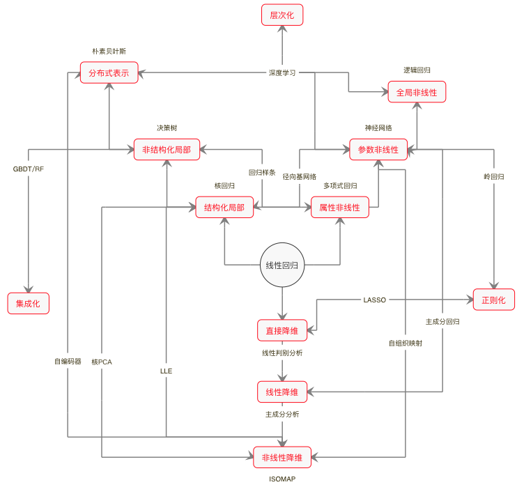

---
date: "2019-06-23"
---  
      
# 总结课 | 机器学习的模型体系
用17讲的篇幅，我和你分享了目前机器学习中的大多数主流模型。可是除开了解了各自的原理，这些模型背后的共性规律在哪里，这些规律又将如何指导对于新模型的理解呢？这就是今天这篇总结的主题。

要想在纷繁复杂的模型万花筒中梳理出一条清晰的脉络，还是要回到最原始的出发点——**线性回归**。线性回归是所有机器学习模型的鼻祖，其原因不仅源于它悠久的历史，还在于它三个最基本的特点。

* **线性**（这不是废话么）：除了常数之外最简单的函数关系。

* **全局性**：一组线性系数适用于整个输入空间。

* **数据不变性**：不对输入数据进行任何预处理。

这三个特点决定了线性回归简洁的数学形式、清晰的可解释性和受限的表达能力。要想从线性回归出发，得到更加复杂的模型，就要摆脱这三个基本假设的限制，从内部对模型加以改造。

线性是首当其冲的改造对象。要对复杂的客观世界进行建模，非线性是不可或缺的要素。但从线性到非线性的过渡并非一蹴而就，而是循序渐进地实现，其演进的过程大致遵循“**属性非线性——参数非线性——全局非线性**”的路线图。

首先是属性的非线性化，典型的处理手段就是基函数的扩展。基函数的引入本质上是对特征空间的重构。一般来说，所有基函数构成一组正交基，自变量和因变量之间的非线性关系就被限制在这组正交基展成的线性空间里。基函数的形式越复杂，模型刻画复杂关系的能力就会越强。从这个角度看，多项式模型和分段的样条模型都可以归入属性非线性化的范畴。

<!-- [[[read_end]]] -->

除了对作为自变量的属性进行非线性化处理之外，待估计的模型参数也可以非线性化。这里我用参数的非线性化来指代属性不变但参数改变的模型，但由于参数本身是常量而非变量，因此参数的非线性化是以自适应调整的方式体现的。这种演化的代表模型就是以感知器为代表的神经网络。而在神经网络中，激活函数的使用又可以看成是基函数扩展的一个实例。

如果在前两者的基础上，进一步对属性和参数实现全局的非线性化，得到的就是广义线性模型。广义线性模型的非线性化是通过非线性的链接函数实现的，将线性组合的整体作为非线性化的对象。这种处理方法从根本上改变了线性模型的结构，将线性模型的应用范围从回归推广到了分类。

处理完线性特性，接下来就轮到全局性了。一手遮天的全局特性限制了模型的灵活性，改进的方法在于将它改造成若干个局部模型的组合，其演进的过程可以描述为“**结构化局部——非结构化局部——分布式表示**”。

结构化局部模型的代表是核函数，虽然它原本的目的不在于此，却在事实上起到了局部化的作用。具有固定形式的核函数给每个样本都定义了归它管辖的一亩三分地，非样本点的取值则等于所有样本在这个点贡献的求和。如果说非线性化是重新定义了属性空间的话，那么局部化就是对属性空间进行了手术刀般精细的切割，它将线性回归拓展为核回归，还衍生出了基于距离的学习。

核函数是具有明确解析式的数学函数，这说明它还具备一定的结构特性。如果将局部的结构特性都不加保留地完全拆解，那就是以\$k\$近邻为代表的基于实例的学习。\$k\$近邻算法秉持少数服从多数的朴素观念，将学习的方法简化到了极致，它甚至不能被称为一个模型，因为支配它的不是参数，而是规则。在线性回归中应用\$k\$近邻方法的话，它就变成了局部加权回归。

将局部化的思想再推进一步，就是分布式表示。局部化是对数据样本所在的特征空间的切割，可分布式表示却是对特征空间的重组，将原来单个的数据点变出了多个分身，分别作为对数据不同角度的观察结果。分布式表示虽然没有对特征空间显式的局部化处理，但它却将数据点分散成局部的组合，这在朴素贝叶斯和深度学习中都有体现。

改造了线性回归本身之后，还要改造线性回归对数据的处理方式。过多的特征数会导致维数灾难的发生，因此稀疏化就成为改进线性回归的另一个角度。降维其实也是对特征空间的重建，但无监督的特性使它通常出现在数据预处理的步骤之中。根据手段的不同，数据的降维技术可以近似地划分成“**直接降维——线性降维——非线性降维**”这样几个类别。

直接降维的处理对象是未经处理原始的输入维度，典型的方法是特征选择。特征选择会把对结果贡献不大的特征直接剔除，这无疑会造成信息量的损失。此外，利用统计特性降维的线性判别分析也可以归入这一范畴。相比之下，以主成分分析为代表的特征提取方法就克服了这个缺点，通过特征的线性重组来实现数据的降维。对主成分进行筛选时虽然也会产生信息的损失，但会具有更好的可控性。

如果抛开线性的限制，从样本的结构属性而非信息属性出发实现降维，这样的方法就是非线性降维，它的另一个名字就是流形学习。所谓流形的含义是嵌入到高维空间内的低维结构，流形学习的任务就是在高维空间上把这个隐藏的低维结构提取出来，从而更好地观察和分析数据。

上面这三种途径都是作用在模型内部，通过修正模型自身的特性来达到演化。如果换个角度，从外部对模型进行拓展的话，常用的方法就包括**正则化、层次化和集成化**。

正则化意在通过添加对待求解参数额外的约束条件来提升模型的泛化性能，避免过拟合，通常体现为模型中的正则化项。贝叶斯主义对正则化的理解来得更加直截了当：所谓正则化其实就是给模型套上先验分布的紧箍咒。定义了先验分布就可以应用最大后验概率估计，让后验概率最大化的过程就是正则化的过程。

层次化和集成化都是对模型结构的外部改进。层次化是将模型串联起来，通过逐级地学习来追求由浅入深的效果；集成化则是将模型并联起来，让多个模型群策群力，充分发挥集体智慧。深度学习和随机森林的成功已经向世人证明，这两种手段都能让模型之间产生充分的互动，从而得到良好的学习效果。

说到这里，我们就从线性回归出发，构建起了如下图所示的（我个人理解的）**机器学习模型鸟瞰图**。无论是作用于模型内部的非线性化、局部化和稀疏化，还是作用于模型外部的正则化、层次化和集成化，这些技巧实际上都属于方法（method）的范畴。**实际问题的解决方案往往来源于一种或者多种方法和基本模型的组合**。

所以在我看来，在读完这个专栏之后，你可以把所有具体的模型全部忘掉，只要领会这些方法，任何见过没见过的模型你都不会觉得陌生。

机器学习模型鸟瞰图

从机器学习模型的体系架构出发，按照由浅入深的顺序，我向你推荐以下的机器学习参考书。

* 《机器学习》（Machine Learning），汤姆·米切尔（Tom Mitchell）

* 《机器学习》（Machine Learning），彼得·弗拉克（Peter Flach）

* 《机器学习导论》（Introduction to Machine Learning），埃塞姆·阿培丁（Ethem Alpaydin）

这三本书是入门读物，共同的特点是结构清晰，难度适中。第一本是历久弥新的经典教材，虽然内容较为久远，却仍不失为理想的入门读物；第二本遵循从任务到模型的顺序，将模型分为树模型、规则模型、线性模型、距离模型和概率模型几类；第三本则先后介绍了参数方法、非参数方法和局部模型，并将频率主义和贝叶斯主义的内容融合在一起。读这些书时可以思考作者们对内容的编排，将重点放在建立关于机器学习的知识框架与体系上面。

* 《统计学习基础》（Elements of Statistical Learning），特雷沃·哈斯蒂等（Trevor Hastie, et. al.）

* 《模式识别与机器学习》（Pattern Recognition and Machine Learning），克里斯托弗·毕晓普（Christopher Bishop）

* 《深度学习》（Deep Learning），伊恩·古德菲洛等（Ian Goodfellow, et. al.）

这三本书是进阶读物，对方法的原理分析具有一定的深度，也会涉及大量的数学运算。前两本书是机器学习领域的经典，分别从频率主义和贝叶斯主义的角度对机器学习做出了详尽的阐释。第三本书则是目前关于深度学习唯一的专著，覆盖范围较广，适合针对某个主题做选择性的阅读。

* 《机器学习：概率视角》（Machine Learning: A Probabilistic Perspective），凯文·墨菲（Kevin Murphy）

* 《深入理解机器学习》（Understanding Machine Learning），沙伊·沙莱夫-施瓦茨等（Shai Shalev-Shwartz, et. al.）

* 《统计学习理论的本质》（The Nature of Statistical Learning Theory），弗拉基米尔·瓦普尼克（Vladimir Vapnik）

这三本书是专业读物。第一本堪称机器学习的百科全书，从贝叶斯角度对机器学习的几乎所有问题展开论述。这本书不太适合阅读，更适用于作为词典随时查阅。第二本则聚焦于机器学习的理论领域，虽然页数不多却充斥着各种定理与证明过程，和前面的所有书目都不是一个路数。如果想要深入理解机器学习的理论进展，这本书绝对不容错过。

最后一本是理论大师瓦普尼克毕生绝学的简化版。他的《统计学习理论》（Statistical Learning Theory）书如其名，对通过样本推断总体规律的数学问题做了详尽的论证，是统计学习思想的集大成者，读起来自然艰深晦涩。《统计学习理论的本质》是《统计学习理论》的简化版，在大幅度削减篇幅和数学细节的同时保留了核心结论。这本书的作用是“欲穷千里目，更上一层楼”，读通之后，你将建立起看待机器学习高屋建瓴的视角。

常言道“授人以鱼不如授人以渔”，我希望今天的这篇总结中的思路能成为那个三点水的“渔”，帮你厘清每个孤立模型背后的联系和逻辑。

在这段时间的学习过程中，你遇到了哪些问题？又有哪些想法呢？欢迎你留言和我讨论。