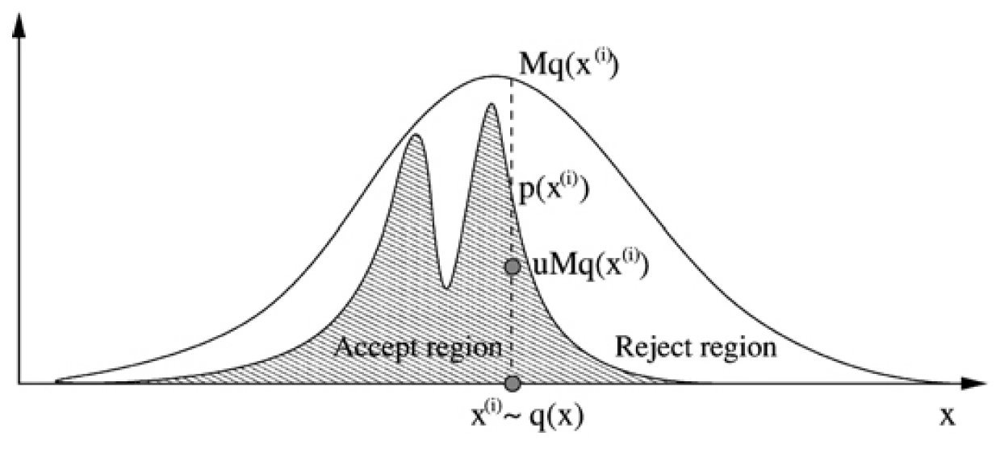

---
date: "2019-06-23"
---  
      
# 37 | 随机近似推断：MCMC
本质上说，确定性近似是遵循着一定的原则，使用一个分布来近似另一个分布，近似结果取决于确定的规则。可是在很多预测任务中，完整的后验分布并不是必需的，我们关注的对象只是某个因变量在后验分布下的期望，或者具有最大后验概率的那个取值。这时再使用确定性近似来计算预测结果，尤其是连续函数在连续分布下的预测结果又是个在计算上颇为棘手的问题。

有些时候，即使目标分布的形式是已知的，对它的求解也存在着困难。就拿常见的Beta分布来说，其概率密度可以表示为\$p\(x\) = Cx\^\{\\alpha \- 1\}\(1 \- x\)\^\{\\beta \- 1\}\$，其中常数\$\\alpha, \\beta\$都是分布参数，常数\$C\$是归一化因子。可问题在于如果不能计算出这个复杂的参数\$C\$，即使能够确定分布的形状，也没法对分布进行直接的采样。这种情况下也要借助随机性近似。

既然求解解析解既复杂繁冗又无甚必要，那就不妨用统计学的核心概念——抽样来解决问题。**用样本分布来代替难以求解的后验分布，这就是随机性近似的思想**。

随机性近似（stochastic approximation）属于**数值近似**（numerical approximation）的范畴，它对数据的生成机制进行建模，通过模型生成符合真实分布的抽样结果，再利用这些抽样结果表示未知的概率分布。

<!-- [[[read_end]]] -->

**随机性近似的典型方法是马尔可夫链蒙特卡洛方法**（Markov Chain Monte Carlo method），简称 **MCMC**。其作用是在概率空间中构造合适的马尔科夫链，再应用蒙特卡洛方法进行随机采样来拟合目标的分布。

**MCMC体现的是真正的概率密度的思想**，它虽然不能计算分布的表达式，却可以将概率等比例地放大。频率意义下的概率就是数据出现的频度，归一化的作用只是让它变成公理化的概率，而不会对频率解释产生任何影响。

MCMC的出发点就在于消除掉那个不影响分布趋势却又没它不行的归一化常数\$C\$对概率求解的影响，通过对简单分布（比如均匀分布）进行抽样来拟合出更加复杂，甚至于压根儿不存在解析式的分布形式。

虽然都可以缩写成MC，但马尔可夫链和蒙特卡洛方法却是两个完全不同的概念。

蒙特卡洛方法诞生于曼哈顿计划中，其缔造者是数学家斯坦尼斯拉夫·乌拉姆（Stanislaw Ulam）和不世出的天才约翰·冯诺伊曼（John von Neumann）。蒙特卡洛本身是袖珍王国摩纳哥的一块国土，以其大名鼎鼎的蒙特卡洛赌场闻名于世，这样的名字或多或少地说明了这个方法和作为概率论不竭灵感源泉的赌博娱乐之间的深厚渊源。

这个号称20世纪最伟大的算法其实不难理解。通俗地说，它就是**通过多次独立重复的随机实验来模拟确定性的概率分布，或者求解难以计算的求和问题，其精确性由大数定律所保证**。

蒙特卡洛方法最广为人知的应用可能就是对圆周率\$\\pi\$的估算：在一个单位面积的正方形里随机且均匀地抛洒若干个点，然后统计这些点中和某个选取出的顶点之间距离小于1的点的数目。

如果将这个选出来的参考顶点视为圆心，那么和它的距离小于1的这些点就都在四分之一圆内，四分之一圆内的点数和所有点数的比例就是\$\\pi / 4\$的估计值。当随机生成的点数达到30000时，\$\\pi\$的估计误差可以下降到0.07\%以下。

用蒙特卡洛法估计\$\\pi\$值（图片来自维基百科）

使用蒙特卡洛方法估计未知的目标分布\$p\(x\)\$时，可以先引入另一个概率分布\$q\(x\)\$作为参考分布，这个参考分布被称为**建议分布**（proposal distribution），具有简单的形式和易于采样的特性。与建议分布配套的还有个常数\$M\$，两者共同满足\$Mq\(x\) \\ge \{\\tilde p\}\(x\)\$，这里的\$\{\\tilde p\}\(x\)\$是未归一化的概率，是目标分布\$p\(x\)\$与另一个常数\$Z\$的乘积。

如果将上面的两个准概率分布画在同一个坐标系里，\$Mq\(x\)\$对应的曲线会将\$\{\\tilde p\}\(x\) = Zp\(x\)\$对应的曲线完全包住，两者之间会存在一段间隔。在执行采样时，首先按照概率分布\$q\(x\)\$生成一个随机数\$x\_0\$，接着在\$\[0, Mq\(x\_0\)\]\$的区间上通过均匀采样采出来一个新数\$u\_0\$。如果得到的\$u\_0\$大于\$\{\\tilde p\}\(x\_0\)\$，那它就落在两条曲线之间的区域，这样的样本会被直接抛弃；如果\$u\_0\$小于\$\{\\tilde p\}\(x\_0\)\$，那它就落在\$\{\\tilde p\}\(x\)\$曲线的下方，这样的样本才会保留。

拒绝采样示意图

图片来自《机器学习》（Machine Learning）第50卷第1期5-43，《用于机器学习的MCMC介绍》（An introduction to MCMC for machine learning）。

由于需要根据样本的特性决定接受或是拒绝，因而以上的采样机制被称为**拒绝采样**（rejection sampling）。可以证明，拒绝采样等效于对目标分布\$p\(x\)\$进行多次独立的采样。一般说来，即使对系数\$Z\$进行优化处理，拒绝采样也会有较高的拒绝率，其运算效率通常较低。

蒙特卡洛方法只是随机采样的过程，而要确保采出来的样本服从我们想要的分布，需要借助第一个MC：**马尔可夫链**。马尔可夫链假定每一时刻的状态只依赖于前一时刻的状态，每一个状态又会以一定的概率变化为另一个状态，状态之间所有的转化概率共同构成了这个马尔可夫链的状态转移矩阵（transition matrix）。

**转移矩阵可以将任意的初始概率分布变成马尔可夫链的稳态分布**（equilibrium distribution）。稳态分布由转移矩阵决定，而与初始的概率分布无关，不管每个状态的初始概率如何，经过若干轮次的转换之后，都可以得到符合稳态分布的样本。这意味着如果能够计算出某个稳态分布所对应的马尔科夫链的状态转移矩阵，服从这个稳态分布的数据样本就唾手可得。

引入了马尔可夫性后，MCMC最原始的实现——**Metropolis算法**便呼之欲出。Metropolis算法可以看成是结合了马尔可夫链的拒绝采样，它将原始的数据点初始化为\$x\^\{0\}\$，将转移概率初始化为\$q\(x | x\^\{0\}\)\$。需要注意的是，Metropolis算法中的转移概率必须具备对称的特性，也就是\$q\(x | y\) = q\(y | x\)\$对任意的\$x\$和\$y\$都成立。

在每一轮数据的生成中，Metropolis算法会根据上一轮的结果\$x\^\{t\}\$和以建议分布形式出现的转移概率\$q\(x | x\^\{t\}\)\$生成\$x’\$，这个新生成的样本将以\$\\alpha = \{\\tilde p\}\(x’\) / \{\\tilde p\}\(x\^\{\(t\)\}\)\$的概率被接受。在实现中，接受的策略体现为生成一个在\[0, 1\]上均匀分布的随机数\$u\$，如果\$u \< \\alpha\$就接收新样本，反之则继续使用上一轮次的旧样本。如果新样本的出现引起了\$\{\\tilde p\}\(\\cdot\)\$的增加，也就是\$\\alpha > 1\$的话，这样的新样本就是必然被保留的。

直观理解，在模拟分布时，Metropolis就像一只在山头上游弋，标记自己领地的老虎。它会在概率密度大，也就是数据出现频度高的位置多转几圈，多留下自己的气味；而在概率密度小，数据出现频度低的位置，示意性地巡逻一下，留一点味道就可以了。数据的概率密度正是通过气味的浓度，也就是采样的样本出现的次数所定义的。

但这样的行为又带来了一个问题，那就是Metropolis在生成新样本时更倾向于接收那些来自分布集中区域的样本。如果新样本导致准概率密度的增加，那它就100\%会被接受。可如果导致准概率下降，新样本就存在被丢弃的可能，下降的程度越大，被接受的概率就越低，这将会导致生成的样本更容易抱团在一起。如果将Metropolis算法中对称的建议分布设定为以上一轮的结果为中心的高斯分布，生成的序列就会变成围着一个小区域转圈圈的随机游动（random walk）。

将原始Metropolis算法的中建议分布的对称特性去掉，得到的就是广泛应用的**Metropolis-Hastings算法**，简称**MH算法**。

马尔可夫链的特性决定了根据给定的状态矩阵确定对应的稳态分布是小菜一碟，可根据给定的稳态分布找到对应状态矩阵的难度却有如大海捞针。为了简化寻找转移矩阵的难度，MH算法利用了稳态分布的一个充分非必要条件，那就是**细致平稳性**（detailed balance）。细致平稳性的数学表达式可以写成

\$\$ \\pi\(i\) \{\\bf Q\}\_\{ij\} = \\pi\(j\) \{\\bf Q\}\_\{ji\} \$\$

其中\$\\pi\$是马尔可夫链的稳态分布，\$\\bf Q\$是马尔可夫链的转移矩阵。这个式子的含义在于从状态\$i\$转移到状态\$j\$的概率质量恰好等于从\$j\$转移回\$i\$的概率质量，转入和转出之间存在动态平衡，分布\$\\pi\$就是稳态分布。但在具体问题中，任意选择的目标分布\$p\(x\)\$和起到转移矩阵作用的建议分布\$q\(x\)\$很难满足细致平稳性，这时就需要对它们做一些人为的修正，修正方式是引入参数\$\\alpha\$，令它满足

\$\$ p\(i\)Q\(i, j\)\\alpha\(i, j\) = p\(j\)Q\(j, i\)\\alpha\(j, i\) \$\$

不难看出，参数的引入使转移矩阵被修正为\$\{\\bf Q\}\(\\cdot\)\\alpha\(\\cdot\)\$，这可以避免Metropolis算法对小概率样本的一刀切。在MH算法中，参数\$\\alpha\$就是接受率，可以理解为执行这次从\$i\$到\$j\$的转移的概率。要让接受率满足上面的条件，最简单的方式是设定两者之中较大的一个为1，再利用等式关系计算出另外一个，这样生成的样本分布\$p\(z\)\$就是马尔可夫链的稳态分布。

MH算法的一个特例是针对高维分布的**吉布斯采样**（Gibbs sampling）。在一个\$N\$元分布中计算每个变量关于其他所有变量的条件分布，可以得到\$N\$个一元条件分布。吉布斯采样就是对这些条件分布进行采样：在给定初始值后，吉布斯采样按照每个一元条件分布依次产生新的样本并全部接受，作为下一轮更新的基础。

追根溯源，吉布斯采样来源于对吉布斯随机场（Gibbs random field）的研究，它相当于将一个高维的马尔可夫链庖丁解牛，拆解成多个一维的马尔可夫链，高维马尔可夫链整体的状态转移也相应地被拆解成不同一维链轮流的状态转移。这样的拆解并不会影响到细致平稳条件，因而得到的分布依然是目标的稳态分布。另外，**吉布斯采样并不会拒绝产生的样本，这使它和MH算法相比具有效率上的优势，从而成为应用最广泛的MCMC算法**。

利用PyMC库可以实现MCMC采样。出于便于对比的考虑，本讲以估计硬币正反面的概率为例。硬币出现正面的概率\$p\$可以用二项分布建模，其先验和后验则用共轭的贝塔分布建模，因而可以给出后验概率精确的解析结果。利用投掷50次硬币出现20次正面的数据，就可以用Metropolis算法来估计二项分布的参数\$p\$了。结果表明，MCMC的结果和解析结果基本吻合。

今天我和你分享了MCMC方法的基本原理，以及MH算法和吉布斯采样等具体的实现方式，包含以下四个要点：

* MCMC是基于随机性近似的推断方法；

* MCMC利用基于蒙特卡洛方法的随机采样将任意的初始分布转化为马尔可夫链的稳态分布；

* MCMC的关键问题是找到和目标稳态分布匹配的转移矩阵；

* MCMC的典型方法包括一维的MH算法和多维的吉布斯采样。

在MCMC中，转移概率或者建议分布\$q\(x, y\)\$的选择是关键因素，其设计的优劣会直接影响到算法的性能。

你可以查阅相关文献，了解转移概率常见的设计思想，并在这里留下你的见解。

