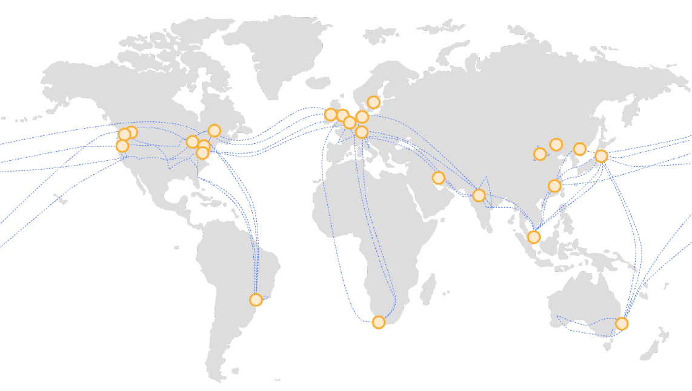

---
date: "2019-06-23"
---  
      
# 01 | 区域和可用区：欢迎来到云端数据中心
你好，我是何恺铎，欢迎来到《深入浅出云计算》专栏。这是课程的第一讲，我们就从IaaS来入手，开始对云计算的讨论。

IaaS的本质，是对云数据中心和各类IT基础设施的抽象，是基于软件技术对物理硬件进行的封装和虚拟。这为云计算用户屏蔽了大量底层细节，能让我们在较高的层面进行架构设计和资源使用，大大提高了工作效率。

说起我们大多数开发者最常用的IaaS服务，恐怕要数云上虚拟机了。没错，虚拟机肯定会是我们IaaS部分的讲解重点。不过在此之前，我想让你对整个云端数据中心，先建立起一个高屋建瓴的认识，帮助你理解宏观层面的重要概念。这会对我们后续的学习大有裨益。

所以第一讲，我们就先来谈谈云计算中的**区域**和**可用区**。

## 指点江山，云计算中的“区域”

云计算中最顶层的概念，就是**区域**（Region）了。在大家的日常认知中，它当然是一个地理概念。而在云计算行业中，区域对应的则是云计算厂商在某个地理位置提供的所有云服务的组合，是厂商对外提供云服务的基本单位和容器。

所以绝大多数的云服务，都会按区域进行部署和落地；用户使用的所有云资源，也都会隶属于一个区域，这通常是在创建资源时就确定了的。

常见的区域，我们一般以**国家或地区命名**，也经常辅以城市和序号予以区分。比如，阿里云的华北1区（青岛）、华北2区（北京），以及AWS的美国西部1区（加利福尼亚北部）、美国西部2区（俄勒冈州）等。

<!-- [[[read_end]]] -->

与此同时，每个区域还会有个字母数字构成的区域代号（Region ID或Region Code）。比方说，阿里云华北1区代号为cn-qingdao，AWS美国西部1区的代号为us-west-1等。这些代号方便我们在程序或脚本中对区域进行唯一指定，有时也会出现在门户控制台URL中。


阿里云的全球区域

当然，想要开设一个新区域，绝非一件容易的事情。它有点像网络游戏中的“开服”，包含了云计算服务商在某个地区建立数据中心，安置大量的计算、存储、网络等硬件资源，以及部署虚拟化、服务组件、资源调度等各种复杂软件，最后与外界互联网相连，获得批准对外提供云服务的全过程。

**所以区域的设立和分布，相当程度地体现了云厂商的业务重点和地区倾向**。小型云厂商一般会着重在个别国家或地区深耕；而大型云厂商实力雄厚，会在全球范围内拥有众多开放区域，以便用户能够在全球范围内管理和部署自己的应用。

考虑到经济效益和地理冗余，在典型情况下，云厂商设置的不同区域之间的距离，一般为数百公里或以上，这也对应了单个区域能够辐射和服务的范围。

云厂商在选址时一般会有两种思路：

* 一种是考虑放在**人口稠密的中心城市**，离用户和商业更近，以提供较快的接入体验；
* 另一种则是在**相对偏远的地区**，当地往往能够提供良好的气候条件、充足的建设空间，以及较低的电力、带宽等运营维护成本。

AWS在中国开设的两个区域，就是典型的例子：由光环新网运营的北京区域，位处繁华都市；由宁夏西云运营的宁夏区域则地广人稀。有时这样的搭配被称为“**前店后厂**”模式。

### 如何选择云上“区域”？

区域是如此的重要，所以不仅是云厂商，我们的应用和架构，同样需要先挑选最合适的落脚点。那么，**当我们作为用户时，应该如何选择合适的区域呢？**

**首要的考量因素，当然在于区域的地理位置本身**。这很好理解，我们需要让它尽可能地靠近我们应用所面向的最终用户，来保证更快的接入速度。

比如，当我们主要面向中国大陆用户服务，那自然不需要考虑其他国家的区域。

而如果我们的应用是具有鲜明地域性特征的服务，像是搭建一个面向华东地区的本地生活服务，那就应该更细致地就近选择区域了，比如说，我可以选择阿里云的“华东1（杭州）”或者“华东2（上海）”等区域。

另外，如果你的场景中需要本地数据中心与云端进行互联，也就是混合云架构，那么同样也需要事先注意云区域的地理位置选择。**混合云的专线接入，一般以同城或短距离接入为主**，这样你也能够较好地控制费用，同时提高线路的稳定性。

**第二个考量因素，非常重要而又容易被忽视，那就是区域之间云服务的差别。**

前面我们提到，区域是云计算物理上存在的一个基本单位，所以从IaaS到PaaS各项云服务的落地，也是按照区域进行的。换句话说，**同一个云在不同的区域，所能提供的服务和规模可能是不同的。**

小提示：厂商通常会大力宣传新机型或新服务的推出，但关于这个新服务在哪些区域可用的信息时常会淡化处理，放在不那么显眼的位置。我们需要特别注意这些信息。

因此，你就非常有必要在选择区域之前，先摸清楚相关区域的具体某项服务的可用性。

比如，生产环境需要一些GPU机型来运行深度学习工作，那你就一定要通过官方网站查询，最好是进行实操验证，来确认理想的GPU机型真的存在于你所准备选择的区域；或者，你看到云厂商发布了全新数据库服务，那么在技术选型时也千万不要忘记，验证一下该服务在你选择的区域是确实可用的。

**另外，区域的“开服时间”，也往往会与区域内云服务的可用性有比较大的关联。**

一般来说，新开服的区域通常会落地最新一代的硬件和云端服务，也有非常充沛的资源可供调用，但它未必能迅速覆盖该云的所有服务，相关支持团队可能也需要进行磨合。

而历经时间考验的老区域，则通常会拥有更为丰富的产品选择和成熟的技术支持，但有时对新特性的部署和落地，可能会因为原有条件的限制而进展得缓慢一些。如果早期规划过于保守，极端情况下还可能出现局部“满服”而无法扩展某类资源的尴尬局面。

小提示：不同云不同区域的实际情况千差万别。我上面说的这些，只是给了你一定的判断思路，仅供参考。必要时，你应当咨询云销售或客服来获取更细致的信息。

总而言之，新旧区域哪个更好，并不能一概而论，需要根据你的服务需求和待选区域的实际情况来综合衡量。

**第三个区域选择的考量因素，则是成本因素。即便是同一种服务的价格，在不同区域也往往是不相同的。**

当你的应用需要大批量地采购同一种型号的虚拟机时，或者是你想利用云存储设立一个大规模的云端备份中心，我都建议你仔细比对一下不同区域相关服务的价格，也许你会有惊喜的发现。个别区域会具有明显的价格优势，比如阿里云的华北5区（呼和浩特），和AWS中国的宁夏区域，以此来吸引用户的入驻。

谈到成本，这里我还想补充说明一下**区域的流量费用，是你需要注意的**。如果把区域作为一个有边界范围的实体圈起来，这个流量可以分为三类：**入站流量、出站流量和内部流量**。在现代云计算的计费框架下，一般会倾向于让入站流量和内部流量免费或接近免费，而出站流量则单独收费。

### 多区域架构浅谈

接下来我们谈谈**多区域架构**，它指的是部分关键应用，为了追求最佳的用户体验和高可用性，需要把多个区域的资源和能力结合起来进行构建。

你首先需要了解，主流云厂商在跨区域方面也进行了大量建设和投资，主要体现为：

* **物理上**，各区域之间建设有网络互联专线，一般称为骨干网（Backbone）。骨干网的存在使得同一个云在不同区域间的通信，能够有较高的带宽和较低的延时。
* **软件层面**，允许位于不同区域的虚拟网络跨区域进行互联，使得多区域的私有内网能够借助自有骨干网无缝高速打通。
* **DNS解析层面**，通常会提供就近解析和智能路由能力，将分布广泛的C端流量引流到最近的数据中心，以获得最快的响应速度。



AWS全球骨干网（来自[AWS官网](https://aws.amazon.com/about-aws/global-infrastructure/global_network/)）

由此可见，公有云的基础设施（尤其是骨干网的存在）能够极大地方便我们构建多区域的应用程序。为了让你对云的骨干网有一个感性的认识，我们来进行一个**动手小实验**，实际感受一下区域间互联的吞吐能力。

我们就以AWS中国的北京区域和宁夏区域作为例子。

首先，我在两边都各自创建了一台虚拟机，在获取IP并开放相应端口后，使用**iperf3**工具进行网络吞吐能力测试。先让一端作为服务器在某个端口监听：

```
    [ec2-user@ip-172-31-xx-yy ~]$ iperf3 -s -p 3390
    -----------------------------------------------------------
    Server listening on 3390
    -----------------------------------------------------------
    

```

然后让另一端作为客户端，发送数据进行测试：

```
    [ec2-user@ip-10-0-1-101 ~]$ iperf3 -c aa.bb.cc.dd -p 3390
    Connecting to host aa.bb.cc.dd, port 3390
    [  4] local 10.0.1.101 port 43640 connected to aa.bb.cc.dd port 3389
    [ ID] Interval           Transfer     Bandwidth       Retr  Cwnd
    [  4]   0.00-1.00   sec  53.6 MBytes   450 Mbits/sec    0   3.11 MBytes
    [  4]   1.00-2.00   sec  61.2 MBytes   514 Mbits/sec    0   3.11 MBytes
    [  4]   2.00-3.00   sec  61.2 MBytes   514 Mbits/sec    0   3.11 MBytes
    [  4]   3.00-4.00   sec  61.2 MBytes   514 Mbits/sec    0   3.11 MBytes
    [  4]   4.00-5.00   sec  60.0 MBytes   503 Mbits/sec    0   3.11 MBytes
    [  4]   5.00-6.00   sec  60.0 MBytes   503 Mbits/sec    0   3.11 MBytes
    [  4]   6.00-7.00   sec  61.2 MBytes   514 Mbits/sec    0   3.11 MBytes
    [  4]   7.00-8.00   sec  61.2 MBytes   514 Mbits/sec    0   3.11 MBytes
    [  4]   8.00-9.00   sec  61.2 MBytes   514 Mbits/sec    0   3.11 MBytes
    [  4]   9.00-10.00  sec  60.0 MBytes   503 Mbits/sec    0   3.11 MBytes
    - - - - - - - - - - - - - - - - - - - - - - - - -
    [ ID] Interval           Transfer     Bandwidth       Retr
    [  4]   0.00-10.00  sec   601 MBytes   504 Mbits/sec    0             sender
    [  4]   0.00-10.00  sec   599 MBytes   502 Mbits/sec                  receiver
    
    iperf Done.
    

```

可以看到，在并发度默认为1且未做任何调优的情况下，距离上千公里的双机点对点传输就达到了500Mbps以上，效果相当不错。

小提示：网络传输速度受到许多因素的影响。此处的测试结果数字仅供参考，不代表所测专线的实际带宽能力。事实上，通过增加并发度（如iperf3的-P选项）并加强机器配置等，你还可以成倍地提升测试效果。建议你一定要结合自己的云环境和需求场景进行实际的测试。

所以，在骨干网的加持下，通过合理架构完全可以让多个区域的云服务融为一体。**借助云的力量，小厂也能轻松拥有巨头的分布式部署能力。**

在应用架构层面，多区域并不意味着，我们需要把某区域的资源依葫芦画瓢复制到其他区域，而是可以**根据实际情况各司其职，让不同区域担任不同的角色，联动起来达到业务目的**。

比如，我们可以将面向消费者服务的触点部署到多个区域，就近服务各地区的互联网流量，而偏后台的数据分析和BI服务，则可以安置在性价比较高的非一线城市区域，业务数据可通过骨干网不断回传。这是一种经典的分工模式。

当然，多区域架构固然诱人，我们也不应当走向另一个极端：**轻率、随意地拓展区域**。因为每一个区域的增加，都会相应增加应用架构的复杂性和流量费用，也给我们的维护工作带来负担，这些额外的成本可能会抵消多区域架构带来的好处。

## 什么是“可用区”？

除了“区域”之外，很可能你还听说过“**可用区**”（Availability Zone）这个术语，它同样是非常重要的概念。因为看上去和区域有点相似，有些同学会把它们等同看待。事实并非如此。

可用区是区域的**下级概念**，是指一个具备完整而独立的电力供应、冷却系统、网络设施的数据中心单元。一个区域通常由多个可用区高速互联组成。区域内的可用区一般位于同一个城市，之间相距往往在一百公里以内。

所以物理上的“数据中心”和“机房”概念，若要严谨地对应到云端，其实是在可用区这个层面。

你可能会问，一个区域看上去拥有一个数据中心就足够了，为什么还要建造多个可用区呢？

首要的原因，当然是**为了解决区域内高可用性问题**，这也正是“可用区”名字的由来。尽管数据中心内部有着非常精密的运作系统和冗余机制，但地震、火灾、雷击等极端情况下，仍有可能造成数据中心级别的故障。

为了避免单个数据中心故障让整个区域不可用，那自然就有必要建设多个相对独立的数据中心，也就是多个可用区了。它能让区域中的服务达到相当高的可用性。许多云上的PaaS服务，正是依赖多可用区，来建设架构并保证冗余的。

所以你在设计IaaS层面架构时，也可以利用可用区来实现自己的业务效果。比如在创建云虚拟机时，我们是可以指定可用区的：


阿里云华东1区可用区选择界面

多可用区架构的选择，与前面探讨的多区域架构类似，同样是一个在网络性能、成本、可用性之间权衡的问题。我们可以将资源安排在同一个可用区，以便获得较高的网络互访性能；也可以安排在不同的可用区，以实现故障隔离和服务冗余。

区域需要多个可用区的另一个原因，在于**区域本身有扩展的需求**。一些区域由于早期的容量规划和成本控制原因，很可能在若干年的运营后就会变得资源紧张、后劲不足。

这时得益于可用区的机制，区域可以通过新建可用区，不断扩展自身容量，补充新鲜血液；而老旧的可用区，则可不对新用户开放，逐步封存甚至淘汰，这让区域形成了良好的新陈代谢机制。

所以反过来讲，**可用区的数量也可以成为一个衡量区域规模的重要指标**。数量越多，意味着这个区域规模越大。在选择区域的时候，这个指标也可以作为重要参考。

## 课堂总结与思考

今天是我们《深入浅出云计算》的第一讲，主要讨论了区域和可用区这两个核心概念。我把这一讲的要点简单总结如下：

* 区域是云计算的顶层概念，云服务以区域为单位对外开放；
* 区域选择需要考虑多种因素，包括但不限于地理位置、服务丰富性、开服时间、资源成本、可用区数量等；
* 可用区是区域之下的重要层级，代表独立的数据中心，一个区域内往往有多个可用区；
* 妥善将资源分布到不同可用区，可实现故障隔离，提升架构的可用性。

在讲解这些内容的同时，今天我们也触碰到了网络和高可用架构等相当硬核的话题。如果你觉得还不过瘾，也没有关系，后续会有相关的专题章节作进一步的探讨。

**最后，我想给你留下两个思考题，欢迎你在留言区和我互动：**

* 你日常接触的云计算区域是哪些？你有察觉到区域之间的一些差别吗？
* 在2019年AWS re:Invent大会上，亚马逊还推出了全新的“本地区域”（Local Zone）概念。这又是为什么场景所设计的？层级上它更接近“区域”还是“可用区”呢？

如果你觉得有收获，也欢迎把这篇文章分享给你的朋友。感谢阅读，我们下期再见。