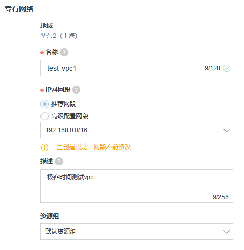
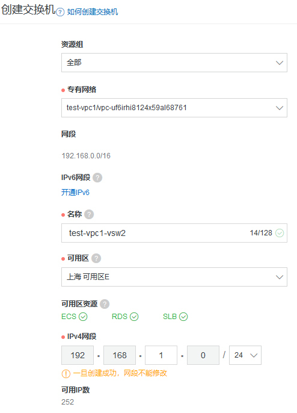
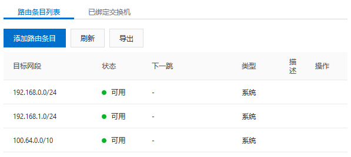
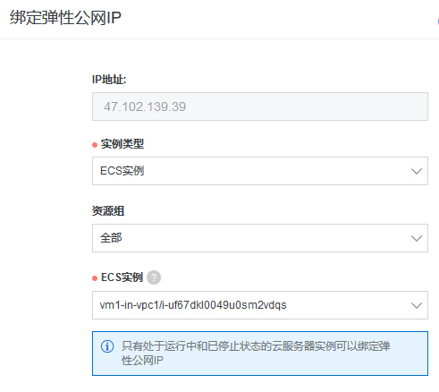
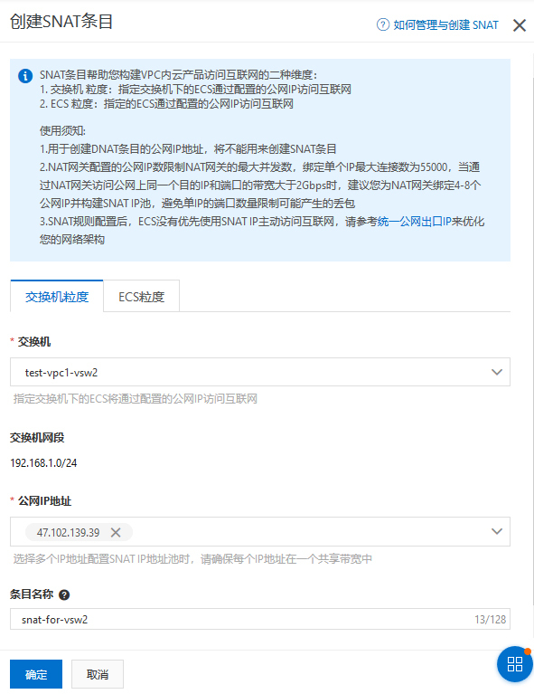

---
date: "2019-06-23"
---  
      
# 06 | 云上虚拟网络：开合有度，编织无形之网
你好，我是何恺铎。

我们对于IaaS的介绍已经渐入佳境了。前面，我们主要涉及了与云虚拟机相关的计算和存储方面的内容。今天这一讲，我想要和你讨论的，则是“计算/存储/网络”三要素中的最后一项：**网络**。

在互联网时代，网络的重要性不言而喻，我们必须好好掌握。通过合理的网络拓扑设置，既能够帮助我们实现架构上的隔离性和安全性，又能够让各组件互联互通、有序配合。

不过网络对于许多开发者而言，有时会让人感觉是一个挺困难的话题。它复杂的设置、晦涩的术语，尤其是各种连而不通的场景，可能让你望而生畏。

请你不要担心，云上的网络经过了一定程度的抽象以后，已经为我们屏蔽了一定的复杂度。只要宏观的思路梳理得足够清晰，你很快就能够理解云上的网络组件，并让它们听你指挥、投入使用。

## 什么是虚拟私有网络？

虚拟私有网络（Virtual Private Cloud，简称VPC），是云计算网络端最重要的概念之一，它是指构建在云上的、相互隔离的、用户可以自主控制的私有网络环境。虚拟私有网络有时也称为专有网络（阿里云）或虚拟网络（Virtual Network或VNet，Azure的叫法）。

上面的概念解释也许不太好理解，其实用通俗的话来讲，**私有网络就是一张属于你自己的内网。**内网之内的服务器和设备，可以比较自由地互相通信，与外界默认是隔离的。如果外部互联网，或者其他虚拟网络需要连接，则需要额外的配置。

<!-- [[[read_end]]] -->

所以说，虚拟私有网络，就是你在云上的保护网，能够有效地保护网内的各种设施。有的时候，你可能还要同时创建多个虚拟网络，让它们各司其职，实现更精细的隔离。

小提示：在一些云上，除了私有网络，你可能还会看到“经典网络”的选项。这是上一代的云上内网基础设施，虽然它配置起来相对简单，但在隔离性、可配置性上有许多局限。现在已不推荐使用了。

虚拟私有网络麻雀虽小，但五脏俱全。在传统数据中心里，经典网络架构中的概念和组件，在虚拟网络中你几乎都能找到对应。这里比较重要的一些概念包括：

* **网段**，私有网络的内部IP区段，通常用CIDR形式来表达，如192.168.0.0/16。
* **子网**，私有网络的下级网络结构，一个私有网络可以划分多个子网，这和通常意义上的子网也是对应和一致的。阿里云中把子网形象地称为“交换机”。
* **路由表**，用于定义私有网络内流量的路由规则，决定着数据包的“下一跳”去向何方。每个子网都必须有一张关联的路由表，通常情况下，系统会自动帮你创建一个默认的路由表。
* **网关**，是对进出私有网络的流量进行把守和分发的重要节点，根据用途的不同，有多种类型，后面我们还会讲到。
* **安全组**，私有网络里虚拟机进出流量的通行或拦截规则，可以起到虚拟机网络防火墙的作用，我们曾经在[第2讲](https://time.geekbang.org/column/article/206296)中提到过它。

所以在创建虚拟网络时，你就需要对上面这些重要属性进行按需设定。

下面，我就以**阿里云VPC**为例，来带你实际操作体验一下。

首先，我们来到阿里云的专有网络管理控制台，选择新建一个VPC，这里的**网段**我们选择**192.168.0.0/16**：



注意：VPC属于局域网，按照RFC规范，能够使用的IPv4区段必须为192.168.0.0/16、172.16.0.0/12、10.0.0.0/8这三个或它们的子集。

同时，我们还**至少要创建一个子网**，也就是交换机。我们选择一个子IP段192.168.0.0/24，并且设置所属可用区为“**可用区D**”：


我们再来创建另外一个交换机，网段设置为192.168.1.0/24。**这里的关键在于，我们可以让第二个交换机位于另外一个可用区E：**



这就说明，**我们可以建立跨可用区，也就是跨同区域内不同数据中心的私有网络。**这是VPC的一个强大的特性，能够为我们私有网络的高可用性提供保障。比如，你可以让主力集群在一个可用区工作，备用集群在另一个可用区随时待命，需要时迅速切换；你也可以把流量同时分发到不同的可用区，动态控制分发策略。

就这样，我们收获了一个包含两个交换机的VPC。


查看一下它的路由表，你可以发现，它自动为我们包含了两个子网的路由信息：



你看，创建VPC其实并不困难。这里的关键还是要规划好VPC和各子网的网段，需要让它们既有足够的地址空间以供资源拓展，又不要安排得范围过大，以免和其他VPC或公司内部网络产生地址冲突，为后续的网间互联带来不必要的麻烦。

如果你在没有VPC的情况下直接创建虚拟机，公有云一般都会为你自动生成VPC。在生产环境中，我强烈地建议你**不要让系统自动建立VPC**，而是像我们上面的做法，先自行建立好VPC，配置好子网和网段等重要参数，然后再创建云虚拟机“入住”。**因为这样，你会事先让自己有一个明确的网络规划，对整个VPC的把控和理解也会更强。**

## 私有网络中的虚拟机

让我们回到虚拟机的视角。当一个虚拟网络已经存在时，我们就可以将新创建的虚拟机放置在这个虚拟网络中。

**那么，这个所谓的“放置”是怎么真正产生的呢？虚拟机和专有网络的连接点是哪里呢？**

答案就在于虚拟机的**网卡**，又称弹性网卡（Elastic Network Interface， 简称ENI）。虚拟机的网卡一方面是和虚拟机的本体进行绑定，另一方面则嵌入某个私有网络的子网，也会拥有至少一个私网IP。

云上的网卡，之所以被称为“弹性”网卡，是因为它具备以下特征：

1.  一个虚拟机可以绑定多块网卡，有主网卡和辅助网卡之分；
2.  一块网卡隶属于一个子网，可以配置同一子网内的多个私有IP；
3.  辅助网卡可以动态解绑，还能够绑定到另一台虚拟机上。

这再次体现了云计算的解耦特征，在某些场景下是非常有用的。比如，有一台服务线上流量的机器，而且线上流量导向的是它的辅助网卡，那么当这台机器因故无法正常工作时，你在排查问题的同时可以考虑这样一个应急的办法：将这台机器的辅助网卡迅速解绑，并重新绑定到待命的备用机上。这样就能够比较快地先恢复对外服务。

当你在创建虚拟机的时候，向导会询问你，这台虚拟机属于哪个VPC，以及VPC下的哪个子网？现在你就理解了，**这个选项的实质性结果，就是新虚拟机自动生成的主网卡，接入了所选VPC的所选子网。**

好了，网卡和私有IP的部分你应该已经比较清楚了。那么你可能会问，**公有IP呢？**这正是我想说的另一个比较关键的部分。

在绝大多数的云上，创建虚拟机时都会有一个选项，问你“是否同时为虚拟机分配一个公网IP地址”。如果你选择“是”，这样机器启动后，就会拥有一个自动分配的公网地址，便于你从自己的电脑连接到这个实例。这在很多时候都是最方便的选择。


但对于生产环境，我的推荐是，**尽量不要使用和依赖这个自动生成的公有IP**。因为它本质上是一个从公有云的IP池中**临时租用**给你的IP。如果你的机器关闭或重启，下次获得的IP可能就完全不同了。

这时，我们真正应该用到的是**弹性IP**（Elastic IP），有些云称为eIP。弹性IP一旦生成，它所对应的IP是固定、不会变化的，而且完全属于你所有。这非常适合需要稳定IP的生产环境。

请不要被它的名字迷惑，它所谓的弹性，其实是指可以**非常自由地解绑和再次绑定到任意目标**。你本质上是买下了这个IP的所有权，将这个IP赋予谁，是你的权利，而且你还可以动态按需切换。

所以，当你有一个域名，需要让DNS服务解析到某个外部IP，你就应该建立一个弹性IP，绑定到相关资源后，让域名解析到这个弹性IP，而不应该使用虚拟机自动匹配的公有IP。因为后者是不稳定的。

好，让我们继续进入实验的部分。我们在刚才的VPC内来建立一台虚拟机，起名为vm1-in-vpc1，把它放置到位于可用区E的第二个交换机中，并且选择**不自动生成公有IP**。


注意，**这时它只有私有IP，我们怎么连接它呢？**我们可以创建一个弹性IP，然后绑定到这台实例：




绑定之后，就自然可以连上刚才的这台虚拟机了。**注意VM列表界面会有相应的显示：**


尝试SSH连接一下，一切正常：

```
    client@clientVM:~$ ssh root@47.102.139.39
    root@47.102.139.39's password:
    Welcome to Ubuntu 18.04.3 LTS (GNU/Linux 4.15.0-72-generic x86_64)
     * Documentation:  https://help.ubuntu.com
     * Management:     https://landscape.canonical.com
     * Support:        https://ubuntu.com/advantage
    Welcome to Alibaba Cloud Elastic Compute Service !
    root@vm1-in-vpc1:~#
    

```

## 如何让私有网络对外“开口子”？

在阿里云上，如果一台云虚拟机没有被赋予公有IP，默认情况下它就失去了访问外网的能力，只能进行内网通信，这在很多时候，的确是我们想要的安全控制。但也有一些情况，**我们希望内网的机器和外界并不完全隔离，一些互联网流量需要有序地引进来，一些内网机器也需要访问外网。**

**这就是一个如何在VPC上“开口子”的问题了。**

当然，你可以使用前面提到的弹性IP，绑定到相关虚拟机上。不过，如果我们需要访问外网的虚拟机数量有很多，这种办法就需要很多弹性IP，管理上就太麻烦了，成本也不划算。还有一个问题是，弹性IP带来的是双向的开放，有时我们只想允许单向的连接。

这就是**网关**可以大显身手的场景了，它正是用来统一协调管理私有网络与外部通信的组件。随着各个公有云的发展，云上也延伸出了许多不同形式、解决不同目的的网关产品。

我们这里讨论一个常见的场景，即**如何允许多台没有公有IP的虚拟机访问外网**。这时需要使用到的网关叫做**NAT**（Network Address Translation）网关，是一种常见的用来给VPC开口的手段。

我们继续以阿里云为例，来看下**如何通过NAT网关让虚拟机访问外网**。

我们可以事先把弹性IP从刚才那台虚拟机解绑，这下它现在又无法访问外网了：

```
    root@vm1-in-vpc1:~# curl myip.ipip.net
    curl: (7) Failed to connect to myip.ipip.net port 80: Connection timed out
    

```

接着我们创建一个NAT网关实例，并选择它对应的VPC，然后把刚才解绑的弹性IP\(47.102.139.39\)绑定到NAT网关上：


这里的关键之处在于**接下来我们要添加的SNAT条目**。

SNAT是“源地址转换”的意思，它非常适合让私有网络的主机共享某个公网IP地址接入Internet。注意，**这是一种从内向外的、单向的连通形式**。



上面我们添加了一个SNAT条目，让整个交换机“test-vpc1-vsw2”下的网段都共享一个出口公网IP。你要注意，**我们的虚拟机是位于这个网段内的**。

接着再回到这台虚拟机内，我们通过curl命令，尝试对外访问：

```
    root@vm1-in-vpc1:~# curl myip.ipip.net
    当前 IP：47.102.139.39  来自于：中国 上海 上海  阿里云/电信/联通/移动/铁通/教育网
    

```

很棒，这回成功地连通了。而且外部网站也显示，我们正在使用的外网IP正是那个弹性IP\(47.102.139.39\)。这就是对于NAT网关的一个小小实验了。

还有一种网关被称为**VPN网关**，也可以帮助外界连接到VPC，它本质上是基于你所熟知的VPN技术。由于VPN能够基于互联网提供私有加密的通信，因此非常适合用来从任意其他私有设施安全地连接到VPC。这些私有设施可以小到一台个人电脑或手机终端，也可以大到是你本地的数据中心，还可以是另一个VPC。

## 多网连接有哪些方式？

前面我们主要是从单个VPC的角度来进行讨论的，那么最后，我们再来讨论一下多VPC的场景。**公有云上是允许你同时使用多个VPC的，这样你可以构建更加复杂的网络架构，实现模块隔离和跨区域扩展等高级需求。**

如果是云端VPC和VPC的互联，我首先推荐的就是**对等连接**（VPC Peering）的方式。它能够在不添加额外设备的情况下，让两个VPC无缝地互联起来，而且操作非常简单，对等连接甚至还能够支持跨区域的私有网络互联。当然，对等连接的实施前提，是这两个VPC的网段没有交集，不存在冲突。

**这里你需要注意对等连接的一个特点，就是它不具备传递性。**也就是说，如果A和B建立了对等连接，B和C建立了对等连接，那么A和C是不相通的。这是对等连接的一个局限。

如果你真的需要多个VPC间任意路径的互联互通，那么可以考虑使用比对等连接更为复杂和强大的**专用网络设施**，比如AWS的Transit Gateway，和阿里云的云企业网，它们能够帮助搭建更为复杂的多VPC网络拓扑结构，也允许进行更精细的路由设置。如有需要，建议你仔细阅读厂商的文档进行学习和研究。

公有云中的私有网络，还可以和企业本地数据中心进行互联，形成**混合云架构**。你可以先考虑使用VPN这种轻量的方式，通过公网线路为两边建立连接渠道。但如果应用场景要求保证延迟和带宽，一般就需要专线进行连接了。绝大多数的云厂商，都提供了云端区域和本地数据中心进行高速互联的服务和解决方案，比如AWS的Direct Connect、Azure的ExpressRoute和阿里云的“高速通道”（云下IDC专线接入）等等。一般专线还会和VPN一起组合使用，来保证通道的高可用性。

小提示：与较为易用的VPC互联相比，混合云的构建是一项较为复杂的工程，通常需要由本地机房、云厂商、电信运营商三方配合进行，也牵涉到本地数据中心端的网络规划和路由设备适配。这超出了我们开发者课程的范畴。如需实施，建议你仔细咨询云厂商工作人员。

## 课堂总结与思考

今天，我主要为你介绍了云上虚拟网络，包括它的具体组成、使用场景和连接性问题。我还给你推荐了一些在生产环境下的最佳实践。

从某种程度上来说，虚拟私有网络的“仿真度”非常高，在软件定义网络（SDN）技术的加持下，甚至比物理网络还要更加灵活高效，更易于扩展。所以，**通过合理的规划和设置，云端的网络基础设施能够让我们拥有一个健壮而强大的网络拓扑结构，对于流量的引导和控制，也完全能够做到因势利导、开合有度。**

需要特别说明的是，在主体理念保持一致的情况下，各个云厂商在具体实现上，其实是各显神通的，会有一些细节存在差异。这是正常的现象，请你在实践时注意。比如说，和阿里云不同，AWS的VPC中访问外网，需要经由专门的Internet Gateway来通行流量，路由表中也需要进行相应的设置。

**好了，今天我给你留下的思考题是：**

* 在虚拟私有网络的内部，两机互联的带宽有多大呢？可能受到哪些因素的影响？
* 在今天的实验中，我们通过NAT网关实现了流量“出网”的目的。那么，如果是反过来需要引导外界流量进入VPC，应该使用什么方式呢？

欢迎你在留言区和我互动，我会一起参与讨论。如果觉得有收获，也欢迎你把这篇文章分享给你的朋友。感谢阅读，我们下期再见。