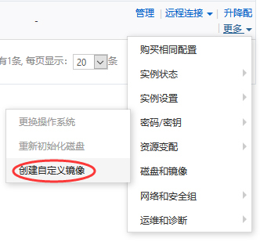
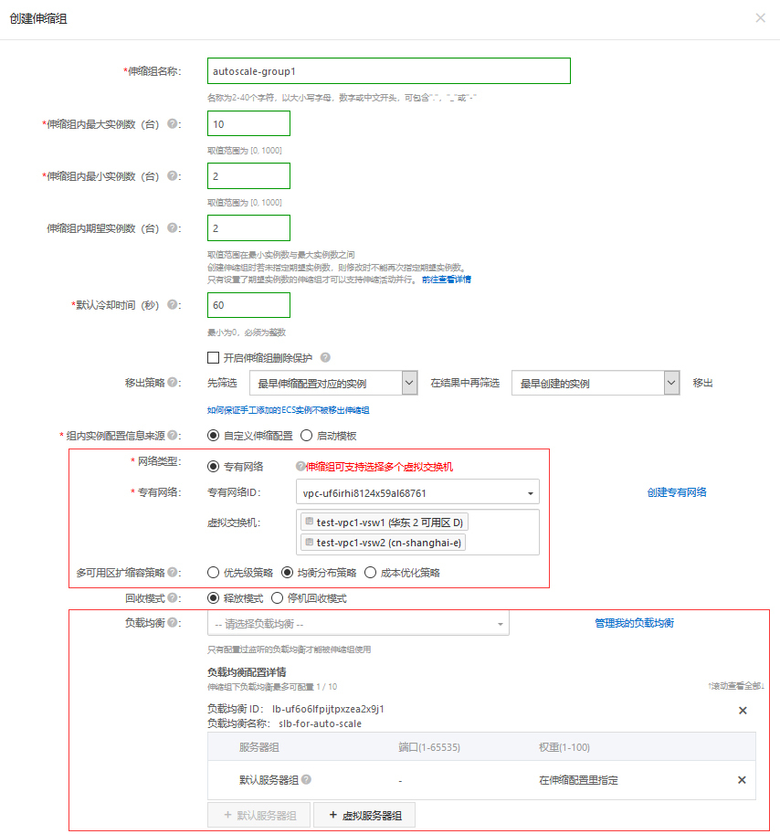
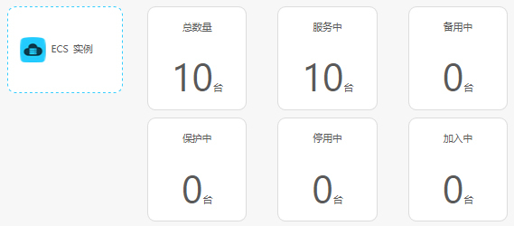

---
date: "2019-06-23"
---  
      
# 07 | 云端架构最佳实践：与故障同舞，与伸缩共生
你好，我是何恺铎。这一讲，我们来谈谈云上架构的注意事项和最佳实践。

云上架构最需要注意什么呢？就像我在标题所描述的那样，云端架构一方面需要处理和应对可能出现的**故障**，保证架构和服务的可用性；另一方面则是需要充分利用好云端的**弹性**，要能够根据负载进行灵活的伸缩。

## 面对故障，提升冗余

故障，是IT业界的永恒话题。故障的原因多种多样，无论是由于硬件的自然寿命造成的，还是数据中心的极端天气捣鬼，或是人工运维操作上的失误，不论我们多么讨厌它，故障似乎总是不可避免。

你也许会问，**那么，云计算会有故障吗？比如说，云上创建的虚拟机，是否百分之百会工作正常呢？**

很遗憾，虽然公有云们为了避免故障，在许多层面上做了冗余和封装，但云也不是可以让你永远无忧无虑的伊甸园。我们需要牢记，云端的服务仍然是有可能出故障的，只是概率上的不同而已。这也是云供应商们为云服务引入**服务等级协议**（Service Level Agreement，简称SLA）的原因，它主要是用来对服务的可靠性作出一个预期和保证。

SLA的可用性等级可能是99.9\%，也可能是99.99\%，它能够表明某项云服务在一段时间内，正常工作的时间不低于这个比例，也代表了厂商对于某项服务的信心。不过你要知道，再好的服务，即便是SLA里有再多的9，也不可能达到理论上的100\%。

<!-- [[[read_end]]] -->

小提示：当实际产生的故障，未达到SLA的要求时，云厂商一般会给予受到影响的客户以消费金额一定比例金额的赔付。不过很多时候，赔付的金额不足以覆盖业务上的经济损失，你不应该依赖它。

所以，从架构思维的角度上来说，我们需要假定故障就是可能会发生，对于它的影响事先就要做好准备，事先就进行推演并设置相关的冗余和预案。AWS有一个非常著名的架构原则，叫做**Design For Failure**，讲的也就是这个意思。

好在云上做高可用架构同样有自己的特点和优势，我们可以轻松地调用各个层面的云端基础设施来构建冗余，规避单点的风险。

**那么，云上可能出现哪些不同层面的故障？相应的故障范围和应对措施又会是怎样的呢？**我们不妨从小到大，依次来看我们可能遇到的问题和解决办法。

**第一种故障是在宿主机的级别，这也是从概率上来说最常见的一种故障。**当宿主机出现硬件故障等问题后，毫无疑问将影响位于同一宿主机上的多个虚拟机。为了避免产生这样的影响，当我们承载重要业务时，就需要创建多台虚拟机组成的集群，共同来进行支撑。这样，当一台虚拟机出现故障时，还有其他几台机器能够保证在线。

这里需要注意的是，**我们需要保证多个虚拟机不在同一台宿主机上，甚至不处于同一个机架上，以免这些虚拟机一起受到局部事故的影响。**那么，要怎么做到这一点呢？

虚拟机的排布看似是一个黑盒，但其实在公有云上是有办法来对虚拟机的物理分配施加干预，让它们实现分散分布，隔开一段距离的。这一特性，在AWS称为置放群组（Placement Group），Azure称为可用性集（Availability Set），阿里云对应的服务则是部署集。比如说，我们对阿里云同一个可用区内的虚拟机，在创建时选择同一个部署集，就可以保证相当程度的物理分散部署，从而最大限度地保证它们不同时出现故障了。

**第二种规模更大的故障，是在数据中心，也就是可用区的层面。**比如火灾、雷击等意外，就可能会导致数据中心级别的全部或者部分服务类型的停摆。有时一些施工导致的物理破坏，也会挖断光纤，影响可用区的骨干网络。

要应对这类故障，我们就需要**多可用区的实例部署**，这也是云抽象出可用区概念的意义所在。你的实例需要分散在多个可用区中，这样，可用区之间既可以互为主备，也可以同时对外服务，分担压力。另外，也不要忘记我在[上一讲](https://time.geekbang.org/column/article/211071)中所提到的，虚拟私有网络可以跨越可用区，这会大大方便我们多可用区架构的搭建。

**第三种更严重的故障，就是整个区域级别的事故了。**当然这种一般非常少见，只有地震等不可抗力因素，或者人为过失引发出的一系列连锁反应，才有可能造成这么大的影响。

区域级别的事故一般都难免会对业务造成影响了。这时能够进行补救的，主要看**多区域架构层面是否有相关的预案**。如果是互联网类的服务，这时最佳的做法，就是在DNS层面进行导流，把域名解析到另外的一个区域的备用服务上，底层的数据则需要我们日常进行着跨区域的实时同步。

再更进一步的万全之策，就需要考虑**多云**了，也就是同时选用多家云厂商的公有云，一起来服务业务。虽然集成多个异构的云会带来额外的成本，但这能够最大限度地降低服务风险，因为两家云厂商同时出问题的概率实在是太低了。更何况，多云还能带来避免厂商锁定的好处，现在其实也越来越多见了。

综上所述，不论是哪种级别的故障，我们应对的基本思想其实没有变化，都是化单点为多点，形成不同层面、不同粒度的冗余。当故障发生时，要能迅速地发现和切换，平滑地过渡到备用的服务和算力上。

当然，盲目地追求可用性也不可取。**根据业务需求，在成本投入与可用性之间获得一个最佳的平衡，才是你应该追求的目标。**试想一下，构建一个个人博客网站，和建立一个金融级系统，两者在可用性架构方面的要求显然天差地别，所以我们最后的架构选择也会大相径庭。

## 随机应变，弹性伸缩

弹性伸缩，这是云上架构的另一个原则，也是云端的重要优势。

由于云的本质是租用，而且它便捷的操作界面、丰富的SDK和自动控制选项，使得云上“租用”和“退租”的成本很低，可以是一个很高频的操作，这就为弹性伸缩在云上的出现和兴起提供了土壤。在妥善应用之下，弹性伸缩既可以提高工作负载洪峰来临时的吞吐和消化能力，提高业务稳定性，又能够在低谷期帮我们显著地节约成本。

在IaaS端，能够弹性伸缩的最实用的产品形态，莫过于**虚拟机编组**了，也就是功能相同的多个虚拟机的集合。把它们作为一个单位来创建、管理和伸缩，是一种普遍应用的最佳实践。AWS中相关的产品命名是 EC2自动伸缩（Auto Scaling），Azure中是虚拟机规模集（VM Scale Set），阿里云则叫做弹性伸缩。

我们把多个虚拟机以弹性伸缩组的方式进行统一管理，能够极大地提高效率，减轻负担。因为弹性伸缩服务，会帮我们动态地创建和销毁虚拟机实例，自动根据我们指定的数量和扩缩容规则，来协调虚拟机的生命周期。我们只需要从高层进行指挥就可以了。

弹性伸缩服务，在云端还有一个最佳拍档，就是**负载均衡器**。它特别适合将流量均匀地，或者按照一定权重或规则，分发到多台虚拟机上，正好可以和提供计算资源的弹性伸缩服务形成配合。当负载增大、虚拟机增加时，负载均衡也能够自动动态识别，将流量分发到新创建的虚拟机上。

**所以，你可以尝试使用弹性伸缩服务来实现云端弹性架构，用它来管理一组虚拟机，并与负载均衡一起配合。这特别适合处理无状态类的计算需求，因为它会为你代劳底层计算资源的管理。**

## 高可用的弹性架构实战

结合上面的介绍，让我们进入这一讲的实战环节。

**我们来模拟一个线上高可用服务的场景，来看下如何用阿里云进行服务的搭建。**我会在上一讲搭建的虚拟私有网络的基础上来提供服务，并做到一定程度的故障隔离和弹性扩展。

我们先用Node.js来搭建一个简单的Web服务，用来计算著名的“斐波那契数列”。相关的源码如下，供你参考：

```
    const express = require('express');
    const ip = require('ip');
    const os = require('os');
    const app = express();
    //使用递归计算斐波那契数列
    function fibo (n) {
        return n > 1 ? fibo(n-1) + fibo(n-2) : 1;
    }
    app.get('/', function(req,res) {res.write('I am healthy'); res.end();} );
    app.get('/fibo/:n', function(req, res) {
        var n = parseInt(req.params['n']);
        var f = fibo(n);
        res.write(`Fibo(${n}) = ${f} \n`);
        res.write(`Computed by ${os.hostname()} with private ip ${ip.address()} \n`);
        res.end();
    });
    app.listen(80);
    

```

我们在上一讲创建的虚拟机“vm1-in-vpc1”中安装好Node环境，将上述代码放入一个起名为“app.js”的文件中，用npm安装express等相关依赖后，就可以用命令“node app.js”直接运行了。然后，我们需要把这个服务设置为**开机自动启动**（你可以通过npm安装pm2组件来帮助实现开机自动启动），这样一个简单的Web服务就搭建好了。

为了让之后的外部流量能够进入到内部网络的多台虚拟机中，我们来建立对外的负载均衡实例。要注意，**负载均衡器本身也需要是高可用的**，我们这里主要选择华东2区域下的可用区D，让可用区E作为备可用区，和我们的VPC保持一致。


然后，在负载均衡器上配置一个HTTP协议80端口的监听，后端服务器可以先指向我们的测试机vm1-in-vpc1，然后从外部测试负载均衡器的连通性。


```
    [client@clientVM ~]$ curl http://47.101.77.110/fibo/35
    Fibo(35) = 14930352
    Computed by vm1-in-vpc1 with private ip 192.168.1.80
    

```

可以看到，curl命令的响应中，成功地返回了斐波那契数列第35项的结果值，以及相关服务器的名称、IP等信息，说明负载均衡已经初步正常工作了。

接下来，我们要创建一个能够弹性伸缩的虚拟机集群，来大规模地对外输出这个计算服务。

作为准备工作，我们要先为vm1-in-vpc1创建一个镜像，作为新建虚拟机的“种子”：

  


然后，我们就可以创建弹性伸缩实例了。我们来建立一个最小数量为2，最大数量为10的伸缩组。在这个过程中，你尤其需要注意，**要选取上一讲中建立的VPC作为目标网络，同时选择两个分属不同可用区的交换机，并设置为均匀分布策略**。如下图所示：



同时在这里，我们还为伸缩组和刚才建立的负载均衡器建立了关联，这样弹性伸缩实例中的机器，会自动地进入到负载均衡后端服务器的列表中。

下一步是建立伸缩配置，这里主要是指定虚拟机模板，记得选取我们刚才创建好的自定义镜像：


启用伸缩配置后，很快就能看到弹性伸缩服务为我们建立了两台虚拟机了：


在ECS控制台，你也可以清楚地看到，这两台机器被自动分配到了不同的可用区中，分属不同的交换机：


我们再设置一下非常重要的伸缩规则，**这会告诉伸缩组何时进行自动扩缩容**。这里我们选择监控平均CPU指标，我们希望理想状态下控制在50\%左右。换句话说，如果平均CPU偏离50\%太远，系统就会自动地为我们增加或减少机器。


回到最佳拍档**负载均衡**的管理界面，我们也看到弹性伸缩组中的两台机器，已经位于后端服务器列表中了（这时可以将测试机vm1-in-vpc1从后端服务中删去）：


我们试着来反复地访问负载均衡端的同一个入口URL，会获得来自不同可用区中不同机器的响应，这说明负载均衡的**随机分发**起到作用了：

```
    [client@clientVM ~]$ curl http://47.101.77.110/fibo/35
    Fibo(35) = 14930352
    Computed by iZuf68viqv1vrqntkpyihaZ with private ip 192.168.0.234
    [client@clientVM ~]$ curl http://47.101.77.110/fibo/35
    Fibo(35) = 14930352
    Computed by iZuf67wyymbgnnd69wkf31Z with private ip 192.168.1.89
    

```

最后也是最精彩的部分，**我们来使用siege命令来持续冲击这个负载均衡，使集群的平均CPU升高，看看它是否会自动扩容。**

```
    [client@clientVM ~]$ siege -c 15 -t 20m http://47.101.77.110/fibo/35
    ** SIEGE 4.0.2
    ** Preparing 15 concurrent users for battle.
    The server is now under siege...
    HTTP/1.1 200     0.14 secs:      88 bytes ==> GET  /fibo/35
    HTTP/1.1 200     0.16 secs:      87 bytes ==> GET  /fibo/35
    HTTP/1.1 200     0.28 secs:      88 bytes ==> GET  /fibo/35
    HTTP/1.1 200     0.29 secs:      87 bytes ==> GET  /fibo/35
    HTTP/1.1 200     0.41 secs:      88 bytes ==> GET  /fibo/35
    ...
    

```

果然，流量到来后，虚拟机的CPU飙升，伸缩组就自动地进行了新实例的创建，一直达到了我们设定的十台上限，以满足汹涌到达的计算请求。



伸缩组的峰值状态


伸缩活动历史记录

当siege命令停止后，平均CPU大幅降低，伸缩组还能自动地缩容，减少实例数量。上面的伸缩活动的截图也体现了这个过程。

至此，我们的跨可用区负载均衡的实验就大功告成了。

你也可以结合你实际的场景，来进一步地实验和拓展这个范例。比如在生产环境中，你通常需要为负载均衡的外部IP绑定正式的域名；或者你的Web服务很可能不是完全无状态的，需要依赖后端数据库；再比如，你可以尝试在别的区域再建立一个VPC，让两个VPC互相连接，新VPC可以作为冷备，或者承担日志数据分析的工作，这样能够形成一个类似“两地三中心”的强壮架构。

## 课堂总结与思考

今天涉及的点比较多，我们谈到了故障范围和故障处理，也谈到了云端的弹性优势。这次的实验也相对大一些，比较完整地构造了一个负载均衡加弹性伸缩的架构。不知道你掌握得怎样，有没有相关的问题，欢迎你在这里留言，和我一起探讨。

**今天我留给你的思考题是：**

* 大多数云上负载均衡产品都有一个重要特性，叫做“**会话保持**”，你知道它是用来做什么的吗？它的原理又是什么呢？
* 默认情况下，弹性伸缩服务会使用按量计费的虚拟机。那么成本上更有优势的包年包月虚拟机，或者竞价实例的虚拟机，能够融入弹性伸缩的体系吗？

好了，今天我们就到这里。如果你觉得有收获，欢迎把这篇文章分享给你的朋友。感谢阅读，我们下期再见。