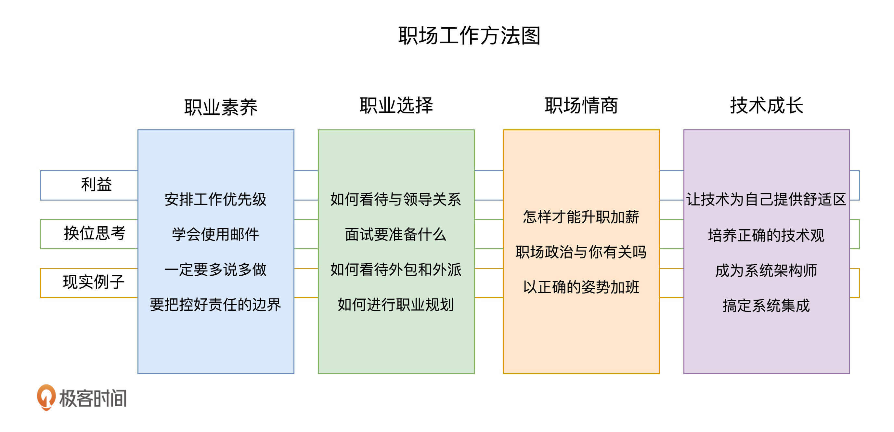

---
date: "2019-06-23"
---  
      
# 开篇词 | 学会如何工作，和学习技术同等重要
你好，我是臧萌，一名已经工作了14年的一线程序员。这些年来，我曾先后在Sybase、eBay、盛大、亚马逊、携程工作，目前是PayPal数据处理组的技术负责人。

回顾我这14年来的工作，其实并不是一帆风顺的。我犯过一些常识性的错误，也对工作中遇到的事情有过迷惑和不解，自然而然的，也就吃过一些亏。后来我遇到了许许多多的程序员，发现无论是初级的，还是中高级的，都会遇到和我一样的问题。

有次一群朋友一起吃饭，有个人说自己最近特别苦恼：

“我现在在一家还不错的公司做后端开发，虽然公司是个很大的跨国企业，在业界也很知名。但是我们公司其实没有自己的产品，说白了，就是专门给人做外包的。我一开始想着公司不错，虽说是外包，但是能做不同的项目，我也能多接触一些东西。但是时间长了我就发现有点不对……”

“我的同学都有自己的专攻方向，我却没有，我还要不要留在这里？有个同事跟我一起入职，但现在职级比我高，为啥升他没升我啊？”

我认真想了一下，他的情况，他的问题都似曾相识。

其实很多人这么迷茫，是因为陷入了“技术之外，别的不重要”的误区。事实上，除了赖以生存的技术本领之外，有很多看似很小的工作细节，也是造成不同人在职场上处于不同地位的重要因素。它会在你不知不觉的情况下，影响你的工作成果、个人成长以及方方面面。

<!-- [[[read_end]]] -->

学生时期的我们都想知道如何学习，同样的，到了职场上，我们也要知道如何工作。这不仅仅包括技术方面的事情，也包括如何与同事协作、如何与上司沟通、如何正确地使用邮件等等一系列需要与同事打交道并付诸实施的事情。

经过我这么多年的工作经验，我发现这些事情虽然琐碎，但其实可以大致分为4类，它们分别是职业素养、职业选择、职场情商和技术成长。这也是专栏的模块划分。

在**职业素养篇**中，我们将会讨论如何培养良好的工作习惯。这些习惯很容易影响我们的工作效率和与同事之间的关系。比如，你以为邮件仅仅只是发送信息的吗？邮件的背后有什么样的工作逻辑？再比如，来自领导和部门的任务那么多，我们要如何根据任务的性质划分出它们的重要性？

在**职业选择篇**中，我们将会探讨工作选择，以及与领导之间的关系。在就业形势如此严峻的情况下，我们选择公司要比之前更加谨慎。如何选择和自己“聊得来”的领导？他们都有怎样的特质？在此基础上，如何选择心仪的公司？你是更适合创业公司还是更适合成熟的大公司呢？

在**职场情商篇**中，我们会探讨一个比较敏感的话题，那就是职场政治。我们都说，有人的地方就有江湖，相信不少人都会对同事关系感到头疼。比如最常见的，为啥领导更喜欢他？工作能力也许是一个原因，但绝不是唯一的原因，在这背后，个人的输出、看问题的方式和立场、工作的方式也同样重要。

最后一个篇幅是我们最熟悉的内容，那就是跟**技术相关**的一系列话题。在提升技术能力的道路上，我们需要注意哪些坑？技术是一种手段，也是一种观念，技术观为何如此重要？它能指导我们什么？

## 我是如何在文章中讲述这些内容的？

问题已经摆出来了，那么如何带着你将每个问题都想透彻呢？

我的做法是，以利益为视角，以换位思考为手段，以现实例子为场景来给你讲。而事实上，我平时其实也是这样思考问题的。每个人在职场中遇到的问题都是不同的，都会有具体的背景，因此，即便我已经尽可能考虑到了你可能会遇到的问题，但是也可能有漏网之鱼。怎么办呢？放心，这套思考问题的方式，换在任何问题上，都是完全适用的。

### 以利益为视角

当我们想要理解工作中的各种问题和各种事情的时候，不妨坦诚地从“利益”这个视角思考，弄清事情背后的“原动力”。别觉得“利益”是什么不好的词儿。公司存在的最主要目的就是创造利润，而我们工作最主要的目的就是赚钱。但是，除了看得见摸得着的金钱，我们可以从工作中获取的“钱”还有很多，比如升职、学习、实战的积累、好的成长机会、可以复用的资源、公司内外的声誉等等。

可以说，利益贯穿了工作中的每个关键环节，是推动工作中几乎所有事情的原动力。这样想的话，很多时候事情的走向就会简单、明晰很多。

### 换位思考为手段

换位思考是一种很重要的能力，很多事情之所以不能理解，甚至看上去匪夷所思，其实就是因为我们没有把自己的屁股坐在在对方的板凳上，站在对方的利益考虑问题。

你可能要说了，换位思考到底对我有啥好处呢？

我觉得最直接的一点就是，换位思考可以帮助我们自己更高效地工作，因为它能有效地帮我们避免一些麻烦，在做事情之前预知随之而来的后果。

### 现实的场景为例子

我们都讨厌干巴巴的理论讲述和推断过程，那太枯燥了。因此，我在讲课的时候，充分考虑到了这一点。刚好，咱们课程中的问题，其实原本就是现实工作中的。所以我在讲述的时候，基本都是把这些真实的场景直接给你给放进来。

在我开始讲之前，你可以去想想，如果你遇到了这个问题，你是怎么想的，你会怎么解决。然后，再看看我的做法，是不是和你的一样。这样对比的过程，你慢慢就能明白，我们的思考问题的方式，有啥不一样。我也欢迎，你对这些话题提出更多自己的想法，我们能够教学相长，共同进步！

我一直坚信，学会如何工作，和学习具体的技术是同等重要的。我一直觉得，在职场中，我们每一步的经历都是有用的，我们在职场中遇到的每一个问题都不小。正是这一点一滴，才构成了我们的职场生活。

你想想，我们人生的多少时间是在职场中度过的呢？你不想更有意义地度过职场人生吗？