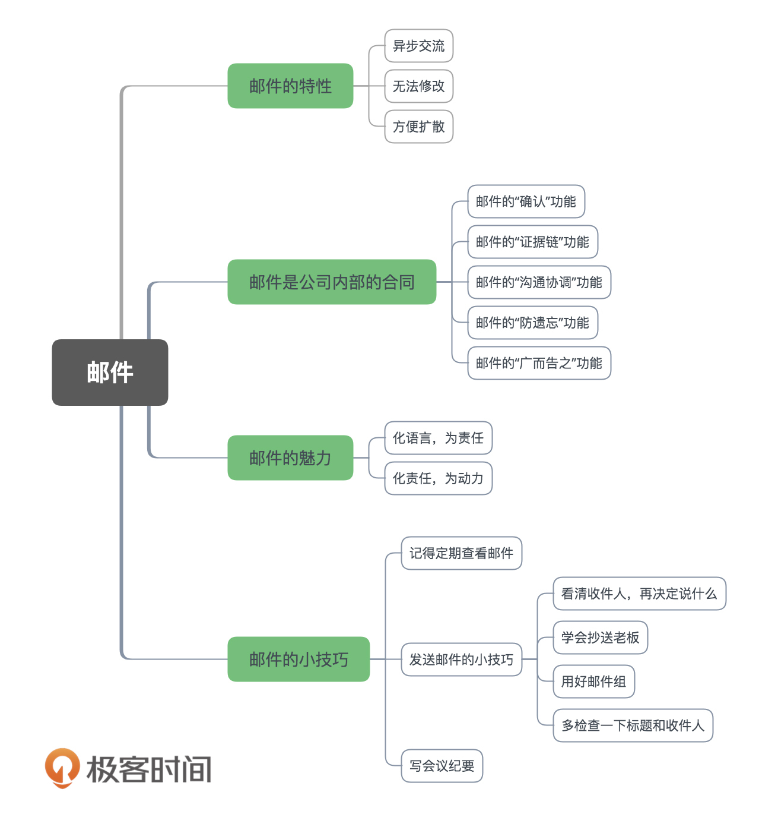

---
date: "2019-06-23"
---  
      
# 02丨沟通：邮件那么重要，你还在轻视邮件吗？
我刚毕业开始工作的时候，是比较讨厌邮件的。面对面聊不好吗，异地的话打电话不好吗？但是现在，我和组外的工作伙伴说得最多的一句话就是：“好的，你发封邮件给我吧。”有时候会再加一句，“抄送我老板”。

嗯，成功变成了自己当初讨厌的样子。为什么呢？

其实工作多年的人都隐隐理解邮件背后的含义，但是不会明说。我有一位前辈在某次组内会议的时候，直接捅破了窗户纸：“邮件不是用来沟通的，它是用来撕扯和甩锅的。”

为什么这么说呢？让我们先从邮件的功能开始说起。

## 邮件的特性

在我看来，邮件有三个重要的特性。

1.  异步交流：邮件是一种异步交流的方式，双方有足够的时间准备邮件内容。
2.  无法修改：邮件内容无法修改，这是邮件可靠的基石。
3.  方便扩散：邮件有邮件组，可以很方便地把相关人员加进来，并且保留邮件历史记录。

## 邮件是公司内部的合同

下面我们开始聊有意思的。邮件，其实就是一种简易版的合同。在这里呢，我们来模仿电商公司两个组之间的一次合作，以此来看看邮件在整个过程中的作用。

### 情景介绍

业务组负责开发业务，对接和集成上层产品线，配合运营做营销活动等。基础服务组负责提供基础框架和服务，蹭个流行一点的词，就是中台。这次的功能是购物车，需求一层层传递下来，基础服务组需要提供一个“购物车功能”给业务组使用。

<!-- [[[read_end]]] -->

#### 场景1：设计确认（邮件的“确认”功能）

购物车的需求设计等等需要一个接一个的会议讨论。当然，需求最后也要用文档的方式确定，并且通过**邮件**的方式通知所有相关人员。邮件这种异步沟通的方式，其实就是给双方足够的时间去细细地看，不催着你立刻给一个确定的回复。邮件可以随意加人，如果有任何疑问，可以随时把相关人员加进邮件线程（email thread）。

我们工程师作为实际干活的人，有问题一定要提出来，或者和组内讨论，或者在邮件讨论。关键的点可以在邮件里确认，比如购物车的数据是保存在服务器端，而非session中。

如果你收到邮件又不说话，那就是默认。

如果没有问题，相关人员（比如经理、技术经理、功能主程、双方对口人之一）应该礼节性地回复一个赞扬的邮件，内容不重要，重要的是这封邮件代表你已经同意邮件内容了。注意，这点很重要：同意。这时候，双方相当于签订了合同，合同内容就是大家对购物车功能的共识。

购物车功能的需求清楚了，开发周期有个差不多的数字了。经过双方估计，基础服务组大概需要10个人做两个月，一台标准服务器可以服务10w活跃用户。

#### 场景2：优先级（邮件的“证据链”功能）

这时候第一个扯点来了：优先级。按照这个预估的工作量，基础服务组之前排好的工作计划就要重新排。但是基础服务组之前已经排好的需求，也大多为了业务组服务的。这个球就踢到了业务组：是把已经排好期的某些功能往后推，还是把购物车功能往后推？亦或者暂且简化购物车的功能，压缩工期到5人一周（比如把购物车保存在session里）？钱多优先级都高的话，可以借人或者招人。双方的经理可以开会，拉上各种相关人员做出决定。业务组内部肯定也会有不同的声音，如果之前的功能排期被挤掉了，肯定会影响业务组一些人的工作。

所以，这时候得出的结论，一定要通过邮件的方式让业务组老大发出来确认。

无论是推迟已经做好的计划，还是简化购物车功能，都可能带来潜在的业务风险。邮件的作用就是允许人在深思熟虑之后，通过邮件的方式宣布决定。这时候，这封邮件就是合同。同样的，基础服务组也要履行自己的承诺，10个人，2个月，做出之前设计的购物车功能。

如果业务组老大的决定是推迟已经安排的功能开发，若是因此被竞争对手抢走了很多用户，那么业务组老大要承担大部分责任。开撕的时候，这封邮件就是依据。同样的，如果2个月没做出购物车功能，这个锅就要算在基础服务组头上。当然，有些时候项目延期，并不会导致明显的损失（软件行业开发延期再正常不过了）。所以这份合同，会不会被用来当做开撕的证据，不好说。但是我们在公司做事，还是要严谨稳妥一点，别在邮件里承诺自己没有把握的事情，力争做到“没事儿Be Nice，有事儿必耐撕”。

#### 场景3：大促（邮件的“沟通协调”功能）

接下来公司搞大促了。沟通从运营一路到业务，到基础服务，到运维，到预算批准，到服务器上线，服务部署等等，每个操作都需要相关的组给出明确的操作细节和时间节点，比如大促的时间、峰值人流、持续频率、活动地区（全国还是某些省市）等方面的数据，都需要相关的组在内部充分沟通之后，以邮件的方式确定。各个组之间通过邮件的方式签合同，用邮件组等方式确定各个组和人员都得到了相同的信息。

每个组各自背负好各自的责任。

#### 场景4：新业务接入（邮件的“防遗忘”功能）

紧接着，公司别的业务也要接入购物车了。对基础部门的你来说，改动可能就是增加一个配置。但如果业务组的人过来找到你，说：“哥们，购物车功能棒棒哒，我们安卓的应用也要用啦，给加个配置呗。”你脑子一热说：“好好好，立刻就加。”

那么这种沟通，就是双输。

为什么呢？

对业务组来说，他们并没有得到一个上线的保证，只是你的一句口头承诺。而你可能一忙，转头就忘了。如果业务组立刻着手进行安卓的购物车集成，结果上线之后发现你这边还没改配置，这就是车祸现场。

对你来说，如果你真的立刻做了这个事情，组里没有人知道，非但无功，而且有过。配置的修改，至少要对流量有个预估吧。而这些数据，包括上线时间，还是需要用邮件的形式做出正式的沟通和确认。还有很重要的一点，一个组要做的事情，需要在组内告知，因为组员都可能会修改这个服务，万一有对安卓不兼容的改动而你不知道，上线之后依旧是车祸现场。当然组内的沟通，可以不通过邮件这种方式。

#### 场景5：技术升级和Bug修复（邮件的“广而告之”功能）

接下来是基础服务组要对服务做改动，可能是一个Bug的修复，也可能是技术升级，比如增加一层Redis缓存。发布的时候，服务的可用性可能会受到影响。作为基础服务组的你，如果只是走到业务组那边，找个相熟的人问：“哥们，今天晚上我们做个升级，购物车大概停服一个小时。”你哥们也很“够意思”，说：“木有问题。”那么你们俩就都掉坑里去了。

你这个哥们可能不知道全组的情况，可能组里有些项目今天晚上正好要用到购物车服务。万一出了事情，俩人就都得歇菜。所以和上面的情况一样，还是要用邮件加邮件组，充分告知足够的人，而且提前足够多的时间（比如三天），让大家都能得知变动的计划详情。

## 邮件的魅力

到这里可能你会觉得心好累，为什么有这么多算计，为什么不能干就完了。其实，**这不是算计，这是负责**。邮件是正式的沟通渠道，一封邮件如同一份合同。我现在为什么张口闭口让别人发邮件给我，因为别人张口就来的需求，可能并没有经过深思熟虑，也可能没有经过他们组内部的讨论。我让对方发邮件的初衷，就是让对方好好思索和沟通好之后，给出一个正式的需求，而不是草草地开始做事。

同时，邮件确认了，做不好就要负责，也就是“背锅”。**我们都是普通人，普通人没有“背锅”的压力，就没有持久的把事情做好的动力**。你品，你细细品，我们是不是这样的人。

## 邮件的小技巧

我在上面说了很多，模拟了一个场景，既想让你了解合同的重要作用，也想让你知道合同的正确使用方式。那么在这里，我再给一些使用合同的小技巧，或者注意事项，希望对你有帮助。

#### 定期查看邮件

既然是要使用邮件，那我们就要定期看邮件。不要觉得这个建议很不起眼，事实上，我刚开始工作那几年，经理经常跟我说这句话。因为那时候的我还时不时地会漏掉公司的一些公告信息，以及别的组请我们帮忙的邮件。这就很尴尬了。所以一定要养成定期查看邮件的习惯。

#### 发送邮件的小技巧

回复或发送一封邮件的时候，看清收件人有哪些，再决定自己该说什么。

首先要学会抄送老板。如果想催促进度，就抄上对方的老板。如果觉得自己搞不定，记得抄上自己的老板。

其次要用好邮件组，该加人的时候加人，比如某个组的邮件列表，某个部门的邮件列表等。做到应通知，尽通知。避免只通知某个组的某个人，以免这个人对邮件中的事情有误解或者漏掉了信息。

如果你的邮件收件人比较多，那就记得**多检查一下邮件内容和标题**。版本公告就是个例子，每次都是复制上一次的模版然后修改一下。我曾经不止一次忘记改标题或者时间，虽然没直接影响，但是会让人觉得你不仔细（本来就不仔细囧）。

#### 写会议纪要

如果是和自己相关的会，开完会之后一定要记得发一封会议纪要，给所有参会人员。会议纪要可以总结这个会上得出的共识，列出下一步可以采取的行动，保证这个会上得出的成果不会被遗忘或者被误解。

## 总结

我今天讲有关邮件的一些内容，比如邮件的功能、使用技巧等。其实你也能看出来，邮件不只是一个沟通的渠道，而是一个正式的，签合同的渠道。现在很多公司也在积极的使用更高效的工具代替邮件的功能，但是本质是一样的。

因此，在正式的工作使用场所中，我们要牢记使用邮件的注意事项，这样一来可以避免工作沟通带来的问题，二来也可以帮助自己梳理工作任务。

发邮件要有仪式感。邮件只是一种形式，如果公司不使用邮件，也会有一种正式的沟通渠道。好好利用它，祝大家工作愉快。

## 思考题

你在使用邮件的问题上，有过哪些疑问或者故事吗？欢迎在评论区讨论，我会和你一起交流，也欢迎你把这篇文章分享给你的朋友或者同事，一起交流一下。