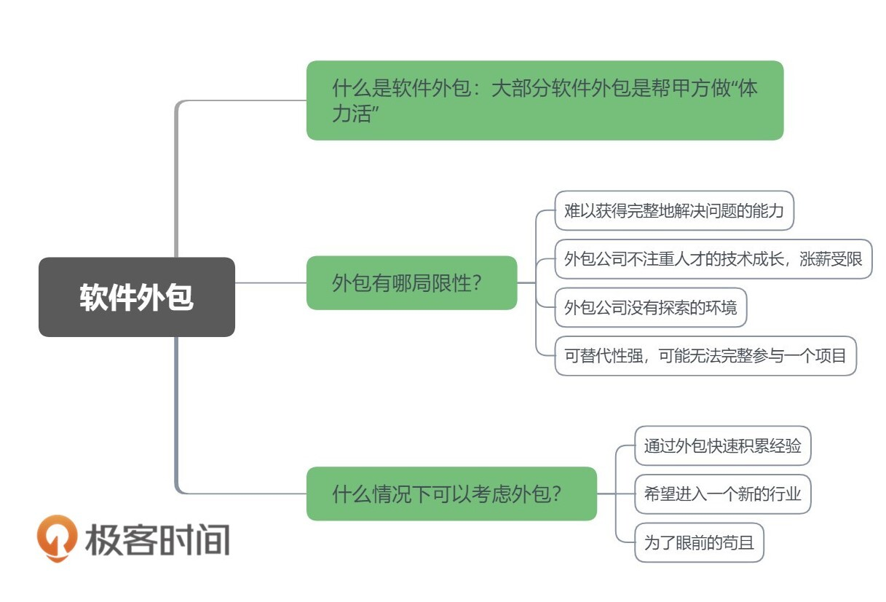

---
date: "2019-06-23"
---  
      
# 12丨外包：外包不也是写程序吗？有什么不一样的？
有一种软件公司，叫做软件外包公司。软件外包公司做的是拿甲方的钱，按甲方的要求，帮甲方完成项目的工作。这里的工作一般就是写代码，也可能会包括一些上线、运维、维护等内容。

外包的工作一般是以项目为单位的。一般来说，如果项目需求设计都很清楚，外包公司都会在自己的办公地点工作。也有项目需要频繁和甲方交流的，根据实际情况，外包公司也会让项目相关的员工去甲方的办公地点工作。

除了这个形式上的特殊之外，软件外包具体是做什么的呢？和软件研发有什么区别呢？外包值不值得做呢？

我可以在这里先甩出结论：一个程序员，如果想长期从事这个行业，那么外包不值得做太多年。下面我们就来说说为什么。

## 从修路的例子看，外包有什么限制？

首先，我们来看个修路的例子，通过这个例子我们来看看外包的主要矛盾到底是什么。

假设A公司要给一个开发区规划公路，那么A公司要考虑的事情其实有很多，比如哪里是居民区，哪里是办公区，哪里是主干道，各条道路分别需要几个车道，路的承重多少，路基怎么设计才能扛得住承重……除了设计，可能还要铺设简单的实验道路，验证设计的可行性。

当A公司做好所有这些设计之后，就会交给市面上专业的修路公司，将修路工程外包给这些公司去做。修路公司人多，长期从事铺路工作，签了合同之后就可以带着几百上千号人拿着图纸开干。

<!-- [[[read_end]]] -->

这时候，我们可以认为，A公司就是甲方，修路公司就是外包公司。外包公司在具体做项目的时候，对路的各种技术细节以及其背后的奥妙，其实并不是特别清楚。比如为什么这条路是双向8车道，而不是双向6车道？为什么路基要分这么多层，每层要这么厚？为什么路面的坡度是这样的，而不是大一度或者小一度？

看到这里，我想你应该明白了，我们的软件开发上也是同样的道理。

软件外包中，甲方公司一般也都有些软件背景，会自己分析需求，自己做出详细的系统设计，但是写代码的人手不够。这时候甲方公司就找到外包公司，让外包公司按照自己的设计，帮自己写代码做系统。

做软件外包，其实就要面对着一堆需求文档、API文档和详细设计说明书，照着要求写代码。但是代码背后的业务逻辑，外包人员可能是无法理解的。比如说，原始的需求是什么样的？基于这些需求，又经过了怎样的讨论和权衡，才得出这样的API设计？API文档中为什么要强调某个地方？缓存为什么是Redis？为什么设计里使用的数据库是MySQL而不是MongoDB？

看到这里，是不是已经隐约感觉外包和非外包的区别了？外包工作并不能让我们详细地了解工程的本质，除此以外，它对我们的限制还体现在方方面面。

## 外包的限制具体有哪些？

### 难以获得完整地解决问题的能力

**如果用一句话来概括，我觉得外包真正的问题在于，它的工作内容只包括最后的写代码，不包括写代码之前的思考和筹备过程**。然而就是这个思考的过程，对程序员来说，是非常重要的锻炼。通过这种锻炼，程序员可以逐渐培养出思考问题的能力，再学着将这些问题分解为一个个小的、复杂度可控的模块，进而通过编程完成一个能解决问题的系统。这就是使用技术解决问题的能力。另外，还能够积累在相关领域的专业经验。而这些积累，是程序员拥有更好待遇的有力支撑。

纯粹写代码，并不是解决问题的完整过程。如果不经过前期的思考和锻炼，解决问题的能力是无法得到很好的锻炼的。就好像只修路的工人很难理解路背后各个参数的含义，自己也就没办法设计出一条合格的公路。

### 外包公司不注重人才的技术成长，涨薪受限

外包的工作内容，事实上也决定了外包公司对人才的态度。从外包公司的利益来看，只要员工能够“按照需求，写出代码，完成功能”就可以了。只要能够到达这个水准，那么外包公司就没有理由，也没有动力去培养人才了。

同样的道理，一般外包公司也不会鼓励员工深入学习一门技术。毕竟外包公司的任务就是把事情做出来，至于怎么做更好就不在外包公司操心的范围内了，甚至可以说，外包公司也操不上心。所以，我们在前面提到的很多主观能动性等内容，在外包公司看来，并没有太多的适用场景。

在我看来，外包公司不鼓励程序员深入学习还有两层利益的考虑，一方面，学习需要耗费时间。技术够用就行，没必要探索用不到的新技术，公司更希望你用这个时间来干活。另一方面，如果程序员技术精进了，跳槽的几率就会变大。因为外包公司不需要程序员有强大的技术，而程序员有了技术傍身，工资又不涨，自然会考虑跳槽。

### 外包公司没有探索的环境

因为需求和详细设计都是甲方定的，作为实施的乙方，也没有权利和自由去实践可能更好的方案。需求里写的用MySQL，那么就是MySQL，即使乙方的开发人员再怎么觉得用MongoDB好，也没有权利和渠道更改。

我们还是用修路的例子来举例。如果A公司的一个设计人员通过计算，认为改一下混凝土的成分比例和路基的厚度，可以降低成本，达到更好的承重效果。那么A公司大概率会鼓励创新，让设计人员铺个实验路面试试看。

但如果是铺路公司的施工工人有这个想法，负责人大概率只会让工人老老实实按照图纸施工。一方面是因为就算乙方有了更好的实施方案，也不会拿到更多的钱，另一方面是铺路的材料可能都已经按照之前的规划定好了，已经过了方案修改的窗口期，修改的代价太高了。

### 可替代性强，可能无法完整参与一个项目

因为外包公司的工作比较单一，所以可替代性也更强，同样外包公司程序员的可替代性也强。这也造成了外包公司的人员流动比较大。

外包公司可能会被甲方换掉，即使不换掉，一个项目的程序员也可能无法参与项目的下一期的工作，甚至有可能在做一个项目的过程中就被抽调走了。

从成长和积累的角度来说，程序员最好能参与项目的整个过程，甚至一个项目多期的开发，这样就能够沉淀完整的经验。如果是东一榔头，西一棒槌，技术和业务都很难沉淀下来。如果能参与一个项目多期的开发，也可以从这个项目的技术演进中，学到不少东西，但是如果无法连续参与，也无法收获这部分经验。

## 什么情况下可以考虑外包？

看完了上面的内容，我不知道你有没有发现，我不赞同长期从事外包工作的出发点只有一个，那就是不利于程序员的个人成长。那么反过来说，只要你觉得自己有成长，有收获，那么从事外包也不要紧，毕竟凡事没有绝对。外包没有好与不好，只有合适与不合适。

这里我一下可以考虑外包的几种情况。

### 通过外包快速积累经验

对于刚毕业的同学来说，好的外包公司也不失为一个不错的开始。成熟的外包公司一般会有规范的项目管理、文档管理和代码规范管理等，这些可以培养程序员优秀的编码习惯。同时，在还没有熟练掌握一个技术之前，在外包公司可以通过项目将自己的熟练度提升上去。

### 希望进入一个新的行业

有的外包公司有自己的工作风格，比如主要接某个行业的外包项目。那么如果你想进入某个行业，但没有相关经验，无法通过面试直接进入这些公司。那么不妨考虑相关行业的龙头外包公司，积累相关的行业经验。

当然，并不是每个人都喜欢一直从事一线程序员的。相比来说，外包公司更容易转管理。当然，我并不认为管理是程序员必须走上的道路。后面我会专门写一篇文章来聊这个话题。

## 总结

外包公司并不是一个很好的让程序员可以长期发展成才的环境。在外包公司呆久了，这种氛围可能会让人有两个错误的认知：程序员的工作就只是写程序；程序员只有转管理才有前途。

如果想要成长，就不要被外包公司的氛围影响，做个有心人，肯下功夫，也会有自己的收获。当然，如果你觉得在外包公司已经没有太多的成长空间了，感觉自己不想只是写程序了，那么不妨换个环境。一般来说，在一项技术上如果有三年的积淀就差不多成熟了，五年就可以说很成熟了。这时候如果还想继续做程序员，就要考虑向更高的层面发展了，去锻炼自己除了写代码之外的能力。

当然，实际的外包形式有很多，今天的内容里只是讨论了一种最主流的形式。也有一些外包公司反其道而行之，专门做一些甲方无法搞定的非常专业的工作，甚至连方案都是外包公司参与一起制定的。想当初，MS-DOS就是IBM外包给微软开发的。如果你正在从事外包工作，千万不要否定自己的工作。总之一句话：只要感到自己有成长，有收获，那么就是值得的。  

## 思考题

外包可以说是一个很常见的现象了。不知道你有没有在外包公司工作过呢？根据你的成长历程，你有哪些感触呢，欢迎在评论区和我交流。也欢迎把这篇文章分享给你的朋友或者同事，一起交流一下。