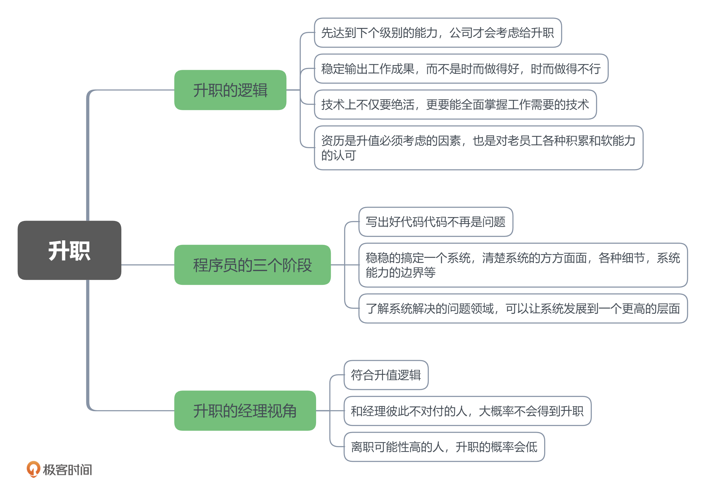

---
date: "2019-06-23"
---  
      
# 17 | 升职：看着周围的人都升职了，我什么时候才能升职？
你好，我是臧萌。今天我们来聊聊升职那些事儿。

升职加薪，人人心向往之。但是升职之路，怎么才能走得顺呢？大家都在同一个公司混，为啥别人升职我没有，我真的比别人差吗？要是差的话，又差在哪里呢？今天这篇文章我们就来聊聊升职这档子事儿。

但我讲的不是咋升到很高的层次，我就讲如何从萌新升到临界级别。临界级别我之前的文章中有提到过，简单来说就是指在公司里只要专心把事情做好，就可以升到的级别。临界级别我们都能达到，但是有人到的快，有人到的慢，还有人到了临界级别后，憋很多年也没升职。

## 升职的逻辑

那你可能要问了，这到底是为啥呢？其实，升职这事大有学问。首先呢，我们来聊聊升职的逻辑。每家公司的风格都有不同，我给出了你升职逻辑的四个共同点。

### 1.先做到，再升职

说到升职，可能很多朋友会有一个问题：我本职工作做得很好啊，可为什么升职没有我呢？

这就要说到升职的第一个逻辑了，那就是先能做到下一级别的事情，才会升职到下一个级别。简单来说，你要先证明自己具备下个级别的能力，才能升职到下个级别。而不是去指望公司先给你升职，再自己努力达到下一个级别的要求。

所以，当前的工作做得好，只能说明自己能力对得上当前的级别。当前的工作越做越好，加薪的几率越大。但是这并不是说当前的工作做好了，就理所当然地可以升职了。

<!-- [[[read_end]]] -->

公司给员工升职加薪，不是因为他之前做得多好，而是因为相信他以后能够做得更好。公司是为未来买单。简单来说，公司花钱肯定是有明确的目的。俗话说得好，不见兔子不撒鹰。你之前做的工作，公司给了你工资，给了你奖金，这就是两清了。只有你已经证明自己可以做得更多，做得更好的时候，公司才会相信你未来也可以延续这个势头，然后考虑给你升职加薪。

如果你任性地想着，公司不给我升职，我为啥要做得更多？那你就完全想错了。因为公司和经理不会这么想。因为你的表现还没达到下一个级别，如果给你升了职，结果你还是达不到下一个职级的要求，那怎么办？

毕竟一个职级应该做到什么，做得好不好，都是比较主观的事情。升职升上去了，再降下来的话阻力就会很大。这就好像奖金一样。奖金的规定可以模糊，但如果是罚金，那一定要规定得很严格，否则没人觉得自己应该被罚钱。升职的决定权掌握在公司和经理手里，那么公司和经理自然想让升职这件事情的主动权掌握在自己手里，而不是你手里。

大多数时候，很多公司对于那些无法证明自己能力的老员工，不会给他们升职，而是宁可招聘新的更高级别的员工。因为员工如果表现没有到下一个级别，给他们升职就会是一个错误的示范。会让更多的人觉得混着就应该得到升职。公司可不想让员工有这种念头。

### 2.稳定输出

你可能又要问了，下一个级别的同事能做到的事情，我也能做到呀，为啥我还没升职呢？

这里就要说到稳定输出了。在职场，稳定的输出是黄金一般的品质。

我们来举个视频App的例子。比如说有这样两个视频App，一个App在打开视频的时候，有99.99\%的概率会最多缓冲3s，后面就会顺畅播放视频。另一个App有80\%的概率视频一秒不卡，还有20\%的概率每一帧都卡，卡到忧伤。如果只能选一个App，你会选择哪个App？我想大部分没有自虐倾向的人都会选择第一个App。这就是稳定的魅力。

工作中也是一样。稳定输出，结果可期。不求有惊喜，但求没惊吓。如果做一个事情这次用一天，下次用五天，再下次用一个小时。试想一下，如果你是经理，你敢给这样的员工重要的事情吗？万一下次用一个星期都搞不定呢？所以不如去选择一个，每次都能两天搞定事情的员工。

级别越高，对稳定输出的要求也越高。这里稳定输出的内容，也可能不仅限于具体的某个工作。也包括一些日常琐碎的事情，比如不会漏掉客户发来的邮件和消息、每天都会查看系统dashboard、每次都记得将发布流程按规定走完、每次写完代码都会记得增加UT、每次遇到问题都会记得给系统增加新的报警规则等等。

稳定代表可靠。所有的经理都喜欢稳定发挥的人。而经理喜欢的人，有更大的升职机会。

结合前面说的“先做到，再升职”的逻辑，稳定发挥意味着你能够在连续的几件事情上，都发挥出下一个级别的能力，达到下一个级别的水准。这样才能让经理对你放心，你才会有更大的升职概率。时而行时而不行，就好像一盏灯一会儿明，一会暗，只会伤眼睛，起不到太大的照明作用。你只有稳定地发出光，才能当灯用。

### 3.不仅要绝活，更要靠全面

我们玩技术的，都更喜欢靠技术出位。也就是说，要靠自己技术好，博得大家的认可。这点没问题，但是光技术好是远远不够的，还要足够全面，这样才是全面的好。别人都会的，自己也要会。然后再去说别人不会的我也会。而不是别人都会的，我觉得没意思，我就要整点别人都不会只有我会的。

我再来举个例子帮你理解一下绝活与全面的关系。假设一个人在工作中需要使用ABC三种技术：有两个选择，一个选择是自己的A和C技术都达到平均水平，B技术略突出；一个是自己A和C技术基本无法完成工作，B技术超牛，各种犄角旮旯的东西都会。

在实际工作中，前者会更受经理喜欢。毕竟工作中用到的技术是全面的，只会B技术，基本无法独立地去完成任何一项工作。即使偶尔有机会靠B技术，亮出自己的绝活，也无法让人认可他的综合能力。

所以我建议你不要沉迷于只靠绝活。工作中用到的技术，你一定都要学会，就算是硬着头皮学，也得让自己能达到可以独立完成工作的程度。毕竟公司雇佣一个员工，是为了让员工完成工作，不是来技惊四座的。

### 4.资历老

在能力差不多的情况下，肯定是资历更老的同事更容易升职。这是人之常情。就好像我们前面提到的，程序员的日常工作还包含了交流和沟通，资历老的同事在一个公司里认识的人更多，这也是能力之一。

同时，资历老的同事通常有更多公司相关的经验积累，比如熟悉各种明坑案渠，各种系统怎么用，哪个同事对某个系统最精通等等。升职资历老的同事，一方面是对这种软能力和技能的认可，同时也是对资历的认可。

## 程序员的三个阶段

每个公司的职级划分都不同，对于每个职级的能力要求也都不同。我根据我的经历和理解，将程序员的能力划分为下面三个阶段。

### 1.写代码

这个阶段的工作就是能够按照设计，完成代码的编写和bugfix。这个阶段要锻炼出熟练的编码手感，养成良好的编码习惯。按照我的理解，这个阶段要达成的主要成就有以下五个。

* 能够完成具体功能的代码，保证代码质量。
* 有阅读代码的能力。
* 开始理解和掌握基本的设计模式。
* 不再闷头就开始写代码，而是开始在class和package层级，思考和实践高内聚、低耦合的代码。
* 建立自己学习技术的体系，培养学习技术的习惯。

这个阶段的成长点集中在写代码。经过这个阶段的成长，一个明显的感觉就是写代码不再是问题了。这个阶段一般会需要3到5年的经验积累。紧接着，就会进入下个阶段。

### 2.能掌握

这个阶段，除了要承担代码编写的任务之外，还能够理解整个系统的设计，针对系统的新功能，能够给出和现有系统连贯的设计，并能够承担新系统的设计，理解这些设计背后的目的。按照我的理解，这个阶段要达成的成就有如下六个。

* 接到需求，能够快读准确的给出可行性，难点，系统集成点，给出设计和工作量估计。
* 可以将一个系统的设计划分为高内聚，低耦合的模块，并给出工作量估计。
* 补全自己计算机底层知识的短板。有一个自己是在做系统设计而不是瞎做系统设计的底气。
* 锻炼自己快速掌握一门技术的能力，包括技术的总体设计，优缺点，使用场景等。
* 熟练掌握这个系统，能够快速排错。
* 能主导搞定系统里的一个项目。带领低级别的同事做项目，自己能发挥主导作用。

经过这个阶段的成长，最明显的感觉就是自己清楚系统的方方面面，各种细节，系统能力的边界等，知道自己能稳稳地搞定这个系统。这个阶段一般需要3到8年的经验积累。这时候，就会很自然地想到这个系统的明天会怎样，也就很自然地进入下个阶段。

### 3.能hold住

这个阶段的意思就是能够own一个系统，系统各种大大小小的事情都能搞定。换句话说就是有ownership。说起这个系统，第一个想到的就是你。而且你的稳定发挥也不会让人失望，只要是这个系统的问题，找你马上能够快速直接的解决。按照我的理解，这个阶段要达成的成就有这四个。

* 逐渐掌握系统的全貌，设计新的功能时，可以通篇考虑。
* 可以对系统进行重构和升级，解决系统的技术债。
* 开始积淀起自己在相关领域的业务知识，理解领域中的难点，易出错的点和痛点。
* 可以顺畅地和上下游相关同事沟通交流，并开始培养自己的影响力。

经过这个阶段的成长，最明显的感觉就是对这个系统有了feel，不仅对系统当前清楚，能清楚地知道系统解决的问题，基于此，对系统的未来有自己的想法，可以让系统发展到一个更高的层面。这个阶段一般需要8年以上的经验积累。

能够own一个业务系统，基本上就可以顺利升到临界级别了。这时候，已经站在半山腰了，怎么继续向上爬，需要根据自己的特点来拿捏了。

## 到底我能不能升职？

那到底我能不能升职呢？那我们就得从经理的视角来看看升职这件事了。首先，经理是否愿意本组的人升职？答案是肯定的。经理肯定想争取到更多升职的名额，这样，自己的队伍相当于是壮大了，也就相当于自己有了更多的资源。给自己的手下争取更多的升职机会，是符合经理的利益的。所以，首先弄清这一点，别没事儿就老觉得经理在想着法地不给自己升职。

但是公司肯定是有自己的预算的，每个经理能争取到的升职名额也是有限的。所以如何分配升职名额呢？如果我们是一个经理，我们会尽量避免给哪些人升职呢？

首先，不符合文中开头说的升职的逻辑的人，大概率不会升职。这个是硬性指标。

其次，和经理彼此不对付的人，也基本和升职没太大关系。每个人都有自己的好恶。经理也不是圣人，他为什么要给一个自己不喜欢的人升职呢？让他做更重要的事情，然后继续和自己对着干么？这点我们在经理那节也说过，这里不再细说。

还有就是，经理不会给离职可能性大的人升职。如果好不容易争取来的升职机会，刚给一个员工升职，没多久他就走了，这会让经理很头疼。这样一方面是浪费了升职的机会，另一方面也是对自己的考核不利。因为这代表自己辛苦培养的人才流失了。

同时，对于离职可能性大的人来说，升职之后去找工作更容易，这更加增加了离职的可能性。但是对于员工来说，一直升不上去，就会越来越难在外面找合适自己的工作。所以还是那句话，遇到不对付的经理，如果确实非常不对付，那么可以考虑换个组了。

## 总结

升职是职场永恒的话题。职场永远不缺辛苦工作，却多年无法升职的故事，也从来不缺有人火箭速度升职的传说。有人喜欢富贵险中求，有人喜欢步步为营。本文给出了升职的一些总结和思考，但现实总会更复杂些。

升职不是游戏里的打怪升级，不能像游戏里一样砍怪就加经验，经验到了就能升。升职背后的各种利益考量，各方势力的角力，都会影响最终的升职结果。一时的得失，难免让人心态失衡。而关于升职，最重要的一点就是不要让自己的心态失衡，影响到自己的发挥。升不升职，都要有自己的职业规划。

有次我在一个老同事群里讨论升职之类的事情，有个同事说了一句话，我印象深刻，记忆至今。他说：“从足够长的时间跨度来看，公司对我们是公平的。”

其中滋味，各自体会。

最后，祝你在升职的路上，守得云开见月明；祝你在升职的路上，柳暗花明又一村。

## 思考题

关于升职，你有什么故事吗？有过没想到我竟然没升职，或者我竟然升职了的疑问吗？

欢迎在评论区和我交流。也欢迎把这篇文章分享给你的朋友或者同事，一起交流一下。