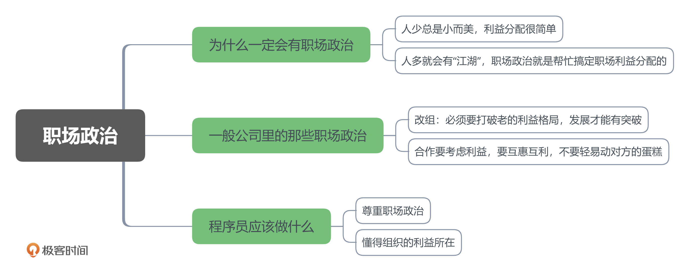

---
date: "2019-06-23"
---  
      
# 18 | 职场政治：我只想好好干活，职场政治和我有什么关系？
你好，我是臧萌。今天我们来聊聊职场政治那些事儿。

不过我首先得强调一点，这篇文章并不是教你怎么搞职场政治。毕竟在职场政治这个大舞台上，我们程序员不是主角。这篇文章的目的就是为了能让你理解职场政治的必要性，理解职场政治的基本要素——站队。这样你才能在职场政治这个舞台剧上，扮演好自己的绿叶角色。

## 为什么我说一定会有职场政治？

也许你也曾经天真如我，觉得自己靠自己的双手干活在公司谁都不亏欠，觉得自己全凭勤劳和真本事吃饭，觉得公司全靠和自己一样的写代码的人来养活。以至于像我这样想了太久，在公司里感觉腰杆子比铝合金电线杆子都硬气了。如果你是这样的人，那么我建议你仔细品品我下面说的这个故事。

### 人少总是小而美

这是一个电商网站的故事。一开始，有一个“草台班子”，只有创始人单干，卖定制化小商品，比如T恤、杯子等等。所有的事情，包括产品研发、产品代工生产、进货、库存、编写电商商城代码、服务器维护、发货、售后、营销等等都是创始人一个人来包办。

老天有眼，商品的路数对了，卖得很不错，订单量越来越大。这时候创始人一个人就忙不过来了。怎么办呢？招人呀。按照工作职责划分，很自然地，创始人又招了三个人，一个人负责生产，一个人负责营销，一个人负责售后。程序员太贵招不起，所以创始人自己继续负责商城的开发和服务器维护等，同时总管新来的三个人。

<!-- [[[read_end]]] -->

这时候，其实问题已经来了。因为人多了起来，赚的钱怎么分就是个问题。之前只有创始人一个人，赚多少都是自己的。现在有了三个手下，虽然他们现在还不管人，只是拿工资。但是年底奖金怎么分？加薪怎么给？谁多谁少？这些问题就开始接二连三地蹦出来了。

当然，这时候人还不多，大家也都很辛苦。所以大家对创始人的奖金和加薪方案，也可能没有什么抱怨。毕竟公司发展得好，对大家都有好处，每个人到手的钱，差的那仨核桃俩枣也没多少。或者创始人如果足够有魅力，还可以让大家忘记心里那一丢丢对利益的纠结，继续拧成一股绳，奔向更美好的明天。

故事讲到到这里，你能够明显看出，当公司只有一个人时，所有赚的钱亏的钱都是创始人自己的，这个毫无争议。公司接着发展下去，会从一个人发展到非常扁平的两层结构。

这个两层结构时期人还非常少，虽然已经要开始为各自的付出来分配利益，为各自的失误承担责任。但是由于公司规模不大，每个人为公司做的贡献和每个人的工作失误造成的损失都非常明显。这时候要做到奖惩分明，并不是特别难。

### 人多就会有“江湖”

但是，公司会继续发展。进一步往下发展的话，之前做产品的部分就会变成产品部和库管部，分别各有十几号人。营销部和售后部也都成立了，也都是好几个人的规模。同时，公司也终于有了商城研发组。创始人终于可以专心地管理公司了。

这时候，公司变成了三层结构，公司的人也越来越多，想做到奖惩分明已经非常难了。

比如说，产品是直接面向用户的，所以产品设计做得不好的话，对销量会有直接的影响。营销可以扩大销路，增加销量。但是产品的销量有多少是要归在产品设计上，又有多少要归在营销上呢？

营销需要经费，那么接下来的营销经费，是应该增加还是减少呢？售后不是利润部门，但是会影响回头客。有多少客人是因为售后不好而流失的，又有多少新客是因为优质的售后才获得的增长呢？因为售后原因增加的客户和营销带来的新客户，又应该如何区分？这些问题的出现，让公司很难做到奖惩分明。

更不用说，公司除了奖惩分明之外，还有更高级更复杂的利益。比如大到某个部门的存留，小到某个项目是继续还是取消。举个例子，库管部负责商品进库、发货、清点等工作。这个工作并不是公司的核心竞争力，而且随着公司规模的扩大，可能交由更专业的公司来负责会更好。这时候，这个部门留是不留？这个部门的老大怎么证明自己部门的价值？是更安全、更快速、还是更省钱？

所有这些大大小小的事情背后，都是赤裸裸的利益。没有这些，你可能都没机会干活，没机会赚辛苦钱，也没机会升职加薪。

你想想看，如果不是商城部门的老大能搞定关系，给出各种让人信服的数据，背上各个方面给的KPI，这个部门可能就被取代，下面的程序员可能就散了。如果不是老大能做出正确的决策，展示出让公司满意信服的成果，整个部门的加薪升职可能都要缩水。

而这整个过程，都是政治的运作。

## 一般公司里的那些职场政治

当然，在一般的公司里，对于我们这些最基层的程序员来说，日常能亲身体会到的，并不是上面例子中说的整个部门不要了这种大动作。我来给你说两个个比较常见的例子。

### 为啥要改组？

在成规模的公司里，大大小小的改组（Reorg）可谓屡见不鲜。比如我们熟悉的腾讯和华为，最近几年都有调整自己的事业群（Business Group）。这种公司层面的改组，肯定会一层层地传递给下面的部门。有时候，一个小的部门，也会随着发展而改组。正所谓，分久必合，合久必分。很多时候改组就是分分合合。

下面我来说说我对改组的拙见。随着公司的发展，内部外部环境的变化，公司改组是难免的。公司通过重新划分地盘，打破老的利益格局，重新规定各自的权利和责任。改组搞得对了，可以激发组织的活力，可以让做事情更顺畅自然。

我之前面对重组，只关心两件事，一是我的工作还有吗？二是我换老板了吗？最多再关心一下我老板换老板了没。现在我更愿意去理解这次改组的目的，想要解决的问题是什么。进而我能去理解，这次重组给自己所在的组带走了哪些老的负担，带来了哪些新的责任，又伴随着哪些新的机会。

### 不改组行不行？

我来给你说个柯达公司的故事。柯达公司原本是做相机胶卷的。后来，随着数码相机的普及，柯达公司的胶卷业务已经没有了存在感。但很多人可能不知道，数码相机其实是柯达最先发明的。但是柯达却将这个未来的潮流束之高阁。

这个也不难理解，一个靠胶卷生存的公司，不待见一个可以淘汰胶卷的发明，这也是很自然的。但是如果当时柯达公司能够改组一下，将数码相机的研发制造从胶卷业务中独立出来，柯达公司或许会走上一条完全不一样的道路。

当然，这也是一个久远的例子，现在数码相机也被手机淘汰了。所以说啊同学们，公司不改组行吗？不打破老的利益格局行吗？当然不行。不变就意味着被淘汰呀。

### 用谁的系统？

在公司里，除了改组，用谁的系统这件事儿也会经常出现。公司大了，系统多了，功能难免会有重叠。更不用说还有鹅厂这种鼓励内部竞争的公司。这时候，用谁的系统这个问题，除了功能等因素之外，还有更多非技术的考量。比如从两者所在组织的角度看，这种合作是否互惠互利？合作是否会动了别人的蛋糕，让别人不爽？合作带来的地盘交叉，以后是否能分得清？在对方系统上做的投资，是否会被好好维护？这些考量都是有政治意味的。

## 面对职场政治，程序员应该做什么？

前面说了这么多，其实目的是阐述职场政治的必然性和必要性。当然，我们是程序员，是基层做实际工作的员工。这篇文章不是鼓励你去搞政治。那么了解这些之后，我们程序员应该做什么呢？

### 尊重职场政治

我觉得首先要做的，就是尊重职场政治。职场政治远不止我这里列出来的这些正能量的事情，也有很多算计，可能看上去并不那么让人舒服。但是，从屁股决定脑袋的角度来说，我们还是要尊重自己组织作出的各种决策，尽自己的力量去支持。

你要知道，每一份工作背后的一系列利益逻辑都是各路老大搞定的。你不要动不动就想着，此处不留爷，自有留爷处。你这样想的话，到哪都没有你的工作。

### 懂得组织的利益所在

一个公司，往大了说，大家是一个整体。往小了说，大家是一个个利益小团体。我们作为程序员，要懂得自己所在的组织的利益所在，不要做违背组织利益的事情。当然，这里也并不是鼓励大家去花太多的时间，思考职场政治。毕竟我们是干活的人，不是搞职场政治的人。大部分情况下，你只要配合经理做好自己的工作就好了。

同时呢，我们还要能理解和自己合作的各个组，以及各个部门的利益所在。这样在大家合作的时候，能够泾渭分明。不要打破大家合作的约定和默契。

## 总结

俗话说，有人的地方就有江湖。那么在职场这个江湖里，它背后的逻辑就是利益。支配利益的方式就是靠政治。游戏的主角就是各路老大们，我们做好配角就是了。别替老大们操心，别想太多没用的，别说太多没用的，更别做太多没用的。

大家在一起玩儿，一定要有游戏规则。这个游戏的规则的制定，不需要我们操心。实际上职场政治也远比我这里举的例子复杂难懂，我们也很难参与进去。就好像你在路上开车一样，你不用参与，也无法参与制定各个路口的红绿灯的规则，我们只要学会看红绿灯，按照红灯停绿灯行的规则走就行了。当然，职场上的政治，没有红绿灯那么简单直接。看不懂的时候，别乱动，问经理该怎么做。毕竟全公司最不希望你犯错的人，除了你，就是你的经理。

## 思考题

关于职场政治，你有什么故事吗？有没有因为这个迷茫过，又有没有因为这个吃过亏呢？

欢迎在评论区和我交流。也欢迎把这篇文章分享给你的朋友或者同事，一起交流一下。