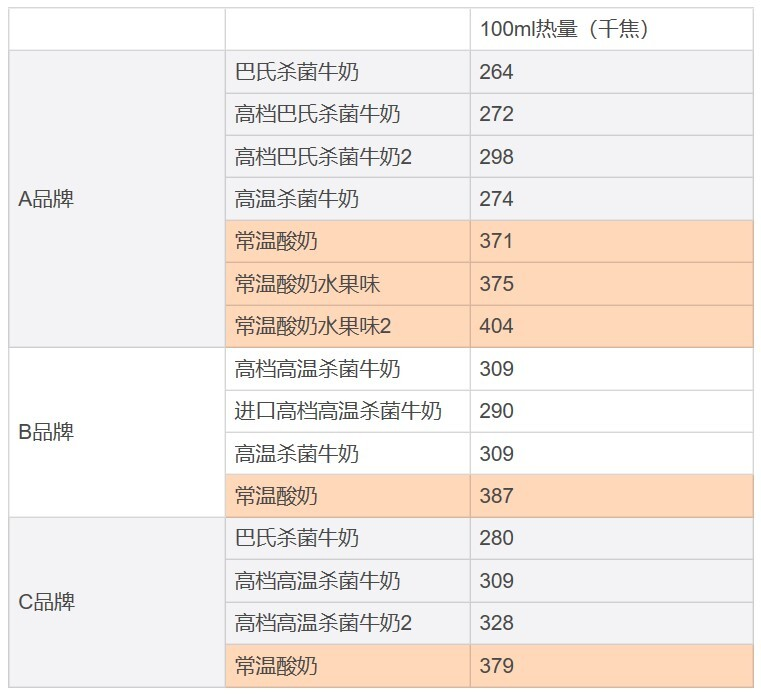
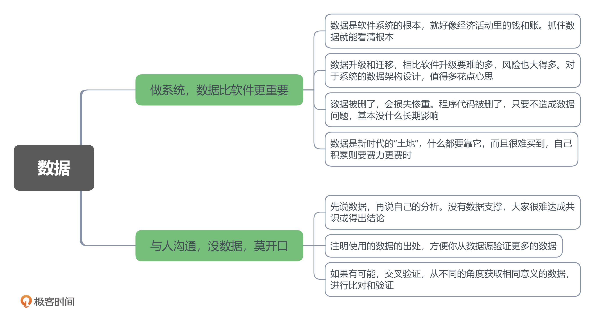

---
date: "2019-06-23"
---  
      
# 31 | 数据观：在你眼里，数据到底是什么？
你好，我是臧萌。这一节我来和你漫谈一下数据。工作这么多年来，我看待数据的态度，经历了从轻视、差不多就行，到重视和严谨对待的转变，甚至对数据有些敬畏。

我相信很多同学在刚开始工作的时候，也是只重视程序不重视数据。程序员嘛，就是写程序的。数据结构、算法、设计模式，这才是我们程序员的战场高地。数据什么的，随便搞搞，别耽误我写程序就行。数据大不了删了重来。什么？不能删？那就迁移一下嘛。

还有的同学在抛出自己的观点时，经常是七分靠直觉，两分靠猜测，一分靠经验。就是没数据什么事儿。当别人就某个细节问下去的时候，就开始拍胸脯拍脑袋，但就是给不出什么具体的数据。这时候，沟通基本就进行不下去了。因为当每个人的观点有冲突时，光凭直觉、猜测、经验都无法让对方信服。

今天，我们就从软件系统和与人沟通两个方面，来谈谈数据的重要性。

## 程序重要？数据更重要

我们来思考一下这个问题，是我们设计的系统和写的程序代码更重要，还是数据更重要呢？相信很多同学都会下意识地觉得系统和代码更重要。但我觉得不然，数据其实更重要。下面我们来聊聊这个话题。

### 数据是软件系统的根本

我们来打个比方，数据就好像经济活动中的钱和账。数据在各个系统里的流动，就好像钱在不同的组织之间流动。无论是什么经济活动，做账都能把钱的流动一笔笔记清楚，通过账本，你就能够把经济活动给理解清楚。钱和账，是经济活动中最重要的。

<!-- [[[read_end]]] -->

公司可以今天卖口罩，明天卖水果，但是账的重要性是不变的。就好像软件系统可以重构、重写，甚至可以换技术、换语言、换平台，这都不重要。重要的是软件系统要能把数据落地入库。只要数据能够按照之前的规则入库，软件系统怎么改都无所谓。

在软件构造的虚拟世界中，数据是唯一的真实存在。尤其是那些以数据处理为目的的软件系统，更是这样。软件系统的目的就是把数据写入库。所以很多程序员戏称自己是专业的CRUD，从这个层面来说，CRUD才是根本。如果一个程序不CRUD，不读取数据，也没有数据落盘，那它跑起来有啥用呢？

下面我们再从实际情况来看看，为什么应该重视数据。

### 软件系统可以升级，数据很难升级

对于很多偏数据的系统，数据架构设计比软件的架构更重要。数据的架构包括系统中有哪些实体、实体有哪些属性、属性分别是什么类型、实体与实体之间有什么关系、数据如何联动等等。当然也包括采用哪种数据库、数据库怎么分库分表等等。如果采用的是NoSQL数据库，则要考虑数据的访问模式、数据的可靠性、数据的可用性等等。当然两种数据库都要考虑如何应对数据的增长问题。

为什么说数据的架构比软件更重要呢？升级软件系统，很多时候是可以测试的。只要最后输出的结果对，就没啥问题。给软件系统升级，还有很多方式可以让系统升级的影响更小，比如灰度发布、A/B测试等等。只要底层数据结构不变，底气就还有。只要程序没破坏数据，出了问题回滚就可以了。

但是数据升级，难度就远远不止这样了。如果说给业务系统升级是给飞驰的汽车换轮子，那么给数据升级则是相当于是给飞驰的汽车换发动机。有时候还是得从内燃发动机换成新能源发动机，同时车还不能停。

为什么这么说呢？因为给数据升级，有很多沉甸甸的问题需要解决。这里我随便列出几个：

1.  数据如果不兼容怎么办？如果补的话，缺的属性值怎么补？
2.  数据的结构变化升级，如何保证业务不受影响？要知道历史数据的大小，绝不是一个alter可以简单搞定的。alter一下数据库可能很久很久没反应，甚至直接挂了都有可能。
3.  如何保证数据不丢失？
4.  这种数据升级往往是没有回退可能的，或者回退的代价极高。如何能做到万无一失？

删库的代价和删程序的代价是不能比的。删库给公司带来重大损失，甚至倒闭的例子有很多。但是把程序删了，恢复的挑战和风险要小得多。比如当年携程不小心把线上的程序给删了，但是真的恢复起来，也很快。对后续的业务，也没有任何影响。

这里我们再强调一点。程序写得烂，比如跑得慢一点，设计得不好等等，这些问题很多时候并不麻烦，大都是稍微花点时间就能够修复，也不会造成什么损失。我们写程序的时候，尤其需要注意的是生成入库数据和写入数据的代码。在对这些程序代码进行更改的时候，更是要谨慎谨慎再谨慎。如果破坏了数据或者写入了脏数据就麻烦了。这点一定要注意，敬畏数据。

### 数据是新时代的土地

对于很多行业来说，比如AI、自动驾驶等，数据就是根基。再牛的算法和模型，也顶不过真实的海量数据有价值。算法可以招人来做，实在不行可以买。而数据呢，得自己积累，需要时间和渠道。想购买数据呢，也很难买得到，因为数据就是核心竞争力，谁会去卖自己的核心竞争力呢？

我们可以把数据理解为新时代的土地，是一切的根基。有了数据，干什么都可以。没有数据，再好的种子，也没有发芽的空间。种子和土地，当然都重要，但是两者的分量不在一个级别上。数据够多，随便什么算法模型都能得出不错的结果。但如果没数据，能做到的事情就会很受限。可以说，数据起的是决定性的作用，是基础，是土地，算法和模型是地上开花。

即使是算法和模型工程师，日常工作中很大一部分时间，也是在整理数据。俗话说：数据从来不是干净的。所以能把数据整理好，基本上就胜利一大半了。

## 没数据，莫开口

我们之前反复聊了沟通。今天我们从沟通的角度来看看数据。我们可以思考一下，我们在和同事沟通的时候，信息是否足够地准确和清晰呢？我们在沟通中，有没有提供或者接收到足够多的数据呢？

### 先说数据

我刚工作那几年，交流的时候经常无法传递准确的信息。比如被问起数据量增长了多少，我就说增加了一点；被问起数据丢失了多少，就说丢失了不多；被问起一行数据有多大，就说不太大；被问起有几个单元测试没过，就说没几个。有时候对方不再追问，我可能还感觉自己回答得挺好。

有时候对方一个反问：增加了一点具体是增加多少？我就傻眼了，可能支支吾吾也说不出个所以然来。当然，数据我确实是看过，在我看来，也确实就是增加了一点，但是具体的数字没上心，被问起来，就很尴尬。

可能有时候我心里还有点不平：一点就是一点，你管他多少，反正不多嘛。但是实际情况是，每个人对于一点、不多、不大、没几个这些词语的理解都是不一样的，很多时候这些都会掺杂进个人的判断。而交流首先应该提供事实，而不是个人的主观判断。当大家对事实都有了一致的认识之后，再各抒己见。

再比如说单元测试，很多人看来，一个不过就是有问题的，也有的人心大觉得10\%以内的就没问题。当然这个也和具体的项目有关系，可能某些项目的单元测试已经对环境有依赖了，有几个不过确实难免。所以，交流应该从具体有几个单元测试不过，具体是哪几个单元测试不过这些方面开始。而不是上来就给出自己的结论。可能有些测试特别重要，而且一定要求过呢？

所以我渐渐地养成了给出准确数据的习惯。任何问题，先找出数据，罗列清楚，再去做自己的分析。准确、经过整理的数据是自带力量的。我们经常说：一图胜千言。这里除了具象的图画之外，我觉得图表也应该算在这个图里面。一份整理好的数据传递的信息，有时候胜过反反复复地讨论得出的结论。

### 注明出处，交叉验证

很多时候，仅仅是列出直接的数据还不够。为了更全面地理解问题，还需要注明数据的出处，甚至需要从多个数据源来交叉验证数据。数据是我们用来做判断的依据，对数据的态度要仔细认真，否则后面基于数据的讨论、结论和方案，可能都会是错的。

注明出处是对数据负责。很多时候，罗列的数据可能并不全面。注明出处，方便你可以根据出处去对数据进行更详细的检查。而且不同的数据源，数据的可靠性也不一样。可以说数据源本身，就是数据的一种。

关于交叉验证，我举个简单的例子。A服务调用B服务，那么要验证服务调用的增加量，自然需要对A服务对比过去一天的服务调用数据，为了更加全面，还可以增加上周同一天，上个月同一天调用量。同时呢，从B服务这一端，也可以做同样维度的考量，这就是从另一个数据源做交叉验证了。如果发现两边的数据有差异，那么就要先找出差异的原因，再来看调用的增加量。

这里我再举一个生活中的例子。市面上有很多种牛奶：巴氏杀菌牛奶，高温杀菌牛奶，常温酸奶等等。如果要选一种牛奶喝，你会选择哪种呢？在做判断之前，你可能会觉得酸奶风味好，但是有糖热量高，在我去超市逛了一趟之后，我收集到了下面这些数据：

数据来源是商品外包装标注，这个来源还是可靠的。同时经过了多方对比，我看了三个主流的牌子的牛奶。这些数据是事实。酸奶是用乳酸菌消耗掉牛奶中的乳糖，所以无添加的酸奶肯定是酸的，因为乳酸菌会生成乳酸，这是常识。在这个基础上，我们可以去推断自己的结论。比如下面两个结论就是比较初级的结论：

1.  纯牛奶的热量是差不多的，上下不会超过10\%。无论是巴氏杀菌牛奶还是高温杀菌的常温奶。
2.  酸奶的热量比纯奶更高，说明添加了很多糖以及其它增强其风味的物质。一般来说，会比纯奶高出20\%\~30\%。

有这样一张表格，是不是说出来的话就更有力量了？什么叫差不多？相差不到10\%，就叫差不多。什么叫酸奶比纯奶热量高？高出20\%\~30\%就叫热量高。

## 总结

数据是有分量的，对数据的辗转腾挪，都要费很大的劲。数据是有力量的，当你把数据整理好罗列出来的时候，甚至都不用说明自己的观点，就可以不言自明，让人无法反驳。数据是最难获取的，真正有价值的数据，钱是买不来的，只能靠自己积累。数据是软件系统的目的，和现实中业务相关的软件系统，无论业务逻辑玩的多花，最后都是要生成相应的数据，落盘为安。

数据不会说谎，数据很难伪造，数据中最重要的一个属性就是时间，这让数据可以日积月累的积聚力量。小小的一张地铁卡，只有两个操作，滴，刷卡进站，滴，刷卡出站。如果一个人用地铁卡刷卡上下班，一次两次，数据确实没啥意思。

但是如果这张卡积攒一年的数据，那么数据的力量就会爆发出来。它可以证明这个人有稳定的出行时间和路线，从而可以证明这个人有固定的工作地点和居住地点。这就是一个人信用的证明。这个数据，能伪造吗？一次两次，可以。长期下来，很难。

数据是什么？让我们在工作中来重新思考这个问题，重新认识它吧。

## 思考题

我们每天都在跟数据打交道。你是如何看待数据的呢？你在设计程序的时候，有重视数据存储的设计吗？你在与人沟通的时候，有注意把支撑自己判断的数据都罗列出来吗？

好，今天的加餐到这里就结束了，希望可以帮助到你，也希望你在下方的留言区和我参与讨论，并把文章分享给你的朋友或者同事，一起交流一下。