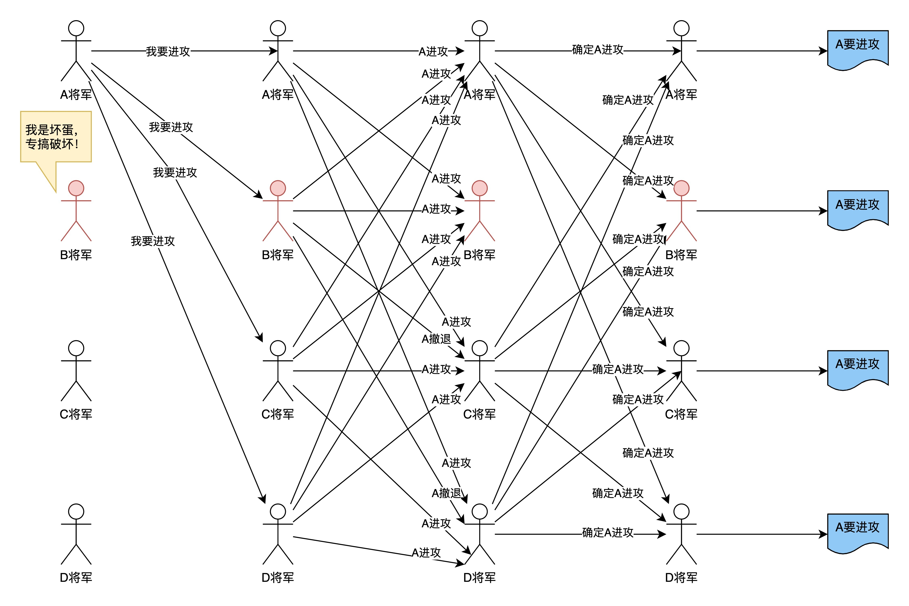

---
date: "2019-06-23"
---  
      
# 07 | 共识（上）：拜占廷将军也讲少数服从多数？
你好，我是自游。

在上一讲中，我提到交易扩散的时候，说过交易自连接节点开始逐步向外扩散，最终会有一个时刻，所有的节点都可以收到该交易。这也就意味着去中心化网络中，想要实时保证每个节点数据状态一致比较困难，网络越分散，数据扩散的时间也越久，一致性也越难以达成。更不要说还存在专门搞破坏的作恶者，故意阻碍一致性的达成。

因此，就需要专门有一种机制去协调，使其在一定程度上约束节点的行为，来保证整个区块链网络保持状态的一致性，而这也就是这一讲要学习的共识算法。**共识算法可以说是区块链技术的核心思想，是区块链运行的行为准则。**

我会通过两讲的内容，带你快速理解区块链里的共识算法。为了让你轻松理解共识算法，这节课我会用一个故事为你解析共识背后的基础知识点，而下一节课再将知识点融入到区块链中，为你详细剖析区块链中是如何解决共识问题的。

## 拜占庭将军问题

话说在拜占庭帝国，9位将军分别率领一支军队要共同围困一座城市。但是这座城市军事实力很强大，如果不协调统一将军们的行动策略，部分军队进攻、部分军队撤退会造成围困失败。

因此，各位将军必须通过投票达成一致策略，少数服从多数，要么一起进攻，要么一起撤退。

因为各位将军分别占据城市的一角，他们只能通过信使互相联系。在协调过程中，每位将军都将自己想“进攻”还是“撤退”的消息通过信使分别通知其他所有将军，这样一来每位将军根据自己的投票和其他将军送过来的投票，就可以知道投票结果，然后决定是进攻还是撤退。

<!-- [[[read_end]]] -->

但不幸的是，将军中可能出现叛徒，他们可能会选择性地投票，具体来说就是投错误的票，或者干脆不投票。假设9位将军中有1名叛徒，8位忠诚的将军中出现了4人投“进攻”，4人投“撤退”，这时候叛徒可能故意给4名投“进攻”的将军投“进攻”，而给另外4名投“撤退”的将军投“撤退”。

这样在4名投“进攻”的将军看来，结果是5人投“进攻”，选择发动进攻；而另外4名将军看来是5人投“撤退”，从而选择撤退。这样，一致性就遭到了破坏，围困城市的计划也就破产了。

另外，因为将军之间需要通过信使交流，即便所有的将军都是忠诚的，但派出去的信使也可能被敌军截杀，甚至被间谍替换，也就是说将军之间进行交流的信息通道是不能保证可靠性的。所以在没有收到对应将军消息的时候，将军们会默认投一个票，例如“撤退”。

以上就是整个故事的描述。如果是你，你会觉得这个问题有解吗？有没有什么办法，可以确保即使有叛徒存在，也能让所有的将军都得到一致的进攻或撤退命令呢？你不妨先想一想。

为解决这个问题，我们可以先简化下模型，因为此处共识的基础是少数服从多数，那么最小化模型的将军数就是3个。我们分别以A、B、C来指代三位将军，再假设有一位将军是叛徒，且只有一位将军发起投票，我们一起来推演一番。

> A将军分别向B、C将军发出“进攻”的命令，B、C将军分别会收到A将军的“进攻”命令。

> 此时如果B将军是叛徒，他可能会告诉C将军，他从A将军那里收到的是“撤退”命令。那么C将军就会发现他收到了自己从A将军那里直接得到的“进攻”命令，以及从B将军那里间接得到的A将军的“撤退”命令，因此C将军无法判断A将军到底是想要“进攻”还是“撤退”。这种情况是无解的。

我们再来看另一种情况：

> 我们假设A将军是叛徒，他告诉B将军我要“进攻”，同时呢，又告诉C将军他要“撤退”。而当B、C将军交换自己从A将军那里得到的命令时，彼此都发现从A将军那里得到的是一个“进攻”，一个“撤退”。局面陷入僵局，他们无法就A将军的命令达成一致。

通过分析以上的这两种场景，我们可以发现，在最小化模型中只要有一个叛徒，拜占庭将军问题就是无解的。也就是说，这个问题**要有解，叛徒的数量不能大于等于所有将军数的1/3**。

如果有一个叛徒，则必须要4位将军参与，两个叛徒就必须要有7位将军参与。而原本故事中的9位将军，要想达成一致，最多只能容忍2位叛徒的存在。你可以试着用上面的思路，重新推演一遍，验证下是否准确。

你可能还会有点小疑惑，C将军从A将军那里得到“进攻”的命令，而自己也想“进攻”，那么我已经有了两个“进攻”的命令，何必要理会B将军的“撤退”命令呢？

2>1，显而易见，在C将军这里已经达成了共识。这其实也是大多数人学习理解共识算法的**一个误区**，当初我学习的时候也是很难理解，为何要如此纠结地交换信息。

这个问题我们可以从两方面来解释。一方面，在我们日常工作生活中，对问题的表决往往是实时的，要么面对面，要么通过即时通讯软件。实时可以杜绝两面派的可能性，也就是没有叛徒，而且也没有必要互相询问自己收到的是什么命令，因为命令是实时广播，大家接收到的是相同信息，达成共识只需要一次决议就够了。而在这个故事中，将军们之间无法面对面交流，信使传递消息也只能两两将军间定向传播。

另一方面呢，我们并没有真正理解只有一位将军发起投票的意思，此处想要表达的是，这一次的共识针对的**只是A将军发出的命令，而不是在这一次投票以后就决定整体是“进攻”还是“撤退”**。直接用文字描述你可能还是觉得抽象，我们不妨配合图解去形象地理解这种差异。

这张示意图直接描述了A将军就自己想要“进攻”的共识流程，图中B将军是一位叛徒，他向CD两位将军发出了错误的消息，但因为ACD三位将军是忠诚的，所以最后所有的将军都得到了A将军想要“进攻”的一致结果。

但如果想要就整体是“进攻”还是“撤退”达成一致，就必须要所有的将军就自己的观点独立发起一个共识流程。可想而知，真正在战场上传递命令投票时，信使是多么的忙碌啊。

## 共识的必要性

那这个故事对我们了解区块链中的共识算法有什么启发呢？乍一看好像没有什么关联性，但如果我们把将军看作是区块链节点，信使是网络。信使被截杀代表着节点间网络的不可达，而将军的叛变代表着节点想作恶。

这么一解释，有没有感觉豁然开朗呢？如果你还有疑惑，可以试着将类比带入到故事中再重新推演一番。

接下来，在将目光从故事转向区块链中的共识前，我们可以先来讨论一下共识的必要性，就是为什么一定要保持所有节点的状态一致？

我们可以反向考虑这个问题，结合我们对区块链状态的解释，**状态是节点接收到交易后执行结果的累积**（如果不熟悉可以回看[第4讲](https://time.geekbang.org/column/article/400419)）。如果每个节点接收到的交易是不一致的，那么即便现在不同节点处理同一笔交易，其前置状态也会有所不同，从而在此基础上累积成不同的状态结果。随着更多的交易被提交到区块链网络，这种状态的不一致会进一步加深。

如果我们把目光从单个节点转向整个网络，按照我们前面学习的知识点，一个区块链节点出现问题，我们可以随时切换到任意其他节点继续工作，但如果此时两个节点的状态有差别，无疑会产生不一样的结果。而这影响了区块链去中心化的特性，是不可接受的。因此，我们非常有必要引入共识算法来保证节点间状态的一致。

这里还可以引申一个知识点：为什么区块链中要引入区块的概念呢，直接交易不是更好吗，反正状态是交易执行结果的累积？

其实这就像我前面所说的，交易的扩散是有时间消耗的，最终有个时刻所有的节点都会收到该交易，但会是哪一个时刻呢？在去中心化架构中我们无从知道。

同时，交易的扩散也会受制于网络环境的影响，完全可能出现后发出的交易被某个节点先收到，先发出的交易后被收到，那这样累积的状态也是可能不一致的。

为了避免这些问题的出现，区块链是这样规定的：节点会把一段时间内接收到的所有交易打个包组装成区块。区块的构建是有确切时间点的，这样就可以保证在这个时间点前的交易有序排列，而且区块是有编号的，即便因网络问题区块并未按照编号顺序进行扩散，其接收节点也可以等待前置区块接收到以后，再累积状态。

因此，**区块链中对状态的共识实质就是对区块的共识**，只要区块一致状态就一定一致。当然，区块的产生是随机性的，任意节点都可以产生区块，那以谁产生的为准呢？而这也就是共识算法需要解决的问题了，我们留着这个问题下一讲解答。

## 总结

其实拜占庭将军问题这个故事其实并不是我的胡编乱造，而是一篇正儿八经的学术论文，可以说是分布式共识问题的鼻祖。随后，计算机科学界就在此基础上，展开了长达几十年的、关于如何在分布式系统中有节点被故意破坏的情况下达成共识的讨论。

区块链是一种非常典型的分布式系统，讨论拜占庭问题能帮助我们理解区块链共识会面临的情况。在故事之外，我们还通过去中心化特性，反向论证了共识的必要性。区块链中共识的基础是区块，区块有序地包含了交易，从而保证了状态的一致，对区块的共识就是对状态的共识。

理论只是科学，重要的还是要把理论付诸到工程实践中来。下一讲我们将具体剖析区块链中是如何在节点间达成共识的。

## 讨论

在A将军共识示意图中，在“A要进攻”这个阶段之后，各位将军已经能够得出“A要进攻”这个共识结果了，为什么还要再有一个“确定A要进攻”的阶段呢？

## 扩展阅读

这一讲提到的拜占庭将军问题出自这篇[论文](https://lamport.azurewebsites.net/pubs/byz.pdf)，完整缜密地描述了分布式系统达成共识可能会遇到的种种问题，你如果有时间推荐看看原文。

欢迎你在留言区跟我互动，主动思考、积极交流会让你更有收获。如果这节课对你有帮助，也欢迎你把这一讲分享给自己的朋友、同事。