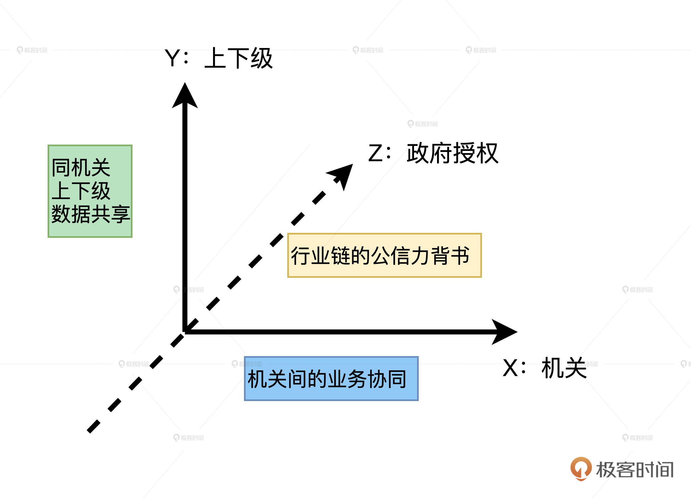
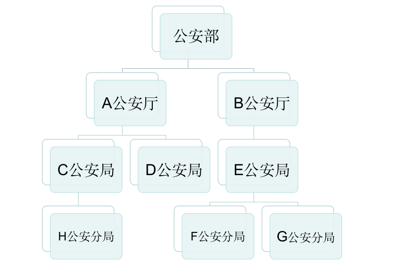
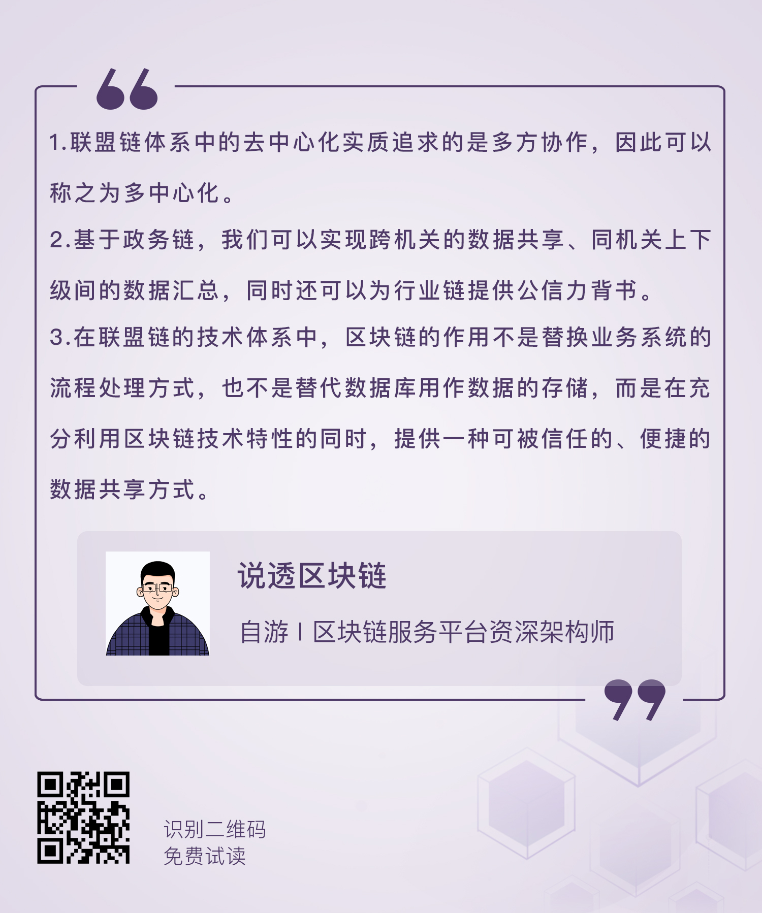

---
date: "2019-06-23"
---  
      
# 15 | 区块链+社会治理：区块链如何为治理提供新方案？
你好，我是自游。

从2019年10月24日这天起，国家陆续出台了多份针对区块链技术在国内发展的利好政策，社会各界积极回应，各行各业对区块链+的探索热情都在上升。

在[上一讲](https://time.geekbang.org/column/article/409778)，我们讨论了企业应用区块链技术的相关内容，联盟链试点的最终结果是行业链，而行业链的集合可能就是价值网络的雏形。

而在政府这边，各级政府也带头摸索区块链技术在社会治理领域的内在价值。政府等职能机构主动参与区块链社会的探索，不仅能够推动政务管理模式的革新、提升办事效率，更可以与行业链进行协同，共同推进价值网络的建设。这一讲，我们就从**区块链+社会治理**这个角度，看看区块链可以为社会治理提供怎样的新方案。

## 社会治理

社会治理是指由政府、社会组织、社区、企业等参与主体分工协作，共同管理解决社会事务，维护社会治安秩序，保障社会稳定。

从概念上就可以看出，社会治理需要多参与方主体分工合作，这其实跟区块链的思想不谋而合，**区块链在联盟链的体系中，去中心化的特性其实更多的是想表达多方协作的意思，因此我们也可以用多中心化替换**。

社会治理涉及面其实非常广，但为了帮你把握重点，我们可以把社会治理简单分为政务跟公益两个部分。

政务的主体参与方上至国家各部委机关，下至各乡镇办事处，主要处理与人民群众工作生活息息相关的事务，比如户籍管理、社保公积金管理等等，在此基础上搭建的区块链网络，我们可以称之为**政务链**。而公益的参与主体主要是社会性非营利组织，比如孤儿院、红十字会等等，主要接洽的是社会事务以及对外援助工作等，与之对应的区块链网络叫做**公益链**。

<!-- [[[read_end]]] -->

而无论是政务还是公益，在与区块链技术的结合方面，二者有着诸多相似之处，因此可以作为一个整体进行分析。为了能让你对它们有整体的认识，我们可以从三个维度解析政务链/公益链，你可以想象成三维空间的X、Y、Z三个方向。

### X：机关间的业务协同

关于这一点，我想你应该并不陌生。就拿政务来说，政府机关其实分成了很多的职能部门，比如市级部门就有公安局、民政局、劳动和社会保障局等等，他们分别分管社会治理事务中的一部分。

通常情况下，他们是独立进行工作的，但是在某些时候，一些公众事务就需要各部门间的协同，就比如我们现在基本上办理任何事务都需要身份证、户口本等材料证明你的身份，这其实就涉及到公安系统与具体办事部门间的业务协作。

那现在他们是如何协作的呢？就拿身份证明这件事来说，最糟糕的情况就是让你回到原户籍地派出所开具证明材料，这对于常年奔波在外的打工一族非常不友好。在信息技术如此发达的今天，就身份证明这件事来说，为什么还如此困难呢？归根到底，还是因为各机关的数据并未共享，也没有提供一种实时的在线查询服务。

而**利用政务链，我们就可以基于区块链技术实现跨机关的数据共享，达到业务协同的效果**。具体的讲，就是可以在需要共享数据的部门间搭建一条政务联盟链，每个部门维护自己的区块链节点，并通过该节点将需要被共享的数据上链，通过区块链网络的扩散，自然而然同步至其他部门的区块链节点，这样需要数据的部门就可以从自己维护的节点中获得相应的数据。

### Y：同机关的上下级数据共享

在上一讲我们讲到，行业链的形成并不是自上而下的政策性产物，而是依靠行业龙头企业发起的联盟链试点，先进行小范围的探索，然后吸引其他企业的加入进而逐渐壮大，最终在监管等需求的促使下，形成统一的行业链。可以说，行业链的形成是自下而上的顺势而为，而政务链/公益链的形成方式却正好相反。

我们可以这样认为，**政务链是在国家指导政策的基础上，由上级部门自上而下进行推动而逐步搭建的区块链网络体系**。

这其实也很容易理解，主要是由行政管辖权决定的，同机关的上级部门比下级机构的权力的管辖范围更广泛，因此能够有力推动多个直属下属部门的技术体系变革。这就非常类似于我们之前提到的[默克尔树](https://time.geekbang.org/column/article/400419)对应的树形结构，父节点可以统辖归属于该节点的所有子节点事务。

另外，**政务链的搭建过程是自上而下，而不是自顶到底**。什么意思呢？一棵树有根节点与叶子节点，中间可能还有很多层级的中间节点，同样，管理同类事务的政府部门也有从部到厅，从厅到局，从局到分局等的分级。

如果政务链的搭建从一开始就要从部延伸到分局，那无疑是巨大的工作量，因此需要采用分而治之的方法，局部自上而下，然后再逐步贯通，而最终形成的政务链应该就能呈现出自顶到底的完整链条。

上面我阐述了同机关上下级之间搭建政务链的过程，那具体有什么作用呢？其实**政务链主要用于数据的共享，或者可以说是用于数据的汇总**。

同机关上下级意味着政务业务范围是一致的，只是管辖范围的不同，上级机关需要根据下级单位的数据做出业务决策。如果不采用区块链技术，上级部门就需要从业务层面入手，提供数据汇总的途径。

而区块链技术为此提供了另一种解决方案，在上级与多个下属部门间构建联盟区块链网络，彼此维护不同的区块链节点，下级部门的数据通过自己维护的区块链节点上链，这样上级部门就能获得所有下属部门的数据，在不影响现有业务系统的前提下实现数据的共享汇总。

### Z：行业链的公信力背书

在上一讲，我说过**行业链与国家权力机关的协同是一种必然**。为什么这么说呢？接下来我们就这个问题展开讨论。

我们之前多次提到区块链的技术特点，由去中心化、不可篡改及可追溯性构建的区块链网络天然能给人带来信任感，而这是其他技术无法做到的。此时，如果你的业务仅仅是因为缺乏用户对平台的信任，迟迟无法得以突破，就可以采用区块链技术。

就比如公益，我们通过公益平台募捐以后，其实是很关注后续社会性援助的过程及结果的。但通常缺乏这样的渠道，就只能通过有限的对外通报获得捐赠物资的流通情况，久而久之，信任感缺失，我们可能便不再通过该平台进行援助。

如果采用公有区块链技术记录捐赠物资的使用情况，并能让任何人都可以加入到这条公益链中，物资流转从此变得公开透明、可追溯，这能让民众对公益平台的信任感倍增，也能变相促进公益事业的发展。

而如果更进一步分析，**行业链所对应的业务不仅仅是有与用户间的信任问题，其实更主要的一点就是需要与政府等部门进行业务的协同，需要获得政府部门的授权或者接受监管机构的监督**。也就是说，单纯的使用区块链技术是无法做到这一点的，行业链的运作还必须要有国家权力赋予的公信力。

而政务链正好可以提供行业链需要的公信力，当然，这时候的公信力并不是区块链技术提供的，还是国家权力机关本身的属性。只不过是复用在X、Y维度已经建立的政务链网络，而且随着跨链技术的发展，链与链的交互相比链与业务系统的交互要更加和谐、便捷。

## 互联网法院

接下来，我会通过互联网法院这个例子，为你进一步说明区块链+社会治理的作用。不同于其他“区块链+”的例子，这种应用并不是我的畅想，而是已经实实在在存在的事物。互联网法院，意思就是将案件的受理到案件宣判等一系列诉讼环节都通过互联网完成。

现阶段，杭州、北京及广州互联网法院已经开通，这是司法系统顺应互联网发展趋势的重大举措。那互联网法院是如何为行业链提供公信力背书的呢？

其实可以用4个字概括，那就是**证据先行**，提前将后续可能会发生维权等司法纠纷的证据，上传至互联网法院的[司法区块链](https://blockchain.netcourt.gov.cn/first)进行证据公证，以便在将来可能发生纠纷时快速取证，提升维权效率。

现在很火的区块链电子合同、存证等行业链雏形项目，背后都有互联网法院的身影。

另一方面，不同互联网法院的区块链网络数据互联互通，也展现了机关间的业务协同能力，合同版权等司法证据在最初上传的时候是在一家互联网法院，但是在真正诉讼的时候却可能是在另一家互联网法院，甚至是一般线下的法院。如果无法做到数据融合共享，就并不能体现出区块链+司法的优越性，但毫无疑问，区块链技术是可以做到这一切的。

## 为什么要选择区块链+社会治理？

通过以上对X、Y、Z三个维度的描述，我想你已经对政务链/公益链有了一定的认知，三位一体，方为全貌。

但是，你会发现如果任意一个维度单拎出来，其实都可以用传统技术来解决。那为什么我们一定要采用区块链技术呢？我想这是大部分人首先会想到的问题，区块链+社会治理到底是不是伪需求呢？

其实，在联盟链的技术体系中，区块链的作用不是替换业务系统的流程处理方式，也不是替代数据库用做数据的存储，而是**在充分利用区块链技术特性的同时提供一种可被信任的，便捷的数据共享方式**。怎么理解这句话呢？

互联网信息技术已经出现了快30年，我国的信息化建设的年头也不短了。期间各行各业已经基于当时最先进的技术，搭建出了大量的信息化平台。但是这些平台却并未随着技术的发展而逐步更替，因此就逐渐落后了，这是选择业务优先的必然结果，而这种情况在政务领域更加明显。

怎么解决这种情况呢？全部推翻重来肯定不现实，相比前一个时代的业务优先，数据优先是新时代的选择，**如何以最小化的成本实现最大化的数据共享，就是最主要的矛盾**。

而通过对专栏的学习，你会发现区块链技术就是最好的解决方案，在不大规模改变现有技术架构的同时，实现数据在区块链网络中共享，而上层业务系统只需要极小部分的改动（与区块链SDK对接），即可实现对数据的上链以及利用其中的数据，在降本增效的同时，也能连带享受区块链技术带来的额外优势。

## 总结

这一讲，我们一起探索了区块链+社会治理的新方案，我分别从机关间的业务协同、同机关的上下级数据共享及行业链的公信力背书这三个维度，和你探讨了政务链/公益链的搭建过程及作用。

另外，我还通过互联网法院这个例子阐述了区块链与社会治理的结合应用，这确实能够提升司法维权效率，解决司法数据的融合共享问题。实际案例证明，区块链+社会治理并不是一个伪命题，而是一种切实可行的、从业务优先到数据优先的跨时代转型解决方案。

在上一讲，我说过行业链是特定行业的价值网络，而价值网络是所有行业链的集合。而这一讲讲完，可以说这句话其实还并不完整，**行业链、政务链、公益链三者合为一体，才能称得上是联盟链价值网络的完整形态**。

## 讨论

行业链、政务链、公益链组成联盟链价值网络的这个说法你是否同意呢？

欢迎你在留言区跟我互动，主动思考、积极交流会让你更有收获。如果这节课对你有帮助，也欢迎你把这一讲分享给自己的朋友、同事。