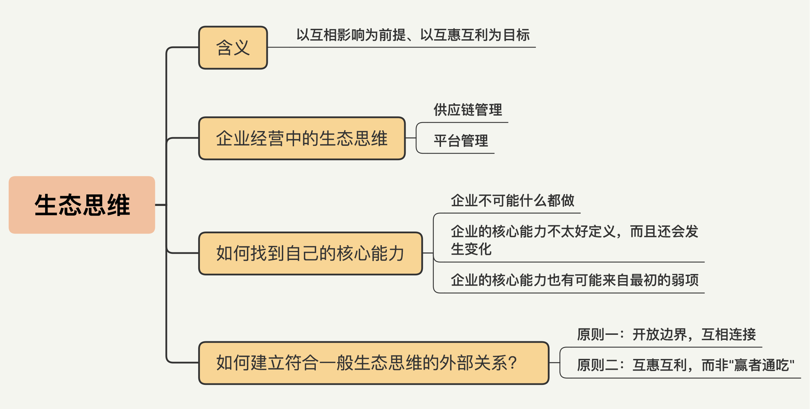

---
date: "2019-06-23"
---  
      
# 02 | 生态思维：企业怎么找准自己的定位？
你好！我是付晓岩。今天，我想和你聊一聊，在数字化转型中，企业必须要用到的生态思维。

说到生态，也许你立刻想到的就是跟每个人都息息相关的环境问题，比如小河的污染、气温的持续上升、沙漠化等，可以说，这些问题很大程度上都是粗放的、单纯求快的发展思路导致的。这种因果循环不是自然界才有的东西，在我们的商业领域、企业管理，甚至是技术领域，都是存在的。

每个企业都生活在一个超级大的生态里，无论是世界500强，还是街边小店，如果处理不好自己的商业环境，都很难经营下去。进行数字化转型，更是牵一发而动全身的事情，要想获得长远的发展，就必须用到生态思维。所谓的生态思维，也就是以互相影响为前提、以互惠互利为目标的思维模式。

所以，今天，我们就来了解下企业经营中的生态思维。我会借助实际的例子，帮助你理解正确运用生态思维所产生的效果。同时，我还会告诉你怎么运用生态思维，包括在生态中找到自己的核心能力、建立良好的生态关系。

## 企业经营中的生态思维

任何一家企业，无论是否明确地提倡生态思维的理念，实际上都在实践着这样的发展思路，比较典型的2个表现就是供应链和平台模式。

**先说供应链**。供应链代表了商业环境中跟你关系最密切的一群小伙伴，这些小伙伴发展得好不好，你如何处理跟他们的关系，都会影响到自身发展的稳定性和服务能力。所以，企业都很重视供应链管理，越大的企业越是如此。

<!-- [[[read_end]]] -->

这么说可能不是特别容易理解，我借助苹果公司的例子来给你解释下。

苹果公司可以说是供应链管理中的典范，全球著名顾问机构Gartner每年会选出全球25家供应链管理最优秀的企业，苹果公司连续10年入选，可见功力深厚。

苹果公司的供应链至少涉及200家企业、800多个工厂，分布在20多个国家、几百个城市，可以说是相当复杂。而他们的管理相当深入，他们会对合作企业的产品设计进行控制，不允许合作方有“黑盒”存在，合作方对苹果公司几乎是透明的。据说，他们曾经派驻2000多个工程师到富士康工厂，对他们进行设计、生产等细节的深入管理。控制得越深入，他们的设计要求也就越容易得到满足，生产组织能力也就更强。

你想，如果苹果公司要发起某种企业级的转型变化，那这些受到其深入控制的供应商也很难不受其影响；反过来，如果这些供应商的某些能力跟不上，也会制约苹果公司的战略实现。

所以，在互相影响的生态下，任何一家公司都不能只考虑自己家的事情，而忽略了别人可能带来的影响。供应链管理，是我们做数字化转型不可忽视的一环。

**除了供应链管理，平台模式也是必须要考虑的因素。**

平台模式现在非常流行，很多商业平台都是在努力连接更多的交易方，所以平台模式的本质其实是生态构建。

这是什么意思呢？我借助电商App的例子来解释下。

电商App就跟我们身边的菜市场一样。它们通常会提供去菜市场买菜的三个基本功能：

* 提供各种商品，满足你的挑选需求；
* 提供聊天功能，满足你砍价的需求；
* 提供支付功能，让你可以支付菜钱。

阿里最初的淘宝、阿里旺旺、支付宝就是这样的组合。不过，这些电商App的功能远远超过了菜市场。比如说：

* 它们会通过增加App的功能、增加商品种类、举办促销活动等方式，去优化购买者的用户体验；
* 它们还会通过帮助零售商优化在线店面设计、提供营销分析、库存管理、商业导流等方式，优化销售者的商户体验；
* 还会通过加强物流管理、连接更多技术服务商等方式，提高配送能力和技术供应能力。

你看，这就相当于通过平台把所有相关的参与方都连接起来，形成一个各方都可以获得利益的生态圈子。参与的人越多、体验越好，平台发展就越快；平台发展越快，各方从平台上获得收益的能力就会越强。这跟建立生态环境是一样的，都是在努力形成广泛连接和正向反馈。

了解了供应链和平台模式的重要作用，相信你对企业所处的生态环境就有了明确的认知。各个相关方不仅会相互影响，也会有各自的分工和位置。而**决定分工和位置的，就是企业的核心能力**。

## 如何在生态中找到核心能力？

其实，找核心能力就是在决定什么东西应该自己做，什么东西要留给别人做，也就是在定义自己跟别人的关系。从生态的角度看，就是在定义自己跟别人的生态联系。

要找到核心能力，你必须要清楚3个问题。

**1.企业不可能什么都做**

这一点看起来就是个常识，但遗憾的是，仍然有很多企业因为盲目扩张业务，走了不少弯路。

举个小例子，美国就曾有一些制造业企业试图进行水平方向的扩张，将重要的上游生产能力吸收到自己的集团内，完成集团化的供应链整合，结果却导致了巨大损失。比如说，美国的福特汽车曾经拥有钢铁企业和矿山，以更好整合自己的供应链上游，但是经营管理成本却超过了收益，最终又放弃了这种模式。

所以，无论你是什么样的企业，大包大揽、什么都做只会让自己的精力过度分散，让企业内部的结构过于复杂，这样不仅会消耗大量宝贵的资源，而且收益甚小。

**2.企业的核心能力不太好定义，而且还会发生变化**

既然不要什么都做，那自己做什么呢？答案似乎很简单，核心能力留给自己，其他留给别人。但是怎么判断什么是核心能力呢？

这个问题比较主观，对于不同企业来说，核心能力自然不同。我来跟你分享一下我的思考。

因为我长期在银行工作，所以，我就老是在想，什么是银行的核心能力呢？

是服务吗？如果是服务，那我们专心提升网点服务品质、柜员服务能力、客户经理的服务技巧、手机银行的用户体验，客户量和业务量就会显著上升吗？答案似乎又不是。因为不断有银行在这方面推陈出新，但是，这么多年来，国内银行中的圈层排名很少有变化。

是风控能力吗？似乎也不是。相同规模等级的银行，风控能力都接近，即便超越了相应规模等级的水平，也很少有银行可以跃升到上一圈层。

所以你看，即使你在这个行业深耕多年，也很难定义核心能力。而且，核心能力还很容易变化，即使你当下的定义是正确的，也会随着形势的发展进行调整。

还是以苹果公司为例。苹果公司一度将手机设计作为自己的核心能力，但是后来，它又把核心能力向硬件制造上拓展了。截至目前，苹果公司已经搞了10多年芯片研究，至少收购了6家企业。在2020年11月，还发布了首款自主研发的功能强悍的Apple M1芯片，这导致其与Intel将近15年的合作要结束了。为了保持对硬件的控制，苹果公司的“自研”也是越来越多，这也说明，它对核心能力的定义在变化。当然，苹果公司即使变“重”了，也不会什么都自己造，那是没有必要的，它只是从整个生态的角度不停地观察，什么东西掌握在自己手里更合适。

通过这两个例子，你应该也感觉到了，核心能力不好定义，而且还会发生变化，所以，我们需要**放眼整个生态，做好自己的权衡**，案例只能用来说明道理，却不是你可以简单照搬的，因为案例往往只能介绍亮点，而真正铸就这个亮点的很多细节问题谁都讲不出来，这也是我认为对标分析要谨慎的原因。

数字化转型这个大工程往往需要数年之久，所有参与方在战略制定、方法讨论、架构设计、项目执行、任务协调、工程返工等方面都有着企业特有的烙印，可以参考，但不能盲目模仿，而且还要随着时代而变。

**3.企业的核心能力也有可能来自最初的弱项**

很多人都认为应该从成功处下手找核心能力，把一技之长做到无人能及，是建立核心能力的不二法门。这个思路没问题，但是可能并不全面，因为“胜利”容易冲昏头脑，找准成功的原因还真没有那么简单。

反过来看，从“痛”的地方寻找可能会更准确，因为痛觉往往会更清晰。

比如互联网公司大力发展X86的分布式架构、发展云计算，不是因为他们擅长，毕竟他们原来也是小白，只是因为他们在发展初期资金有限，实在是买不起那么多的大型主机，大型主机就是他们的痛处。如果都是通过持续采购大型主机去承担业务扩展的要求，那可能业务还没做大，公司就先破产了，所以，弱项经过长期努力，反倒可能成为“绝技”。

总之，核心能力是决定企业生态地位、适应生态变化的关键，企业不可能什么都做，因此务必要做好对自己最重要的事情，而这个事情的确定必须从整个生态去看，而且还要动态调整。

数字化转型是全社会的转型，不是只有你自己的企业想这么做，在这个大背景下，生态可能又会发生很大的变化，“不变”真的应不了“万变”，一定要在新生态下找好自己的核心能力。

## 如何建立符合一般生态思维的外部关系？

有了核心能力，还得做好跟别人的连接，处理好跟别人的关系，才能保持健康的生态，那咱们就来看看怎么建立外部关系才合适。在我看来，主要是两个原则：开放边界；互惠互利。

**原则一：开放边界，互相连接**

作为一个大生态来讲，这个世界是普遍联系的，我们都不可能脱离别人而实现自我成功。闭门造车，是做数字化转型的大忌，所以，我们必须要开放边界，重视和相关方的连接。

近两年很火的“开放银行”，就是传统行业认识到开放边界重要性的一个好例子。

商业平台和银行服务的是同一个客户，都讲体验至上，那么，如果在它们之间搞水火不容的业务边界，显然是在割裂以客户为中心的“生态”。而开放银行这种理念，就意味着银行把自己的业务能力API化，封装成可供调用的服务，嵌入到其他商业平台中，结合场景提供更及时的金融服务。

毕竟，对银行来说，把老百姓的生活场景数字化不是它的强项，如果要发展起来，就必须搞实打实的跨界，但是隔行隔山，没那么容易的；对于商业来说，金融服务的监管越来越严格，如果不好好联合银行，平台的生态也无法完整。所以开放银行，不仅解决了银行现在由于客户生活场景大量数字化，而导致的银行离客户有点远的问题，也提高了平台的用户体验，对双方都好。

不仅是开放银行，对于任何企业来说，开放边界都是现在的大势所趋。只有良好的边界连接、场景连接，才能不断提升客户体验，以客户为中心建立360度的客户服务能力，任何一个企业的“缺席”，都可能会造成客户体验的“割裂”。

**原则二：互惠互利，而非“赢者通吃”**

很多人认为，自然进化是一种单纯的竞争，生物生存下来就是竞争获胜的表现。其实，这种理解有点儿偏差，物种之间既相互制约，又相互受益。进化中既有通过竞争夺取资源的一面，也有通过共同节约资源保持关系稳定的一面，绝不是“有你没我”。说白了，自然界不是只有简单粗暴，还有“和谐发展”。

对于企业来讲，“赢者通吃”也许会带来一时的豪爽，但是，物极必反，没有所谓的“强者恒强”。数字化转型过程中，谁都有可能暂时领先，但如果因为领先就为所欲为，则有可能导致“生态失衡”，最终祸及自己。

比如，国外的科技巨头们都曾获得过某些方面的垄断优势，从而开始进行捆绑销售、滥用信息、不正当竞争等行为，也都曾经或者正在应对持久的反垄断调查与诉讼，这对国内企业的发展也是个启示。企业搞数字化，还是应该以互惠互利为目标，这才是长久之计。

总之，任何一家企业都不是孤立的，在进行数字化转型时，必须要在整个生态中考虑问题，积极开放边界，以互惠互利为目标，这样才能获得长远的发展。

为了能够更好地帮助你理解生态思维，我画了一张可以用来做生态分析的业务背景图，你可以用它来帮助自己建立一个观察生态的视图，而不是只看到自己的左邻右舍。

我简单解释下这张图。最内圈的是围绕个体消费的生活网络，第二圈就是支持生活网络的生产网络，第三圈是同时支持两个网络的金融网络，最外圈是关注着整个社会的治理网络。你可以对照着看看你所在的企业以及你自己在什么网络中，看看跟哪些类型的企业有联系，他们有什么能力，你的企业有什么能力，怎么定位自己、发展自己，是不是有机会建立更广泛的连接，拓展新的商业机会。

## 总结

好了，我们来小结一下。

数字化转型要用到生态思维，生态思维强调的是万事万物互有联系，互相影响，所以关起门来搞数字化不是正道。

既然互有联系，那就要考虑好什么是自己的核心能力，而且还得经常思考，因为核心能力不仅不好定义，还会发生变化。基于核心能力的定位，处理好与他人的关系，这需要保持开放，同时也要避免过度的竞争。过于强烈的竞争意识，无论是对企业，还是对个人而言，都是不必要的。

## 思考题

学完了今天的内容，你应该很清楚生态建设的重要性了。那么，你知道什么得益于生态建设的企业的成功案例吗？

欢迎你在留言区跟我们分享你知道的案例。如果你觉得今天的内容对你有所帮助，也欢迎你把它分享给你的朋友或同事。