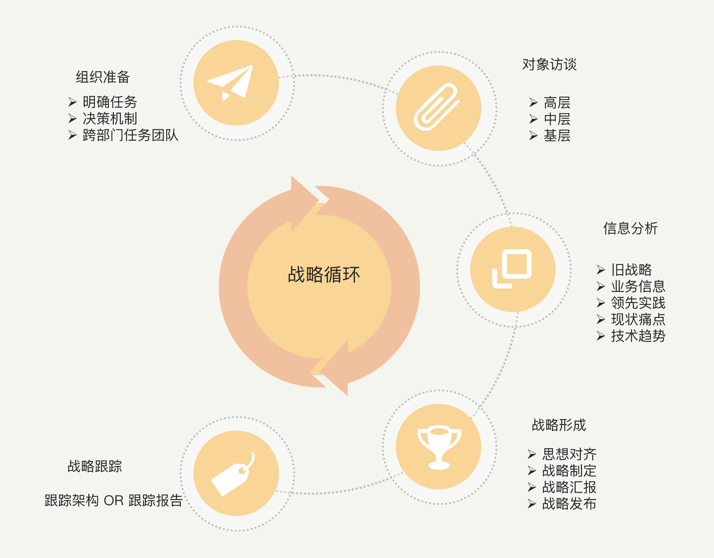
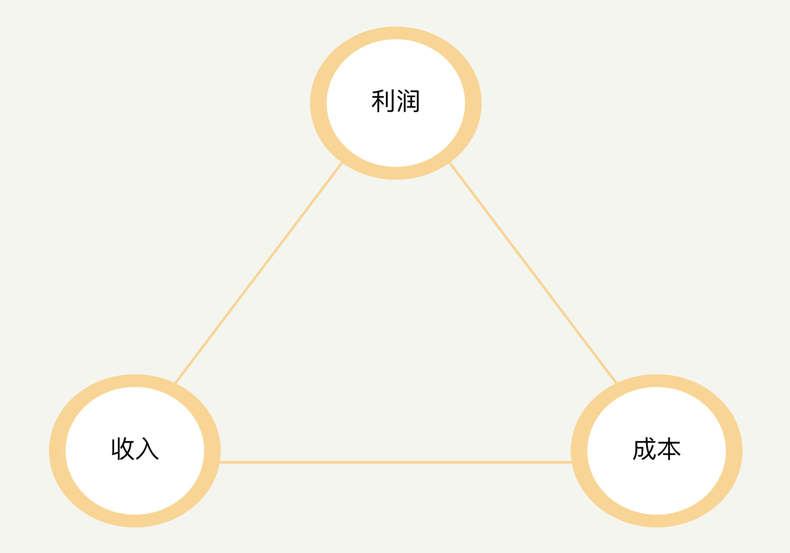
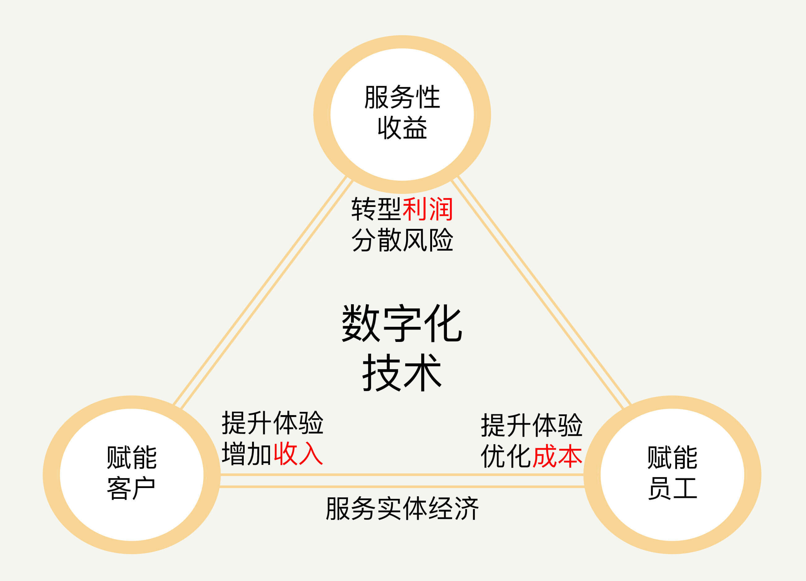

---
date: "2019-06-23"
---  
      
# 08 | 战略先行：怎么制定数字化战略？
你好，我是付晓岩。这节课，咱们来聊聊战略这个生死攸关的问题。

上节课在讲转型路径的时候，我首先讲到了战略转型，因为企业转型的成败跟战略有着密切的联系。你想，数字化不是一朝一夕就能完成的，我们必须要找到正确的方向，能够集中大量的资源，才能完成这件事儿，所以，今天咱们聊聊怎么制定数字化转型战略。

在做战略的时候，企业越大，需要思考的东西越多，要在数字化转型中处理的问题也就越多。所以，大企业就要用复杂点儿的方式去做战略制定；而相对来说，中小企业要考虑的问题没有大企业那么繁琐，就可以采用简单点儿的方式。这两种情况下分别怎么制定战略呢？这节课我就会详细地和你聊一聊。

当然，做战略不只是企业层面的事情，我们每个人都要掌握这项能力，这样无论是在未来参与公司战略，或者是自己创业的时候，都能够游刃有余一些。所以今天，我也会讲一讲个人做战略的方式。

首先，咱们来聊聊大企业的复杂的战略制定过程。很多人都认为这个才是深入的战略设计，那我们就先从复杂的聊起。

## 复杂的战略制定过程

复杂的战略制定过程一般分为五步，分别是组织准备、对象访谈、信息分析、战略形成和战略跟踪。下面我一个个来介绍下。

**1.组织准备**

完整的战略管理过程得先从建组织开始，也就是**选好搞企业战略的部门或者团队**。

<!-- [[[read_end]]] -->

很多大公司都有专门的组织负责战略管理，但这不意味着战略都是他们的事儿。他们只不过是组织者，负责方法论、过程协调等，要做的时候，得大家一起上，建立跨部门团队。如果有哪个部门没积极参加，会怎样呢？后果就是，部门的利益诉求没有挤进公司战略，要不到资源。这就会进一步导致你的业务改进计划、做新系统的计划得不到资源支持，优先级靠后，影响业务发展，甚至影响部门的绩效考评。

除此之外，在建立组织的时候，也要建立个决策机制，确定在争执不下的时候由谁来拍板。不然，讨论可能就会一直拖着，迟迟没有一个结论，这样就会影响到整体的进度，甚至到了截止时间都搞不出像样的战略。

当然，可能的确会有一些公司没有专门的团队。因为有很多人都觉得，并不是有了战略规划部，就可以搞定战略了，还是要大家一起讨论才可以。

那如果你们实在不想设置专门的团队，也可以让办公室之类的综合管理类部门，或者是比较核心的业务部门牵头，进行临时的组织。

只是我必须提醒你的一点是，这样的安排虽然每次也能完成任务，但可能很难把握部门的专注度和专业性，毕竟，他们不是专职做这件事儿的，会缺少对如何做战略的深入研究，很容易做成与部门计划类似的目标性任务。

**2.对象访谈**

等建立好组织以后，就得赶紧去了解大家的诉求了，尤其是领导层的。毕竟，战略的最终决定者是领导们，你的战略方案能不能通过，当然要看合不合他们的预期。

那找谁去谈呢？我建议你**根据任务的时间和领导对业务发展方向的想法，选择重点业务部门进行访谈**。如果时间充裕，就多谈些部门。如果企业覆盖的地区比较多，也得选择地区负责人进行访谈。因为，搞战略不能只聊总部，那样谈出来的东西可能缺少点儿“烟火气”，不够结合实际。

其实，要做到这一点，**访谈基层员工是件很有用的事情**，而这经常是被忽略的。在实际工作中，基层员工的访谈往往是不够充分的。

确定了访谈对象，那要通过访谈发现些什么内容呢？这里有一个关键是，**访谈不仅要发现受访对象到底想要什么，更重要的是发现差异**，也就是领导层之间、领导层与中层之间，以及中层与基层之间，在认知上到底有多大差异。

战略是用来统一思想的，知道差异，才能知道战略制定是要去弥合什么，知道要克服的认知障碍是什么。

**3.信息分析**

有了这些第一手访谈资料，就该做信息分析了。

不过，这里可不只是分析访谈得来的东西，你要把企业以前的战略、业务情况、竞争对手动向、领先实践、企业痛点、技术发展趋势，等等，都汇总进来，这也是很多大企业要找咨询公司的原因。

因为咨询公司有几件法宝，也就是方法论、信息、有经验的顾问。这些咨询公司经常游走在行业的领先者中，见多识广，又有好的分析体系和经验来整理铺天盖地的信息。顾问们往往又很有说服力，能够把很多“朴素”的想法变成“高大上”的方案。

当然，如果你觉得请顾问太贵的话也没关系，你可以自己搞，**重点就是尽可能多地收集这些信息，尤其是业务痛点**。要知道，战略并不只是畅想未来，一定也要立足于解决当前的问题，只不过是把眼光放得长远些而已。

具体到数字化转型上，你就要特别关注技术发展趋势，因为这会决定企业的技术架构、技术获得策略的走向，也是数字化战略的重点。

**4.战略形成**

信息分析之后，就是战略方案的形成环节。到这个环节，就有必要把战略团队的思想再对齐一次，免得被大量信息冲得太发散，不容易聚焦。

在做战略方案时，还有一点挺重要的，那就是**尽可能设置可量化的执行目标，这是将来度量战略执行情况的基础**。战略方案完成后，一般要经过一定的审核过程，包括给领导层的专题汇报、广泛征求意见等环节，最后形成定稿，才算是完成了制定过程。

关于战略形成，你还要清楚一点，没有哪个过程会保证你能做出出色的战略。这就跟软件开发一样，过程有助于保证质量，但没法保证你打造出个传奇的游戏或者软件。

不过，我们仍然必须重视过程，因为它至少能在一定程度上保证质量。

对战略而言，这个质量是什么呢？**就是对各方期望的准确把握、对分歧的有效弥合、对战略的可理解性和可操作性的保证**。

**5.战略跟踪**

不少企业花了大价钱做的战略，执行的时候却没有很好地跟踪执行过程，导致战略变成了“装饰品”。

当然，战略跟踪确实不好弄，如果没有工具，就变成了听执行者的汇报，这样很难评价结果。这个时候，就又可以用到企业架构了，尤其是业务架构。通过架构把战略的执行和战略能力分解成各种业务细节，再通过架构提供的脉络，跟踪细节的执行和实现，这样比没有工具、只看报告会好很多。

好了，从组织准备到对象访谈，再到信息分析、战略形成，最后到战略跟踪，我介绍了一个完整的战略管理闭环。你可能会说，我们的公司比较小，这一套流程做起来太消耗时间和精力了，有没有适合中小微企业的简单做法呀？别着急，当然有了，下面我就来讲一讲。

## 简单的战略分析方法

要想做简单的战略，必须要经历两个步骤：第一步是破除对“快”的错误追求，免得在寻求简单时走了错路，第二步才是让战略制定变简单。这两步缺一不可。

### 1.破除对“快”的错误追求

在谈简单的战略分析方法之前，我们必须要破除一些对“简单”的误解：简单绝不是单纯为了求“快”。**不要仅仅因为完整的过程环节多、耗人力、耗时间，就考虑要变“快”**。

说到这儿呢，我想到了传统开发和敏捷开发谁更好的问题。那我就拿这个做例子，跟你谈谈，怎么保证自己的战略制定过程在“简单”的同时，不至于把质量给丢了。

敏捷开发并不是简单地在谈如何变快，它主要是解决2个问题：

* 传统开发因为集中考虑的问题太多而不知该从何下手的问题；
* 因为项目周期太长，业务迟迟看不到系统会做成什么样，导致设计偏差发现太晚的问题。

因此，敏捷开发提倡MVP（最小可行产品，Minimum Viable Product），先做个简单的或者部分的交付，这样，既容易找到下手点，又因为周期缩短，可以早点儿看到系统的模样，早发现偏差。你看，敏捷的落脚点不是单纯追求做得快，而是快速反馈、快速调整。离开了这两项，敏捷就没有保证质量的方法了。

所以，在做数字化转型时，切忌总想找捷径，只想简化过程、加快速度的要求未必是靠谱的。在琢磨捷径的时候，你要想清楚，基础有没有打牢、有没有快速纠正错误的手段，不然等着你的可能不是你期望的快，而是浪费时间和质量问题。

### 2.如何简单地进行战略管理？

如果企业确实规模小、人少，那么，可以在我刚刚说的完整流程的基础上进行简化。具体怎么做呢？

首先，你可以在方法上“剪裁”。

* 把“组织准备”简化成内部开个会，领导自己带队，挑选几个得力的人，直接开搞。
* 在访谈部分，可以找一些主要的访谈对象单独谈，比如团队负责人、骨干，访谈要避免互相干扰，好让你收集到更多有价值的独立意见，提供更多的分析维度。其他相对来说没有那么核心的访谈对象，发起几场“头脑风暴”，基本上就可以搜集到关键信息了。
* 至于信息分析，因为需要花费很多时间收集和整理，如果到了这个时候才现做，那会严重拖慢你的工作进度，所以平时就应该有序地收集和整理，在这个阶段只补充一些对当前的战略制定任务而言缺失的东西就行了。在数字时代，数据就是你感知一切的手段，时时刻刻都应该收集，并且有序地管理它们。
* 在方案形成上，要把关注点放在对问题的简单阐述和对关键指标的提炼上，以便于跟踪。
* 关于跟踪，就可以融合到周期例会上，比如月度会、季度会。

这样“裁剪”下，制定个战略会很困难吗？应该不会。而且，当企业形成工作习惯、形成循环后，花费不了你太多时间。

如果你觉得这种方式还是不过瘾，还想再省省，那也可以。这样的话，我建议你把战略真的当成是一种工作习惯，用一些简单的画板类工具帮你实现分析过程、分析结论的可视化，比如用一个改良的画布分析法：

这张图上集成了战略分析的关键要素，要从上往下进行设计，这跟我说的战略转型路径的顺序也是一样的：先整理好长期愿景，再分析相对短期的战略和目标，然后分析关键性的战略能力。

不过，得有个商业模式去支持战略的实现，图中的屋顶下面的部分就是分析商业模式的，也就是商业画布分析法，大概思路就是，企业有什么渠道触达客户，目标的客户群体是什么？如何维持客户关系？主要的业务活动有哪些？具备什么资源？需要跟谁合作？产生多少收入、多少成本？最后创造了多少价值？

利用这个模型，我们就可以快速地推导出企业的战略靠不靠谱。如果按照图中的思路去推导都难以盈利，那现实中的执行就更困难了。

在做数字化转型的时候，也千万别忘了加入数字化成分，比如，数据是关键生产要素了，那获取数据、分析数据就是关键活动，数据、数据分析人才也是关键资源，外部数据供应商也是合作方，等等，这些你都要考虑到。不要因为工具简单，就只图快，导致分析不全面。**把数字化成分考虑到的战略，才是一个值得落地的数字化转型战略**。

## 怎么提升自己的战略制定能力？

好了，最后，我再来讲一讲怎么提升自己的战略制定能力。

你不要总觉得，不参加战略制定工作就没必要思考战略。其实，琢磨琢磨战略设计，是一个很好的深度思考过程，对你提升自己的思维能力非常有价值。所以，我给你分享一下我推导数字化转型战略的过程。

从历史思维的角度看，数字时代是一个新时代，要把物理世界的活动向更便捷的虚拟世界迁移，这种迁移主要依靠数字化技术。

这种发展还要符合给个体赋能这个方向，以企业的视角看，对内是给员工赋能，对外是给客户赋能。

但是，这些想法怎么跟企业的业务发展相结合呢？我再给你个图，这个图描绘了企业的本质，也可以说是最高阶的企业架构：

刚刚我在讲战略分析工具的时候说过，收入与成本的差额就是企业最直接的价值，也就是利润。可持续发展的企业考虑的就是这个三角形，这是企业经营最核心的东西，没有这个三角形的稳固，就没有企业的持续发展，更谈不上搞转型。

所以，我思考数字化转型战略时，就是把我通过历史思维、生态思维找到的那些发展趋势、数字化转型理念，对应到这个三角形上，去形成数字化转型战略，于是就得到下边这个图：

我来解释下这张图的核心含义。

以数字化技术为核心，通过虚拟空间的能力去赋能客户，提升客户体验，这样会增加收入；通过虚拟空间的能力去赋能员工，改善员工的工作体验，提升效率，这样可以优化成本；服务这两者就是服务实体经济。

而赋能员工、赋能客户，代表的是企业有更强的能力和机会来发展、改变其业务模式。这种模式的改变，也许会进一步改进企业的盈利模式，也就是利润的转型。

这样就给我们提供了一个分析框架，我们可以继续展开分析赋能客户怎么做，需要什么能力？赋能员工怎么做，需要什么能力？转型盈利模式的想法成不成立，怎么转？要用什么样的数字化技术，怎样才能用好？这样就能在一个基础模型的指导下，有目标地展开分析了。

所以，搞战略不是天马行空的，尽管有很多不确定性的因素，但还是遵循一个内在的逻辑框架，以此来支撑自己。因此，建议你平时就对照着我刚刚的推导过程，进一步提升下自己的战略能力。

## 总结

这节课，我们学习了制定数字化转型战略的方法。我给你讲解了完整的5个环节，也就是组织准备、对象访谈、信息分析、战略形成和战略跟踪，这适用于规模庞大，需要慎重对待战略设计的企业。同时，我还特意针对中小企业和个人，提出了便捷的过程和分析工具，希望可以帮助你从建立战略思维习惯开始，形成良好的战略管理能力。

最后我还想再强调一下，在做战略时，一定要头脑清楚，不要过于强调对某些特性的关注。就像很多人讨论传统和敏捷一样，不要光觉得敏捷就是快、传统就是慢。在不深入了解方法的情况下，不要急着下结论，多看看、多想想。很多时候，**害死人的不是方法，而是误解**。

另外，你千万不要等到有机会参加战略工作了，再思考该怎么做战略，你现在就可以先拿自己做例子。毕竟，咱们自己的人生，得自己去规划，管好了自己，才能帮别人。

## 思考题

在讲自己的战略制定经验时，我提到了企业的那个三角形，收入、成本、利润，其实这个也能用于分析自己，不要被收入、成本、利润的字面意思限制住。所以，请你利用这个模型来分析下自己。

欢迎你在留言区跟我们分享你的分析和设计，我们一起交流讨论。如果你觉得今天的内容对你有所帮助，也欢迎你把它分享给你的朋友或同事。