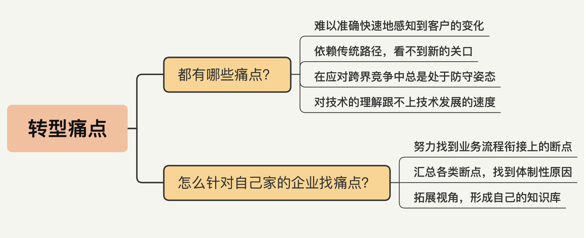

---
date: "2019-06-23"
---  
      
# 09 | 转型痛点（上）：转型中都有哪些痛点问题？如何识别？
你好，我是付晓岩。

上节课，咱们学习了制定数字化转型战略的方法。总体来说，战略更关注长期价值导向。不过，数字化不只是畅想未来，在战略中，我们也要考虑到如何解决眼下面临的问题。这些问题会影响企业当前的生存，也是企业在走向未来时必须要越过的坎儿。没有考虑到眼前这些痛点的战略，通常会成为不接地气的战略。

但是，痛点识别也不是件容易的事情。所以，今天我会和你聊一聊数字化转型过程中，企业要解决的眼前痛点，让你知道什么东西可能会成为痛点。同时，我还会再跟你聊聊识别痛点的方法，帮助你高效地找出你所面临的痛点。下节课，我再具体给你讲一讲怎么解决这些痛点问题。

## 数字化转型中都有哪些痛点？

一说数字化转型要解决的痛点问题，你可能第一时间想到的就是技术问题，比如企业缺人工智能技术、缺分布式系统技术，等等。

不可否认，技术确实是个问题，但是咱们想问题要全面。**数字化转型要解决的不仅仅是技术问题，我们还要多想想企业的整体经营管理问题**，比如企业的业务会遇到什么困难、业务模式要怎么找转变的路子，等等。那些问题可能才是真正难解决的问题。

这些问题通常来自于四个方面，分别是客户感知、路径依赖、外部竞争和技术理解，这是很多传统企业的通病了。接下来，咱们就来挨个儿分析一下。

<!-- [[[read_end]]] -->

### 难以准确快速地感知到客户的变化

每个企业最难以解决的挑战是什么？答案是，**客户的变化**。

随着时代的变迁，人们的习惯、喜好会发生多种多样的变化，企业很难把客户的习惯局限在一个不动的点上。一些曾经成功的企业都成为了某一代人的记忆，因为，这些企业迎合了那一代人，但是无法被后来的人们喜欢。

其中一个典型的例子就是柯达。柯达是胶卷时代的王者，却忽视了数码时代的到来。最令人感到可惜的是，柯达自己还是数码相机的早期发明者，有能力自己“革自己的命”。但是，就是因为没有充分意识到数码相机给人们提供的各种方便，就渐渐失去了客户的青睐，跟着老胶卷一起“泛黄”了。

柯达还算是在第一时间掌握了变化可能性的。有些行业比相机行业更麻烦，他们并不一定能够在第一时间感受到客户的变化，比如银行业。

银行业是信息化水平较高的行业，每年科技投入也不少，但是，很多消费者觉得银行还是跟不上时代、跟不上消费者的体验需求。这是为啥呢？主要就是因为金融业务多数都是次生需求，通常是你买东西要付款了、付款钱不够了，你才会有支付、信用卡消费等金融需求出现，它们是生产、生活场景中那些原始需求的派生物，对需求的感觉本来就会慢半拍。

互联网公司围绕原始需求场景搞的花样翻新太快，这就会导致客户需求的变化也很快，而这些需求传到银行，银行为此做出反应、设计新产品需要一定的时间。任何强制缩短这种传导机制的想法也许都不是太科学的，你不能指望次生需求比原始需求反应更快。所以，怎么准确感知并跟上客户的变化，对这样的行业来讲，就是更大的痛点了。

### 依赖传统路径，看不到新的关口

**很多时候，自己的成功可能会成为自己的绊脚石。企业既有的业务模式，可能会妨碍企业对未来发展的认知，这也是人们常说的路径依赖**。这条路走得越久，你改变它的难度就越大，这也是习惯的力量。

这么说你也许不太能有具体的感知，我来举个例子你就知道了。

就拿电动汽车来说，之前它们一直不太受传统车企的喜欢，除了竞争这个原因之外，技术上的不成熟也是一个重要因素。所以，好多传统车企肯定不会用all in（全力投入）的方式去做电动车，一开始还是会觉得传统汽车靠谱。

但是，现在很多科技企业扎堆儿涌入电动车行业，形成了一股“造车新势力”。它们已经逐渐把电动车演变成了一个软件平台、一个流量入口，我们相当于买了一个装着轮子的移动电脑。这种思路做出来的汽车跟传统汽车相比，体验必定是不同的。

总之，数字化技术会全面地重塑整个社会，无论是产品的形态、设计思路，还是客户的选择能力，都会有很大幅度的改变。所以，无论是企业还是个人，都在面临一个关口。

**不要局限在传统的路径里**，即使是过去的成功经验，你也要结合新的趋势，衡量下哪些可以继续传承，哪些需要改变。

### 在应对跨界竞争中总是处于防守姿态

很多企业都担心遇到“不讲武德”的跨界竞争。确实，另一个行业过来的人，思维不受行业传统束缚，对着传统企业这种“老师傅”就是一顿新技术、新玩法的“乱拳”。

如果互联网公司想要进入传统行业，尽管有业务认知上的门槛，但是通过挖传统行业的人，可以快速补齐这部分。可是，当传统行业想反击时，却很难靠挖互联网公司的技术人员，迅速补齐自己在技术上的短板。

**因为牛的技术是需要复杂的开发环境提供支持的，不是单靠几个人**。技术也需要“阵地战”，这些环境的建立、机制的配套需要一定的投入和时间。再加上互联网公司最近这十年发展起来的生态，这就不是单个传统企业可以轻易反击的了。

需要注意的是，这种外部竞争的痛点并不是来自于竞争本身，而是来自于竞争双方在内部结构上的巨大差异，业务和技术人员的比例决定了企业最核心的生产要素，也就是人，在构成和思维模式上的不同。

随着反垄断政策的调整，互联网公司与传统企业的关系也许会有一些缓和的态势。但是，这种来自于内部结构的竞争力差异，不会因此而改变。数字化企业要具备的是业务和技术的双螺旋，缺的东西早晚得补上，不然就是在对着未知的竞争者敞开自己的门户。

### 对技术的理解跟不上技术发展的速度

现在技术发展太快，对技术的理解跟不上，也就谈不上很好地应用技术了。这是一个普遍存在的痛点。而且，这个痛点不只是传统行业面临的，互联网公司也一样。所以，很多头部企业广泛地投资和发展各种技术。比如，在虚拟现实类技术中，很多公司是VR、AR一起搞，而不是只押注在一个技术上。

技术理解不是个单纯的技术活儿。除了要适当了解这项技术，还得知道，可以在什么样的业务场景中更好地应用它，否则，你就很难说自己理解到位了。

这个事情在业务和技术两侧的表现不大一样。在业务侧，往往是业务人员不了解技术本身，这就可能会导致相信一些道听途说的观点，夸大技术的实际效果；而技术侧呢，有可能会因为太了解技术本身而抑制了想象力，很多技术在业务人员看来好像很高大上，但实际上未必。

区块链就是一个典型的例子。对技术人员来讲，区块链的底层原理简直没什么新东西，像哈希函数之类的技术都是老东西了。但是，它居然就这么火了。而业务人员其实是根本听不懂的，很多人都不知道区块链是干啥的。在这种情况下，怎么能诞生非常好的应用呢？直到国家提高对区块链的重视，各类行业标准、团体标准相继出台，才逐步让区块链开发走上了正轨。

所以，理解技术这件事又难又重要，业务人员和技术人员要一起来搞，这也是业务与技术的融合方式。**都别先入为主，不要觉得自己知道技术原理，就知道该怎么用了，有可能你已经被自己的思维限制住了**。武器不是买了就管用的，不理解就用不好，这是很多传统企业在面对数字化转型时存在的痛点，是数字化转型战略必须要覆盖的。

这些痛点是非常普遍而通用的痛点，那作为一家企业，以及企业中的一员，你必须要找到自身的个性化问题。

## 怎么针对自己家的企业找痛点？

找痛点，是很多企业搞战略、请咨询公司，或者开经营分析会时的必备话题。但实际上，这个事情其实不太好做。找痛点就是提问题，你可能听说过，**能找准问题，问题就已经解决一半了，找不准问题，那搞解决方案就是白费力气**。

那怎么找痛点呢？我给你分享几个窍门。

### 努力找到业务流程衔接上的断点

一般来说，企业里90\%以上的创新都是微创新、渐进式的改进，没有那么多颠覆性创新的机会。那么，这么多微创新的来源是什么呢？其实，大部分都是流程中不顺畅、经常被吐槽的东西，也就是流程上的断点。而这些正是大量创新的来源，甚至是数字化的关键点。

很多人都认为，数字化转型之后的业务流程可以自动执行，再加上人工智能和大数据，数字化企业的业务流程，可以很“聪明”地根据环境的变化，选择不同的执行方式。这就表示，这些流程首先应该是能被衔接起来的，如果流程本身就充满断点，那怎么可能自动执行呢？

很多人没有把这些痛点跟数字化联系起来，还是仅仅在从业务体验上考虑。而实际情况是，这样想已经不够了。毕竟，**数字化的一大方向是尽量减少人的操作**。那就是说，**你考虑业务体验的方式，应该是怎么减负，怎么不用人来做，而不只是让他做起来舒服**。

那具体怎么找呢？我给你个小建议。

* 如果你是技术人员，那么，就要尝试跟岗观察。业务人员有时会出于长期的操作习惯，意识不到流程中断点的存在，所以，你要多观察实地操作，自己发现问题。
* 如果你是业务人员，你就应该经常有意识地分析自己的操作过程，分析是什么阻碍自己完成得更快，因为这里就可能存在断点。

做到这些，也许企业不会为此奖励你，但是日积月累下来，你可能会成为流程改进专家，这种能力会让你在任何一个领域中都能出色地工作。

### 汇总各类断点，找到体制性原因

**寻找体制性原因是找痛点的高级模式**，你不会止步于微创新，当你经验值够了，总是想去挑战“大怪”的。但是。“大怪”是什么？其实就是隐藏一堆“小怪”后边的大Boss，也是我们常说的，隐藏在众多表象之下的深层次问题。比如咱们刚刚学习的四个痛点，就是从众多痛点现象中抽象总结出来的共性问题。

一谈到数字化转型，我们经常说要转变企业文化、转变组织模式、转变经营理念，等等。那么，这些高大上的口号是怎么来的？其实，这些就是综合考虑各种断点、流程的不顺畅等问题之后得到的结果。

假如你发现了一堆断点，除了要持续地去改进它们，同时也要思考下有些问题是不是会反复，或者是换个样子出现，这很可能是你发现体制性问题的机会。

举个小例子，我们常说传统企业存在开发体制问题，其实就是隐藏在需求传导不准确、开发责任不明确、立项速度慢、资源评估不准确、项目协调不顺畅等一大堆小问题下的大问题。

如果我们想要为企业提供支持数字化转型的开发能力，光是一个点一个点地去想怎么解决这些问题，是不够的。你必须要继续思考，它们会不会汇总成对整个开发体制的调整，是不是需要上升一个看问题的维度才能解决？

所谓锻炼你自己的机会，就是尝试不断地琢磨如何解决这些问题，而不要总想着有些问题层级太高，与我无关，那样你就失去了深度参与数字化转型、提升自己的机会。

### 拓展视角，形成自己的知识库

做到了刚刚的这两点，我相信，你就能找出企业的绝大多数痛点了。但这还不够，因为这都是立足于现在去找痛点，其实还有一些隐藏的痛点问题，你必须眼观八方，才能提前预知到。

怎么做呢？我建议你多读一些讲述行业、企业发展历程的书，或者是其他相关资料，同时还要注重积累，把观察到的东西都沉淀下来，时不时地来分析下自己的企业。

俗话说，“日光之下并无新鲜事”，很多问题都不是只有你自己的企业遇到过。有些问题你这个行业没人想过，但是别的行业有人想过，甚至解决了，还分享了出来，这个就可以成为你的知识库。

比如，我们说数字化转型离不开软件开发，但是软件开发自己的管理需要持续增强，不然现有的工程效率，很难保证我们可以生产出满足数字化转型需要的那么多软件。软件造得不够，转型速度也就跟不上了。

但是，在工程效率这个问题上，制造业和建筑业用工程思想把生产和建设管理得井井有条。相关的资料有很多，咱们都可以找来学一学，参考下制造业和建筑业的标准化管理、大批量生产等方式。

**总之，找到痛点才有可能解决痛点。越早找出来，你的数字化转型之路就会走得越快。**

## 总结

今天，我们学习了企业数字化转型中存在的四个亟待解决的眼前的痛点问题，这是战略中应该覆盖的问题。它们分别是难以准确快快速地感知到客户的变化、过于依赖传统路径、在应对跨界竞争中总是处于防守姿态、对技术的理解跟不上技术发展的速度。

除了这四个痛点之外，企业管理层普遍缺乏对企业架构思维的认知和引入能力，这一点对企业的数字化转型也是非常不利的。因为所有转型最终转的就是思维和行为习惯，而作为企业的管理者来讲，如果没有及时进行必要的思维调整，也就很难推动整个企业的转变了。

同时，我还给你介绍了找痛点的3个方法：

* 找到业务流程衔接上的断点；
* 汇总各类断点、找到体制性原因；
* 同时也要拓展视角，逐渐形成自己的知识库。

我建议你每次找到痛点和深层次原因后，就立马总结下，同时也要给别人分享下，把自己做过的东西知识化、体系化，这样就积累起了你自己的知识库。

工程思维中很有价值的一点就是对以往成果的重复利用，当你成为时间的朋友，有效积累起自己的知识后，你就真的有可能发现别人未曾发现的痛点了。这样的机会也许一生未必有太多，发现一个，就有机会找到你一生的职业方向，也有可能帮你的企业形成很大的竞争优势，发现数字化转型最需要产生的那个结果。

## 思考题

你有没有解决过流程上的某些痛点呢？是怎么发现这些痛点的呢？

欢迎你畅所欲言，和我一起交流讨论。如果你觉得今天的内容对你有所帮助，也欢迎你分享给你的朋友或同事。