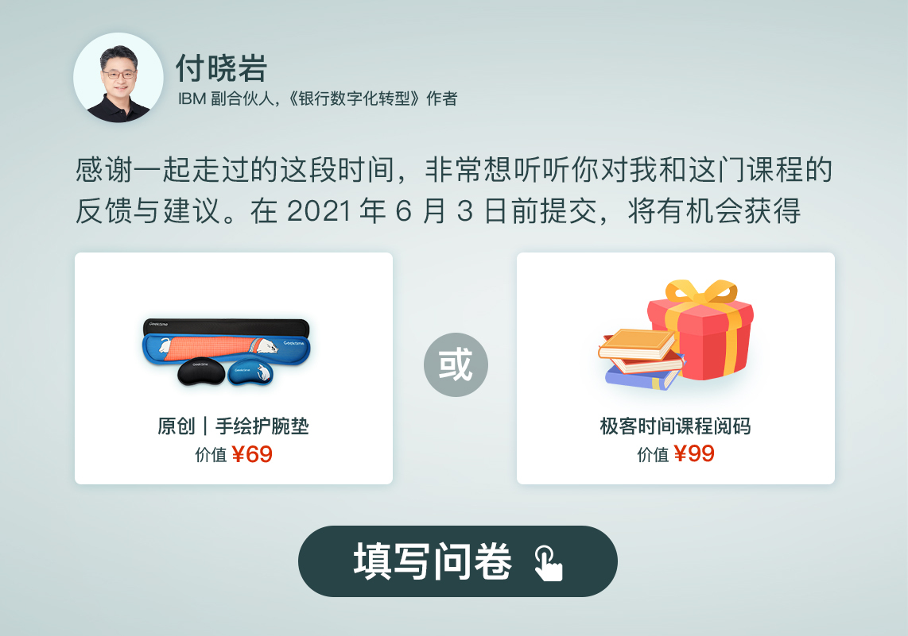

---
date: "2019-06-23"
---  
      
# 结束语 | 被时代挡在大门外的，往往是对变化视而不见的人
你好，我是付晓岩。

在前面的课程中，我给你系统讲解了一套以企业架构理论为核心的数字化转型方法论。我不敢说这是“倚天剑”“屠龙刀”，但我相信，这可以算是一套内功心法，能够帮助你理清想问题的逻辑，找到最适合自己的个性化转型路径，以及数字化学习之路。

我在[开篇词](https://time.geekbang.org/column/article/361319)中说过，掌握数字化能力，已经不能算是竞争优势了，而是会逐渐成为起跑线问题。这不是危言耸听，而是时代真真切切的变化。

**而被时代挡在大门外的，往往是对变化视而不见的人。**

虽然现在依旧很少有堪称标兵的数字化企业，但是这也正是机会所在。在未来的20\~30年，随着数字化环境的成熟，大量的数字化企业就会出现了，数字化人才将成为巨大的市场缺口。因此，我们必须从此刻开始，抓紧时间学习数字化能力，打好基础，这样才能不辜负时代给的机会。

所以，在课程即将结束的时候，我想再和你聊一聊，如何打好转型的基础。毕竟，只有地基稳了，我们才能以不变应万变。

这个基础，一句话总结就是，**处理业务和技术之间的“分家”思想**。这是达成业务和技术之间深度融合的关键，更是很多企业都迫切需要转变的观念，从上到下都需要。

具体怎么做呢？我给你两个建议。

**首先，让企业中的“多数派”努力学习“少数派”的思维方式。**

<!-- [[[read_end]]] -->

关于这一点，传统企业可以向科技企业学习。

最近这些年，科技企业带出了一个业务与技术融合的非常好的模式。其实，这个模式总结起来，无非也就是业务和技术不分家。

科技企业的技术人员多，如果思维分家的话，对业务有利的事情，技术人员很可能会觉得没必要投太大精力去做。这样一来，科技企业也许就会成为一个不知道怎么去盈利的研究机构，离倒闭也就不远了。

所以，科技企业做得出色的地方恰恰是，技术人员多，还能够努力让技术人员去用业务思维、从业务视角想问题，这才做出了很多跟传统企业不一样的地方，才有了高速的发展。

但是，传统企业在转型的道路上，这个“分家”的思想就像一头“拦路虎”一样横在那里，本来技术人员就少得可怜，如果“思想”上再分家，作为绝对多数派的业务人员，就会认为一个事情是对技术有利的，我没必要认真去做。这样一来，传统企业的技术短板怕是永远也补不齐了，更谈不上企业转型了。

因为跟科技企业相比，传统企业是要用一条反过来的路推动自己的变革。科技企业是技术人员多，要技术人员用业务思维想问题；而传统企业则是业务人员太多，需要业务人员用技术思维想问题，才能努力对齐双方看问题的角度。

其实，科技企业和传统企业都是在做业务和技术的融合，只是因为基础不同，路径才不同。抽象地看，都是要让“多数”的一方努力用“少数”一方的观点看问题，这样才能让自己有所改变。即便是已经做得很好的科技企业，也不要有所松懈，必须要持续关注自己思考问题的方式。因为组织往往像个天平，保持平衡并不容易，失衡反倒很容易。

当然，作为企业里的个体，我们每个人都要从自己开始，擅长技术的要去关注业务，擅长业务的要去了解技术，不能只依赖企业提供的机会。毕竟，成长这件事儿，终究是要自己对自己负责的。

**另外，我们要把业务架构作为抓手，逐步推进思维模式的转变。**

虽然要让“多数派”学习“少数派”的思维模式，但是让双方完全换位也不大现实，比如说，让业务人员都去自学技术，这个目前来看是做不到的。

最可行的就是让业务人员走到业务和技术的连接点上，也就是“业务架构”这个点上。如果业务人员能采用业务架构方法，用结构化思维分析和看待自己的业务，在结构化的视角下给予技术人员软件设计、新技术应用的启发，就已经足够好了，开发效能已经可以提升很多了。剩下的可以交给时间，毕竟，融合是需要时间的。在这个基础上，业务人员再去学习自己感兴趣或者工作中会用到的技术知识。

你可能会问，为啥业务要接受架构思维，并逐渐去了解技术呢？其实道理很简单。你为客户创造价值的方式正在改变。在数字时代，你的产品大多是用软件形态或者与软件相关的形态交付的，就像《价值驱动的数字化转型》一书所指出的，“技术就是你的业务，无论你的业务是什么”。

对技术人员来讲也一样。不是没有一堆技术原理，就意味着业务是好学的。**如果没有在一线充分锻炼过，你理解的就只是“理论”上的业务**。

所以，考虑到做转型的目标，技术人员也要尽量先做到在业务架构上跟业务人员对齐思维，理解业务人员到底在表达什么样的需求，之后，再根据企业的实际条件，考虑一下怎么通过跟岗、轮岗等方式深入地接触下业务，这样才能有更好的改良建议。

总之，对于数字化转型来说，**技术和业务之间的分界线会越来越模糊，哪一方慢了，都代表企业慢了，没有什么你我之分**。

说到底，打好转型的基础，就是让企业能够成为一个整体，让业务和技术的双螺旋坚实地扭结在一起，让企业拥有一个完整、强大的基因，这才是数字化转型能实现的关键。

到这里，我就把至关重要的转型基础给你讲完了。现在，我还想在课程真正结束之前，给你分享一下转型时常见的3个误区。我想说，**踩坑是必然的，但是提前预知一些坑点，避开这些坑也可以是必然的**。

**我要说的第一个误区，就是急着从挖架构师、上新技术上搞数字化。**

你必须要先想清楚自己企业的目标是什么，从自己的视角出发，看到的数字化是什么，再决定怎么行动。

数字化不是架构师的数字化，架构师是在数字化过程中成长起来的。能够通过自己的实践培养出合格的架构师，才是健康的数字化企业，否则，就没有“造血”功能，你挖过来的人，别人也可以再挖走。

另外，数字化也不是某项新技术的数字化。各类技术的搭配使用，才是大部分创新最常见的实现手段，旧技术也能玩出新花样，比如说区块链。

所以，**不要总想着搞新花样，在现有技术的基础上另辟蹊径才是正确之道**。

**第二个常见的误区是，忽视对“带节奏”最重要的国家政策**。

企业很容易误认为数字化是企业自己的事情，觉得国家政策离自己的实践、离个人技能学习太远。实际上，像“十四五规划”这类指导性国家政策离我们非常近。

这里有大量的行业机会、企业机会和个人学习方向，比如，数据中心的建设会需要多少人才？数字家庭会给智能家居行业带来多大的市场机会？会对智能家居产品设计提出什么样的要求？这些很容易就细化到了企业业务和个人工作层面。

无论是对企业还是个人来讲，解读国家政策是未来十五年在数字化转型方面非常重要的能力。

**第三个常见的误区是，输在自己已经看见的终点面前。**

不少企业和个人在经过一定的学习、深入思考之后，会对数字化转型形成一些自己的认知，但是，实现过程往往不是那么容易的，会有很多内外部阻力，比如在建设企业架构的过程中，会有很多部门之间利益协调的麻烦等。

**但是，越有价值的东西往往实现起来也越困难**。如果遇难而退，轻言放弃，那之前的所有付出就都白费了。人们常说“行百里者半九十”，你可不要当只差那最后一点努力却失去了成功机会的人。

最后，我想说的是，数字化转型需要日拱一卒地去推进，而这个“拱卒”可不仅仅是数字化技术的前进，更是人们看待数字化技术、看待数字化企业的方式的改变。

说到底，“拱”的是人们的思维模式。让我们先从解决传统企业内部业务和技术“分家”的思想开始吧，从抛弃这种“内部甲乙方”的立场开始，把整个企业放在自己的思维中，从架构思维中的“全面”这个特性开始，逐步改变自己的认知，真正把握住时代给我们提供的成为领先者的机会。

课程的最后，我还准备了一份[调研问卷](https://jinshuju.net/f/F4xAVX)，希望你能花1分钟填写下，聊聊你对这门课的想法。同时，我也给你准备了礼物，只要填写问卷，就有机会获得手绘护腕垫或者是价值99元的课程阅码。期待你的畅所欲言。

