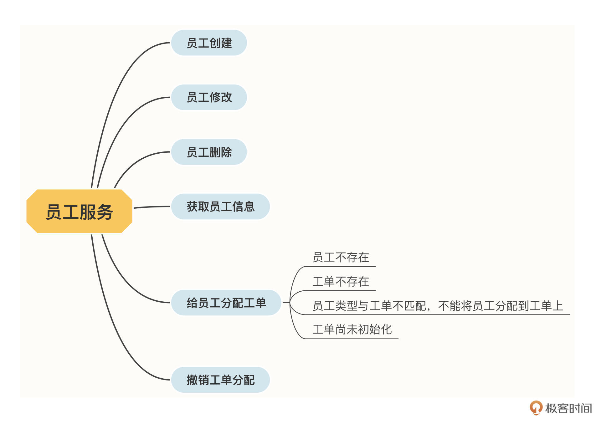
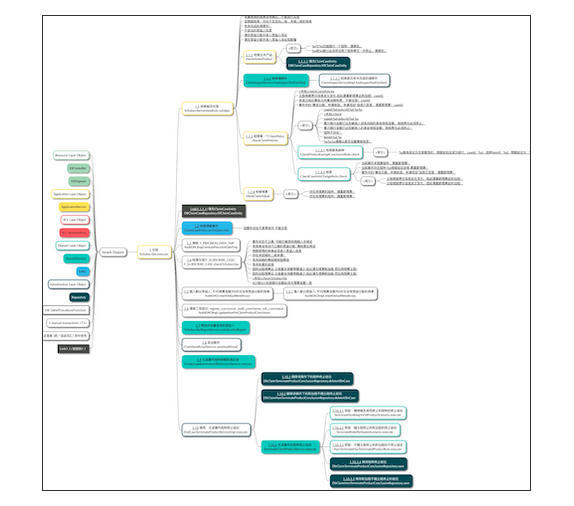

---
date: "2019-06-23"
---  
      
# 04 | 如何降低认知负载：活的文档能救命
你好，我是姚琪琳。

在第三节课，我带你了解了认知心理学中的一个概念——认知负载。这个看似与软件开发毫无瓜葛的知识，实际上却决定了软件系统的成败。因此在遗留系统现代化中，我们把“以降低认知负载为前提”作为首要原则。

有些同学这时就会问了，你总说认知负载如何如何，降低认知负载又是多么重要，那怎么才能真正降低认知负载呢？别着急，我们今天就来看看有哪些方法能降低认知负载。其中最重要的工具，就是活文档。

## 什么是活文档

活文档（living document），顾名思义，就是指活着的文档，也就是**在持续编辑和更新的文档，有时候也叫长青文档或动态文档。**比如维基百科中的一个词条，随时都有人更新和维护，这就是一个活文档。与之相对的是静态文档，也就是一旦产生就不会更新的文档，比如大英百科全书中的一个条目。

你可以想象一下，在软件开发过程中，无论是瀑布模式还是敏捷，我们拿到的需求文档或故事卡是“维基百科”还是“大英百科”呢？我想大多数情况可能是，在最终需求还没有敲定时还是“维基百科”，也就是还会随时更新，而一旦敲定开始开发后，就变成了“大英百科”，再也不会更新了吧。

然而随着需求的不断叠加，“大英百科”作为当时系统的一个“快照”，早就已经失去了时效性。只有将不同时段、不同模块的文档片段合并在一起，才能得到当前系统的快照。但这个合并放在现实中是很难操作的。

<!-- [[[read_end]]] -->

正是因为发现了这样的问题，《实例化需求》一书的作者Gojko Adzic将活文档的概念引入到了软件开发当中；而去年出版的《活文档——与代码共同演进》一书，又在此基础上对活文档如何落地做了系统指导。我强烈建议你读一下这两本书，虽然它们的出版相隔近10年，但讲述的内容却一样非常有帮助。


## 如何用活文档挖掘业务知识

了解了活文档的概念，我们来看一下它是如何降低遗留系统的认知负载的。

### 为遗留代码添加注解

先来看看下面这段虚构的遗留代码（抱歉我实在编不出更糟糕的代码了……），在没有任何文档的情况下，我们如何理解这段代码的意思呢？

```
    public class EmployeeService {
      public void createEmployee(long employeeId) { /*...*/ }
      public void updateEmployee(long employeeId) { /*...*/ }
      public void deleteEmployee(long employeeId) { /*...*/ }
      public EmployeeDto queryEmployee(long employeeId) { /*...*/ }
      public void assignWork(long employeeId, long ticketId) {
        // 获取员工
        EmployeeDao employeeDao = new EmployeeDao();
        EmployeeModel employee = employeeDao.getEmployeeById(employeeId);
        if (employee == null) {
          throw new RuntimeException("员工不存在");
        }
        // 获取工单
        WorkTicketDao workTicketDao = new EmployeeDao();
        WorkTicketModel workTicket = workTicketDao.getWorkTicketById(ticketId);
        if (workTicket == null) {
          throw new RuntimeException("工单不存在");
        }
    
        // 校验是否可以将员工分配到工单上
        if ((employee.getEmployeeType() != 6 && employee.getEmployeeStatus() == 3)
              || (employee.getEmployeeType() == 5 && workTicket.getTicketType() == "2")) {
          throw new RuntimeException("员工类型与工单不匹配，不能将员工分配到工单上");
        }
    
        if (!isWorkTicketLocked(workTicket)) {
          if (!isWorkTicketInitialized(workTicket)) {
            throw new RuntimeException("工单尚未初始化");
          }
        }
        
        // ...
      }
    
      public void cancelWork(long employeeId, long ticketId) { /*...*/ }
    }
    

```

如果每个方法都很长，这样一个类就会愈发不可读，从中理解业务知识的难度也越来越大，这就是我们上节课提到的认知负载过高。

如果把这种代码转化为下面的脑图，是不是一下子就清晰许多了呢？



阅读代码时，我们是以线性的方式逐行阅读的，这样的信息进入大脑后，就会处理成上面这样的树状信息，方便理解和记忆。但当代码过于复杂的时候，这个处理过程就会需要更多的脑力劳动，导致过高的认知负载。

我们可以通过在代码中加入活文档的方式，来降低认知负载。其实要得到上面的脑图，只需要在代码中加入一些简单的注解：

```
    @Chapter("员工服务")
    public class EmployeeService {
      @Doc("员工创建")
      public void createEmployee(long employeeId) { /*...*/ }
      @Doc("员工修改")
      public void updateEmployee(long employeeId) { /*...*/ }
      @Doc("员工删除")
      public void deleteEmployee(long employeeId) { /*...*/ }
      @Doc("获取员工信息")
      public EmployeeDto queryEmployee(long employeeId) { /*...*/ }
      @Doc("给员工分配工单")
      public void assignWork(long employeeId, long ticketId) { /*...*/}
      @Doc("撤销工单分配")
      public void cancelWork(long employeeId, long ticketId) { /*...*/ }
    }
    

```

然后，我们编写一个工具，它可以基于这些注解来生成根节点和二级节点，并将方法中抛出的异常作为叶子节点。

这么做的原因是，虽然遗留系统中的很多文档和代码注释已经不是最新的了，但这些异常信息往往会直接抛出去展示给用户看，是为数不多的、可以从代码中直接提取的有效信息。

当然这样做也有一定局限性，因为异常信息中可能包含一些运行时数据。比如“ID为12345的员工不存在”这样的异常信息，是由“ID为 + employeeId + 的员工不存在”这样的字符串拼接而成，静态扫描字节码，是无法得出这些运行时数据的。但即使只在叶子节点中显示“ID为 \%s 的员工不存在”这样的信息，也已经非常有用了。

通过这样的工具，我们可以把一个非常复杂的业务代码，转化为下面这样的脑图（为了过滤掉敏感信息，我故意将图片做了模糊处理）。



这段业务代码总共有5000多行，一行一行地去阅读代码会让人抓狂，但有了这样的脑图，认知负载简直降低了一个数量级。

看到这里，你一定对这个工具十分感兴趣了。但是很遗憾，这个自研的工具目前还没有开源。一旦开源，我将在专栏写一篇加餐，详细介绍这个可以解救你于水火的工具。

不过它的原理其实十分简单，想必你也已经猜到了，就是扫描Java字节码，获取到用注解标记的代码，然后再进一步分析得到异常信息，组织成树形结构，再生成一些中间文档，并通过一些绘图引擎绘制出来。

在实际操作过程中，只需要有一个人通读一次代码，哪怕花上几个礼拜的时间，但只要能理出一个业务模块的基本逻辑，添加上注解，就可以通过图形化的方式来展示代码结构。其他人不需要再次这么痛苦地阅读代码了，可谓一劳永逸，效率会大大提升。

这么做还有一个好处是，当新的需求来临时，开发人员可以迅速定位到要修改的地方，不需要再去扒一遍代码了。传统的代码和文档最大的问题是，代码是代码，文档是文档，彼此分离。

代码和文档的关联关系储存在开发人员脑子里，这样认知负载比较高。当开发人员看到一份新的需求文档时，需要搜索一下脑子里的记忆，才能想起来这部分内容是在代码的什么位置。

然而人脑不是电脑，这种记忆是十分不靠谱的，搜索定位的过程也十分低效。而上面这样的脑图就和代码很好地结合了起来，可以说找到文档，就找到了代码，非常有效地降低了认知负载。

这么做的第三个好处是有利于团队协作。业务分析师、开发人员、测试人员都可以围绕这样一份文档来讨论需求、设计测试用例。

### 实例化需求最好的工件就是活文档

除了在代码中添加注解，并分析代码生成各种可视化的图表之外，用实例化需求的方式编写的测试也是一种活文档。所谓实例化需求，实际上指的是**以现实中的例子来描述需求，而不是抽象的描述**。

怎么理解呢？在生活中我们会遇到很多文字描述，比如产品说明书、合同文本、法律法规等。这些描述大多数时候都是抽象的，普通人读起来很难理解，甚至引起歧义。如果抽象的说明能够配几个具体的示例，认知负载就会大大降低。软件开发中的需求描述也是如此。

让我印象非常深刻的是，在刚加入Thoughtworks没几天的时候，曾经跟着BA和其他开发人员找客户对一个关于用户权限的需求，大概是不同的用户在不同的场景下，能看到一个页面中的哪些字段。

那位BA没有像我之前见过的BA那样，写一大篇文档，而是简单地把界面打印了出来了好几张，每张纸上注明场景，用马克笔把不能看到的字段打个大叉划掉。

就这样，他用最简单的方式，在5分钟内就快速确认了所有的需求，客户也对这种直观的方式非常满意。这些纸随后就给了我们开发人员，我们根本没必要再去看需求文档了，因为需求已经以如此实例化的方式展示给我们了。

这就是典型的实例化需求。我们在开发时，可以将这种需求转换为测试，这种以实例化方式描述的测试，也是一种活文档。它们不但很好地展示了业务知识，而且是随代码更新的。

比如上面的给员工分配工单的例子，按实例化需求的方式，可以写出一系列组织良好的测试，如下所示：

```
    @Test
    public void should_be_able_to_assign_work_to_an_employee() {}
    @Test
    public void should_not_assign_work_to_when_employee_not_exist() {}
    @Test
    public void should_not_assign_work_when_ticket_not_exist() {}
    @Test
    public void should_not_assign_work_when_employee_type_and_ticket_type_not_match() {}
    @Test
    public void should_not_assign_work_when_ticket_is_not_initialized() {}
    

```

怎么样？是不是一目了然？其实我们就是将需求文档的描述转换成了测试的方法名。

读到测试，就相当于读到了需求文档；测试通过，就相当于需求完成了。以后如果需求有了变更，只需要同步修改测试的名称即可。这时候，测试是和代码共同演进的，也就是活文档。

在某些框架下运行上面的测试，还能帮我们去掉中间的下划线，这就更像是文档了。如果愿意，你还可以用中文去写方法名，阅读起来会更友好，尽管我强烈建议不要这样做。我们在后面讲到代码现代化的时候，再来详细讨论单元测试如何编写和组织。

如果一个遗留系统的每个功能都具有这样的测试，那么业务知识也就不再难以获得了，整个系统的认知负载也没有那么高了。

## 用依赖分析工具展示系统知识

工具除了能挖掘业务知识，还能揭示系统知识。我们在[上一节课](https://time.geekbang.org/column/article/507513)讲过，遗留系统的两大认知负载，是无处可寻的业务知识和难以获取的系统知识。经过多年的腐化，类与类之间、包与包之间、模块与模块之间、服务与服务之间分别是什么样的依赖关系呢？

这就好像我们来到一个陌生的城市时，对这个城市的行政区域、大街小巷都不了解。如果我们想从一个地方到另一个地方，应该怎么办呢？最好的办法就是搞一张当地的地图（当然你也可以用地图App），有了地图的指引，就不会迷路了。

同样，我们可以通过**依赖分析工具**，建立一张遗留系统的地图，这样就可以快速知道一个业务是由哪些模块组成的。市面上存在很多做系统依赖分析的工具，如Backstage、Aplas、Honeycom、Systems、Coca等等。感兴趣的同学可以去了解一下。


但我们也会发现，有时这些工具并不能解决我们的全部问题。比如在做系统的数据拆分时，我希望知道一个API调用都访问了哪些表，从而评估工作量。这种定制化的需求很多工具都无法满足，不过不要灰心，发挥我们开发人员优势的时候又到了。没有轮子，我们就造一个出来。

其实这种根据入口点获取表名的逻辑并不复杂，只需要遍历语法树，把所有执行SQL语句的点都找出来，然后分析它的语句中包含哪些表就可以了。

对于**存储过程或函数**，我们也可以找到执行它们的点，获得存储过程或函数的名称，然后再根据名称找到对应的SQL文件，再做类似的分析。当然，这要求我们首先要治理好编写在数据库中的存储过程和函数治理，将DDL（Data Definition Language）迁移到代码库中，进行版本化。这样分析工具定位起来才方便。

对于**复杂的入口方法**，你可能会得到一幅相当大的列表或脑图，它虽然能列出全部内容，但读起来仍然很费劲。这时候我们有两个办法。一是重构复杂的入口方法，抽取出若干小的方法，再以小方法为入口点做分析。二是修改分析工具，直接分析存储过程或函数。如果存储过程或函数过大，也可以进一步拆分。

除此之外，我们还可以提出很多有用的需求，继续改进分析工具。比如分析不同模块之间所依赖的对方的表有哪些，这对于数据拆分也是非常有帮助的。

## 总结

今天我们学习了降低认知负载的一种非常有用的方法：活文档。很多同学可能是第一次听说这个概念，但如果你的项目里用实例化需求的方式去组织单元测试，你其实已经在使用活文档了。

虽然遗留系统中可能没有太多的测试，但我们仍然可以通过向代码中添加注解的方式来编写活文档，并通过工具来实现图形化展示，将遗留系统中无处可寻的业务知识暴露在你面前。

除此之外，我们还可以使用依赖分析工具来挖掘系统知识，同样也可以用图形化的方式来帮助我们理清系统内的依赖关系。这对我们开发新需求或推动代码和架构的现代化都非常有帮助。

能够降低认知负载的方法、工具和实践还有很多，我们后面的课再慢慢介绍吧。

《活文档》这本书在介绍遗留系统的“文档破产”时，是这样描述遗留系统的，我也想把这段话分享给你：

> 遗留系统里充满了知识，但通常是加密的，而且我们已经丢失了秘钥。没有测试，我们就无法对遗留系统的预期行为做出清晰的定义。没有一致的结构，我们就必须猜测它是如何设计的、为什么这么设计以及应该如何演进。没有谨慎的命名，我们就必须猜测和推断变量、方法和类的含义，以及每段代码负责的任务。

虽然遗留系统是“文档破产”的，是“加密”的，但是只要我们掌握了活文档这个“破译工具”，就可以一步一步破解出那些隐匿在系统深处的知识。

## 思考题

感谢你学完了这节课的内容。我想此刻的你，一定会对课程中提到的活文档工具十分感兴趣。今天的思考题就请你来分享一下，如果是你，会如何设计和开发这样的一个工具呢？

欢迎你在评论区留下你的观点，我会尽量回复你们的问题。也欢迎你把文章分享你的朋友和同事，让我们一起来降低认知负载。